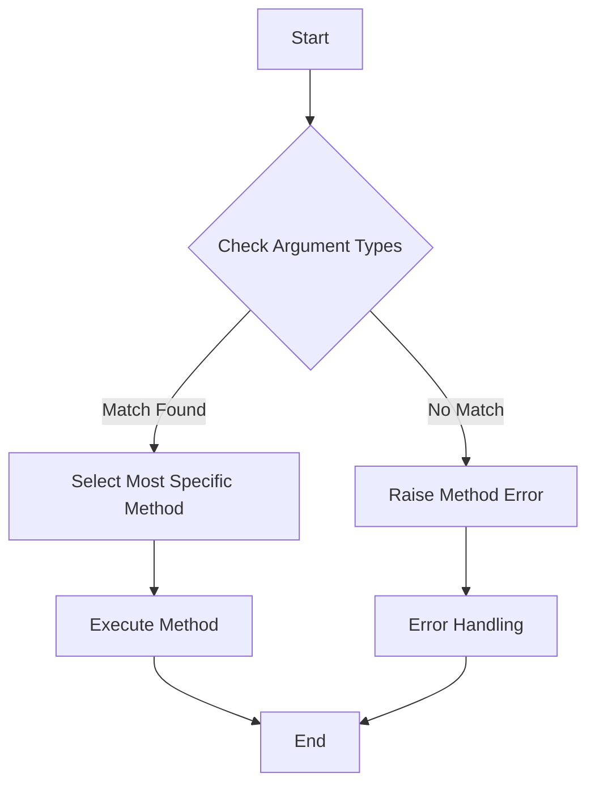

## 3.4 Methods and Multiple Dispatch in Depth

In the world of programming, Julia stands out with its unique feature of multiple dispatch, which allows for highly flexible and efficient code organization. This section delves into the depths of methods and multiple dispatch in Julia, providing a comprehensive understanding of how to define methods, utilize the dispatch mechanism, and apply these concepts in practical scenarios.

### Defining Methods

Methods in Julia are functions that can have multiple implementations, each tailored to specific types of arguments. This capability is central to Julia's design, enabling developers to write code that is both expressive and performant.

#### Method Signatures: Creating Methods for Specific Type Combinations

A method signature in Julia specifies the types of arguments a method can accept. This allows for precise control over which method is invoked based on the types of the inputs.

```julia
function add(x::Int, y::Int)
    return x + y
end

function add(x::Float64, y::Float64)
    return x + y
end
```

In the example above, the `add` function has two methods, each with a different signature. The first method is invoked when both arguments are integers, while the second is used for floating-point numbers.

#### Method Overloading: Defining Multiple Methods for the Same Function

Method overloading in Julia allows you to define multiple methods for the same function name, each with different argument types. This is a powerful feature that enhances code readability and reusability.

```julia
function add(x::Int, y::Float64)
    return x + y
end

function add(x::Float64, y::Int)
    return x + y
end
```

By overloading the `add` function, we can handle mixed-type operations seamlessly. This flexibility is a hallmark of Julia's multiple dispatch system.

### Dispatch Mechanism

Understanding how Julia chooses which method to execute is crucial for leveraging multiple dispatch effectively. The dispatch mechanism is based on the types of the arguments provided to a function.

#### How Julia Chooses Methods: Understanding the Dispatch Algorithm

Julia uses a sophisticated dispatch algorithm to select the most specific method applicable to the given arguments. This involves:

1. **Type Matching**: Julia first matches the types of the arguments against the available method signatures.
2. **Specificity**: Among the matching methods, Julia selects the one with the most specific type constraints.
3. **Ambiguity Resolution**: If multiple methods are equally specific, Julia raises an ambiguity error, prompting the developer to resolve it.

```julia
function process(x::Number, y::Int)
    println("Processing number and integer")
end

function process(x::Int, y::Number)
    println("Processing integer and number")
end

process(1, 2)
```

In the example above, the call to `process(1, 2)` results in an ambiguity error because both methods are equally specific for the given arguments.

#### Advantages of Multiple Dispatch: Flexibility and Code Organization

Multiple dispatch offers several advantages:

- **Flexibility**: It allows for defining behavior based on combinations of argument types, leading to more flexible and adaptable code.
- **Code Organization**: By separating logic into distinct methods, code becomes easier to read and maintain.
- **Performance**: Julia's dispatch mechanism is optimized for performance, ensuring that the most efficient method is selected quickly.

### Practical Examples

Let's explore some practical examples to see how methods and multiple dispatch can be applied in real-world scenarios.

#### Implementing Mathematical Operations with Custom Types

Suppose we want to implement a custom type for complex numbers and define arithmetic operations for it.

```julia
struct MyComplex
    real::Float64
    imag::Float64
end

function Base.+(a::MyComplex, b::MyComplex)
    return MyComplex(a.real + b.real, a.imag + b.imag)
end

function Base.*(a::MyComplex, b::MyComplex)
    real_part = a.real * b.real - a.imag * b.imag
    imag_part = a.real * b.imag + a.imag * b.real
    return MyComplex(real_part, imag_part)
end

c1 = MyComplex(1.0, 2.0)
c2 = MyComplex(3.0, 4.0)
c3 = c1 + c2
c4 = c1 * c2
```

In this example, we define a `MyComplex` type and overload the `+` and `*` operators to handle complex number arithmetic. This demonstrates how multiple dispatch can be used to extend existing functionality for custom types.

#### Designing APIs Using Multiple Dispatch

Multiple dispatch can also be used to design flexible and intuitive APIs. Consider a scenario where we want to create a logging system that handles different types of messages.

```julia
function log(message::String)
    println("Log: $message")
end

function log(message::String, level::Symbol)
    if level == :error
        println("Error: $message")
    else
        println("Log: $message")
    end
end

log("System started")
log("File not found", :error)
```

Here, we define a `log` function with multiple methods to handle different logging levels. This approach allows for a clean and organized API that can be easily extended.

### Visualizing Multiple Dispatch

To better understand how multiple dispatch works, let's visualize the process using a flowchart.



**Figure 1: Visualizing Julia's Multiple Dispatch Process**

This flowchart illustrates the steps Julia takes to select and execute a method based on the types of the provided arguments.

### Try It Yourself

Experiment with the code examples provided in this section. Try modifying the method signatures, adding new methods, or creating custom types to see how multiple dispatch can be leveraged in different scenarios.

### References and Links

For further reading on methods and multiple dispatch in Julia, consider the following resources:

- [Julia Documentation on Functions](https://docs.julialang.org/en/v1/manual/functions/)
- [Multiple Dispatch in Julia](https://julialang.org/blog/2012/02/multiple-dispatch/)
- [Understanding Julia's Type System](https://docs.julialang.org/en/v1/manual/types/)

### Knowledge Check

Before moving on, let's reinforce what we've learned with a few questions and exercises.

1. What is a method signature in Julia, and how does it affect method selection?
2. How does Julia resolve ambiguities when multiple methods match the given arguments?
3. Implement a custom type and define a method for it using multiple dispatch.

### Embrace the Journey

Remember, mastering methods and multiple dispatch in Julia is a journey. As you continue to explore and experiment, you'll discover new ways to write efficient and elegant code. Stay curious, keep learning, and enjoy the process!

## Quiz Time!



### What is a method signature in Julia?

- [x] A specification of the types of arguments a method can accept
- [ ] A unique identifier for a function
- [ ] A way to define default values for function arguments
- [ ] A method for optimizing code execution

> **Explanation:** A method signature in Julia specifies the types of arguments a method can accept, allowing for precise control over method invocation.

### How does Julia choose which method to execute?

- [x] By matching the types of the arguments against available method signatures
- [ ] By selecting the method with the shortest execution time
- [ ] By choosing the method with the fewest arguments
- [ ] By random selection

> **Explanation:** Julia uses the types of the arguments to match against available method signatures and selects the most specific method.

### What happens if multiple methods are equally specific for given arguments?

- [ ] Julia executes the first method defined
- [ ] Julia raises a type error
- [x] Julia raises an ambiguity error
- [ ] Julia executes all matching methods

> **Explanation:** If multiple methods are equally specific, Julia raises an ambiguity error, prompting the developer to resolve it.

### What is the primary advantage of multiple dispatch?

- [x] Flexibility in defining behavior based on combinations of argument types
- [ ] Faster execution of functions
- [ ] Simplified syntax for defining functions
- [ ] Reduced memory usage

> **Explanation:** Multiple dispatch provides flexibility by allowing behavior to be defined based on combinations of argument types.

### How can you resolve an ambiguity error in Julia?

- [x] By defining a more specific method
- [ ] By removing all methods for the function
- [ ] By using a different function name
- [ ] By ignoring the error

> **Explanation:** An ambiguity error can be resolved by defining a more specific method that clearly matches the intended use case.

### What is method overloading?

- [x] Defining multiple methods for the same function name with different argument types
- [ ] Defining a method with default argument values
- [ ] Defining a method that calls another method
- [ ] Defining a method that returns multiple values

> **Explanation:** Method overloading involves defining multiple methods for the same function name, each with different argument types.

### How can multiple dispatch improve code organization?

- [x] By separating logic into distinct methods based on argument types
- [ ] By reducing the number of lines of code
- [ ] By eliminating the need for comments
- [ ] By using fewer variables

> **Explanation:** Multiple dispatch improves code organization by allowing logic to be separated into distinct methods based on argument types.

### What is the role of specificity in Julia's dispatch mechanism?

- [x] To determine which method is most appropriate for the given arguments
- [ ] To optimize the execution speed of methods
- [ ] To reduce memory usage during method execution
- [ ] To simplify the syntax of method definitions

> **Explanation:** Specificity determines which method is most appropriate for the given arguments, ensuring the correct method is executed.

### Can you define a method for a custom type in Julia?

- [x] True
- [ ] False

> **Explanation:** In Julia, you can define methods for custom types, allowing for tailored behavior and operations.

### What is the benefit of using multiple dispatch in designing APIs?

- [x] It allows for clean and organized APIs that can be easily extended
- [ ] It reduces the need for documentation
- [ ] It simplifies error handling
- [ ] It eliminates the need for version control

> **Explanation:** Multiple dispatch allows for clean and organized APIs that can be easily extended, enhancing flexibility and maintainability.


