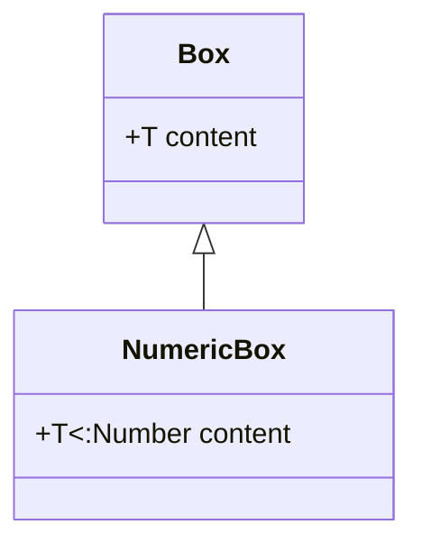

## 3.5 Parametric Types and Generics

In the world of programming, flexibility and reusability are key to building efficient and maintainable software. Julia, with its powerful type system, offers parametric types and generics as tools to achieve these goals. In this section, we will delve into the concepts of parametric types and generics, exploring their syntax, usage, and benefits in Julia programming.

### Defining Parametric Types

Parametric types in Julia allow us to define types that are parameterized over other types. This means we can create a single, flexible type definition that can work with various data types, enhancing code reusability and reducing redundancy.

#### Syntax and Examples

To define a parametric type in Julia, we use the following syntax:

```julia
struct MyType{T}
    value::T
end
```

Here, `MyType` is a parametric type with a type parameter `T`. This allows `MyType` to hold a value of any type `T`. Let's see some examples to illustrate this concept:

```julia
struct Box{T}
    content::T
end

int_box = Box(42)          # Box{Int64}
string_box = Box("Hello")  # Box{String}

println(int_box.content)   # Output: 42
println(string_box.content) # Output: Hello
```

In this example, `Box` is a parametric type that can hold any type of content. We create instances of `Box` with an integer and a string, demonstrating the flexibility of parametric types.

### Constraints on Parameters

While parametric types offer flexibility, there are situations where we need to constrain the type parameters to ensure they meet certain criteria. Julia provides mechanisms to impose such constraints using `<:`, `where`, and type bounds.

#### Using `<:` for Subtype Constraints

The `<:` operator allows us to specify that a type parameter must be a subtype of a given type. This is useful when we want to restrict the types that can be used with our parametric type.

```julia
struct NumericBox{T<:Number}
    content::T
end

float_box = NumericBox(3.14)  # NumericBox{Float64}

# string_box = NumericBox("Hello")  # Error: "String" is not a subtype of "Number"
```

In this example, `NumericBox` is constrained to only accept types that are subtypes of `Number`. Attempting to create a `NumericBox` with a `String` results in an error.

#### Using `where` for Type Constraints

The `where` keyword provides another way to specify constraints on type parameters, offering more flexibility in defining complex constraints.

```julia
function add_elements{T<:Number}(a::T, b::T) where T
    return a + b
end

println(add_elements(5, 10))      # Output: 15
```

Here, the `add_elements` function is constrained to accept arguments of the same type `T`, where `T` is a subtype of `Number`.

### Generic Programming

Generic programming is a paradigm that emphasizes writing code that can work with any data type. In Julia, generic programming is facilitated by parametric types and functions with type parameters.

#### Writing Functions with Type Parameters

By using type parameters in function definitions, we can create functions that are both flexible and efficient. This allows us to write code that can handle a variety of input types without sacrificing performance.

```julia
function swap{T}(x::T, y::T) where T
    return y, x
end

a, b = swap(1, 2)          # Output: (2, 1)
c, d = swap("Hello", "World")  # Output: ("World", "Hello")
```

In this example, the `swap` function is defined with a type parameter `T`, allowing it to swap values of any type.

#### Benefits of Generic Programming

Generic programming offers several benefits:

- **Code Reusability**: Write once, use with any type.
- **Type Safety**: Compile-time checks ensure type correctness.
- **Performance**: Julia's type inference and specialization optimize generic code.

### Visualizing Parametric Types and Generics

To better understand the relationships and constraints in parametric types and generics, let's visualize these concepts using a class diagram.



**Diagram Description**: This diagram illustrates the relationship between `Box` and `NumericBox`. `Box` is a generic type with a type parameter `T`, while `NumericBox` is a specialized version with a subtype constraint on `T`.

### Try It Yourself

Experiment with parametric types and generics by modifying the code examples:

- Create a parametric type `Pair` that holds two values of potentially different types.
- Define a function `compare` that takes two arguments of any type and returns `true` if they are equal, using type parameters.

### References and Links

For further reading on parametric types and generics in Julia, consider exploring the following resources:

- [Julia Documentation on Parametric Types](https://docs.julialang.org/en/v1/manual/types/#Parametric-Types)
- [JuliaLang Blog: Parametric Types](https://julialang.org/blog/2012/02/why-we-created-julia/)
- [MDN Web Docs: Generic Programming](https://developer.mozilla.org/en-US/docs/Glossary/Generic_programming)

### Knowledge Check

- What are parametric types, and how do they enhance code flexibility?
- How can you constrain type parameters in Julia?
- What are the benefits of generic programming in Julia?

### Embrace the Journey

Remember, mastering parametric types and generics is just the beginning. As you continue to explore Julia's powerful type system, you'll unlock new levels of flexibility and efficiency in your code. Keep experimenting, stay curious, and enjoy the journey!

## Quiz Time!



### What is a parametric type in Julia?

- [x] A type that is parameterized over other types
- [ ] A type that cannot hold any data
- [ ] A type that is only used for integers
- [ ] A type that is specific to strings

> **Explanation:** A parametric type in Julia is a type that is parameterized over other types, allowing for flexibility and reusability.

### How do you define a parametric type in Julia?

- [x] Using the `struct` keyword with a type parameter
- [ ] Using the `class` keyword
- [ ] Using the `type` keyword without parameters
- [ ] Using the `function` keyword

> **Explanation:** Parametric types are defined using the `struct` keyword followed by a type parameter in curly braces.

### What does the `<:` operator do in Julia?

- [x] Specifies a subtype constraint for a type parameter
- [ ] Specifies an equality constraint for a type parameter
- [ ] Specifies a supertype constraint for a type parameter
- [ ] Specifies a negation constraint for a type parameter

> **Explanation:** The `<:` operator is used to specify that a type parameter must be a subtype of a given type.

### What is the purpose of generic programming?

- [x] To write code that can work with any data type
- [ ] To write code that only works with integers
- [ ] To write code that is specific to strings
- [ ] To write code that cannot be reused

> **Explanation:** Generic programming aims to write code that can work with any data type, enhancing flexibility and reusability.

### How can you impose constraints on type parameters in Julia?

- [x] Using `<:`, `where`, and type bounds
- [ ] Using `==`, `where`, and type bounds
- [ ] Using `!=`, `where`, and type bounds
- [ ] Using `>`, `where`, and type bounds

> **Explanation:** Constraints on type parameters can be imposed using `<:`, `where`, and type bounds.

### What is a benefit of using parametric types?

- [x] They enhance code reusability
- [ ] They make code less readable
- [ ] They restrict code to specific types
- [ ] They decrease performance

> **Explanation:** Parametric types enhance code reusability by allowing a single type definition to work with various data types.

### What does the `where` keyword do in Julia?

- [x] Specifies constraints on type parameters
- [ ] Specifies the location of a function
- [ ] Specifies the return type of a function
- [ ] Specifies the input type of a function

> **Explanation:** The `where` keyword is used to specify constraints on type parameters in Julia.

### What is a key feature of Julia's type system?

- [x] Support for parametric types and generics
- [ ] Lack of type inference
- [ ] Inability to handle complex data types
- [ ] Restriction to only primitive types

> **Explanation:** A key feature of Julia's type system is its support for parametric types and generics, which enhance flexibility and efficiency.

### Can parametric types be used with functions in Julia?

- [x] True
- [ ] False

> **Explanation:** Parametric types can be used with functions in Julia to create flexible and reusable code.

### What is the role of type parameters in functions?

- [x] To allow functions to handle various input types
- [ ] To restrict functions to a single input type
- [ ] To make functions less efficient
- [ ] To make functions more complex

> **Explanation:** Type parameters in functions allow them to handle various input types, enhancing flexibility and reusability.


