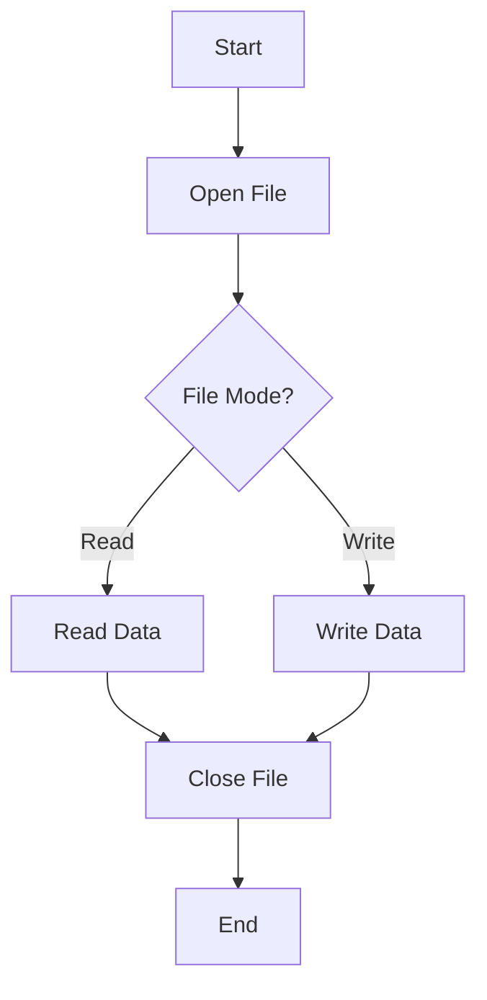

## 3.6 Working with Files and I/O Operations

In the realm of software development, file handling and input/output (I/O) operations are fundamental skills that every developer must master. Julia, with its rich set of built-in functions and libraries, provides powerful tools for handling files and performing I/O operations efficiently. In this section, we will delve into the intricacies of file handling, streams, and serialization in Julia. By the end of this guide, you will be equipped with the knowledge to manage files and data streams effectively in your Julia applications.

### File Handling

File handling in Julia involves a series of operations that allow you to open, read, write, and close files. Let's explore these operations in detail.

#### Opening and Closing Files

To work with files in Julia, you first need to open them. Julia provides the `open` function, which can be used to open a file for reading, writing, or both. Once you are done with a file, it is important to close it to free up system resources. This can be done using the `close` function.

**Example: Opening and Closing a File**

```julia
file = open("example.txt", "w")

write(file, "Hello, Julia!")

close(file)
```

In the example above, we open a file named `example.txt` in write mode (`"w"`), write a string to it, and then close the file. It's crucial to close files to avoid memory leaks and ensure data integrity.

#### Using `do` Blocks for File Operations

Julia provides a more concise and safer way to handle files using `do` blocks. This approach automatically closes the file once the block is executed, even if an error occurs.

**Example: Using `do` Block**

```julia
open("example.txt", "w") do file
    write(file, "Hello, Julia with do block!")
end
```

The `do` block ensures that the file is closed automatically, making your code cleaner and less error-prone.

### Reading and Writing

Once a file is open, you can perform various read and write operations. Julia provides several functions to facilitate these operations.

#### Reading from Files

To read data from a file, you can use functions like `read`, `readline`, and `readlines`.

- **`read`**: Reads the entire content of a file into a string or byte array.
- **`readline`**: Reads a single line from a file.
- **`readlines`**: Reads all lines from a file into an array of strings.

**Example: Reading from a File**

```julia
open("example.txt", "r") do file
    # Read the entire file content
    content = read(file, String)
    println("File Content: ", content)
    
    # Reset file pointer to the beginning
    seek(file, 0)
    
    # Read the first line
    first_line = readline(file)
    println("First Line: ", first_line)
    
    # Reset file pointer to the beginning
    seek(file, 0)
    
    # Read all lines
    lines = readlines(file)
    println("All Lines: ", lines)
end
```

In this example, we demonstrate reading the entire file content, a single line, and all lines using `read`, `readline`, and `readlines`, respectively.

#### Writing to Files

Writing data to a file is straightforward with the `write` function. You can write strings, numbers, or any data that can be converted to a byte stream.

**Example: Writing to a File**

```julia
open("example.txt", "w") do file
    # Write a string
    write(file, "This is a test.\n")
    
    # Write numbers
    write(file, "Numbers: ", 1, 2, 3, "\n")
end
```

In this example, we write a string and a series of numbers to the file. The `write` function automatically converts the data to a byte stream.

### Streams and Buffers

In Julia, streams are objects that represent sources or destinations of data. They can be used for both input and output operations. Understanding streams is essential for efficient I/O operations.

#### Working with IO Streams

Julia provides several types of streams, including `IOStream`, `IOBuffer`, and `Pipe`. Each type serves a specific purpose in I/O operations.

- **`IOStream`**: Represents a file or a socket.
- **`IOBuffer`**: Represents an in-memory buffer.
- **`Pipe`**: Represents a unidirectional communication channel.

**Example: Using IOBuffer**

```julia
buffer = IOBuffer()

write(buffer, "Buffered data")

seek(buffer, 0)  # Reset buffer position
data = read(buffer, String)
println("Buffer Content: ", data)
```

In this example, we create an `IOBuffer`, write data to it, and then read the data back. `IOBuffer` is useful for temporary storage and manipulation of data in memory.

### Serialization

Serialization is the process of converting a data structure into a format that can be easily stored or transmitted and then reconstructed later. In Julia, serialization is commonly used for saving and loading complex data structures.

#### Saving and Loading Data Structures

Julia provides the `Serialization` standard library for serializing and deserializing data structures. This library is particularly useful for saving the state of an application or sharing data between different Julia sessions.

**Example: Serialization and Deserialization**

```julia
using Serialization

data = Dict("name" => "Julia", "version" => 1.6, "features" => ["fast", "dynamic", "easy"])

open("data.jls", "w") do file
    serialize(file, data)
end

loaded_data = open("data.jls", "r") do file
    deserialize(file)
end

println("Loaded Data: ", loaded_data)
```

In this example, we serialize a dictionary to a file and then deserialize it back into a Julia object. The `Serialization` library handles the conversion between the in-memory representation and the serialized format.

### Try It Yourself

Experiment with the code examples provided above. Try modifying the file paths, data content, and operations to see how Julia handles different scenarios. For instance, you can:

- Change the file mode from `"w"` (write) to `"a"` (append) and observe how the file content changes.
- Use `IOBuffer` to manipulate data in memory before writing it to a file.
- Serialize different types of data structures and explore the serialized file content.

### Visualizing File I/O Operations

To better understand the flow of file I/O operations in Julia, let's visualize the process using a flowchart.



**Figure: File I/O Operations Flowchart**  
This flowchart illustrates the basic steps involved in file I/O operations, starting from opening a file, performing read or write operations, and finally closing the file.

### References and Links

For further reading on file handling and I/O operations in Julia, consider exploring the following resources:

- [Julia Documentation on File I/O](https://docs.julialang.org/en/v1/base/io-network/)
- [Serialization in Julia](https://docs.julialang.org/en/v1/stdlib/Serialization/)
- [JuliaLang GitHub Repository](https://github.com/JuliaLang/julia)

### Knowledge Check

To reinforce your understanding of file handling and I/O operations in Julia, consider the following questions:

1. What is the purpose of the `do` block in file operations?
2. How can you read all lines from a file into an array?
3. What is the difference between `IOStream` and `IOBuffer`?
4. How does serialization help in data management?

### Embrace the Journey

Remember, mastering file handling and I/O operations is just the beginning of your journey with Julia. As you progress, you'll encounter more complex scenarios and data management challenges. Keep experimenting, stay curious, and enjoy the process of learning and growing as a Julia developer!

## Quiz Time!



### What function is used to open a file in Julia?

- [x] open
- [ ] read
- [ ] write
- [ ] close

> **Explanation:** The `open` function is used to open a file for reading, writing, or both in Julia.

### Which function reads the entire content of a file into a string?

- [x] read
- [ ] readline
- [ ] readlines
- [ ] write

> **Explanation:** The `read` function reads the entire content of a file into a string or byte array.

### What is the purpose of the `do` block in file operations?

- [x] To automatically close the file after operations
- [ ] To open the file in append mode
- [ ] To read data line by line
- [ ] To write data in binary format

> **Explanation:** The `do` block ensures that the file is closed automatically after the operations, even if an error occurs.

### Which type of stream represents an in-memory buffer?

- [ ] IOStream
- [x] IOBuffer
- [ ] Pipe
- [ ] FileStream

> **Explanation:** `IOBuffer` represents an in-memory buffer, useful for temporary storage and manipulation of data.

### What library is used for serialization in Julia?

- [ ] IO
- [ ] FileIO
- [x] Serialization
- [ ] DataFrames

> **Explanation:** The `Serialization` library in Julia is used for serializing and deserializing data structures.

### How can you read a single line from a file?

- [ ] read
- [x] readline
- [ ] readlines
- [ ] write

> **Explanation:** The `readline` function reads a single line from a file.

### What is the difference between `IOStream` and `IOBuffer`?

- [x] IOStream represents a file or socket, IOBuffer represents an in-memory buffer
- [ ] IOStream is for reading, IOBuffer is for writing
- [ ] IOStream is faster than IOBuffer
- [ ] IOStream is for text, IOBuffer is for binary data

> **Explanation:** `IOStream` represents a file or socket, while `IOBuffer` represents an in-memory buffer.

### Which function writes data to a file?

- [ ] read
- [ ] readline
- [ ] readlines
- [x] write

> **Explanation:** The `write` function is used to write data to a file.

### What does serialization allow you to do?

- [x] Convert data structures into a format for storage or transmission
- [ ] Read data from a file
- [ ] Write data to a file
- [ ] Open a file for reading

> **Explanation:** Serialization allows you to convert data structures into a format that can be stored or transmitted and later reconstructed.

### True or False: The `close` function is used to open a file.

- [ ] True
- [x] False

> **Explanation:** The `close` function is used to close a file, not open it.


