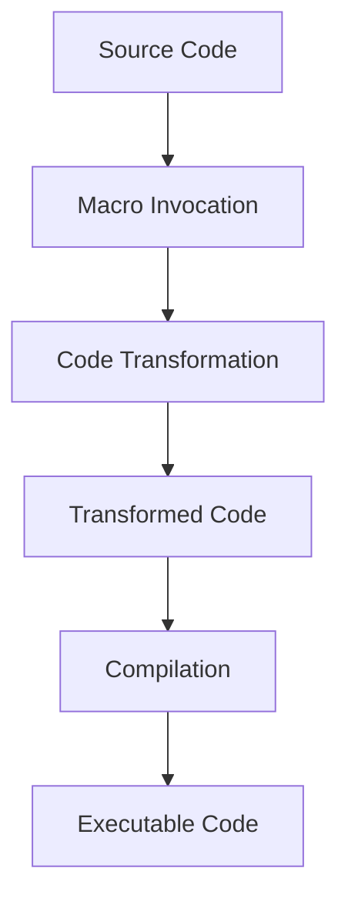

## 3.7 Macros and Metaprogramming Basics

Welcome to the fascinating world of macros and metaprogramming in Julia! In this section, we'll dive deep into the concepts and techniques that allow you to transform and generate code dynamically. Macros and metaprogramming are powerful tools in Julia, enabling you to write more expressive, efficient, and reusable code. Let's embark on this journey together, exploring the intricacies of macros and how they can elevate your Julia programming skills.

### Introduction to Macros

Macros in Julia are a form of metaprogramming that allows you to manipulate and transform code at parse time. Unlike functions, which operate on values, macros operate on code itself. This means that macros can generate and modify code before it is executed, providing a powerful mechanism for code abstraction and reuse.

#### Purpose of Macros

The primary purpose of macros is to enable code transformation and generation. They allow you to:

- **Automate repetitive code patterns**: Macros can encapsulate common code patterns, reducing redundancy and improving maintainability.
- **Implement domain-specific languages (DSLs)**: By transforming code, macros can create custom syntaxes tailored to specific problem domains.
- **Optimize performance**: Macros can generate specialized code paths, improving performance by eliminating unnecessary computations.

#### Defining Macros

Macros are defined using the `macro` keyword in Julia. A macro takes a series of expressions as input and returns a transformed expression. This transformation occurs at parse time, meaning the macro's output is compiled into the final program.

Here's a simple example of a macro definition:

```julia
macro sayhello(name)
    return :(println("Hello, ", $name))
end
```

In this example, the `sayhello` macro takes a single argument `name` and returns an expression that prints a greeting. The `:` syntax is used to create an expression, and `$` is used for interpolation within the expression.

### Expr Objects and Quoting

To understand macros fully, we need to delve into expressions and quoting in Julia. Expressions are the building blocks of Julia code, representing the structure of code itself.

#### Working with Expressions

In Julia, expressions are represented by the `Expr` type. An `Expr` object encapsulates the structure of a piece of code, including its head (the type of expression) and its arguments (the components of the expression).

Here's how you can create and inspect an `Expr` object:

```julia
expr = :(a + b)
println(expr.head)  # Output: :call
println(expr.args)  # Output: Any[:+, :a, :b]
```

In this example, `expr` is an expression representing the addition of `a` and `b`. The `head` of the expression is `:call`, indicating a function call, and the `args` are the components of the expression.

#### Quasi-quoting

Quasi-quoting is a technique used to construct expressions in Julia. It allows you to create expressions with placeholders that can be filled in later. The `quote` block and the `:( )` syntax are used for quasi-quoting.

Here's an example of quasi-quoting:

```julia
expr = quote
    x = 10
    y = x + 20
end

println(expr)
```

The `quote` block creates an expression that assigns `10` to `x` and then adds `20` to `x`. Quasi-quoting is essential for building complex expressions dynamically.

### Simple Macro Examples

Now that we have a solid understanding of expressions and quoting, let's explore some simple macro examples. These examples will demonstrate how macros can be used to create powerful abstractions and custom control structures.

#### Creating a Logging Macro

Logging is a common task in software development, and macros can simplify the process by automating the generation of logging code. Let's create a simple logging macro:

```julia
macro log(expr)
    return quote
        println("Executing: ", $(string(expr)))
        result = $(esc(expr))
        println("Result: ", result)
        result
    end
end

x = 5
y = 10
@log x + y
```

In this example, the `log` macro takes an expression `expr` and generates code that logs the expression and its result. The `esc` function is used to ensure that the expression is evaluated in the correct scope.

#### Implementing a Custom Control Structure

Macros can also be used to implement custom control structures. Let's create a simple `unless` macro, which behaves like an inverted `if` statement:

```julia
macro unless(condition, block)
    return quote
        if !($condition)
            $(esc(block))
        end
    end
end

x = 5
@unless x > 10 begin
    println("x is not greater than 10")
end
```

The `unless` macro takes a condition and a block of code. If the condition is false, the block is executed. This demonstrates how macros can be used to create intuitive and expressive control structures.

### Visualizing Macros and Metaprogramming

To better understand the flow of macros and metaprogramming, let's visualize the process using a flowchart. This diagram illustrates how a macro transforms code at parse time, resulting in the final executable code.



**Caption**: This flowchart shows the process of macro invocation, code transformation, and compilation in Julia.

### References and Links

For further reading on macros and metaprogramming in Julia, consider exploring the following resources:

- [Julia Documentation on Metaprogramming](https://docs.julialang.org/en/v1/manual/metaprogramming/)
- [Metaprogramming in Julia: A Tutorial](https://www.juliabloggers.com/metaprogramming-in-julia-a-tutorial/)
- [Understanding Julia's Macros](https://www.juliabloggers.com/understanding-julias-macros/)

### Knowledge Check

Let's test your understanding of macros and metaprogramming with a few questions:

1. What is the primary purpose of macros in Julia?
2. How do you define a macro in Julia?
3. What is the role of the `Expr` type in metaprogramming?
4. How does quasi-quoting help in constructing expressions?
5. Can you create a simple macro that doubles a number?

### Embrace the Journey

Remember, mastering macros and metaprogramming is a journey. As you continue to explore these concepts, you'll discover new ways to write more efficient and expressive code. Keep experimenting, stay curious, and enjoy the process!

### Quiz Time!



### What is the primary purpose of macros in Julia?

- [x] Code transformation at parse time
- [ ] Runtime value manipulation
- [ ] Memory management
- [ ] Type checking

> **Explanation:** Macros in Julia are used for code transformation at parse time, allowing for dynamic code generation and manipulation.

### How do you define a macro in Julia?

- [x] Using the `macro` keyword
- [ ] Using the `function` keyword
- [ ] Using the `struct` keyword
- [ ] Using the `module` keyword

> **Explanation:** Macros are defined using the `macro` keyword in Julia, allowing for code transformation.

### What type represents expressions in Julia?

- [x] `Expr`
- [ ] `String`
- [ ] `Int`
- [ ] `Float64`

> **Explanation:** The `Expr` type represents expressions in Julia, encapsulating the structure of code.

### What is the purpose of quasi-quoting in Julia?

- [x] Constructing expressions with placeholders
- [ ] Optimizing runtime performance
- [ ] Managing memory allocation
- [ ] Handling exceptions

> **Explanation:** Quasi-quoting is used to construct expressions with placeholders, allowing for dynamic expression building.

### Which function ensures that an expression is evaluated in the correct scope?

- [x] `esc`
- [ ] `eval`
- [ ] `parse`
- [ ] `include`

> **Explanation:** The `esc` function ensures that an expression is evaluated in the correct scope, preserving variable bindings.

### What is the head of an expression representing a function call?

- [x] `:call`
- [ ] `:function`
- [ ] `:macro`
- [ ] `:expr`

> **Explanation:** The head of an expression representing a function call is `:call`, indicating the type of expression.

### How can macros improve performance?

- [x] By generating specialized code paths
- [ ] By reducing memory usage
- [ ] By simplifying syntax
- [ ] By increasing type safety

> **Explanation:** Macros can improve performance by generating specialized code paths, eliminating unnecessary computations.

### What is the role of the `quote` block in Julia?

- [x] Creating expressions
- [ ] Defining functions
- [ ] Declaring variables
- [ ] Importing modules

> **Explanation:** The `quote` block is used to create expressions in Julia, allowing for dynamic code construction.

### Can macros be used to implement custom control structures?

- [x] True
- [ ] False

> **Explanation:** Macros can be used to implement custom control structures, providing more expressive code patterns.

### What is the benefit of using macros for logging?

- [x] Automating the generation of logging code
- [ ] Reducing memory usage
- [ ] Simplifying syntax
- [ ] Increasing type safety

> **Explanation:** Macros automate the generation of logging code, making it easier to implement consistent logging practices.



By mastering macros and metaprogramming, you unlock the full potential of Julia, enabling you to write more powerful and expressive code. Keep exploring, and you'll continue to discover new ways to leverage these techniques in your projects!
