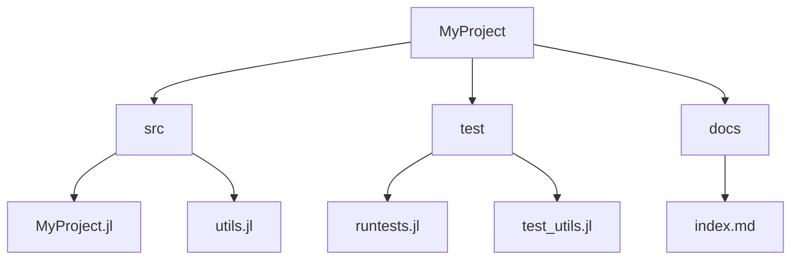

## 3.8 Best Practices for Julia Coding Style

Writing clean, readable, and maintainable code is a hallmark of a proficient developer. In Julia, adhering to a consistent coding style not only enhances the readability of your code but also facilitates collaboration and reduces the likelihood of errors. This section delves into the best practices for Julia coding style, covering essential aspects such as code formatting, naming conventions, documentation, and code organization.

### Code Formatting

Proper code formatting is crucial for readability and maintainability. Let's explore the key elements of code formatting in Julia.

#### Indentation

Indentation is used to define the structure of your code. In Julia, the standard practice is to use four spaces per indentation level. Avoid using tabs, as they can lead to inconsistent formatting across different editors.

```julia
function greet(name)
    println("Hello, $name!")
end
```

#### Line Length

Keeping line lengths manageable improves readability. Aim for a maximum line length of 80 characters. If a line exceeds this length, consider breaking it into multiple lines.

```julia
println("This is a very long line that exceeds the recommended line length and should be split.")

println("This is a very long line that exceeds the recommended line length " *
        "and should be split.")
```

#### Whitespace

Use whitespace to improve code clarity. Insert spaces around operators and after commas, but avoid excessive whitespace that can clutter the code.

```julia
a = 1 + 2
b = [1, 2, 3]

a=1+2
b=[1,2,3]
```

### Naming Conventions

Consistent naming conventions make your code more intuitive and easier to understand. Let's examine the recommended naming conventions for variables, functions, and types in Julia.

#### Variables

Use lowercase letters with underscores to separate words in variable names. This style, known as snake_case, is common in Julia.

```julia
user_name = "Alice"
total_count = 42
```

#### Functions

Function names should be descriptive and use lowercase letters with underscores. If a function modifies its argument, consider using a `!` at the end of the name to indicate this behavior.

```julia
function calculate_sum(a, b)
    return a + b
end

function update_values!(values)
    for i in 1:length(values)
        values[i] += 1
    end
end
```

#### Types

Type names should be in CamelCase, starting with an uppercase letter. This distinguishes them from variables and functions.

```julia
struct UserProfile
    name::String
    age::Int
end
```

### Documentation

Well-documented code is easier to understand and maintain. Julia provides a powerful system for writing documentation using docstrings and Markdown formatting.

#### Writing Docstrings

Docstrings are used to document functions, types, and modules. They should be placed immediately before the item they document and enclosed in triple double quotes (`"""`).

```julia
"""
    greet(name::String)

Prints a greeting message to the user with the given name.
"""
function greet(name::String)
    println("Hello, $name!")
end
```

#### Using Markdown Formatting

Julia's docstrings support Markdown formatting, allowing you to include lists, code blocks, and links for richer documentation.

```julia
"""
    calculate_sum(a::Int, b::Int) -> Int

Calculates the sum of two integers.

- `a::Int`: The first integer.
- `b::Int`: The second integer.

- `Int`: The sum of `a` and `b`.

```julia
julia> calculate_sum(3, 4)
7
```
"""
function calculate_sum(a::Int, b::Int) -> Int
    return a + b
end
```

### Code Organization

Organizing your code effectively is essential for readability and maintainability. Let's explore best practices for structuring modules and projects in Julia.

#### Structuring Modules

Modules are used to encapsulate code and manage namespaces. Organize related functions, types, and constants within a module to improve code organization.

```julia
module MathUtils

export calculate_sum, calculate_product

"""
    calculate_sum(a::Int, b::Int) -> Int

Calculates the sum of two integers.
"""
function calculate_sum(a::Int, b::Int) -> Int
    return a + b
end

"""
    calculate_product(a::Int, b::Int) -> Int

Calculates the product of two integers.
"""
function calculate_product(a::Int, b::Int) -> Int
    return a * b
end

end # module MathUtils
```

#### Project Structure

Organize your Julia projects with a clear directory structure. A typical project might include directories for source code (`src`), tests (`test`), and documentation (`docs`).

```
MyProject/
│
├── src/
│   ├── MyProject.jl
│   └── utils.jl
│
├── test/
│   ├── runtests.jl
│   └── test_utils.jl
│
└── docs/
    └── index.md
```

### Try It Yourself

Experiment with the code examples provided in this section. Try modifying the function names, variable names, and documentation to see how different styles affect readability. Consider creating a small project and organizing it using the guidelines discussed.

### Visualizing Code Organization

To better understand how to organize your code, let's visualize a typical project structure using a Mermaid.js diagram.



This diagram illustrates the hierarchical structure of a Julia project, with separate directories for source code, tests, and documentation.

### References and Links

For further reading on Julia coding style, consider exploring the following resources:

- [Julia Style Guide](https://docs.julialang.org/en/v1/manual/style-guide/)
- [Documenter.jl](https://juliadocs.github.io/Documenter.jl/stable/)

### Knowledge Check

To reinforce your understanding of Julia coding style, consider the following questions:

1. What is the recommended indentation style in Julia?
2. How should function names be formatted in Julia?
3. What is the purpose of using a `!` at the end of a function name?
4. How can you include examples in Julia docstrings?
5. What is the benefit of organizing code into modules?

### Embrace the Journey

Remember, mastering Julia coding style is a journey. As you continue to develop your skills, you'll find that adhering to these best practices will make your code more readable, maintainable, and enjoyable to work with. Keep experimenting, stay curious, and enjoy the journey!

## Quiz Time!



### What is the recommended indentation style in Julia?

- [x] Four spaces per indentation level
- [ ] Two spaces per indentation level
- [ ] Tabs
- [ ] No indentation

> **Explanation:** Julia's style guide recommends using four spaces per indentation level for consistency and readability.

### How should function names be formatted in Julia?

- [x] Lowercase letters with underscores
- [ ] CamelCase
- [ ] ALL_CAPS
- [ ] MixedCase

> **Explanation:** Function names in Julia should use lowercase letters with underscores to improve readability.

### What is the purpose of using a `!` at the end of a function name?

- [x] Indicates that the function modifies its arguments
- [ ] Denotes a private function
- [ ] Marks a deprecated function
- [ ] Shows that the function is recursive

> **Explanation:** In Julia, a `!` at the end of a function name indicates that the function modifies its arguments.

### How can you include examples in Julia docstrings?

- [x] Using Markdown code blocks
- [ ] By writing plain text
- [ ] Through inline comments
- [ ] With XML tags

> **Explanation:** Julia docstrings support Markdown formatting, allowing you to include examples using code blocks.

### What is the benefit of organizing code into modules?

- [x] Improves code organization and namespace management
- [ ] Increases code execution speed
- [ ] Reduces memory usage
- [ ] Simplifies error handling

> **Explanation:** Organizing code into modules helps manage namespaces and improves code organization.

### What is the recommended maximum line length in Julia?

- [x] 80 characters
- [ ] 100 characters
- [ ] 120 characters
- [ ] 60 characters

> **Explanation:** Keeping line lengths to a maximum of 80 characters is recommended for better readability.

### How should type names be formatted in Julia?

- [x] CamelCase
- [ ] snake_case
- [ ] ALL_CAPS
- [ ] kebab-case

> **Explanation:** Type names in Julia should be in CamelCase, starting with an uppercase letter.

### What is the purpose of whitespace in code?

- [x] Improves code clarity and readability
- [ ] Increases code execution speed
- [ ] Reduces memory usage
- [ ] Simplifies error handling

> **Explanation:** Whitespace is used to improve code clarity and readability by separating elements visually.

### How can you structure a Julia project for better organization?

- [x] Use separate directories for source code, tests, and documentation
- [ ] Place all files in a single directory
- [ ] Use a flat file structure
- [ ] Organize files by file size

> **Explanation:** Structuring a project with separate directories for source code, tests, and documentation enhances organization.

### True or False: Julia docstrings support Markdown formatting.

- [x] True
- [ ] False

> **Explanation:** Julia docstrings support Markdown formatting, allowing for rich documentation with lists, code blocks, and links.




