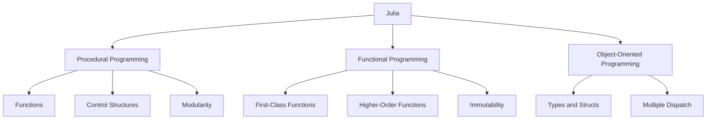

## 4.1 Programming Paradigms Supported by Julia

Julia is a versatile, high-performance programming language designed for technical computing. One of its most compelling features is its support for multiple programming paradigms, allowing developers to choose the most suitable approach for their specific problem domain. In this section, we will explore the various programming paradigms supported by Julia, discuss when to use each paradigm, and examine how combining paradigms can leverage Julia's strengths.

### Multi-Paradigm Language

Julia is often described as a multi-paradigm language because it supports procedural, functional, and object-oriented programming styles. This flexibility allows developers to select the paradigm that best fits their problem domain or even combine paradigms to create more robust and efficient solutions.

#### Procedural Programming

Procedural programming is a paradigm derived from structured programming, based on the concept of procedure calls. Procedures, also known as routines, subroutines, or functions, contain a series of computational steps to be carried out. Julia's syntax and design make it an excellent choice for procedural programming.

**Key Features of Procedural Programming in Julia:**

- **Functions**: Central to procedural programming, functions in Julia are first-class citizens. They can be defined, passed as arguments, and returned from other functions.
- **Control Structures**: Julia supports traditional control structures like loops (`for`, `while`) and conditionals (`if`, `else`, `elseif`).
- **Modularity**: Code can be organized into modules, which encapsulate functions and variables, promoting code reuse and organization.

**Example:**

```julia
function factorial(n::Int)
    result = 1
    for i in 1:n
        result *= i
    end
    return result
end

println(factorial(5))  # Output: 120
```

In this example, we define a simple function to calculate the factorial of a number using a `for` loop, demonstrating procedural programming in Julia.

#### Functional Programming

Functional programming is a paradigm that treats computation as the evaluation of mathematical functions and avoids changing state or mutable data. Julia supports functional programming through features like first-class functions, higher-order functions, and immutability.

**Key Features of Functional Programming in Julia:**

- **First-Class Functions**: Functions can be assigned to variables, passed as arguments, and returned from other functions.
- **Higher-Order Functions**: Functions that take other functions as arguments or return them as results.
- **Immutability**: Encourages the use of immutable data structures to avoid side effects.

**Example:**

```julia
function apply_function(arr, func)
    return [func(x) for x in arr]
end

square(x) = x * x

result = apply_function([1, 2, 3, 4], square)
println(result)  # Output: [1, 4, 9, 16]
```

In this example, we define a higher-order function `apply_function` that applies a given function to each element of an array, demonstrating functional programming in Julia.

#### Object-Oriented Programming

While Julia is not a traditional object-oriented language, it supports object-oriented programming (OOP) concepts through its type system and multiple dispatch. Julia's approach to OOP is more flexible and dynamic compared to classical OOP languages.

**Key Features of Object-Oriented Programming in Julia:**

- **Types and Structs**: Define custom data types using `struct`, which can have fields and methods associated with them.
- **Multiple Dispatch**: Allows defining methods based on the types of all arguments, providing a powerful mechanism for polymorphism.

**Example:**

```julia
struct Point
    x::Float64
    y::Float64
end

function distance(p1::Point, p2::Point)
    return sqrt((p2.x - p1.x)^2 + (p2.y - p1.y)^2)
end

p1 = Point(1.0, 2.0)
p2 = Point(4.0, 6.0)

println(distance(p1, p2))  # Output: 5.0
```

In this example, we define a `Point` struct and a `distance` method to calculate the distance between two points, demonstrating object-oriented programming in Julia.

### Choosing a Paradigm

Choosing the right programming paradigm depends on the problem domain, the complexity of the task, and the developer's familiarity with the paradigm. Each paradigm has its benefits and trade-offs.

- **Procedural Programming**: Best suited for tasks with a clear sequence of steps or when performance is a critical concern. It is straightforward and easy to understand, making it ideal for beginners.
- **Functional Programming**: Ideal for tasks that involve complex data transformations or when immutability and side-effect-free functions are desired. It promotes code that is easier to reason about and test.
- **Object-Oriented Programming**: Useful for modeling complex systems with interacting entities. It provides a natural way to organize code and encapsulate data and behavior.

### Hybrid Approaches

Julia's support for multiple paradigms allows developers to combine them, leveraging the strengths of each. This hybrid approach can lead to more flexible and powerful solutions.

**Example: Combining Paradigms**

```julia
struct BankAccount
    balance::Float64
end

function deposit(account::BankAccount, amount::Float64)
    return BankAccount(account.balance + amount)
end

function apply_transactions(account::BankAccount, transactions::Array{Function, 1})
    for transaction in transactions
        account = transaction(account)
    end
    return account
end

account = BankAccount(100.0)

transactions = [
    account -> deposit(account, 50.0),
    account -> deposit(account, 25.0)
]

final_account = apply_transactions(account, transactions)
println(final_account.balance)  # Output: 175.0
```

In this example, we combine procedural and functional programming paradigms. We define a `BankAccount` struct and a procedural `deposit` function, then use a functional approach to apply a series of transactions.

### Visualizing Julia's Multi-Paradigm Support

To better understand how Julia supports multiple paradigms, let's visualize the relationships between these paradigms and their key features.



This diagram illustrates how Julia supports procedural, functional, and object-oriented programming, highlighting the key features of each paradigm.

### References and Links

For further reading on programming paradigms and Julia, consider the following resources:

- [Julia Documentation](https://docs.julialang.org/)
- [Functional Programming Concepts](https://en.wikipedia.org/wiki/Functional_programming)
- [Object-Oriented Programming](https://en.wikipedia.org/wiki/Object-oriented_programming)

### Knowledge Check

Let's test your understanding of the programming paradigms supported by Julia. Consider the following questions and challenges:

1. What are the key features of procedural programming in Julia?
2. How does Julia support functional programming?
3. Describe how multiple dispatch in Julia differs from traditional object-oriented polymorphism.
4. When might you choose to use a hybrid approach combining multiple paradigms in Julia?
5. Try modifying the code examples to include additional functionality or features.

### Embrace the Journey

Remember, exploring different programming paradigms is just the beginning. As you continue your journey with Julia, you'll discover more ways to leverage its multi-paradigm capabilities to build efficient and scalable applications. Keep experimenting, stay curious, and enjoy the process!

## Quiz Time!



### Which of the following is a key feature of procedural programming in Julia?

- [x] Functions
- [ ] Immutability
- [ ] Multiple Dispatch
- [ ] First-Class Functions

> **Explanation:** Functions are central to procedural programming, allowing for modular and reusable code.

### What is a characteristic of functional programming in Julia?

- [ ] Mutable data structures
- [x] Higher-Order Functions
- [ ] Encapsulation
- [ ] Inheritance

> **Explanation:** Higher-order functions, which take other functions as arguments or return them as results, are a hallmark of functional programming.

### How does Julia's approach to object-oriented programming differ from traditional OOP languages?

- [x] It uses multiple dispatch instead of class-based inheritance.
- [ ] It does not support encapsulation.
- [ ] It relies heavily on mutable state.
- [ ] It lacks support for polymorphism.

> **Explanation:** Julia uses multiple dispatch, allowing methods to be defined based on the types of all arguments, providing a flexible form of polymorphism.

### When is it beneficial to use a hybrid approach combining multiple paradigms in Julia?

- [x] When you want to leverage the strengths of different paradigms for complex problems.
- [ ] When you want to strictly adhere to one programming style.
- [ ] When performance is not a concern.
- [ ] When you are working on a small, simple project.

> **Explanation:** Combining paradigms allows developers to utilize the strengths of each, leading to more robust and efficient solutions.

### Which paradigm is best suited for tasks with a clear sequence of steps?

- [x] Procedural Programming
- [ ] Functional Programming
- [ ] Object-Oriented Programming
- [ ] Declarative Programming

> **Explanation:** Procedural programming is ideal for tasks with a clear sequence of steps, as it focuses on procedures or routines.

### What is a benefit of using functional programming in Julia?

- [x] Easier reasoning about code due to immutability and side-effect-free functions.
- [ ] Increased reliance on mutable state.
- [ ] Complex inheritance hierarchies.
- [ ] Strict adherence to procedural steps.

> **Explanation:** Functional programming promotes code that is easier to reason about and test due to its emphasis on immutability and side-effect-free functions.

### What is a key feature of object-oriented programming in Julia?

- [ ] Immutability
- [ ] Higher-Order Functions
- [x] Types and Structs
- [ ] Control Structures

> **Explanation:** Types and structs are used in Julia to define custom data types, which can have methods associated with them, supporting object-oriented programming.

### How can you apply a series of transformations to data in a functional programming style?

- [x] Use higher-order functions to apply transformations.
- [ ] Use mutable data structures.
- [ ] Use class-based inheritance.
- [ ] Use global variables.

> **Explanation:** Higher-order functions allow you to apply a series of transformations to data in a functional programming style, promoting immutability and side-effect-free operations.

### What is a common use case for procedural programming in Julia?

- [x] Tasks with a clear sequence of steps or when performance is critical.
- [ ] Modeling complex systems with interacting entities.
- [ ] Complex data transformations.
- [ ] Building large inheritance hierarchies.

> **Explanation:** Procedural programming is well-suited for tasks with a clear sequence of steps or when performance is a critical concern.

### True or False: Julia supports only one programming paradigm.

- [ ] True
- [x] False

> **Explanation:** Julia is a multi-paradigm language, supporting procedural, functional, and object-oriented programming styles.


