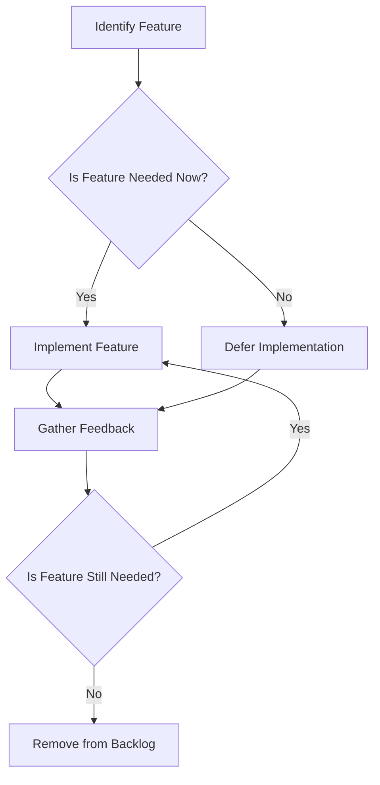

## 4.10 YAGNI (You Aren't Gonna Need It) Philosophy

In the realm of software development, the YAGNI (You Aren't Gonna Need It) philosophy is a guiding principle that encourages developers to focus on the present needs of a project rather than speculating about future requirements. This principle is particularly relevant in the context of Julia programming, where the language's flexibility and power can sometimes tempt developers to over-engineer solutions. In this section, we will delve into the YAGNI philosophy, its implications for Julia development, and how it can be effectively applied to create efficient, maintainable, and scalable software.

### Understanding YAGNI

YAGNI is a principle that originates from the Agile software development methodology, specifically from Extreme Programming (XP). It advocates for the implementation of features only when they are necessary, rather than anticipating future needs that may never materialize. This approach helps in maintaining simplicity and avoiding unnecessary complexity in codebases.

#### Key Concepts of YAGNI

1. **Delayed Implementation**: Implement features only when they are required. This reduces the risk of developing unnecessary functionality that may never be used.

2. **Risk of Premature Optimization**: Avoid optimizing code for hypothetical scenarios. Focus on current requirements and optimize only when performance issues arise.

3. **Agile Development**: Embrace flexibility and adaptability in development processes. Agile methodologies align well with YAGNI by promoting iterative development and continuous feedback.

### The Importance of YAGNI in Julia

Julia, known for its high performance and ease of use, can sometimes lead developers to explore advanced features prematurely. By adhering to the YAGNI philosophy, Julia developers can ensure that their code remains clean, efficient, and easy to maintain.

#### Benefits of Applying YAGNI in Julia

- **Simplicity**: By focusing on current needs, developers can keep their codebase simple and understandable.
- **Reduced Maintenance**: Less code means fewer bugs and easier maintenance.
- **Improved Focus**: Developers can concentrate on delivering value by addressing immediate requirements.
- **Enhanced Flexibility**: Codebases that adhere to YAGNI are more adaptable to change, as they are not burdened by unnecessary features.

### Implementing YAGNI in Julia Projects

To effectively implement the YAGNI philosophy in Julia projects, developers should follow certain best practices and strategies.

#### Delayed Implementation

One of the core tenets of YAGNI is to delay the implementation of features until they are truly needed. This can be achieved through:

- **Incremental Development**: Break down features into smaller, manageable parts and implement them incrementally.
- **Prioritization**: Focus on high-priority tasks that deliver immediate value to users.
- **Feedback Loops**: Regularly gather feedback from stakeholders to ensure that development aligns with actual needs.

#### Avoiding Premature Optimization

Premature optimization can lead to complex and inefficient code. To avoid this, developers should:

- **Profile Before Optimizing**: Use profiling tools to identify performance bottlenecks before attempting optimization.
- **Focus on Readability**: Prioritize code readability and maintainability over micro-optimizations.
- **Iterative Refinement**: Optimize code iteratively, based on real-world performance data.

#### Agile Development Practices

Agile methodologies complement the YAGNI philosophy by promoting adaptability and responsiveness to change. Key practices include:

- **Continuous Integration**: Regularly integrate code changes to detect issues early.
- **Test-Driven Development (TDD)**: Write tests before implementing features to ensure that code meets requirements.
- **Frequent Releases**: Release software frequently to gather user feedback and adjust development priorities accordingly.

### Code Examples in Julia

Let's explore some code examples that illustrate the application of the YAGNI philosophy in Julia.

#### Example 1: Delayed Implementation

Consider a scenario where we need to implement a function to calculate the area of different shapes. Instead of implementing all possible shapes upfront, we start with the most commonly used ones.

```julia
function area(shape::Symbol, radius::Float64)
    if shape == :circle
        return π * radius^2
    else
        error("Shape not supported")
    end
end

println(area(:circle, 5.0))  # Output: 78.53981633974483
```

In this example, we only implement the calculation for a circle. Additional shapes can be added later as needed.

#### Example 2: Avoiding Premature Optimization

Suppose we have a function that processes a list of numbers. Instead of optimizing for performance upfront, we focus on clarity and correctness.

```julia
function process_numbers(numbers::Vector{Int})
    result = []
    for number in numbers
        if number % 2 == 0
            push!(result, number * 2)
        else
            push!(result, number * 3)
        end
    end
    return result
end

println(process_numbers([1, 2, 3, 4]))  # Output: [3, 4, 9, 8]
```

Once we identify performance issues through profiling, we can optimize specific parts of the code.

### Visualizing YAGNI in Software Development

To better understand the YAGNI philosophy, let's visualize the decision-making process involved in feature implementation.



**Figure 1**: Decision-making process for feature implementation following the YAGNI philosophy.

### Challenges and Considerations

While the YAGNI philosophy offers numerous benefits, it also presents certain challenges that developers must be aware of.

#### Balancing Simplicity and Functionality

Striking the right balance between simplicity and functionality can be challenging. Developers must ensure that they do not oversimplify to the point of compromising essential features.

#### Managing Stakeholder Expectations

Stakeholders may have differing opinions on what features are necessary. Effective communication and regular feedback loops are essential to align expectations.

#### Technical Debt

While YAGNI helps reduce unnecessary complexity, it is important to address technical debt promptly to prevent it from accumulating.

### Knowledge Check

To reinforce your understanding of the YAGNI philosophy, consider the following questions:

- What are the key benefits of applying YAGNI in Julia projects?
- How can delayed implementation improve code maintainability?
- Why is it important to avoid premature optimization?
- How do Agile practices complement the YAGNI philosophy?

### Embrace the Journey

Remember, the YAGNI philosophy is not about doing less work; it's about doing the right work at the right time. By focusing on current needs and avoiding unnecessary complexity, you can create software that is both efficient and adaptable. As you continue your journey in Julia development, keep experimenting, stay curious, and enjoy the process of continuous learning and improvement.

## Quiz Time!



### What is the primary goal of the YAGNI philosophy?

- [x] To implement features only when they are needed
- [ ] To optimize code for future requirements
- [ ] To add as many features as possible
- [ ] To focus on long-term planning

> **Explanation:** The YAGNI philosophy emphasizes implementing features only when they are necessary, avoiding unnecessary complexity.

### How does delayed implementation benefit software development?

- [x] It reduces unnecessary complexity
- [ ] It increases the number of features
- [ ] It requires more resources
- [ ] It leads to premature optimization

> **Explanation:** Delayed implementation helps in maintaining simplicity by reducing unnecessary complexity in the codebase.

### What is a risk associated with premature optimization?

- [x] It can lead to complex and inefficient code
- [ ] It improves code readability
- [ ] It reduces development time
- [ ] It simplifies the codebase

> **Explanation:** Premature optimization can result in complex and inefficient code, as it focuses on hypothetical scenarios rather than actual needs.

### Which development methodology aligns well with the YAGNI philosophy?

- [x] Agile
- [ ] Waterfall
- [ ] Spiral
- [ ] V-Model

> **Explanation:** Agile methodologies align well with YAGNI by promoting iterative development and flexibility.

### What should developers prioritize according to the YAGNI philosophy?

- [x] Current requirements
- [ ] Future possibilities
- [ ] Adding more features
- [ ] Optimizing for performance

> **Explanation:** Developers should prioritize current requirements and avoid speculating about future needs.

### How can developers avoid premature optimization?

- [x] By profiling before optimizing
- [ ] By optimizing every part of the code
- [ ] By focusing on hypothetical scenarios
- [ ] By adding more features

> **Explanation:** Developers should use profiling tools to identify performance bottlenecks before attempting optimization.

### What is a key practice in Agile development that supports YAGNI?

- [x] Continuous Integration
- [ ] Extensive documentation
- [ ] Long-term planning
- [ ] Adding all possible features

> **Explanation:** Continuous Integration supports YAGNI by allowing regular integration of code changes and early detection of issues.

### Why is it important to gather feedback in Agile development?

- [x] To ensure development aligns with actual needs
- [ ] To add more features
- [ ] To optimize for future requirements
- [ ] To increase complexity

> **Explanation:** Gathering feedback helps ensure that development aligns with actual needs and priorities.

### What is a challenge associated with the YAGNI philosophy?

- [x] Balancing simplicity and functionality
- [ ] Increasing code complexity
- [ ] Adding unnecessary features
- [ ] Focusing on future requirements

> **Explanation:** Balancing simplicity and functionality can be challenging, as developers must ensure essential features are not compromised.

### True or False: YAGNI is about doing less work.

- [ ] True
- [x] False

> **Explanation:** YAGNI is not about doing less work; it's about doing the right work at the right time.


