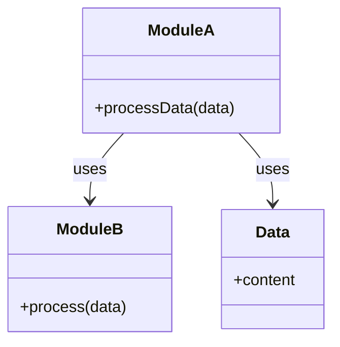

## 4.11 Law of Demeter and Decoupling in Julia

In the realm of software design, the **Law of Demeter** (LoD), also known as the **Principle of Least Knowledge**, is a guideline for designing software systems with minimal coupling. This principle is crucial for creating modular, maintainable, and testable code. In this section, we will explore how the Law of Demeter can be applied in Julia, a language known for its powerful features like multiple dispatch and metaprogramming, to enhance software design.

### Understanding the Law of Demeter

The Law of Demeter is a design guideline that suggests that a module should only communicate with its immediate collaborators and not with the collaborators of its collaborators. This principle can be summarized as "only talk to your friends." The goal is to minimize dependencies and reduce the ripple effect of changes in one part of the system affecting other parts.

#### Key Concepts

- **Minimizing Coupling**: By adhering to the Law of Demeter, we reduce the dependencies between modules, making the system more robust to changes.
- **Enhancing Modularity**: Modules become more self-contained, leading to easier maintenance and testing.
- **Improving Testability**: With fewer dependencies, modules can be tested in isolation, improving the reliability of tests.

### Implementing the Law of Demeter in Julia

Julia's features, such as multiple dispatch and expressive type system, provide unique opportunities to implement the Law of Demeter effectively. Let's explore how to design functions and types in Julia with minimal dependencies.

#### Designing Functions with Minimal Dependencies

In Julia, functions are central to the language's design. To adhere to the Law of Demeter, functions should only interact with objects they directly receive as arguments. This approach minimizes the knowledge a function has about the system.

```julia
function process_data(data::DataFrame, processor::DataProcessor)
    # Directly use the processor to handle data
    processed_data = processor.process(data)
    return processed_data
end
```

In this example, the `process_data` function only interacts with the `DataFrame` and `DataProcessor` objects it receives, avoiding unnecessary dependencies.

#### Designing Types with Minimal Dependencies

When designing types in Julia, it's essential to ensure that each type is responsible for its own behavior and does not rely on the internal details of other types.

```julia
struct TemperatureSensor
    id::String
    location::String
end

function read_temperature(sensor::TemperatureSensor)
    # Simulate reading temperature
    return rand(15:30)
end
```

Here, the `TemperatureSensor` type encapsulates its behavior, and the `read_temperature` function interacts directly with the sensor, adhering to the Law of Demeter.

### Benefits of Applying the Law of Demeter in Julia

Applying the Law of Demeter in Julia offers several benefits:

- **Modularity**: By reducing dependencies, modules become more self-contained, making them easier to understand and modify.
- **Testability**: With fewer dependencies, modules can be tested in isolation, leading to more reliable tests.
- **Maintainability**: Changes in one part of the system are less likely to affect other parts, reducing the risk of introducing bugs.

### Visualizing the Law of Demeter

To better understand the Law of Demeter, let's visualize the interactions between objects in a system that adheres to this principle.



In this diagram, `ModuleA` interacts directly with `ModuleB` and `Data`, adhering to the Law of Demeter by not reaching into `ModuleB`'s internal collaborators.

### Try It Yourself

To get hands-on experience with the Law of Demeter in Julia, try modifying the following code example to introduce a violation of the principle, then refactor it to adhere to the principle.

```julia
struct WeatherStation
    sensor::TemperatureSensor
end

function get_temperature(station::WeatherStation)
    # Directly accessing the sensor's method
    return read_temperature(station.sensor)
end

function get_temperature_refactored(station::WeatherStation)
    # Use a method on WeatherStation to encapsulate behavior
    return station.read_temperature()
end
```

### Knowledge Check

- **Question**: What is the primary goal of the Law of Demeter?
- **Challenge**: Identify a scenario in your current project where the Law of Demeter is violated and refactor the code to adhere to the principle.

### References and Further Reading

- [Wikipedia: Law of Demeter](https://en.wikipedia.org/wiki/Law_of_Demeter)
- [MDN Web Docs: Principles of Software Design](https://developer.mozilla.org/en-US/docs/Learn/JavaScript/Building_blocks/Principles_of_software_design)

### Embrace the Journey

Remember, applying the Law of Demeter is just one step towards writing better software. As you continue to explore Julia and its powerful features, keep experimenting and refining your skills. Stay curious, and enjoy the journey of becoming a more proficient Julia developer!

## Quiz Time!



### What is the primary goal of the Law of Demeter?

- [x] Minimize dependencies between modules
- [ ] Maximize the number of collaborators
- [ ] Increase the complexity of modules
- [ ] Reduce the number of functions

> **Explanation:** The Law of Demeter aims to minimize dependencies between modules to enhance modularity and maintainability.

### How does the Law of Demeter enhance testability?

- [x] By reducing dependencies, allowing modules to be tested in isolation
- [ ] By increasing the number of test cases
- [ ] By making modules more complex
- [ ] By requiring more integration tests

> **Explanation:** With fewer dependencies, modules can be tested in isolation, leading to more reliable tests.

### Which Julia feature helps in implementing the Law of Demeter?

- [x] Multiple dispatch
- [ ] Global variables
- [ ] Complex inheritance hierarchies
- [ ] Deep coupling

> **Explanation:** Multiple dispatch allows functions to be designed with minimal dependencies, adhering to the Law of Demeter.

### What is a potential violation of the Law of Demeter?

- [x] Accessing a collaborator's collaborator
- [ ] Using encapsulated behavior
- [ ] Designing self-contained modules
- [ ] Testing modules in isolation

> **Explanation:** Accessing a collaborator's collaborator increases dependencies and violates the Law of Demeter.

### How can you refactor code to adhere to the Law of Demeter?

- [x] Encapsulate behavior within the module
- [ ] Increase the number of collaborators
- [ ] Use global variables
- [ ] Avoid encapsulation

> **Explanation:** Encapsulating behavior within the module reduces dependencies and adheres to the Law of Demeter.

### What is a benefit of applying the Law of Demeter?

- [x] Enhanced modularity
- [ ] Increased complexity
- [ ] More dependencies
- [ ] Less maintainability

> **Explanation:** Applying the Law of Demeter enhances modularity by reducing dependencies.

### What does the Law of Demeter suggest about module communication?

- [x] Only communicate with immediate collaborators
- [ ] Communicate with all modules
- [ ] Avoid communication altogether
- [ ] Use global variables for communication

> **Explanation:** The Law of Demeter suggests communicating only with immediate collaborators to minimize dependencies.

### Which of the following is NOT a benefit of the Law of Demeter?

- [ ] Enhanced modularity
- [ ] Improved testability
- [x] Increased coupling
- [ ] Easier maintenance

> **Explanation:** The Law of Demeter reduces coupling, which is beneficial for modularity, testability, and maintenance.

### What is the Law of Demeter also known as?

- [x] Principle of Least Knowledge
- [ ] Principle of Maximum Knowledge
- [ ] Principle of Deep Coupling
- [ ] Principle of Complexity

> **Explanation:** The Law of Demeter is also known as the Principle of Least Knowledge, emphasizing minimal dependencies.

### True or False: The Law of Demeter encourages modules to have many dependencies.

- [ ] True
- [x] False

> **Explanation:** The Law of Demeter encourages minimal dependencies to enhance modularity and maintainability.


