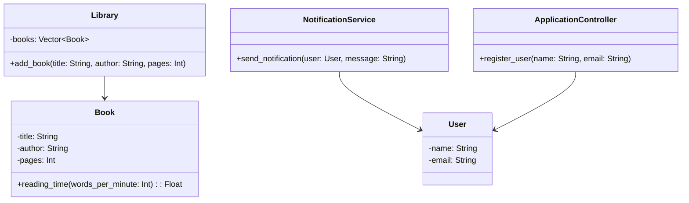

## 4.12 GRASP Principles Applied to Julia

In the realm of software design, GRASP (General Responsibility Assignment Software Patterns) principles serve as a foundational guide for assigning responsibilities to classes and objects. These principles help in creating systems that are robust, maintainable, and scalable. In this section, we will explore how these principles can be applied in Julia, a language known for its high performance and flexibility. We will delve into each GRASP principle, providing clear explanations, code examples, and visual aids to enhance understanding.

### Information Expert

**Intent**: Assign responsibility to the class that has the necessary information to fulfill it.

In Julia, the Information Expert principle guides us to assign responsibilities to the class or module that has the necessary data to perform a task. This principle helps in reducing unnecessary data transfer between classes and ensures that the logic is placed where the data resides.

#### Code Example

```julia
struct Book
    title::String
    author::String
    pages::Int
end

function reading_time(book::Book, words_per_minute::Int)
    # Assume an average of 250 words per page
    total_words = book.pages * 250
    return total_words / words_per_minute
end

my_book = Book("Julia Programming", "John Doe", 300)
println("Estimated reading time: $(reading_time(my_book, 200)) minutes")
```

In this example, the `Book` struct is the information expert as it contains the data necessary to calculate the reading time. The `reading_time` function operates on the `Book` instance, utilizing its data directly.

### Creator

**Intent**: Determine which class should be responsible for creating instances of another class.

The Creator principle in Julia suggests that a class B should be responsible for creating instances of class A if one or more of the following is true:
- B contains or aggregates A.
- B records instances of A.
- B closely uses A.
- B has the initializing data for A.

#### Code Example

```julia
struct Library
    books::Vector{Book}
end

function add_book(library::Library, title::String, author::String, pages::Int)
    new_book = Book(title, author, pages)
    push!(library.books, new_book)
end

my_library = Library([])
add_book(my_library, "Julia Programming", "John Doe", 300)
println("Library contains $(length(my_library.books)) books.")
```

Here, the `Library` struct is the creator of `Book` instances. It aggregates `Book` objects and has the responsibility to create and manage them.

### High Cohesion

**Intent**: Design classes and modules with focused purposes to improve clarity and maintainability.

High cohesion in Julia means that a class or module should have a single, well-defined purpose. This makes the system easier to understand and maintain.

#### Code Example

```julia
struct Calculator
end

function add(a::Number, b::Number)
    return a + b
end

function subtract(a::Number, b::Number)
    return a - b
end

println("Addition: $(add(5, 3))")
println("Subtraction: $(subtract(5, 3))")
```

The `Calculator` struct and its associated functions demonstrate high cohesion by focusing solely on arithmetic operations.

### Low Coupling

**Intent**: Reduce dependencies between classes to enhance flexibility and reusability.

Low coupling in Julia involves designing classes and modules that are independent of each other, minimizing the impact of changes.

#### Code Example

```julia
struct User
    name::String
    email::String
end

struct NotificationService
end

function send_notification(service::NotificationService, user::User, message::String)
    println("Sending message to $(user.email): $message")
end

user = User("Alice", "alice@example.com")
service = NotificationService()
send_notification(service, user, "Welcome to Julia!")
```

In this example, `User` and `NotificationService` are loosely coupled. Changes to one do not directly affect the other, promoting flexibility.

### Controller

**Intent**: Centralize control logic in a non-UI class to manage the flow of the application.

The Controller principle in Julia involves creating a class or module that handles the coordination of tasks, separating the user interface from the business logic.

#### Code Example

```julia
struct ApplicationController
end

function register_user(controller::ApplicationController, name::String, email::String)
    user = User(name, email)
    println("User registered: $(user.name)")
end

app_controller = ApplicationController()
register_user(app_controller, "Bob", "bob@example.com")
```

The `ApplicationController` acts as a central point for managing user registration, separating the control logic from the user interface.

### Visualizing GRASP Principles in Julia

To better understand the relationships and responsibilities defined by GRASP principles, let's visualize them using a class diagram.



**Diagram Description**: This class diagram illustrates the application of GRASP principles in Julia. It shows the relationships between `Library`, `Book`, `User`, `NotificationService`, and `ApplicationController`, highlighting how responsibilities are assigned based on the principles.

### Design Considerations

- **When to Use**: GRASP principles are applicable in any Julia project where clear responsibility assignment is crucial for maintainability and scalability.
- **Important Considerations**: Ensure that each class or module has a clear purpose and minimal dependencies. This will enhance the system's flexibility and ease of maintenance.

### Differences and Similarities

- **Differences**: GRASP principles focus on responsibility assignment, while other design patterns may focus on structural or behavioral aspects.
- **Similarities**: Like SOLID principles, GRASP aims to improve software design by promoting clear and maintainable code structures.

### Try It Yourself

Experiment with the code examples provided by modifying the structures and functions. For instance, try adding new methods to the `Calculator` struct or creating a new service in the `NotificationService` to handle different types of notifications.

### Knowledge Check

- **Question**: How does the Information Expert principle help in reducing data transfer between classes?
- **Exercise**: Implement a new class in Julia that demonstrates the Creator principle by managing a collection of objects.

### Embrace the Journey

Remember, mastering GRASP principles in Julia is a journey. As you progress, you'll find that these principles not only enhance your code's quality but also make your development process more intuitive and enjoyable. Keep experimenting, stay curious, and enjoy the journey!

## Quiz Time!



### Which GRASP principle focuses on assigning responsibility to the class with the necessary information?

- [x] Information Expert
- [ ] Creator
- [ ] High Cohesion
- [ ] Low Coupling

> **Explanation:** The Information Expert principle assigns responsibility to the class that has the necessary information to fulfill it.

### What is the primary goal of the Creator principle?

- [x] To determine which class should create instances of another class
- [ ] To ensure classes have a single, well-defined purpose
- [ ] To reduce dependencies between classes
- [ ] To centralize control logic

> **Explanation:** The Creator principle guides which class should be responsible for creating instances of another class.

### How does High Cohesion benefit a software system?

- [x] By improving clarity and maintainability
- [ ] By reducing dependencies between classes
- [ ] By centralizing control logic
- [ ] By assigning responsibility to the class with necessary information

> **Explanation:** High Cohesion ensures that classes and modules have focused purposes, improving clarity and maintainability.

### What does Low Coupling aim to achieve in software design?

- [x] Reducing dependencies between classes
- [ ] Assigning responsibility to the class with necessary information
- [ ] Ensuring classes have a single, well-defined purpose
- [ ] Centralizing control logic

> **Explanation:** Low Coupling aims to reduce dependencies between classes, enhancing flexibility and reusability.

### Which principle involves centralizing control logic in a non-UI class?

- [x] Controller
- [ ] Information Expert
- [ ] Creator
- [ ] High Cohesion

> **Explanation:** The Controller principle involves centralizing control logic in a non-UI class to manage application flow.

### In the context of GRASP, what is the role of the ApplicationController?

- [x] To centralize control logic
- [ ] To create instances of another class
- [ ] To reduce dependencies
- [ ] To assign responsibility based on information

> **Explanation:** The ApplicationController centralizes control logic, separating it from the user interface.

### How does the Information Expert principle enhance system design?

- [x] By placing logic where the data resides
- [ ] By reducing dependencies between classes
- [ ] By ensuring classes have a single purpose
- [ ] By centralizing control logic

> **Explanation:** The Information Expert principle enhances design by placing logic where the data resides, reducing unnecessary data transfer.

### What is the relationship between High Cohesion and Low Coupling?

- [x] High Cohesion focuses on purpose, Low Coupling on dependencies
- [ ] Both focus on reducing dependencies
- [ ] Both focus on assigning responsibility
- [ ] High Cohesion focuses on control logic, Low Coupling on purpose

> **Explanation:** High Cohesion focuses on ensuring classes have a single purpose, while Low Coupling focuses on reducing dependencies.

### True or False: The Creator principle is concerned with centralizing control logic.

- [ ] True
- [x] False

> **Explanation:** False. The Creator principle is concerned with determining which class should create instances of another class.

### Which principle is demonstrated by the `Library` struct creating `Book` instances?

- [x] Creator
- [ ] Information Expert
- [ ] High Cohesion
- [ ] Low Coupling

> **Explanation:** The `Library` struct demonstrates the Creator principle by being responsible for creating `Book` instances.


