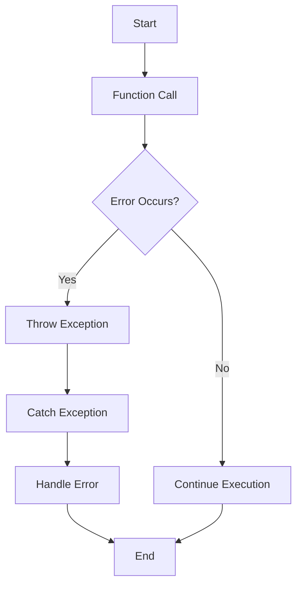

## 4.13 Exception Handling and Writing Robust Code

In the realm of software development, writing robust code is paramount. Robust code is not only functional but also resilient to unexpected conditions and errors. In Julia, exception handling is a crucial aspect of writing such code. This section will guide you through the principles of exception handling and robust code writing in Julia, focusing on error propagation, defensive programming, and the use of `@assert` and `@warn`.

### Understanding Exceptions in Julia

Exceptions in Julia are objects that represent an error or unexpected condition. They are used to signal that something has gone wrong during the execution of a program. Julia provides a mechanism to handle these exceptions gracefully, allowing developers to write code that can recover from errors or fail gracefully.

#### Key Concepts

- **Exception**: An object representing an error condition.
- **Throwing an Exception**: The act of signaling an error by creating and raising an exception.
- **Catching an Exception**: Handling an exception using a `try-catch` block.

### Error Propagation

Error propagation is the process of allowing errors to bubble up through the call stack until they are handled. This is a powerful technique that enables you to centralize error handling logic and avoid cluttering your code with repetitive error checks.

#### Implementing Error Propagation

In Julia, you can propagate errors using the `throw` function. When an error occurs, you can throw an exception, which will propagate up the call stack until it is caught by a `try-catch` block.

```julia
function divide(a, b)
    if b == 0
        throw(DivideError())
    end
    return a / b
end

function calculate()
    try
        result = divide(10, 0)
        println("Result: $result")
    catch e
        println("Caught an exception: $e")
    end
end

calculate()
```

In this example, the `divide` function throws a `DivideError` when attempting to divide by zero. The `calculate` function catches this exception and handles it gracefully.

#### Best Practices for Error Propagation

- **Use Specific Exceptions**: Define and throw specific exceptions that accurately describe the error condition.
- **Avoid Silent Failures**: Ensure that exceptions are caught and handled appropriately, rather than allowing them to fail silently.
- **Log Errors**: Consider logging errors for later analysis and debugging.

### Defensive Programming

Defensive programming is a practice that involves writing code that anticipates and handles potential errors or unexpected conditions. This approach helps ensure that your code behaves correctly even in the face of invalid inputs or unexpected states.

#### Techniques for Defensive Programming

1. **Input Validation**: Always validate inputs to functions and methods to ensure they meet expected criteria.

```julia
function safe_divide(a, b)
    if !isa(a, Number) || !isa(b, Number)
        throw(ArgumentError("Both arguments must be numbers"))
    end
    if b == 0
        throw(DivideError())
    end
    return a / b
end
```

2. **State Validation**: Check the state of objects or systems before performing operations.

```julia
function process_data(data)
    if isempty(data)
        throw(ArgumentError("Data cannot be empty"))
    end
    # Process data
end
```

3. **Use of `@assert` and `@warn`**: Utilize assertions and warnings to catch potential issues during development.

```julia
function calculate_area(radius)
    @assert radius >= 0 "Radius must be non-negative"
    return π * radius^2
end

function check_temperature(temp)
    if temp > 100
        @warn "Temperature is above the safe limit"
    end
end
```

#### Benefits of Defensive Programming

- **Improved Reliability**: Code is less likely to fail unexpectedly.
- **Easier Debugging**: Errors are caught early, making them easier to diagnose and fix.
- **Enhanced Security**: Reduces the risk of security vulnerabilities due to unexpected inputs or states.

### Using `@assert` and `@warn`

The `@assert` and `@warn` macros in Julia are powerful tools for catching potential issues during development.

#### `@assert`

The `@assert` macro is used to check that a condition holds true. If the condition is false, an `AssertionError` is thrown.

```julia
function calculate_square_root(x)
    @assert x >= 0 "Cannot calculate the square root of a negative number"
    return sqrt(x)
end
```

#### `@warn`

The `@warn` macro is used to issue a warning message. It does not stop the execution of the program but alerts the developer to a potential issue.

```julia
function monitor_temperature(temp)
    if temp > 75
        @warn "Temperature is getting high: $temp"
    end
end
```

### Writing Robust Code

Writing robust code involves more than just handling exceptions. It requires a holistic approach to software design that anticipates potential issues and ensures that your code can handle them gracefully.

#### Key Principles

- **Modularity**: Break your code into small, manageable modules that can be tested and debugged independently.
- **Reusability**: Write code that can be reused in different contexts, reducing duplication and potential errors.
- **Readability**: Ensure your code is easy to read and understand, making it easier to maintain and debug.
- **Testing**: Write comprehensive tests to catch errors before they reach production.

### Try It Yourself

To reinforce your understanding of exception handling and robust code writing in Julia, try modifying the code examples provided. Experiment with different types of exceptions, input validation techniques, and the use of `@assert` and `@warn`.

### Visualizing Error Propagation

To better understand how error propagation works, consider the following flowchart:



**Figure 1**: This flowchart illustrates the process of error propagation in Julia. When an error occurs, an exception is thrown and propagated up the call stack until it is caught and handled.

### References and Links

For further reading on exception handling and robust code writing in Julia, consider the following resources:

- [Julia Documentation on Exception Handling](https://docs.julialang.org/en/v1/manual/control-flow/#Exception-Handling)
- [Defensive Programming in Software Development](https://en.wikipedia.org/wiki/Defensive_programming)
- [Best Practices for Writing Robust Code](https://www.codingdojo.com/blog/robust-code)

### Knowledge Check

To test your understanding of the concepts covered in this section, consider the following questions:

- What is the purpose of error propagation in Julia?
- How can defensive programming improve the reliability of your code?
- When should you use the `@assert` and `@warn` macros?

### Embrace the Journey

Remember, mastering exception handling and writing robust code is a journey. As you continue to develop your skills in Julia, keep experimenting with different techniques and approaches. Stay curious, and enjoy the process of becoming a more proficient and confident developer.

## Quiz Time!



### What is the primary purpose of error propagation in Julia?

- [x] To allow errors to bubble up through the call stack until they are handled.
- [ ] To prevent errors from occurring in the first place.
- [ ] To log errors for later analysis.
- [ ] To automatically fix errors without developer intervention.

> **Explanation:** Error propagation allows errors to bubble up through the call stack until they are caught and handled, centralizing error handling logic.

### Which of the following is a key benefit of defensive programming?

- [x] Improved reliability of code.
- [ ] Increased code complexity.
- [ ] Reduced code readability.
- [ ] Decreased performance.

> **Explanation:** Defensive programming improves the reliability of code by anticipating and handling potential errors or unexpected conditions.

### What does the `@assert` macro do in Julia?

- [x] Checks that a condition holds true and throws an `AssertionError` if it does not.
- [ ] Issues a warning message without stopping execution.
- [ ] Logs an error message for later analysis.
- [ ] Automatically fixes the condition if it is false.

> **Explanation:** The `@assert` macro checks that a condition holds true and throws an `AssertionError` if it does not.

### When should you use the `@warn` macro in Julia?

- [x] To issue a warning message without stopping execution.
- [ ] To throw an exception and stop execution.
- [ ] To log an error message for later analysis.
- [ ] To automatically fix potential issues.

> **Explanation:** The `@warn` macro is used to issue a warning message without stopping execution, alerting the developer to a potential issue.

### Which of the following is NOT a technique for defensive programming?

- [ ] Input validation.
- [ ] State validation.
- [x] Ignoring exceptions.
- [ ] Using `@assert` and `@warn`.

> **Explanation:** Ignoring exceptions is not a technique for defensive programming; instead, exceptions should be handled appropriately.

### What is the role of the `try-catch` block in exception handling?

- [x] To catch and handle exceptions that are thrown during program execution.
- [ ] To prevent exceptions from occurring.
- [ ] To log exceptions for later analysis.
- [ ] To automatically fix exceptions without developer intervention.

> **Explanation:** The `try-catch` block is used to catch and handle exceptions that are thrown during program execution.

### How can you improve the readability of your code?

- [x] By ensuring your code is easy to read and understand.
- [ ] By writing complex and intricate code.
- [ ] By using as few comments as possible.
- [ ] By avoiding modularity.

> **Explanation:** Improving readability involves ensuring your code is easy to read and understand, making it easier to maintain and debug.

### What is the benefit of writing comprehensive tests?

- [x] To catch errors before they reach production.
- [ ] To increase code complexity.
- [ ] To reduce code readability.
- [ ] To decrease performance.

> **Explanation:** Writing comprehensive tests helps catch errors before they reach production, improving code reliability.

### Which of the following is a principle of writing robust code?

- [x] Modularity.
- [ ] Complexity.
- [ ] Duplication.
- [ ] Ambiguity.

> **Explanation:** Modularity is a principle of writing robust code, as it involves breaking code into small, manageable modules.

### True or False: The `@warn` macro stops the execution of the program.

- [ ] True
- [x] False

> **Explanation:** The `@warn` macro does not stop the execution of the program; it issues a warning message to alert the developer to a potential issue.




