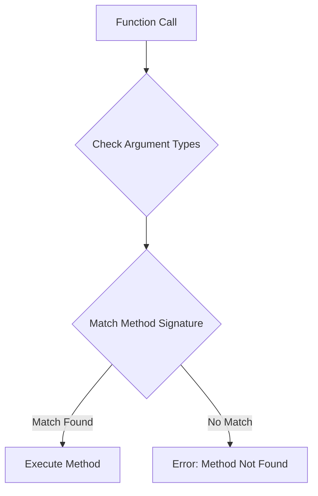

## 4.2 Leveraging Multiple Dispatch for Flexible Design

In the world of programming, flexibility and efficiency are key to building robust and scalable applications. Julia, a high-level, high-performance programming language, offers a unique feature known as multiple dispatch, which plays a pivotal role in achieving these goals. In this section, we will explore how multiple dispatch can be leveraged for flexible design, serving as an alternative to traditional object-oriented programming (OOP) polymorphism, and how it can be used to design flexible and extensible APIs. We will also delve into case studies from Julia's standard libraries and popular packages to illustrate these concepts in action.

### Polymorphism Through Dispatch

Polymorphism is a core concept in programming that allows functions to operate on different data types. In traditional OOP languages, polymorphism is often achieved through inheritance and interfaces. However, Julia takes a different approach by using multiple dispatch, which allows functions to be defined for different combinations of argument types. This provides a more flexible and powerful form of polymorphism.

#### Understanding Multiple Dispatch

Multiple dispatch in Julia refers to the ability of a function to dynamically select a method based on the types of all its arguments, rather than just the first one (as is common in single dispatch systems). This allows for more granular control over function behavior and can lead to more efficient and readable code.

```julia
function add(x::Number, y::Number)
    return x + y
end

function add(x::String, y::String)
    return x * y  # Concatenate strings
end

println(add(3, 4))       # Outputs: 7
println(add("Hello, ", "World!"))  # Outputs: Hello, World!
```

In the example above, the `add` function is defined for both `Number` and `String` types, demonstrating how multiple dispatch allows us to define behavior for different type combinations.

#### Advantages of Multiple Dispatch

- **Simplicity**: By allowing functions to be defined for specific type combinations, multiple dispatch reduces the need for complex inheritance hierarchies.
- **Performance**: Julia's compiler can optimize method selection at runtime, leading to faster execution.
- **Flexibility**: New methods can be added without modifying existing code, making it easier to extend functionality.

### Designing APIs with Multiple Dispatch

When designing APIs, flexibility and extensibility are crucial. Multiple dispatch provides a powerful tool for creating APIs that can easily adapt to new requirements and data types.

#### Creating Flexible APIs

To create a flexible API using multiple dispatch, consider the following steps:

1. **Define a Clear Type Hierarchy**: Establish a hierarchy of types that represent the different entities your API will handle. This hierarchy should be intuitive and easy to extend.

2. **Implement Core Functions**: Define core functions that operate on the base types in your hierarchy. These functions should be designed to handle the most common use cases.

3. **Extend with Specific Methods**: Add methods for specific type combinations as needed. This allows your API to handle special cases without complicating the core logic.

4. **Document Extensibility**: Clearly document how users can extend the API by adding new methods for custom types.

```julia
abstract type Shape end

struct Circle <: Shape
    radius::Float64
end

struct Rectangle <: Shape
    width::Float64
    height::Float64
end

function area(shape::Shape)
    throw(ArgumentError("Unsupported shape type"))
end

function area(circle::Circle)
    return π * circle.radius^2
end

function area(rectangle::Rectangle)
    return rectangle.width * rectangle.height
end

circle = Circle(5.0)
rectangle = Rectangle(4.0, 6.0)

println(area(circle))      # Outputs: 78.53981633974483
println(area(rectangle))   # Outputs: 24.0
```

In this example, we define a simple API for calculating the area of different shapes. The `area` function is defined for the base `Shape` type and extended for specific shape types like `Circle` and `Rectangle`.

#### Extending APIs with New Types

One of the key benefits of using multiple dispatch in API design is the ease with which new types can be integrated. Users can add new types and methods without altering the existing codebase, promoting modularity and reusability.

```julia
struct Triangle <: Shape
    base::Float64
    height::Float64
end

function area(triangle::Triangle)
    return 0.5 * triangle.base * triangle.height
end

triangle = Triangle(3.0, 4.0)
println(area(triangle))  # Outputs: 6.0
```

By defining a new `Triangle` type and extending the `area` function, we seamlessly integrate new functionality into the existing API.

### Case Studies: Real-World Applications

To illustrate the power of multiple dispatch in real-world applications, let's examine some case studies from Julia's standard libraries and popular packages.

#### Case Study 1: Julia's Base Library

Julia's base library extensively uses multiple dispatch to provide a consistent and flexible interface for various operations. For example, the arithmetic operators (`+`, `-`, `*`, `/`) are defined using multiple dispatch, allowing them to work seamlessly with different numeric types, such as integers, floating-point numbers, and complex numbers.

```julia
println(3 + 4.5)       # Outputs: 7.5
println(3 + 4im)       # Outputs: 3 + 4im
```

This flexibility is achieved by defining methods for each combination of numeric types, ensuring that operations are performed correctly and efficiently.

#### Case Study 2: DataFrames.jl

The DataFrames.jl package, a popular tool for data manipulation in Julia, leverages multiple dispatch to provide a flexible and intuitive API for working with tabular data. By defining methods for different data types and operations, DataFrames.jl allows users to perform complex data transformations with ease.

```julia
using DataFrames

df = DataFrame(Name = ["Alice", "Bob"], Age = [25, 30])

function filter_rows(df::DataFrame, condition::Function)
    return filter(condition, eachrow(df))
end

filtered_df = filter_rows(df, row -> row[:Age] > 26)
println(filtered_df)
```

In this example, the `filter_rows` function uses multiple dispatch to operate on DataFrames, allowing users to define custom filtering conditions.

### Visualizing Multiple Dispatch

To better understand how multiple dispatch works, let's visualize the process using a flowchart. This diagram illustrates how Julia selects the appropriate method based on the types of all arguments.



**Diagram Description**: This flowchart represents the process of method selection in Julia's multiple dispatch system. When a function is called, Julia checks the types of all arguments and matches them against available method signatures. If a match is found, the corresponding method is executed. Otherwise, an error is raised.

### Key Takeaways

- **Multiple Dispatch**: A powerful feature in Julia that allows functions to be defined for different combinations of argument types, providing a flexible form of polymorphism.
- **API Design**: Multiple dispatch enables the creation of flexible and extensible APIs by allowing methods to be added for new types without modifying existing code.
- **Real-World Applications**: Julia's standard libraries and popular packages, such as DataFrames.jl, leverage multiple dispatch to provide intuitive and efficient interfaces.

### Try It Yourself

Experiment with the code examples provided in this section. Try adding new types and methods to the API examples, and observe how multiple dispatch allows for seamless integration of new functionality. Consider how you might use multiple dispatch in your own projects to achieve similar flexibility and extensibility.

### References and Further Reading

- [Julia Documentation on Methods](https://docs.julialang.org/en/v1/manual/methods/)
- [DataFrames.jl Documentation](https://dataframes.juliadata.org/stable/)
- [JuliaLang Blog on Multiple Dispatch](https://julialang.org/blog/2012/02/multiple-dispatch/)

## Quiz Time!



### What is multiple dispatch in Julia?

- [x] The ability to define functions for different combinations of argument types.
- [ ] The ability to define functions for a single argument type.
- [ ] The ability to define functions without specifying argument types.
- [ ] The ability to define functions that cannot be extended.

> **Explanation:** Multiple dispatch allows functions to be defined for different combinations of argument types, providing a flexible form of polymorphism.

### How does multiple dispatch differ from traditional OOP polymorphism?

- [x] It allows method selection based on all argument types, not just the first.
- [ ] It requires inheritance to achieve polymorphism.
- [ ] It does not support method overloading.
- [ ] It is less flexible than OOP polymorphism.

> **Explanation:** Multiple dispatch selects methods based on all argument types, unlike traditional OOP, which typically uses single dispatch based on the first argument.

### What is a key advantage of using multiple dispatch in API design?

- [x] It allows for easy extension with new types and methods.
- [ ] It requires complex inheritance hierarchies.
- [ ] It limits the flexibility of the API.
- [ ] It makes the API harder to understand.

> **Explanation:** Multiple dispatch allows APIs to be easily extended with new types and methods without modifying existing code.

### In the provided example, what does the `area` function do?

- [x] Calculates the area of different shapes based on their types.
- [ ] Calculates the perimeter of different shapes.
- [ ] Calculates the volume of different shapes.
- [ ] Calculates the density of different shapes.

> **Explanation:** The `area` function is defined to calculate the area of different shapes, such as circles and rectangles, based on their types.

### Which package is mentioned as leveraging multiple dispatch for data manipulation?

- [x] DataFrames.jl
- [ ] Plots.jl
- [ ] Flux.jl
- [ ] HTTP.jl

> **Explanation:** DataFrames.jl is a popular package for data manipulation in Julia that leverages multiple dispatch.

### What is the purpose of the `filter_rows` function in the DataFrames.jl example?

- [x] To filter rows based on a custom condition.
- [ ] To add new rows to the DataFrame.
- [ ] To sort rows in the DataFrame.
- [ ] To remove columns from the DataFrame.

> **Explanation:** The `filter_rows` function is used to filter rows in a DataFrame based on a custom condition provided by the user.

### What does the flowchart in the visualization section represent?

- [x] The process of method selection in multiple dispatch.
- [ ] The process of inheritance in OOP.
- [ ] The process of compiling Julia code.
- [ ] The process of garbage collection in Julia.

> **Explanation:** The flowchart represents the process of method selection in Julia's multiple dispatch system.

### Which of the following is NOT a benefit of multiple dispatch?

- [ ] Simplicity
- [ ] Performance
- [ ] Flexibility
- [x] Complexity

> **Explanation:** Multiple dispatch is known for its simplicity, performance, and flexibility, not complexity.

### True or False: Multiple dispatch requires modifying existing code to add new methods.

- [ ] True
- [x] False

> **Explanation:** Multiple dispatch allows new methods to be added without modifying existing code, promoting extensibility.

### What should you do to experiment with the code examples?

- [x] Try adding new types and methods to see how multiple dispatch works.
- [ ] Avoid modifying the code to prevent errors.
- [ ] Only use the examples as they are without changes.
- [ ] Delete the examples after reading.

> **Explanation:** Experimenting with the code by adding new types and methods helps understand how multiple dispatch allows for flexible design.



Remember, this is just the beginning. As you progress, you'll discover more ways to leverage multiple dispatch in Julia to create powerful and flexible software designs. Keep experimenting, stay curious, and enjoy the journey!
