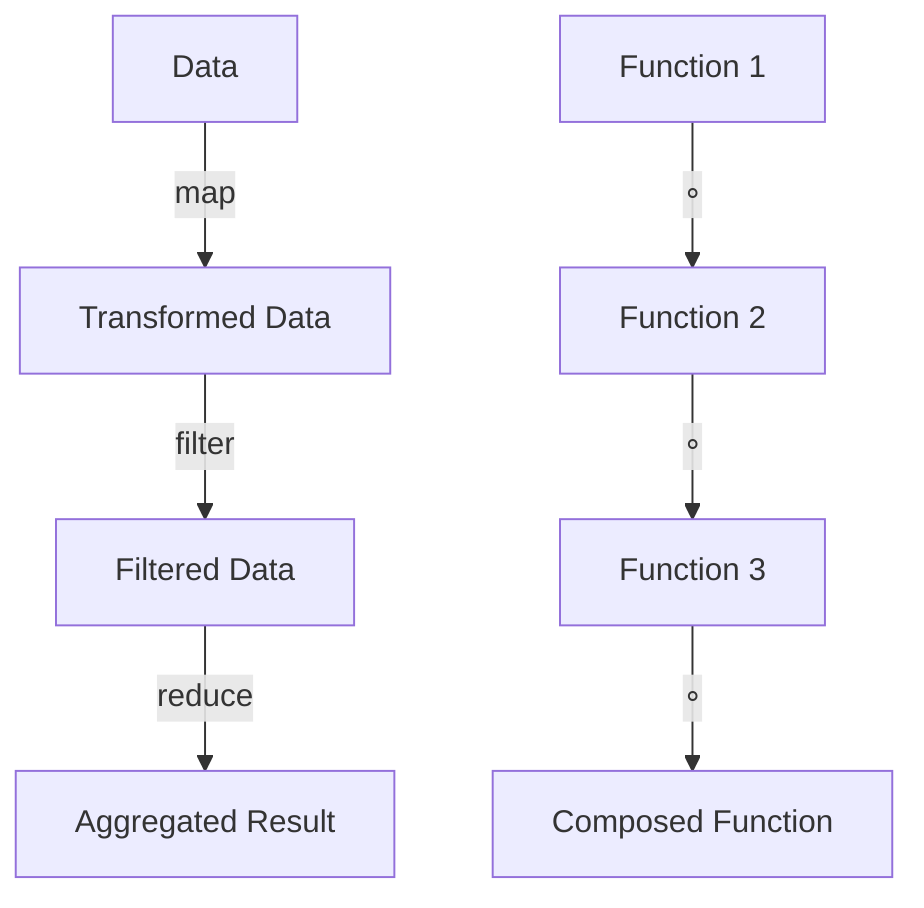

## 4.3 Functional Programming Concepts in Julia

Functional programming is a paradigm that treats computation as the evaluation of mathematical functions and avoids changing state or mutable data. Julia, while being a multi-paradigm language, offers robust support for functional programming. In this section, we will delve into key functional programming concepts in Julia, including immutability, higher-order functions, function composition, and anonymous functions. These concepts are essential for writing clean, efficient, and maintainable code.

### Immutability

**Immutability** refers to the concept of data that cannot be changed once created. In functional programming, immutability is a cornerstone because it helps avoid side effects, making code easier to reason about and debug.

#### Benefits of Immutability

1. **Predictability**: Immutable data structures ensure that data remains consistent throughout the program, reducing unexpected behavior.
2. **Concurrency**: Immutability eliminates the need for locks or synchronization mechanisms, making concurrent programming safer and simpler.
3. **Ease of Testing**: Functions that operate on immutable data are easier to test since they don't depend on or alter external state.

#### Use Cases for Immutable Data Structures

- **Functional Data Structures**: Use immutable lists, tuples, and dictionaries for data that doesn't change.
- **Configuration and Settings**: Store configuration data in immutable structures to prevent accidental modifications.
- **Concurrency**: Share immutable data across threads or processes without the risk of data races.

#### Implementing Immutability in Julia

In Julia, you can create immutable data structures using the `struct` keyword. By default, fields in a `struct` are immutable.

```julia
struct Point
    x::Float64
    y::Float64
end

p = Point(1.0, 2.0)
```

### Higher-Order Functions

**Higher-order functions** are functions that can take other functions as arguments or return them as results. They are a powerful tool in functional programming, enabling abstraction and code reuse.

#### Examples of Higher-Order Functions

1. **Map**: Applies a function to each element of a collection.
2. **Filter**: Selects elements from a collection based on a predicate function.
3. **Reduce**: Combines elements of a collection using a binary function.

#### Implementing Higher-Order Functions in Julia

Let's explore how to use higher-order functions with practical examples.

```julia
square(x) = x * x

numbers = [1, 2, 3, 4, 5]
squared_numbers = map(square, numbers)
println(squared_numbers)  # Output: [1, 4, 9, 16, 25]

even_numbers = filter(x -> x % 2 == 0, numbers)
println(even_numbers)  # Output: [2, 4]

sum_of_numbers = reduce(+, numbers)
println(sum_of_numbers)  # Output: 15
```

### Function Composition

**Function composition** is the process of combining two or more functions to produce a new function. In Julia, the `∘` operator is used for function composition.

#### Benefits of Function Composition

1. **Modularity**: Break down complex operations into simpler, reusable functions.
2. **Readability**: Compose functions to express operations in a clear and concise manner.
3. **Maintainability**: Simplify changes by modifying individual functions without affecting the entire composition.

#### Using the `∘` Operator

Let's see how to compose functions in Julia.

```julia
double(x) = 2 * x
increment(x) = x + 1

double_then_increment = increment ∘ double

result = double_then_increment(3)
println(result)  # Output: 7
```

### Anonymous Functions

**Anonymous functions** are functions without a name, often used for short-term operations. They are useful for passing as arguments to higher-order functions.

#### Creating Anonymous Functions

In Julia, anonymous functions are defined using the `->` syntax.

```julia
add = (x, y) -> x + y

result = add(3, 4)
println(result)  # Output: 7
```

#### Use Cases for Anonymous Functions

- **Callbacks**: Use anonymous functions as callbacks in event-driven programming.
- **Short-term Operations**: Pass anonymous functions to higher-order functions like `map`, `filter`, and `reduce`.

### Visualizing Functional Programming Concepts

To better understand how these concepts interrelate, let's visualize the flow of data through higher-order functions and function composition.



**Caption**: This diagram illustrates how data flows through higher-order functions (`map`, `filter`, `reduce`) and how functions are composed using the `∘` operator.

### Try It Yourself

Experiment with the code examples provided. Try modifying the functions and observe how the output changes. For instance, create a new function that triples a number and compose it with the existing functions.

### References and Links

- [Julia Documentation on Functions](https://docs.julialang.org/en/v1/manual/functions/)
- [Functional Programming in Julia](https://julialang.org/blog/2017/01/functional-programming/)

### Knowledge Check

- What are the benefits of using immutable data structures?
- How do higher-order functions enhance code reuse?
- Why is function composition beneficial in functional programming?
- When would you use an anonymous function?

### Embrace the Journey

Remember, this is just the beginning. As you progress, you'll build more complex and interactive applications using Julia's functional programming features. Keep experimenting, stay curious, and enjoy the journey!

## Quiz Time!



### What is a key benefit of immutability in functional programming?

- [x] Predictability
- [ ] Complexity
- [ ] Performance
- [ ] Flexibility

> **Explanation:** Immutability ensures that data remains consistent, leading to predictable behavior in programs.

### Which of the following is a higher-order function?

- [x] Map
- [ ] Print
- [ ] Input
- [ ] Loop

> **Explanation:** Map is a higher-order function because it takes another function as an argument.

### What operator is used for function composition in Julia?

- [x] ∘
- [ ] +
- [ ] *
- [ ] -

> **Explanation:** The ∘ operator is used for composing functions in Julia.

### How are anonymous functions defined in Julia?

- [x] Using the `->` syntax
- [ ] Using the `function` keyword
- [ ] Using the `def` keyword
- [ ] Using the `lambda` keyword

> **Explanation:** Anonymous functions in Julia are defined using the `->` syntax.

### What is a common use case for anonymous functions?

- [x] Callbacks
- [ ] Class definitions
- [ ] Module imports
- [ ] Variable declarations

> **Explanation:** Anonymous functions are often used as callbacks in event-driven programming.

### Which of the following is NOT a benefit of function composition?

- [ ] Modularity
- [ ] Readability
- [ ] Maintainability
- [x] Complexity

> **Explanation:** Function composition reduces complexity by breaking down operations into simpler functions.

### What is the result of the composed function `increment ∘ double` applied to 3?

- [x] 7
- [ ] 6
- [ ] 8
- [ ] 9

> **Explanation:** The function `double` doubles 3 to 6, and `increment` adds 1, resulting in 7.

### Why are higher-order functions important?

- [x] They enable abstraction and code reuse.
- [ ] They increase code length.
- [ ] They decrease performance.
- [ ] They complicate debugging.

> **Explanation:** Higher-order functions allow for abstraction and code reuse, making code more modular.

### What is a benefit of using immutable data structures in concurrent programming?

- [x] Eliminates the need for locks
- [ ] Increases memory usage
- [ ] Reduces code readability
- [ ] Complicates data sharing

> **Explanation:** Immutable data structures can be shared across threads without locks, simplifying concurrent programming.

### True or False: Immutability in Julia is achieved using the `mutable struct` keyword.

- [ ] True
- [x] False

> **Explanation:** Immutability in Julia is achieved using the `struct` keyword, not `mutable struct`.


