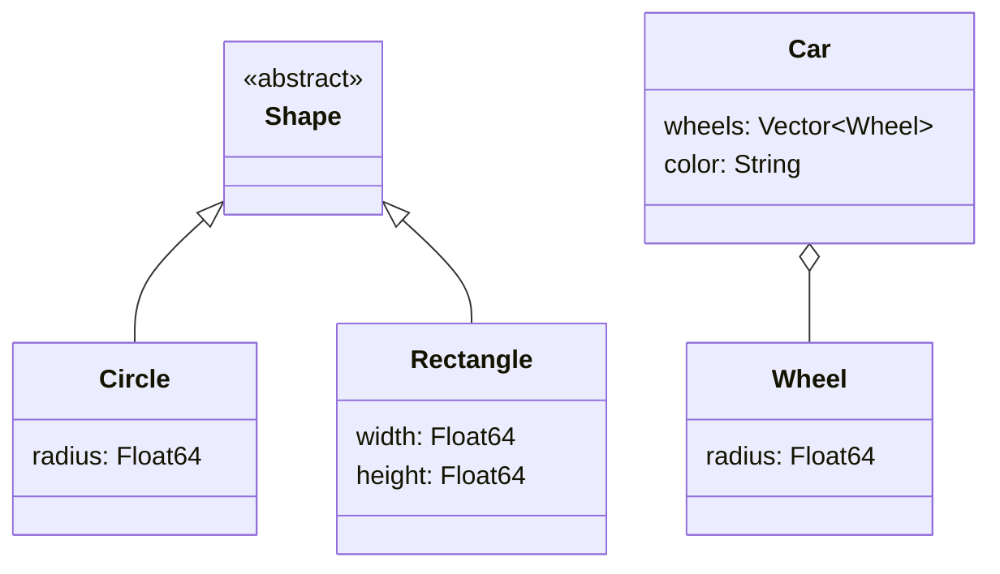

## 4.4 Emulating Object-Oriented Programming with Structs and Methods

In the world of software development, object-oriented programming (OOP) has long been a popular paradigm, offering a way to structure code that models real-world entities. While Julia is not inherently an object-oriented language, it provides powerful features that allow developers to emulate OOP concepts effectively. In this section, we will explore how to use Julia's structs and methods to achieve this, focusing on defining structs, associating methods, and emulating inheritance and interfaces.

### Defining Structs

In Julia, structs are used to define composite data types. They are similar to classes in object-oriented languages but come with some differences. Julia offers two types of structs: mutable and immutable.

#### Mutable and Immutable Structs

**Immutable Structs**: These are the default in Julia and are defined using the `struct` keyword. Once an instance of an immutable struct is created, its fields cannot be changed. This immutability can lead to performance optimizations, as the compiler can make certain assumptions about the data.

```julia
struct Point
    x::Float64
    y::Float64
end

p = Point(1.0, 2.0)

println("x: ", p.x, ", y: ", p.y)
```

**Mutable Structs**: If you need to change the fields of a struct after it has been created, you can define a mutable struct using the `mutable struct` keyword.

```julia
mutable struct MutablePoint
    x::Float64
    y::Float64
end

mp = MutablePoint(1.0, 2.0)

mp.x = 3.0
mp.y = 4.0

println("x: ", mp.x, ", y: ", mp.y)
```

### Associating Methods

In Julia, methods are functions that can operate on structs. Unlike traditional OOP languages where methods are defined within classes, Julia separates data (structs) from behavior (methods). This separation allows for more flexible and powerful programming patterns.

#### Implementing Methods that Operate on Structs

To associate methods with a struct, you define functions that take instances of the struct as arguments. This approach leverages Julia's multiple dispatch feature, allowing you to define different behaviors for functions based on the types of their arguments.

```julia
function distance(p::Point)
    return sqrt(p.x^2 + p.y^2)
end

p = Point(3.0, 4.0)
println("Distance from origin: ", distance(p))
```

**Multiple Dispatch**: This feature allows you to define multiple methods for the same function name, each with different argument types. It is a powerful tool for creating flexible and reusable code.

```julia
function distance(p1::Point, p2::Point)
    return sqrt((p2.x - p1.x)^2 + (p2.y - p1.y)^2)
end

p1 = Point(1.0, 2.0)
p2 = Point(4.0, 6.0)
println("Distance between points: ", distance(p1, p2))
```

### Inheritance and Interfaces

While Julia does not support inheritance in the traditional OOP sense, it provides mechanisms to achieve similar functionality through abstract types and composition.

#### Using Abstract Types

Abstract types in Julia allow you to define a hierarchy of types without specifying their implementation. They serve as a blueprint for concrete types (structs) that inherit from them.

```julia
abstract type Shape end

struct Circle <: Shape
    radius::Float64
end

struct Rectangle <: Shape
    width::Float64
    height::Float64
end
```

#### Emulating Inheritance with Composition

Composition is a design principle where a struct contains instances of other structs, allowing you to build complex types from simpler ones. This approach is often preferred over inheritance as it promotes flexibility and reusability.

```julia
struct Wheel
    radius::Float64
end

struct Car
    wheels::Vector{Wheel}
    color::String
end

wheels = [Wheel(15.0), Wheel(15.0), Wheel(15.0), Wheel(15.0)]
car = Car(wheels, "Red")
```

#### Interfaces in Julia

Interfaces in Julia are not explicitly defined like in some other languages. Instead, they are a set of functions that a type must implement to be considered as implementing the interface. This is often documented as a convention.

```julia
function draw(obj)
    error("draw not implemented for $(typeof(obj))")
end

function draw(c::Circle)
    println("Drawing a circle with radius ", c.radius)
end

function draw(r::Rectangle)
    println("Drawing a rectangle with width ", r.width, " and height ", r.height)
end

c = Circle(5.0)
r = Rectangle(4.0, 3.0)
draw(c)
draw(r)
```

### Visualizing Structs and Methods in Julia

To better understand how structs and methods work together in Julia, let's visualize the relationship using a class diagram.



**Diagram Description**: This diagram illustrates the relationship between the abstract type `Shape` and its concrete implementations `Circle` and `Rectangle`. It also shows the composition relationship between `Car` and `Wheel`.

### Try It Yourself

To deepen your understanding, try modifying the code examples above:

- Add a new struct `Triangle` that implements the `Shape` interface.
- Define a method `area` for each shape that calculates its area.
- Create a new struct `Bicycle` that uses composition with `Wheel`.

### Key Takeaways

- **Structs** in Julia are used to define composite data types and can be mutable or immutable.
- **Methods** are functions that operate on structs, leveraging Julia's multiple dispatch for flexibility.
- **Abstract Types** and **Composition** are used to emulate inheritance and interfaces, promoting code reusability and flexibility.

### References and Further Reading

- [Julia Documentation on Types](https://docs.julialang.org/en/v1/manual/types/)
- [Multiple Dispatch in Julia](https://docs.julialang.org/en/v1/manual/methods/)
- [Design Patterns: Elements of Reusable Object-Oriented Software](https://en.wikipedia.org/wiki/Design_Patterns)

Remember, this is just the beginning. As you progress, you'll build more complex and interactive applications. Keep experimenting, stay curious, and enjoy the journey!

## Quiz Time!



### What is the default type of struct in Julia?

- [x] Immutable
- [ ] Mutable
- [ ] Abstract
- [ ] Dynamic

> **Explanation:** In Julia, structs are immutable by default unless explicitly defined as mutable.

### How do you define a mutable struct in Julia?

- [ ] Using the `struct` keyword
- [x] Using the `mutable struct` keyword
- [ ] Using the `abstract struct` keyword
- [ ] Using the `dynamic struct` keyword

> **Explanation:** Mutable structs in Julia are defined using the `mutable struct` keyword.

### What feature allows Julia to define multiple methods for the same function name?

- [ ] Single Dispatch
- [x] Multiple Dispatch
- [ ] Inheritance
- [ ] Polymorphism

> **Explanation:** Julia uses multiple dispatch, allowing different methods for the same function name based on argument types.

### How can you emulate inheritance in Julia?

- [ ] Using classes
- [x] Using abstract types and composition
- [ ] Using interfaces
- [ ] Using dynamic typing

> **Explanation:** Julia emulates inheritance using abstract types and composition, as it does not support traditional class-based inheritance.

### What is the purpose of an abstract type in Julia?

- [x] To define a hierarchy of types without implementation
- [ ] To create mutable data structures
- [ ] To enforce method implementation
- [ ] To optimize performance

> **Explanation:** Abstract types in Julia define a hierarchy of types without specifying their implementation.

### How do you associate methods with structs in Julia?

- [ ] By defining methods inside the struct
- [x] By defining functions that take the struct as an argument
- [ ] By using inheritance
- [ ] By using interfaces

> **Explanation:** In Julia, methods are associated with structs by defining functions that take the struct as an argument.

### What is a key benefit of using composition over inheritance?

- [x] Flexibility and reusability
- [ ] Simplicity
- [ ] Performance optimization
- [ ] Type safety

> **Explanation:** Composition promotes flexibility and reusability, making it a preferred design principle over inheritance.

### Which of the following is not a feature of Julia's structs?

- [ ] Immutability
- [ ] Mutability
- [ ] Composition
- [x] Inheritance

> **Explanation:** Julia's structs do not support inheritance; instead, they use composition and abstract types.

### What is the role of interfaces in Julia?

- [x] To define a set of functions a type must implement
- [ ] To enforce data encapsulation
- [ ] To provide inheritance
- [ ] To optimize memory usage

> **Explanation:** Interfaces in Julia are a set of functions that a type must implement, often documented as a convention.

### True or False: Julia supports traditional class-based inheritance.

- [ ] True
- [x] False

> **Explanation:** Julia does not support traditional class-based inheritance; it uses abstract types and composition to achieve similar functionality.




