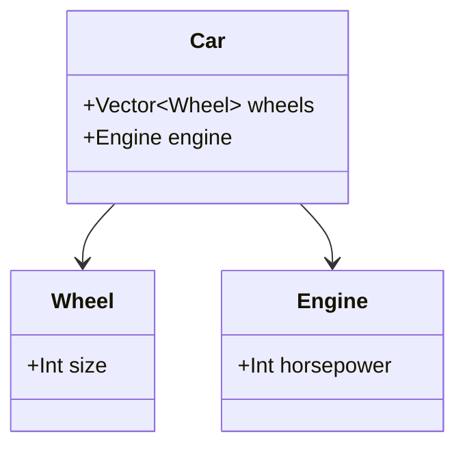

## 4.5 Composition Over Inheritance in Julia

In the world of software design, the debate between composition and inheritance is a long-standing one. While inheritance has its place, composition offers a more flexible and reusable approach to building complex systems. In this section, we will explore the concept of composition over inheritance in Julia, a language that naturally lends itself to this paradigm due to its powerful type system and multiple dispatch capabilities.

### Understanding Composition and Inheritance

Before we dive into the specifics of implementing composition in Julia, let's clarify what we mean by composition and inheritance.

**Inheritance** is a mechanism where a new class (or type) is derived from an existing class, inheriting its properties and behaviors. This can lead to a rigid hierarchy and can make code difficult to modify or extend.

**Composition**, on the other hand, involves building complex types by combining simpler ones. Instead of inheriting behaviors, a composed object delegates tasks to its components. This approach promotes flexibility and reusability, as components can be easily swapped or extended without affecting the overall system.

### Benefits of Composition

1. **Flexibility**: Composition allows you to change the behavior of a system by simply replacing or modifying its components. This is particularly useful in dynamic environments where requirements can change frequently.

2. **Reusability**: By composing objects, you can reuse existing components across different systems or applications, reducing duplication and promoting consistency.

3. **Maintainability**: Composed systems are often easier to understand and maintain, as they avoid the complexities of deep inheritance hierarchies.

4. **Decoupling**: Composition encourages a design where components are loosely coupled, making it easier to isolate and test individual parts of the system.

### Implementing Composition in Julia

Julia's type system and multiple dispatch capabilities make it an ideal language for implementing composition. Let's explore how we can achieve this by embedding structs within structs and using delegation patterns.

#### Embedding Structs

In Julia, you can embed one struct within another to achieve composition. This allows you to build complex types from simpler ones.

```julia
struct Wheel
    size::Int
end

struct Engine
    horsepower::Int
end

struct Car
    wheels::Vector{Wheel}
    engine::Engine
end

wheel = Wheel(16)
engine = Engine(150)

car = Car([wheel, wheel, wheel, wheel], engine)

println("Car has $(length(car.wheels)) wheels and an engine with $(car.engine.horsepower) horsepower.")
```

In this example, the `Car` struct is composed of `Wheel` and `Engine` structs. This design allows us to easily modify or extend the `Car` by changing its components.

#### Delegation Patterns

Delegation is a key concept in composition, where a composed object forwards method calls to its components. This allows you to extend or modify behavior without altering the original components.

```julia
function start_engine(engine::Engine)
    println("Engine with $(engine.horsepower) horsepower started.")
end

function start_car(car::Car)
    start_engine(car.engine)  # Delegate the call to the engine
end

start_car(car)
```

Here, the `start_car` function delegates the task of starting the engine to the `start_engine` function. This separation of concerns makes the code more modular and easier to maintain.

### Visualizing Composition in Julia

To better understand how composition works in Julia, let's visualize the relationship between the `Car`, `Wheel`, and `Engine` structs using a class diagram.



This diagram illustrates how the `Car` struct is composed of `Wheel` and `Engine` structs, highlighting the composition relationship.

### Key Participants in Composition

- **Component**: A simple, reusable unit that can be combined with other components to form a complex system. In our example, `Wheel` and `Engine` are components.

- **Composite**: A complex type that is composed of one or more components. The `Car` struct is a composite.

- **Delegator**: An entity that forwards method calls to its components. In our example, the `Car` acts as a delegator when it calls `start_engine`.

### Applicability of Composition

Composition is particularly useful in the following scenarios:

- When you need to build systems that are flexible and easy to extend.
- When you want to reuse components across different applications.
- When you need to avoid the complexities of deep inheritance hierarchies.
- When you want to promote loose coupling and high cohesion in your design.

### Design Considerations

When using composition in Julia, consider the following:

- **Encapsulation**: Ensure that components are well-encapsulated and expose only the necessary interfaces.
- **Cohesion**: Aim for high cohesion within components, meaning that their responsibilities should be closely related.
- **Coupling**: Strive for loose coupling between components to facilitate easy swapping and testing.
- **Performance**: Be mindful of performance implications, especially when composing large numbers of components.

### Differences and Similarities with Inheritance

While both composition and inheritance allow you to build complex systems, they have distinct differences:

- **Flexibility**: Composition offers more flexibility as it allows you to change behavior by swapping components, whereas inheritance can lead to rigid hierarchies.
- **Reusability**: Composition promotes reusability by allowing components to be reused across different systems, while inheritance often ties components to specific hierarchies.
- **Complexity**: Inheritance can lead to complex hierarchies that are difficult to understand and maintain, whereas composition encourages simpler, more modular designs.

### Try It Yourself

To solidify your understanding of composition in Julia, try modifying the code examples above. For instance, add a `Transmission` struct to the `Car` and delegate a method to change gears. Experiment with different compositions and observe how they affect the overall design.

### Knowledge Check

Let's reinforce what we've learned with a few questions:

- What are the main benefits of using composition over inheritance?
- How does delegation work in a composed system?
- What are some scenarios where composition is more applicable than inheritance?

### Embrace the Journey

Remember, mastering composition over inheritance is just one step in your journey to becoming a proficient Julia developer. As you continue to explore and experiment with different design patterns, you'll gain a deeper understanding of how to build flexible, reusable, and maintainable applications. Keep experimenting, stay curious, and enjoy the journey!

## Quiz Time!



### What is a primary benefit of using composition over inheritance?

- [x] Flexibility and reusability
- [ ] Simplicity and ease of use
- [ ] Faster execution time
- [ ] More secure code

> **Explanation:** Composition allows for flexibility and reusability by building complex types from simpler ones, making it easier to modify and extend systems.

### How can you implement composition in Julia?

- [x] By embedding structs within structs
- [ ] By using inheritance hierarchies
- [ ] By creating global variables
- [ ] By using macros

> **Explanation:** Composition in Julia is typically implemented by embedding structs within structs, allowing for the combination of simpler types to form complex ones.

### What is delegation in the context of composition?

- [x] Forwarding method calls to composed objects
- [ ] Inheriting methods from a parent class
- [ ] Creating new methods for each component
- [ ] Using global variables for method calls

> **Explanation:** Delegation involves forwarding method calls to composed objects, allowing for behavior extension or modification without altering the original components.

### In the provided code example, what does the `start_car` function do?

- [x] Delegates the task of starting the engine to the `start_engine` function
- [ ] Directly starts the car's engine
- [ ] Modifies the car's horsepower
- [ ] Changes the car's wheel size

> **Explanation:** The `start_car` function delegates the task of starting the engine to the `start_engine` function, demonstrating the delegation pattern in composition.

### What is a composite in the context of composition?

- [x] A complex type composed of one or more components
- [ ] A simple, reusable unit
- [ ] A method that forwards calls
- [ ] A global variable

> **Explanation:** A composite is a complex type that is composed of one or more components, such as the `Car` struct in the example.

### Which of the following is NOT a benefit of composition?

- [ ] Flexibility
- [ ] Reusability
- [ ] Maintainability
- [x] Complexity

> **Explanation:** Composition reduces complexity by promoting simpler, more modular designs, unlike inheritance which can lead to complex hierarchies.

### What should you consider when using composition in Julia?

- [x] Encapsulation, cohesion, coupling, and performance
- [ ] Only performance
- [ ] Only encapsulation
- [ ] Only cohesion

> **Explanation:** When using composition, it's important to consider encapsulation, cohesion, coupling, and performance to ensure a well-designed system.

### How does composition promote loose coupling?

- [x] By allowing components to be easily swapped or extended
- [ ] By tying components to specific hierarchies
- [ ] By using global variables
- [ ] By creating deep inheritance hierarchies

> **Explanation:** Composition promotes loose coupling by allowing components to be easily swapped or extended, facilitating easier testing and maintenance.

### What is a key difference between composition and inheritance?

- [x] Composition offers more flexibility than inheritance
- [ ] Inheritance offers more flexibility than composition
- [ ] Composition is more complex than inheritance
- [ ] Inheritance is more reusable than composition

> **Explanation:** Composition offers more flexibility than inheritance, as it allows for behavior changes by swapping components without affecting the overall system.

### True or False: Composition encourages a design where components are tightly coupled.

- [ ] True
- [x] False

> **Explanation:** Composition encourages a design where components are loosely coupled, making it easier to isolate and test individual parts of the system.




