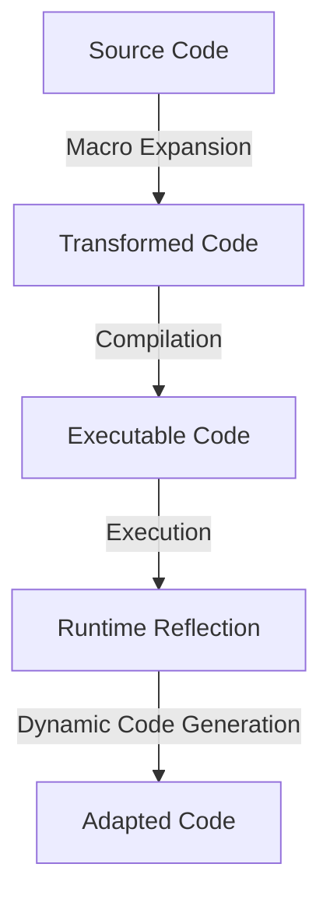

## 4.6 Metaprogramming and Code Generation

Metaprogramming is a powerful feature in Julia that allows you to write code that writes code. This capability can lead to more flexible, efficient, and maintainable programs. In this section, we will delve into advanced metaprogramming techniques, including writing complex macros, utilizing generated functions for performance optimization, and employing reflection to inspect types and methods at runtime. Let's embark on this journey to master the art of metaprogramming and code generation in Julia.

### Understanding Metaprogramming

Metaprogramming involves writing programs that can manipulate other programs or themselves. In Julia, this is achieved through macros, generated functions, and reflection. These tools allow you to dynamically generate and transform code, providing a higher level of abstraction and flexibility.

#### Key Concepts

- **Macros**: Special functions that transform code before it is executed.
- **Generated Functions**: Functions that generate specialized code based on input types.
- **Reflection**: The ability to inspect and modify the program structure at runtime.

### Advanced Macros

Macros in Julia are a form of metaprogramming that allows you to perform code transformations at compile time. They are defined using the `macro` keyword and are invoked with the `@` symbol.

#### Writing Complex Macros

To write complex macros, you need to understand Julia's Abstract Syntax Tree (AST) and how to manipulate it. Macros operate on expressions, which are the building blocks of Julia's AST.

```julia
macro sayhello(name)
    return :(println("Hello, ", $name))
end

@sayhello "Julia"
```

**Explanation**: This macro takes a name as an argument and generates code that prints a greeting. The `$` symbol is used to interpolate the argument into the expression.

#### Macro Hygiene

When writing macros, it's crucial to maintain hygiene to avoid variable name clashes. Julia provides the `esc` function to ensure that variables within the macro do not interfere with those in the surrounding code.

```julia
macro safe_add(x, y)
    return :(let a = $(esc(x)), b = $(esc(y))
        a + b
    end)
end
```

**Explanation**: The `esc` function ensures that the variables `x` and `y` are evaluated in the caller's scope, preventing unintended interactions with local variables.

#### Advanced Macro Example

Let's create a macro that logs the execution time of a block of code.

```julia
macro timeit(expr)
    return quote
        start = time()
        result = $expr
        println("Execution time: ", time() - start, " seconds")
        result
    end
end

@timeit begin
    sleep(2)
    println("Task completed")
end
```

**Explanation**: This macro measures the time taken to execute a block of code. It captures the start time, evaluates the expression, and then calculates the elapsed time.

### Generated Functions

Generated functions in Julia allow you to generate specialized code based on the types of the arguments. This can lead to significant performance improvements by enabling type-specific optimizations.

#### Using `@generated` Functions

The `@generated` macro is used to define a generated function. The function body returns an expression that is compiled for specific argument types.

```julia
@generated function mysum(a, b)
    if a <: Int && b <: Int
        return :(a + b)
    else
        return :(float(a) + float(b))
    end
end

println(mysum(1, 2))   # Uses integer addition
println(mysum(1.0, 2)) # Uses floating-point addition
```

**Explanation**: This generated function checks the types of its arguments and generates optimized code for integer and floating-point addition.

#### Performance Considerations

Generated functions can significantly enhance performance by eliminating type checks and enabling inlining. However, they should be used judiciously, as excessive use can lead to code bloat and longer compilation times.

### Reflection

Reflection in Julia allows you to inspect and manipulate the program's structure at runtime. This includes examining types, methods, and the call stack.

#### Inspecting Types and Methods

You can use reflection to query information about types and methods, which can be useful for debugging and dynamic code generation.

```julia
methods(println)

fieldnames(typeof(1))
```

**Explanation**: The `methods` function returns a list of all methods associated with a function, while `fieldnames` provides the fields of a type.

#### Dynamic Code Generation

Reflection can be combined with metaprogramming to dynamically generate code based on runtime information. This is particularly useful in scenarios where the program needs to adapt to changing conditions.

### Visualizing Metaprogramming in Julia

To better understand the flow of metaprogramming in Julia, let's visualize the process using a Mermaid.js diagram.



**Diagram Explanation**: This diagram illustrates the flow of metaprogramming in Julia. Source code undergoes macro expansion to become transformed code, which is then compiled into executable code. During execution, runtime reflection allows for dynamic code generation, resulting in adapted code.

### Try It Yourself

Experiment with the examples provided by modifying the macros and generated functions to suit your needs. Try creating a macro that logs both the execution time and memory usage of a block of code. Additionally, explore using generated functions to optimize operations on custom data types.

### Key Takeaways

- **Macros**: Use macros to perform compile-time code transformations, ensuring hygiene to avoid variable clashes.
- **Generated Functions**: Leverage generated functions for type-specific optimizations, balancing performance gains with potential code bloat.
- **Reflection**: Employ reflection to inspect and manipulate program structures at runtime, enabling dynamic code generation.

### Embrace the Journey

Metaprogramming in Julia opens up a world of possibilities for writing more expressive and efficient code. As you continue to explore these techniques, remember to experiment, stay curious, and enjoy the journey of mastering Julia's metaprogramming capabilities.

## Quiz Time!



### What is the primary purpose of metaprogramming in Julia?

- [x] To write code that writes code
- [ ] To optimize memory usage
- [ ] To improve network communication
- [ ] To enhance user interface design

> **Explanation:** Metaprogramming allows you to write code that can generate or transform other code, providing flexibility and abstraction.

### Which keyword is used to define a macro in Julia?

- [ ] function
- [x] macro
- [ ] struct
- [ ] module

> **Explanation:** The `macro` keyword is used to define macros in Julia, which are used for code transformation.

### What does the `esc` function do in a macro?

- [x] Ensures variables are evaluated in the caller's scope
- [ ] Escapes special characters in strings
- [ ] Encrypts data for security
- [ ] Executes code asynchronously

> **Explanation:** The `esc` function is used in macros to ensure that variables are evaluated in the caller's scope, preventing name clashes.

### What is a generated function in Julia?

- [ ] A function that runs in parallel
- [x] A function that generates specialized code based on input types
- [ ] A function that logs execution time
- [ ] A function that handles exceptions

> **Explanation:** Generated functions create specialized code based on the types of their arguments, optimizing performance.

### How can reflection be used in Julia?

- [x] To inspect types and methods at runtime
- [ ] To encrypt data
- [ ] To optimize memory usage
- [ ] To enhance graphical interfaces

> **Explanation:** Reflection allows you to inspect and manipulate the program's structure at runtime, useful for dynamic code generation.

### What is the benefit of using generated functions?

- [x] Performance optimization through type-specific code
- [ ] Simplifying user interfaces
- [ ] Enhancing security features
- [ ] Improving network speed

> **Explanation:** Generated functions optimize performance by generating type-specific code, reducing type checks and enabling inlining.

### Which function lists all methods for a given function in Julia?

- [ ] typeof
- [ ] fieldnames
- [x] methods
- [ ] eval

> **Explanation:** The `methods` function returns a list of all methods associated with a given function.

### What is macro hygiene?

- [x] Avoiding variable name clashes in macros
- [ ] Cleaning up memory after execution
- [ ] Ensuring code is well-documented
- [ ] Optimizing network protocols

> **Explanation:** Macro hygiene involves avoiding variable name clashes by ensuring that variables within a macro do not interfere with those in the surrounding code.

### What does the `@generated` macro do?

- [x] Defines a generated function
- [ ] Logs execution time
- [ ] Encrypts data
- [ ] Optimizes memory usage

> **Explanation:** The `@generated` macro is used to define generated functions, which generate specialized code based on input types.

### True or False: Reflection can be used to modify the program structure at runtime.

- [x] True
- [ ] False

> **Explanation:** Reflection allows you to inspect and modify the program's structure at runtime, enabling dynamic code generation.


