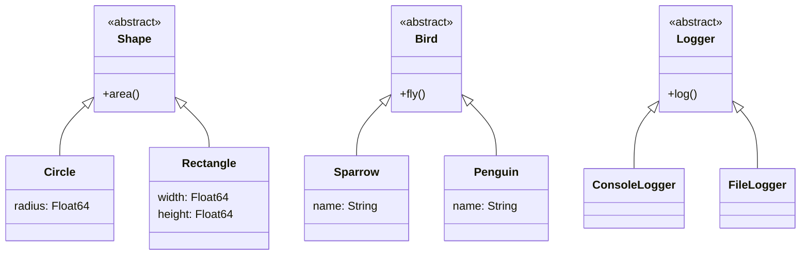

## 4.7 Applying SOLID Principles in Julia Code

In the realm of software design, the SOLID principles serve as a foundational guideline for creating robust, maintainable, and scalable software. These principles, originally introduced by Robert C. Martin, are crucial in object-oriented programming but can be adapted to Julia's unique features, such as multiple dispatch and its powerful type system. Let's delve into each of these principles and explore how they can be applied in Julia.

### Single Responsibility Principle (SRP)

**Definition:** A class or function should have only one reason to change, meaning it should have only one job or responsibility.

In Julia, this principle can be applied by ensuring that functions and modules are focused on a single task. This makes the code easier to understand, test, and maintain.

#### Example in Julia

```julia
function process_data_and_generate_report(data)
    # Process data
    processed_data = process_data(data)
    # Generate report
    report = generate_report(processed_data)
    return report
end

function process_data(data)
    # Logic for processing data
    return processed_data
end

function generate_report(processed_data)
    # Logic for generating report
    return report
end

data = [1, 2, 3, 4, 5]
processed_data = process_data(data)
report = generate_report(processed_data)
```

In the example above, we separate the concerns of data processing and report generation into two distinct functions, adhering to the SRP.

### Open/Closed Principle (OCP)

**Definition:** Software entities should be open for extension but closed for modification.

In Julia, we can achieve this by leveraging multiple dispatch and abstract types, allowing us to extend functionality without altering existing code.

#### Example in Julia

```julia
abstract type Shape end

struct Circle <: Shape
    radius::Float64
end

struct Rectangle <: Shape
    width::Float64
    height::Float64
end

function area(shape::Shape)
    throw(MethodError(area, shape))
end

function area(circle::Circle)
    return π * circle.radius^2
end

function area(rectangle::Rectangle)
    return rectangle.width * rectangle.height
end

circle = Circle(5.0)
rectangle = Rectangle(4.0, 6.0)
println("Area of circle: ", area(circle))
println("Area of rectangle: ", area(rectangle))
```

Here, the `area` function is open for extension by adding new methods for different shapes, without modifying the existing code.

### Liskov Substitution Principle (LSP)

**Definition:** Objects of a superclass should be replaceable with objects of a subclass without affecting the correctness of the program.

In Julia, this principle is naturally supported by its type system and multiple dispatch, allowing for polymorphic behavior.

#### Example in Julia

```julia
abstract type Bird end

struct Sparrow <: Bird
    name::String
end

struct Penguin <: Bird
    name::String
end

function fly(bird::Bird)
    println("Flying high!")
end

function fly(penguin::Penguin)
    println("Penguins can't fly!")
end

sparrow = Sparrow("Jack")
penguin = Penguin("Pingu")

fly(sparrow)  # Output: Flying high!
fly(penguin)  # Output: Penguins can't fly!
```

In this example, the `fly` function behaves correctly for both `Sparrow` and `Penguin`, demonstrating LSP.

### Interface Segregation Principle (ISP)

**Definition:** Clients should not be forced to depend on interfaces they do not use. Prefer many specific interfaces over a single general-purpose one.

In Julia, this can be implemented by defining specific functions for different behaviors rather than a monolithic interface.

#### Example in Julia

```julia
function swim(animal::Penguin)
    println("Swimming in the water!")
end

function chirp(bird::Sparrow)
    println("Chirping melodiously!")
end

swim(penguin)  # Output: Swimming in the water!
chirp(sparrow) # Output: Chirping melodiously!
```

By defining specific functions for different behaviors, we adhere to the ISP, ensuring that each type only implements the functions it needs.

### Dependency Inversion Principle (DIP)

**Definition:** High-level modules should not depend on low-level modules. Both should depend on abstractions. Abstractions should not depend on details. Details should depend on abstractions.

In Julia, we can use abstract types and dependency injection to adhere to this principle.

#### Example in Julia

```julia
abstract type Logger end

struct ConsoleLogger <: Logger end
struct FileLogger <: Logger end

function log(logger::Logger, message::String)
    throw(MethodError(log, logger))
end

function log(logger::ConsoleLogger, message::String)
    println("Console: $message")
end

function log(logger::FileLogger, message::String)
    println("File: $message")
end

function perform_task(logger::Logger)
    log(logger, "Task started")
    # Perform task
    log(logger, "Task completed")
end

console_logger = ConsoleLogger()
file_logger = FileLogger()

perform_task(console_logger)
perform_task(file_logger)
```

In this example, the `perform_task` function depends on the `Logger` abstraction, allowing us to inject different logger implementations without changing the high-level logic.

### Visualizing SOLID Principles in Julia

To better understand the relationships and dependencies in our examples, let's visualize the structure using a class diagram.



### Try It Yourself

Now that we've covered the SOLID principles in Julia, it's time to experiment. Try modifying the examples to:

- Add a new shape, such as `Triangle`, and extend the `area` function.
- Implement a new bird type, such as `Eagle`, and define its behavior.
- Create a new logger type, such as `DatabaseLogger`, and integrate it into the `perform_task` function.

### Key Takeaways

- **Single Responsibility Principle**: Keep functions and modules focused on a single task.
- **Open/Closed Principle**: Use multiple dispatch and abstract types to extend functionality without modifying existing code.
- **Liskov Substitution Principle**: Ensure polymorphic behavior through Julia's type system.
- **Interface Segregation Principle**: Define specific functions for different behaviors.
- **Dependency Inversion Principle**: Depend on abstractions, not concretions, using abstract types and dependency injection.

### Embrace the Journey

Remember, mastering SOLID principles is a journey. As you continue to apply these principles in your Julia projects, you'll find your code becoming more robust, maintainable, and scalable. Keep experimenting, stay curious, and enjoy the process of becoming a better software designer!

## Quiz Time!



### What is the main goal of the Single Responsibility Principle?

- [x] To ensure a class or function has only one reason to change.
- [ ] To allow multiple responsibilities in a single module.
- [ ] To enforce strict type checking.
- [ ] To enable polymorphism.

> **Explanation:** The Single Responsibility Principle aims to ensure that a class or function has only one reason to change, focusing on a single responsibility.

### How does the Open/Closed Principle benefit software design?

- [x] By allowing extensions without modifying existing code.
- [ ] By enforcing a single interface for all modules.
- [ ] By restricting the use of abstract types.
- [ ] By promoting the use of global variables.

> **Explanation:** The Open/Closed Principle benefits software design by allowing extensions without modifying existing code, making it easier to add new functionality.

### Which principle emphasizes substitutability of types?

- [ ] Single Responsibility Principle
- [ ] Open/Closed Principle
- [x] Liskov Substitution Principle
- [ ] Interface Segregation Principle

> **Explanation:** The Liskov Substitution Principle emphasizes the substitutability of types, ensuring that objects of a superclass can be replaced with objects of a subclass without affecting the program's correctness.

### What does the Interface Segregation Principle advocate?

- [ ] Using a single general-purpose interface.
- [x] Preferring many specific interfaces over a single general-purpose one.
- [ ] Avoiding the use of interfaces altogether.
- [ ] Implementing all possible methods in a single interface.

> **Explanation:** The Interface Segregation Principle advocates preferring many specific interfaces over a single general-purpose one, ensuring that clients only depend on the interfaces they use.

### How can the Dependency Inversion Principle be applied in Julia?

- [x] By using abstract types and dependency injection.
- [ ] By relying on concrete implementations.
- [ ] By avoiding the use of abstract types.
- [ ] By using global variables for dependencies.

> **Explanation:** The Dependency Inversion Principle can be applied in Julia by using abstract types and dependency injection, allowing high-level modules to depend on abstractions rather than concrete implementations.

### Which principle is naturally supported by Julia's type system?

- [ ] Single Responsibility Principle
- [ ] Open/Closed Principle
- [x] Liskov Substitution Principle
- [ ] Dependency Inversion Principle

> **Explanation:** The Liskov Substitution Principle is naturally supported by Julia's type system, allowing for polymorphic behavior through multiple dispatch.

### What is a key benefit of adhering to the Single Responsibility Principle?

- [x] Easier to understand, test, and maintain code.
- [ ] Increased complexity in code design.
- [ ] More dependencies in the codebase.
- [ ] Reduced code readability.

> **Explanation:** A key benefit of adhering to the Single Responsibility Principle is that it makes the code easier to understand, test, and maintain by focusing on a single responsibility.

### How does the Open/Closed Principle relate to multiple dispatch in Julia?

- [x] It allows extending functionality by adding new methods without modifying existing code.
- [ ] It restricts the use of multiple dispatch.
- [ ] It requires modifying existing methods for new functionality.
- [ ] It discourages the use of abstract types.

> **Explanation:** The Open/Closed Principle relates to multiple dispatch in Julia by allowing the extension of functionality through new methods without modifying existing code.

### What is the focus of the Interface Segregation Principle?

- [ ] Enforcing a single interface for all clients.
- [x] Ensuring clients only depend on the interfaces they use.
- [ ] Avoiding the use of interfaces.
- [ ] Implementing all methods in a single interface.

> **Explanation:** The focus of the Interface Segregation Principle is to ensure that clients only depend on the interfaces they use, promoting specific interfaces over general-purpose ones.

### True or False: The Dependency Inversion Principle suggests that high-level modules should depend on low-level modules.

- [ ] True
- [x] False

> **Explanation:** False. The Dependency Inversion Principle suggests that high-level modules should depend on abstractions, not low-level modules, promoting the use of abstract types and dependency injection.


