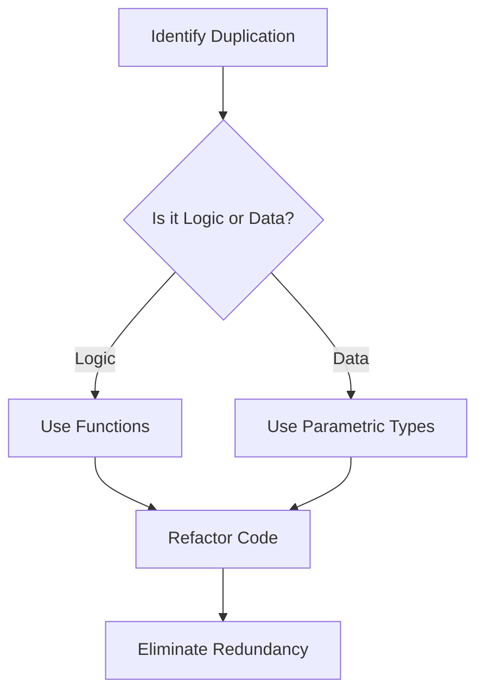

## 4.8 The DRY (Don't Repeat Yourself) Principle

The DRY (Don't Repeat Yourself) principle is a cornerstone of software development that emphasizes reducing repetition within code. This principle is not only about writing less code but also about enhancing maintainability, scalability, and readability. In this section, we will explore how the DRY principle can be effectively applied in Julia, a language known for its high performance and expressive syntax.

### Identifying Duplication

Before we can eliminate duplication, we must first identify it. Duplication can manifest in various forms, such as repeated code blocks, similar logic structures, or even redundant data structures. Recognizing these patterns is the first step toward applying the DRY principle.

#### Recognizing Redundant Code

Redundant code is often a result of copy-pasting or re-implementing similar logic across different parts of a program. This can lead to inconsistencies and make maintenance cumbersome. Let's look at an example:

```julia
function calculate_area_circle(radius)
    return π * radius^2
end

function calculate_area_square(side)
    return side^2
end

function calculate_area_rectangle(length, width)
    return length * width
end
```

In this example, the logic for calculating areas is repeated across different functions. While the formulas differ, the structure is similar, indicating potential for abstraction.

### Abstraction Techniques

Abstraction is the process of generalizing common patterns into reusable components. In Julia, we can use functions, macros, and parametric types to achieve this.

#### Using Functions to Eliminate Duplication

Functions are the most straightforward way to encapsulate repeated logic. By defining a function, we can replace multiple instances of similar code with a single, reusable component.

```julia
function calculate_area(shape, dimensions...)
    if shape == :circle
        return π * dimensions[1]^2
    elseif shape == :square
        return dimensions[1]^2
    elseif shape == :rectangle
        return dimensions[1] * dimensions[2]
    else
        error("Unsupported shape")
    end
end

circle_area = calculate_area(:circle, 5)
square_area = calculate_area(:square, 4)
rectangle_area = calculate_area(:rectangle, 3, 6)
```

In this example, we use a single function to handle different shapes, reducing redundancy and improving maintainability.

#### Leveraging Macros for Code Reuse

Macros in Julia provide a powerful way to generate code programmatically. They are particularly useful for eliminating boilerplate code and enforcing DRY principles at a higher level of abstraction.

```julia
macro define_area_function(shape, formula)
    quote
        function $(Symbol("calculate_area_", shape))(dimension...)
            return $formula
        end
    end
end

@define_area_function(circle, π * dimension[1]^2)
@define_area_function(square, dimension[1]^2)
@define_area_function(rectangle, dimension[1] * dimension[2])

circle_area = calculate_area_circle(5)
square_area = calculate_area_square(4)
rectangle_area = calculate_area_rectangle(3, 6)
```

Here, the macro `@define_area_function` generates functions for different shapes, reducing the need to manually write each function.

#### Utilizing Parametric Types

Parametric types in Julia allow us to write generic code that can operate on different data types. This is particularly useful for eliminating duplication in type-specific logic.

```julia
struct Shape{T}
    dimensions::T
end

function calculate_area(shape::Shape{Tuple{Float64}})
    return π * shape.dimensions[1]^2
end

function calculate_area(shape::Shape{Tuple{Float64, Float64}})
    return shape.dimensions[1] * shape.dimensions[2]
end

circle = Shape((5.0,))
rectangle = Shape((3.0, 6.0))

circle_area = calculate_area(circle)
rectangle_area = calculate_area(rectangle)
```

In this example, we define a `Shape` struct with parametric types, allowing us to handle different shapes with a single function signature.

### Visualizing DRY Principle in Action

To better understand how the DRY principle can be applied, let's visualize the process of identifying and eliminating duplication using a flowchart.



**Figure 1:** Visualizing the process of applying the DRY principle in Julia.

### Try It Yourself

Experiment with the code examples provided by modifying the shapes or adding new ones. Try creating a new shape, such as a triangle, and integrate it into the existing abstraction. This exercise will help reinforce your understanding of the DRY principle and its application in Julia.

### References and Links

- [Julia Documentation](https://docs.julialang.org/en/v1/)
- [DRY Principle on Wikipedia](https://en.wikipedia.org/wiki/Don%27t_repeat_yourself)
- [Metaprogramming in Julia](https://docs.julialang.org/en/v1/manual/metaprogramming/)

### Knowledge Check

- What are some common signs of code duplication?
- How can functions help in reducing redundancy?
- What role do macros play in enforcing the DRY principle?
- How do parametric types contribute to code generalization?

### Embrace the Journey

Remember, the journey to mastering the DRY principle in Julia is ongoing. As you continue to write and refactor code, keep an eye out for patterns and opportunities to apply these techniques. Stay curious, experiment with different approaches, and enjoy the process of creating efficient and maintainable code.

## Quiz Time!



### What is the primary goal of the DRY principle?

- [x] To reduce code duplication
- [ ] To increase code complexity
- [ ] To write more code
- [ ] To avoid using functions

> **Explanation:** The DRY principle aims to reduce code duplication to enhance maintainability and readability.

### Which Julia feature is most commonly used to encapsulate repeated logic?

- [x] Functions
- [ ] Macros
- [ ] Parametric types
- [ ] Modules

> **Explanation:** Functions are the most common way to encapsulate repeated logic in Julia.

### How can macros help in applying the DRY principle?

- [x] By generating repetitive code programmatically
- [ ] By increasing code redundancy
- [ ] By making code less readable
- [ ] By eliminating the need for functions

> **Explanation:** Macros can generate repetitive code programmatically, reducing the need for manual repetition.

### What is a benefit of using parametric types in Julia?

- [x] They allow for generic code that can handle different data types
- [ ] They increase code duplication
- [ ] They make code less flexible
- [ ] They are only useful for numerical computations

> **Explanation:** Parametric types allow for generic code that can handle different data types, reducing duplication.

### Which of the following is a sign of code duplication?

- [x] Repeated code blocks across functions
- [ ] Use of functions
- [ ] Use of modules
- [ ] Use of comments

> **Explanation:** Repeated code blocks across functions are a clear sign of code duplication.

### What is the role of abstraction in the DRY principle?

- [x] To generalize common patterns into reusable components
- [ ] To increase code complexity
- [ ] To write more code
- [ ] To avoid using functions

> **Explanation:** Abstraction generalizes common patterns into reusable components, reducing redundancy.

### How does the DRY principle improve code maintainability?

- [x] By reducing redundancy and making code easier to update
- [ ] By increasing code complexity
- [ ] By making code less readable
- [ ] By avoiding the use of functions

> **Explanation:** The DRY principle reduces redundancy, making code easier to update and maintain.

### What is a potential pitfall of not applying the DRY principle?

- [x] Increased maintenance effort due to inconsistent code
- [ ] Reduced code complexity
- [ ] More efficient code
- [ ] Easier debugging

> **Explanation:** Not applying the DRY principle can lead to increased maintenance effort due to inconsistent code.

### How can you identify code duplication?

- [x] By looking for repeated logic or data structures
- [ ] By counting the number of functions
- [ ] By checking for comments
- [ ] By measuring code length

> **Explanation:** Code duplication can be identified by looking for repeated logic or data structures.

### True or False: The DRY principle is only applicable to large codebases.

- [ ] True
- [x] False

> **Explanation:** The DRY principle is applicable to codebases of all sizes, as it enhances maintainability and readability.


