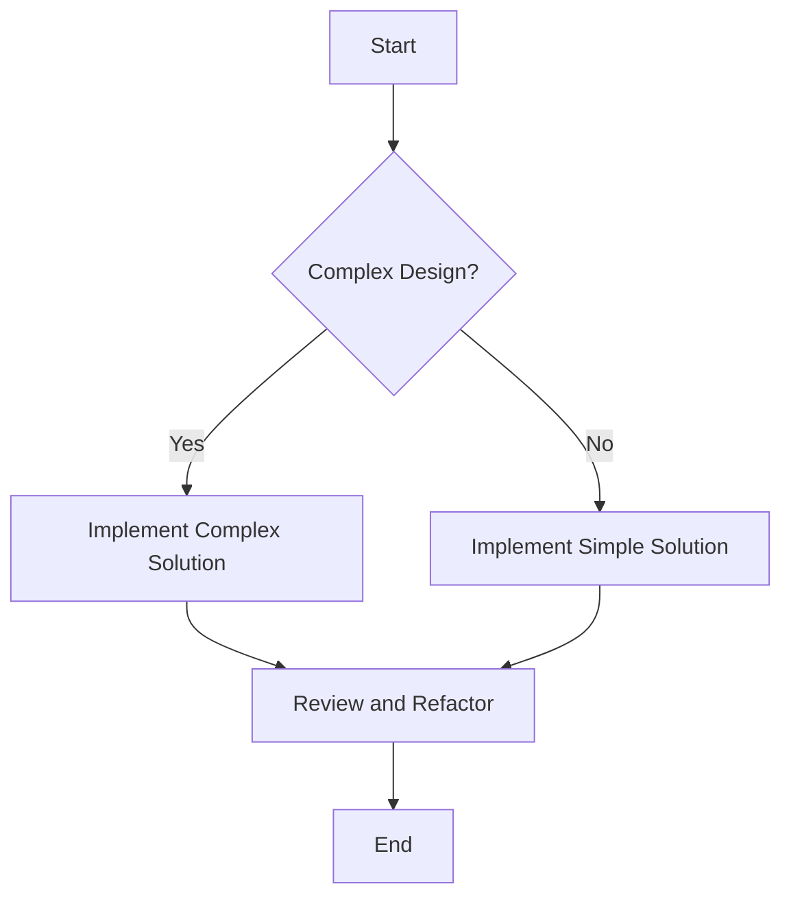

## 4.9 KISS (Keep It Simple, Stupid) in Practice

In the realm of software development, the KISS principle—Keep It Simple, Stupid—serves as a guiding beacon for developers striving to create efficient, maintainable, and scalable applications. This principle emphasizes simplicity in design and implementation, advocating for solutions that are straightforward and devoid of unnecessary complexity. In this section, we will explore how the KISS principle can be effectively applied in Julia programming, focusing on simplicity versus complexity, avoiding over-engineering, and writing readable code.

### Simplicity vs. Complexity

The balance between simplicity and complexity is a crucial consideration in software design. While complex solutions may seem appealing due to their perceived robustness and feature richness, they often lead to increased maintenance costs and potential for errors. Let's delve into how we can evaluate trade-offs in design decisions to maintain simplicity.

#### Evaluating Trade-offs

When faced with a design decision, consider the following questions:

- **Does this solution address the current problem effectively?**
- **Are there any unnecessary features being added?**
- **Will this solution be easy to maintain and extend in the future?**

By focusing on these questions, we can ensure that our design remains simple and aligned with the KISS principle.

#### Code Example: Simplifying a Function

Consider a function that calculates the factorial of a number. A complex implementation might involve recursion with additional checks and balances:

```julia
function complex_factorial(n::Int)
    if n < 0
        error("Factorial is not defined for negative numbers")
    elseif n == 0
        return 1
    else
        return n * complex_factorial(n - 1)
    end
end
```

While this function works, it can be simplified by using a more straightforward iterative approach:

```julia
function simple_factorial(n::Int)
    result = 1
    for i in 1:n
        result *= i
    end
    return result
end
```

The iterative version is not only easier to understand but also avoids the potential pitfalls of recursion, such as stack overflow for large inputs.

### Avoiding Over-Engineering

Over-engineering occurs when developers add unnecessary complexity to a solution, often in anticipation of future requirements that may never materialize. The KISS principle encourages us to focus on current requirements and avoid adding features that are not immediately needed.

#### Focus on Current Requirements

To avoid over-engineering, adhere to the following practices:

- **Prioritize current needs over speculative future requirements.**
- **Implement features incrementally, allowing for adjustments based on actual usage and feedback.**
- **Regularly review and refactor code to eliminate unnecessary complexity.**

#### Code Example: Avoiding Over-Engineering

Imagine a function designed to process user data. An over-engineered version might include multiple layers of abstraction and configuration options:

```julia
function process_user_data(data::Dict, config::Dict)
    # Complex configuration handling
    if config["use_advanced_processing"]
        # Advanced processing logic
    else
        # Basic processing logic
    end
    # Additional layers of processing
end
```

A simpler approach focuses on the core functionality required:

```julia
function process_user_data(data::Dict)
    # Basic processing logic
    # Additional processing can be added as needed
end
```

This version is easier to maintain and adapt as requirements evolve.

### Readable Code

Readable code is a cornerstone of the KISS principle. Code that is easy to understand and maintain reduces the likelihood of errors and facilitates collaboration among developers.

#### Writing Readable Code

To enhance code readability, consider the following guidelines:

- **Use descriptive variable and function names.**
- **Adopt consistent coding conventions and style.**
- **Include comments to explain complex logic or decisions.**
- **Break down large functions into smaller, focused units.**

#### Code Example: Enhancing Readability

Let's refactor a function to improve its readability:

```julia
function calc(a, b, c)
    d = a + b
    e = d * c
    return e
end
```

This function can be made more readable by using descriptive names and adding comments:

```julia
function calculate_total_cost(base_cost::Float64, tax_rate::Float64, discount::Float64)
    # Calculate the total cost after applying tax and discount
    taxed_cost = base_cost + (base_cost * tax_rate)
    total_cost = taxed_cost - discount
    return total_cost
end
```

### Visualizing Simplicity in Design

To further illustrate the importance of simplicity, let's visualize the concept using a flowchart that compares a complex and a simple design approach.



**Figure 1: Visualizing Simplicity in Design**

This flowchart demonstrates the decision-making process involved in choosing between a complex and a simple design, emphasizing the importance of reviewing and refactoring to maintain simplicity.

### Try It Yourself

To practice applying the KISS principle, try modifying the code examples provided in this section. Experiment with simplifying complex functions or refactoring code to enhance readability. Consider the following challenges:

- Refactor a recursive function to use an iterative approach.
- Simplify a function by removing unnecessary features or parameters.
- Enhance the readability of a function by using descriptive names and comments.

### References and Further Reading

For more insights into the KISS principle and its application in software development, consider exploring the following resources:

- [The Pragmatic Programmer: Your Journey to Mastery](https://pragprog.com/titles/tpp20/the-pragmatic-programmer-20th-anniversary-edition/)
- [Clean Code: A Handbook of Agile Software Craftsmanship](https://www.oreilly.com/library/view/clean-code-a/9780136083238/)
- [Refactoring: Improving the Design of Existing Code](https://martinfowler.com/books/refactoring.html)

### Knowledge Check

To reinforce your understanding of the KISS principle, consider the following questions:

- What are the key benefits of maintaining simplicity in software design?
- How can over-engineering be identified and avoided in a project?
- What practices can enhance the readability of code?

### Embrace the Journey

Remember, simplicity is a journey, not a destination. As you continue to develop your skills in Julia programming, strive to embrace the KISS principle in your designs. Keep experimenting, stay curious, and enjoy the process of creating elegant and efficient solutions.

## Quiz Time!



### What is the primary goal of the KISS principle in software design?

- [x] To maintain simplicity and avoid unnecessary complexity
- [ ] To implement as many features as possible
- [ ] To focus on future requirements
- [ ] To use advanced algorithms

> **Explanation:** The KISS principle emphasizes simplicity and avoiding unnecessary complexity in software design.

### Which of the following practices helps avoid over-engineering?

- [x] Focusing on current requirements
- [ ] Adding speculative features
- [ ] Implementing complex solutions
- [ ] Using multiple layers of abstraction

> **Explanation:** Focusing on current requirements helps avoid over-engineering by preventing the addition of unnecessary features.

### How can code readability be enhanced?

- [x] Using descriptive variable names
- [x] Including comments
- [ ] Writing long functions
- [ ] Using complex logic

> **Explanation:** Descriptive variable names and comments enhance code readability, while long functions and complex logic can hinder it.

### What is a common pitfall of complex solutions?

- [x] Increased maintenance costs
- [ ] Improved performance
- [ ] Easier collaboration
- [ ] Reduced error potential

> **Explanation:** Complex solutions often lead to increased maintenance costs and potential for errors.

### What is the benefit of using an iterative approach over recursion?

- [x] Avoiding stack overflow
- [ ] Faster execution
- [ ] More complex logic
- [ ] Easier to implement

> **Explanation:** An iterative approach avoids stack overflow, which can occur with recursion in large inputs.

### Which of the following is a key aspect of the KISS principle?

- [x] Simplicity
- [ ] Complexity
- [ ] Over-engineering
- [ ] Feature richness

> **Explanation:** Simplicity is a key aspect of the KISS principle, which aims to avoid complexity and over-engineering.

### What should be prioritized to adhere to the KISS principle?

- [x] Current needs
- [ ] Future requirements
- [ ] Advanced features
- [ ] Complex algorithms

> **Explanation:** Prioritizing current needs helps adhere to the KISS principle by focusing on simplicity.

### How can unnecessary complexity be identified in a project?

- [x] Regular code reviews
- [ ] Adding more features
- [ ] Implementing complex solutions
- [ ] Ignoring feedback

> **Explanation:** Regular code reviews help identify unnecessary complexity and maintain simplicity.

### What is the role of comments in code?

- [x] To explain complex logic
- [ ] To increase code length
- [ ] To add complexity
- [ ] To replace variable names

> **Explanation:** Comments explain complex logic and enhance code readability without adding complexity.

### True or False: The KISS principle encourages adding features for future requirements.

- [ ] True
- [x] False

> **Explanation:** The KISS principle discourages adding features for future requirements, focusing instead on current needs.


