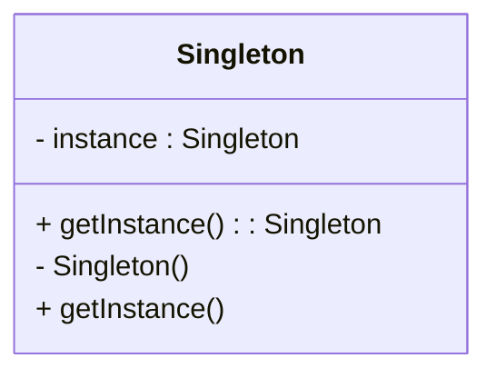

## 5.1 Implementing the Singleton Pattern

### Introduction

The Singleton Pattern is a creational design pattern that ensures a class has only one instance and provides a global point of access to that instance. This pattern is particularly useful in scenarios where a single object is needed to coordinate actions across a system, such as configuration managers or logging services. In this section, we will explore how to implement the Singleton Pattern in Julia, considering its unique features and concurrency model.

### Purpose of the Singleton Pattern

- **Ensures a Single Instance**: The Singleton Pattern restricts the instantiation of a class to one object, ensuring that there is a single point of control.
- **Global Access Point**: Provides a global access point to the instance, allowing it to be accessed from anywhere in the application.
- **Resource Management**: Useful for managing shared resources, such as database connections or configuration settings.

### Implementing Singleton in Julia

Julia, with its dynamic and flexible nature, offers several ways to implement the Singleton Pattern. We will explore using `const` variables and modules to maintain a single instance.

#### Using `const` Variables

In Julia, `const` variables can be used to define a singleton instance. By declaring a variable as `const`, we ensure that its value cannot be reassigned, effectively creating a single instance.

```julia
module SingletonExample

mutable struct Singleton
    data::Int
end

const instance = Singleton(0)

function get_instance()
    return instance
end

end # module
```

In this example, the `Singleton` struct is defined with a single field `data`. The `instance` is created as a `const` variable, ensuring that it cannot be reassigned. The `get_instance` function provides access to this singleton instance.

#### Using Modules

Modules in Julia can also be used to implement the Singleton Pattern. By encapsulating the singleton logic within a module, we can ensure that only one instance exists.

```julia
module LoggerSingleton

mutable struct Logger
    log_level::String
end

const logger_instance = Logger("INFO")

function get_logger()
    return logger_instance
end

function set_log_level(level::String)
    logger_instance.log_level = level
end

end # module
```

Here, the `Logger` struct is defined within the `LoggerSingleton` module. The `logger_instance` is a `const` variable, and functions `get_logger` and `set_log_level` provide access and modification capabilities.

### Thread Safety in Julia

When implementing the Singleton Pattern, it is crucial to consider thread safety, especially in a concurrent environment. Julia's concurrency model allows for multi-threading, and care must be taken to ensure that the singleton instance is accessed safely.

#### Ensuring Thread Safety

To ensure thread safety, we can use locks or atomic operations. Here's an example using a lock:

```julia
using Base.Threads: @threads, lock, unlock, ReentrantLock

module ThreadSafeSingleton

mutable struct ConfigManager
    settings::Dict{String, Any}
end

const config_instance = ConfigManager(Dict())
const config_lock = ReentrantLock()

function get_config()
    lock(config_lock) do
        return config_instance
    end
end

function update_setting(key::String, value::Any)
    lock(config_lock) do
        config_instance.settings[key] = value
    end
end

end # module
```

In this example, a `ReentrantLock` is used to ensure that access to the `config_instance` is thread-safe. The `lock` function is used to acquire the lock before accessing or modifying the instance.

### Avoiding Pitfalls

While the Singleton Pattern is useful, it can introduce challenges, particularly with global state and testing.

#### Global State Issues

Singletons inherently involve global state, which can lead to issues with maintainability and testing. It is essential to manage the state carefully and consider the implications of shared state across different parts of the application.

#### Testing Challenges

Testing singleton instances can be challenging due to their global nature. It is crucial to design tests that can isolate the singleton's state or reset it between tests to ensure consistent results.

### Use Cases and Examples

The Singleton Pattern is commonly used in scenarios where a single instance is required to manage shared resources or coordinate actions.

#### Configuration Managers

A configuration manager is a typical use case for the Singleton Pattern. It provides a centralized point for managing application settings, ensuring consistency across the application.

```julia
module ConfigManagerSingleton

mutable struct ConfigManager
    settings::Dict{String, Any}
end

const config_manager_instance = ConfigManager(Dict("theme" => "dark"))

function get_config_manager()
    return config_manager_instance
end

function update_config(key::String, value::Any)
    config_manager_instance.settings[key] = value
end

end # module
```

#### Logger Instances

A logger is another common use case for the Singleton Pattern. It ensures that all logging operations are coordinated through a single instance, providing a consistent logging mechanism.

```julia
module LoggerSingleton

mutable struct Logger
    log_level::String
end

const logger_instance = Logger("INFO")

function get_logger()
    return logger_instance
end

function log_message(message::String)
    println("[$(logger_instance.log_level)] $message")
end

end # module
```

### Design Considerations

When implementing the Singleton Pattern in Julia, consider the following:

- **Thread Safety**: Ensure that the singleton instance is accessed safely in a multi-threaded environment.
- **Global State**: Be mindful of the implications of global state and design your application to manage it effectively.
- **Testing**: Design tests that can handle the singleton's global nature, possibly by resetting its state between tests.

### Differences and Similarities

The Singleton Pattern is often confused with other creational patterns, such as the Factory Pattern. While both involve object creation, the Singleton Pattern focuses on ensuring a single instance, whereas the Factory Pattern is concerned with creating objects without specifying the exact class.

### Visualizing the Singleton Pattern

To better understand the Singleton Pattern, let's visualize its structure and flow using a class diagram.



In this diagram, the `Singleton` class has a private `instance` attribute and a public `getInstance` method that provides access to the single instance.

### Try It Yourself

Experiment with the Singleton Pattern in Julia by modifying the code examples provided. Try creating a singleton for a different use case, such as a database connection manager, and ensure that it is thread-safe.

### Knowledge Check

- What is the primary purpose of the Singleton Pattern?
- How can you ensure thread safety when implementing a singleton in Julia?
- What are some common use cases for the Singleton Pattern?

### Embrace the Journey

Remember, mastering design patterns like the Singleton Pattern is just the beginning. As you continue to explore Julia and its capabilities, you'll discover new ways to build efficient and scalable applications. Keep experimenting, stay curious, and enjoy the journey!

## Quiz Time!



### What is the primary purpose of the Singleton Pattern?

- [x] To ensure a class has only one instance and provide a global point of access.
- [ ] To create multiple instances of a class.
- [ ] To manage memory allocation for objects.
- [ ] To facilitate communication between objects.

> **Explanation:** The Singleton Pattern ensures that a class has only one instance and provides a global point of access to it.

### How can you implement a singleton in Julia using `const`?

- [x] By declaring a `const` variable for the instance.
- [ ] By using a `mutable` variable for the instance.
- [ ] By creating multiple instances and selecting one.
- [ ] By using a `global` variable.

> **Explanation:** In Julia, a `const` variable can be used to define a singleton instance, ensuring it cannot be reassigned.

### What is a common use case for the Singleton Pattern?

- [x] Configuration managers.
- [ ] Creating multiple database connections.
- [ ] Implementing complex algorithms.
- [ ] Managing user sessions.

> **Explanation:** Configuration managers are a common use case for the Singleton Pattern, providing a centralized point for managing settings.

### How can you ensure thread safety in a singleton implementation?

- [x] By using locks or atomic operations.
- [ ] By creating multiple instances.
- [ ] By using global variables.
- [ ] By avoiding concurrency.

> **Explanation:** Locks or atomic operations can be used to ensure thread safety when accessing a singleton instance.

### What is a potential pitfall of using the Singleton Pattern?

- [x] Global state issues.
- [ ] Increased memory usage.
- [ ] Difficulty in creating instances.
- [ ] Lack of flexibility in design.

> **Explanation:** The Singleton Pattern involves global state, which can lead to maintainability and testing challenges.

### Which of the following is NOT a characteristic of the Singleton Pattern?

- [ ] Ensures a single instance.
- [ ] Provides a global access point.
- [x] Allows multiple instances.
- [ ] Manages shared resources.

> **Explanation:** The Singleton Pattern ensures a single instance, not multiple instances.

### What is a key consideration when testing singletons?

- [x] Isolating or resetting the singleton's state between tests.
- [ ] Creating multiple instances for testing.
- [ ] Avoiding tests for singletons.
- [ ] Using global variables for tests.

> **Explanation:** Isolating or resetting the singleton's state between tests ensures consistent results.

### How can modules be used in implementing a singleton in Julia?

- [x] By encapsulating the singleton logic within a module.
- [ ] By creating multiple modules for each instance.
- [ ] By using modules to create multiple instances.
- [ ] By avoiding modules altogether.

> **Explanation:** Modules can encapsulate singleton logic, ensuring only one instance exists.

### What is the role of a `ReentrantLock` in a singleton implementation?

- [x] To ensure thread-safe access to the singleton instance.
- [ ] To create multiple instances.
- [ ] To manage memory allocation.
- [ ] To avoid concurrency.

> **Explanation:** A `ReentrantLock` ensures thread-safe access to the singleton instance.

### True or False: The Singleton Pattern is often confused with the Factory Pattern.

- [x] True
- [ ] False

> **Explanation:** The Singleton Pattern is often confused with the Factory Pattern, but they serve different purposes.


