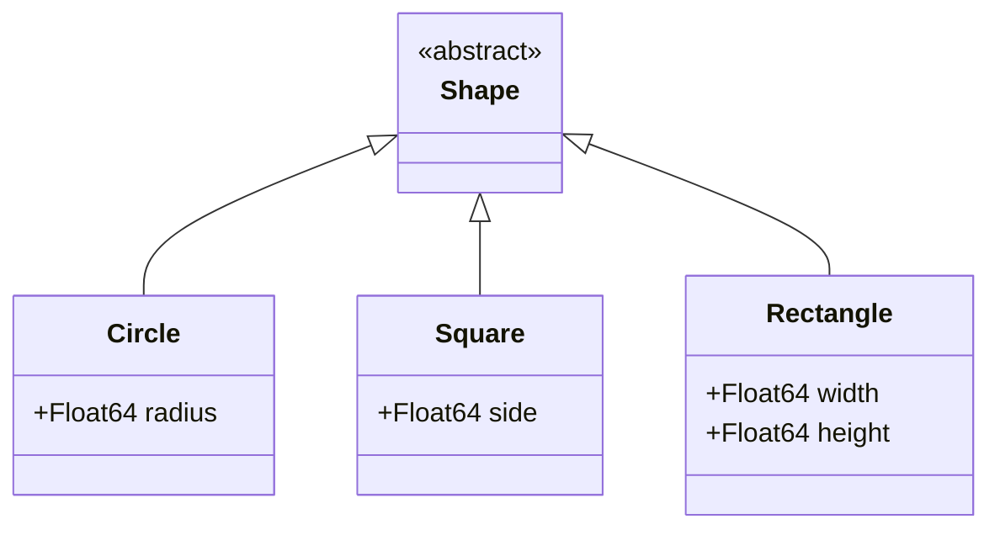

## 5.2 Factory Method Pattern with Multiple Dispatch

In the world of software design, the Factory Method Pattern stands as a cornerstone for creating objects in a way that promotes flexibility and scalability. In Julia, this pattern can be elegantly implemented using the language's powerful multiple dispatch mechanism. Let's delve into how we can leverage this pattern to enhance our Julia applications.

### Definition

The Factory Method Pattern is a creational design pattern that defines an interface for creating an object but allows subclasses to alter the type of objects that will be created. This pattern is particularly useful when the exact types of objects to be created are not known until runtime.

### Implementing Factory Method in Julia

Julia's multiple dispatch is a feature that allows functions to be defined for different combinations of argument types. This makes it an ideal candidate for implementing the Factory Method Pattern. By utilizing multiple dispatch, we can create a flexible factory method that selects the appropriate constructor based on the types of the arguments provided.

#### Step-by-Step Implementation

1. **Define Abstract Types**: Start by defining an abstract type that will serve as the base for all objects created by the factory.

    ```julia
    abstract type Shape end
    ```

2. **Create Concrete Subtypes**: Define concrete subtypes that inherit from the abstract type. These represent the different types of objects that can be created.

    ```julia
    struct Circle <: Shape
        radius::Float64
    end

    struct Square <: Shape
        side::Float64
    end
    ```

3. **Define Factory Method**: Implement a factory method using multiple dispatch. This method will determine which concrete subtype to instantiate based on the input parameters.

    ```julia
    function create_shape(::Type{Circle}, radius::Float64)
        return Circle(radius)
    end

    function create_shape(::Type{Square}, side::Float64)
        return Square(side)
    end
    ```

4. **Use the Factory Method**: Call the factory method with the desired type and parameters to create an object.

    ```julia
    circle = create_shape(Circle, 5.0)
    square = create_shape(Square, 4.0)
    ```

### Extending Factories

One of the key benefits of the Factory Method Pattern is its extensibility. In Julia, we can easily add new types without modifying existing code, thanks to multiple dispatch.

#### Adding a New Shape

Suppose we want to add a new shape, `Rectangle`. We can do this by simply defining a new struct and a corresponding factory method.

```julia
struct Rectangle <: Shape
    width::Float64
    height::Float64
end

function create_shape(::Type{Rectangle}, width::Float64, height::Float64)
    return Rectangle(width, height)
end
```

Now, we can create rectangles using the same factory method:

```julia
rectangle = create_shape(Rectangle, 3.0, 6.0)
```

### Use Cases and Examples

The Factory Method Pattern is versatile and can be applied in various scenarios. Let's explore some practical use cases.

#### Parsing Different File Formats

Imagine a scenario where we need to parse different file formats (e.g., JSON, CSV, XML). We can use the Factory Method Pattern to create parsers for each format.

```julia
abstract type FileParser end

struct JSONParser <: FileParser end
struct CSVParser <: FileParser end
struct XMLParser <: FileParser end

function create_parser(::Type{JSONParser})
    return JSONParser()
end

function create_parser(::Type{CSVParser})
    return CSVParser()
end

function create_parser(::Type{XMLParser})
    return XMLParser()
end

json_parser = create_parser(JSONParser)
csv_parser = create_parser(CSVParser)
xml_parser = create_parser(XMLParser)
```

#### Creating Different Shapes in a Graphics Application

In a graphics application, we might need to create various shapes based on user input or configuration files. The Factory Method Pattern allows us to encapsulate the creation logic and easily extend the application with new shapes.

```julia
function draw_shape(shape::Shape)
    if isa(shape, Circle)
        println("Drawing a circle with radius $(shape.radius)")
    elseif isa(shape, Square)
        println("Drawing a square with side $(shape.side)")
    elseif isa(shape, Rectangle)
        println("Drawing a rectangle with width $(shape.width) and height $(shape.height)")
    end
end

draw_shape(circle)
draw_shape(square)
draw_shape(rectangle)
```

### Visualizing the Factory Method Pattern

To better understand the Factory Method Pattern, let's visualize the relationships between the components using a class diagram.



**Diagram Description**: This class diagram illustrates the hierarchy of the `Shape` abstract type and its concrete subtypes `Circle`, `Square`, and `Rectangle`. The factory method `create_shape` uses multiple dispatch to instantiate the appropriate subtype based on the input parameters.

### Key Participants

- **Abstract Type (`Shape`)**: Defines the interface for objects created by the factory.
- **Concrete Subtypes (`Circle`, `Square`, `Rectangle`)**: Implement the abstract type and represent the different objects that can be created.
- **Factory Method (`create_shape`)**: Uses multiple dispatch to determine which concrete subtype to instantiate.

### Applicability

The Factory Method Pattern is applicable in scenarios where:

- The exact type of object to be created is determined at runtime.
- A system needs to be independent of how its objects are created.
- New types need to be added without modifying existing code.

### Design Considerations

When implementing the Factory Method Pattern in Julia, consider the following:

- **Use Multiple Dispatch**: Leverage Julia's multiple dispatch to create flexible and extensible factory methods.
- **Abstract Types**: Use abstract types to define the interface for objects created by the factory.
- **Extensibility**: Design the factory method to be easily extensible with new types.

### Differences and Similarities

The Factory Method Pattern is often compared to the Abstract Factory Pattern. While both patterns deal with object creation, the Factory Method Pattern focuses on creating a single object, whereas the Abstract Factory Pattern involves creating families of related objects.

### Try It Yourself

Now that we've explored the Factory Method Pattern, try modifying the code examples to create additional shapes or parsers. Experiment with different parameters and see how the factory method adapts to new requirements.

### Knowledge Check

Before we conclude, let's reinforce what we've learned with a few questions:

- How does multiple dispatch enhance the Factory Method Pattern in Julia?
- What are the benefits of using abstract types in the Factory Method Pattern?
- How can you extend a factory method to support new types?

### Embrace the Journey

Remember, mastering design patterns is a journey. As you continue to explore Julia and its powerful features, you'll find new ways to apply these patterns to solve complex problems. Keep experimenting, stay curious, and enjoy the process of learning and growing as a developer!

## Quiz Time!



### What is the primary purpose of the Factory Method Pattern?

- [x] To define an interface for creating an object, but let subclasses decide which class to instantiate.
- [ ] To create a single instance of a class.
- [ ] To provide a way to access the elements of an aggregate object sequentially.
- [ ] To define a family of algorithms.

> **Explanation:** The Factory Method Pattern is used to define an interface for creating an object, allowing subclasses to decide which class to instantiate.

### How does Julia's multiple dispatch enhance the Factory Method Pattern?

- [x] By allowing functions to be defined for different combinations of argument types.
- [ ] By providing a single entry point for object creation.
- [ ] By enforcing strict type checking.
- [ ] By simplifying the inheritance hierarchy.

> **Explanation:** Multiple dispatch allows functions to be defined for different combinations of argument types, making it easier to implement flexible factory methods.

### Which of the following is a key participant in the Factory Method Pattern?

- [x] Abstract Type
- [ ] Singleton
- [ ] Iterator
- [ ] Proxy

> **Explanation:** The abstract type defines the interface for objects created by the factory, making it a key participant in the pattern.

### What is a benefit of using abstract types in the Factory Method Pattern?

- [x] They define a common interface for all objects created by the factory.
- [ ] They enforce a single instance of a class.
- [ ] They simplify the implementation of iterators.
- [ ] They provide a way to access elements of an aggregate object.

> **Explanation:** Abstract types define a common interface for all objects created by the factory, promoting flexibility and extensibility.

### How can you extend a factory method to support new types?

- [x] By defining new concrete subtypes and corresponding factory methods.
- [ ] By modifying the existing factory method.
- [ ] By creating a new singleton class.
- [ ] By implementing a new iterator.

> **Explanation:** New concrete subtypes and corresponding factory methods can be defined to extend the factory method to support new types.

### What is the difference between the Factory Method Pattern and the Abstract Factory Pattern?

- [x] The Factory Method Pattern focuses on creating a single object, while the Abstract Factory Pattern involves creating families of related objects.
- [ ] The Factory Method Pattern is used for object creation, while the Abstract Factory Pattern is used for object destruction.
- [ ] The Factory Method Pattern is a structural pattern, while the Abstract Factory Pattern is a behavioral pattern.
- [ ] The Factory Method Pattern is used for creating singletons, while the Abstract Factory Pattern is used for creating prototypes.

> **Explanation:** The Factory Method Pattern focuses on creating a single object, whereas the Abstract Factory Pattern involves creating families of related objects.

### Which of the following is an example use case for the Factory Method Pattern?

- [x] Parsing different file formats.
- [ ] Implementing a singleton.
- [ ] Creating a proxy for remote objects.
- [ ] Iterating over a collection.

> **Explanation:** The Factory Method Pattern can be used to create parsers for different file formats, demonstrating its flexibility in object creation.

### What role does the factory method play in the pattern?

- [x] It uses multiple dispatch to determine which concrete subtype to instantiate.
- [ ] It enforces a single instance of a class.
- [ ] It provides a way to access elements of an aggregate object.
- [ ] It defines a family of algorithms.

> **Explanation:** The factory method uses multiple dispatch to determine which concrete subtype to instantiate, making it a central component of the pattern.

### True or False: The Factory Method Pattern allows for the addition of new types without modifying existing code.

- [x] True
- [ ] False

> **Explanation:** The Factory Method Pattern is designed to be easily extensible, allowing new types to be added without modifying existing code.

### What is a key advantage of using the Factory Method Pattern in Julia?

- [x] It leverages multiple dispatch for flexible and scalable object creation.
- [ ] It simplifies the implementation of iterators.
- [ ] It enforces strict type checking.
- [ ] It provides a single entry point for object creation.

> **Explanation:** The Factory Method Pattern leverages Julia's multiple dispatch to create flexible and scalable object creation mechanisms.


