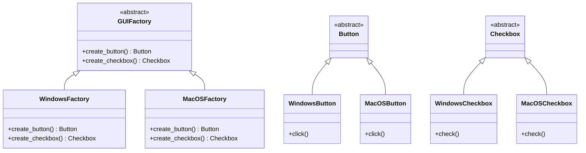

## 5.3 Abstract Factory Pattern in Julia

The Abstract Factory Pattern is a creational design pattern that provides an interface for creating families of related or dependent objects without specifying their concrete classes. This pattern is particularly useful when a system needs to be independent of how its objects are created, composed, and represented. In this section, we will explore how to implement the Abstract Factory Pattern in Julia, leveraging its unique features such as multiple dispatch and powerful type system.

### Purpose of the Abstract Factory Pattern

- **Decoupling Object Creation**: The Abstract Factory Pattern helps in decoupling the client code from the concrete classes it needs to instantiate. This promotes loose coupling and enhances code maintainability.
- **Managing Product Families**: It allows you to create families of related objects without being tied to their specific classes. This is particularly useful when you need to switch between different implementations, such as UI themes or database connectors.
- **Consistency Across Products**: Ensures that products created by the factory are compatible with each other, maintaining consistency across the application.

### Implementing Abstract Factory in Julia

To implement the Abstract Factory Pattern in Julia, we will define abstract types and factory functions, grouping related products under a common interface. Let's break down the implementation process step by step.

#### Step 1: Define Abstract Types

First, we define abstract types to represent the product families. These abstract types serve as the base for concrete implementations.

```julia
abstract type Button end
abstract type Checkbox end
```

#### Step 2: Create Concrete Product Types

Next, we create concrete types that implement the abstract product types. These types represent specific implementations of the product families.

```julia
struct WindowsButton <: Button
    function click()
        println("Windows Button Clicked")
    end
end

struct MacOSButton <: Button
    function click()
        println("MacOS Button Clicked")
    end
end

struct WindowsCheckbox <: Checkbox
    function check()
        println("Windows Checkbox Checked")
    end
end

struct MacOSCheckbox <: Checkbox
    function check()
        println("MacOS Checkbox Checked")
    end
end
```

#### Step 3: Define the Abstract Factory Interface

We define an abstract factory interface that declares methods for creating each type of product.

```julia
abstract type GUIFactory end

function create_button(factory::GUIFactory)::Button
    error("Must be implemented by concrete factory")
end

function create_checkbox(factory::GUIFactory)::Checkbox
    error("Must be implemented by concrete factory")
end
```

#### Step 4: Implement Concrete Factories

Concrete factories implement the abstract factory interface, providing specific implementations for creating products.

```julia
struct WindowsFactory <: GUIFactory end

function create_button(factory::WindowsFactory)::Button
    return WindowsButton()
end

function create_checkbox(factory::WindowsFactory)::Checkbox
    return WindowsCheckbox()
end

struct MacOSFactory <: GUIFactory end

function create_button(factory::MacOSFactory)::Button
    return MacOSButton()
end

function create_checkbox(factory::MacOSFactory)::Checkbox
    return MacOSCheckbox()
end
```

#### Step 5: Use the Abstract Factory

Finally, we use the abstract factory to create products. The client code interacts with the factory interface, remaining agnostic to the concrete implementations.

```julia
function create_ui(factory::GUIFactory)
    button = create_button(factory)
    checkbox = create_checkbox(factory)
    
    button.click()
    checkbox.check()
end

windows_factory = WindowsFactory()
macos_factory = MacOSFactory()

println("Creating Windows UI:")
create_ui(windows_factory)

println("\nCreating MacOS UI:")
create_ui(macos_factory)
```

### Visualizing the Abstract Factory Pattern

To better understand the relationships between the components of the Abstract Factory Pattern, let's visualize it using a class diagram.



**Diagram Description**: This class diagram illustrates the Abstract Factory Pattern in Julia, showing the relationships between the abstract factory, concrete factories, and product families.

### Key Participants

- **Abstract Factory (`GUIFactory`)**: Declares an interface for creating abstract product objects.
- **Concrete Factories (`WindowsFactory`, `MacOSFactory`)**: Implement the operations to create concrete product objects.
- **Abstract Products (`Button`, `Checkbox`)**: Declare interfaces for a type of product object.
- **Concrete Products (`WindowsButton`, `MacOSButton`, `WindowsCheckbox`, `MacOSCheckbox`)**: Define product objects to be created by the corresponding concrete factory.

### Applicability

The Abstract Factory Pattern is applicable when:

- A system needs to be independent of how its products are created, composed, and represented.
- A system should be configured with one of multiple families of products.
- A family of related product objects is designed to be used together, and you need to enforce this constraint.
- You want to provide a library of products, and you want to reveal only their interfaces, not their implementations.

### Use Cases and Examples

- **UI Components for Different Themes**: Use the Abstract Factory Pattern to create UI components that can switch between different themes, such as light and dark modes.
- **Database Connectors for Different Systems**: Implement database connectors that can switch between different database systems, such as SQL and NoSQL databases.

### Design Considerations

- **Flexibility**: The Abstract Factory Pattern provides flexibility by allowing the client code to work with different product families without knowing their concrete implementations.
- **Complexity**: Implementing the Abstract Factory Pattern can introduce complexity, as it requires creating multiple classes and interfaces.
- **Extensibility**: Adding new product families can be challenging, as it requires changes to the factory interface and all concrete factories.

### Differences and Similarities

- **Factory Method Pattern**: The Factory Method Pattern is similar to the Abstract Factory Pattern, but it focuses on creating a single product. The Abstract Factory Pattern, on the other hand, deals with creating families of related products.
- **Builder Pattern**: The Builder Pattern is used to construct complex objects step by step. It is different from the Abstract Factory Pattern, which focuses on creating families of related objects.

### Try It Yourself

Now that we've explored the Abstract Factory Pattern in Julia, try modifying the code examples to create additional product families or implement new concrete factories. Experiment with different configurations and observe how the pattern facilitates flexibility and consistency in object creation.

### Knowledge Check

- Explain the purpose of the Abstract Factory Pattern.
- Describe how the Abstract Factory Pattern promotes loose coupling.
- Identify the key participants in the Abstract Factory Pattern.
- Discuss the applicability of the Abstract Factory Pattern in software design.
- Compare and contrast the Abstract Factory Pattern with the Factory Method Pattern.

### Embrace the Journey

Remember, mastering design patterns is a journey. As you continue to explore and implement different patterns, you'll gain a deeper understanding of software architecture and design principles. Keep experimenting, stay curious, and enjoy the journey!

## Quiz Time!



### What is the primary purpose of the Abstract Factory Pattern?

- [x] To provide an interface for creating families of related objects without specifying their concrete classes.
- [ ] To create a single object with a complex construction process.
- [ ] To define a one-to-one mapping between an interface and a concrete class.
- [ ] To allow an object to alter its behavior when its internal state changes.

> **Explanation:** The Abstract Factory Pattern is designed to provide an interface for creating families of related or dependent objects without specifying their concrete classes.

### Which of the following is a key participant in the Abstract Factory Pattern?

- [x] Abstract Factory
- [ ] Singleton
- [ ] Observer
- [ ] Adapter

> **Explanation:** The Abstract Factory is a key participant in the Abstract Factory Pattern, responsible for declaring an interface for creating abstract product objects.

### How does the Abstract Factory Pattern promote loose coupling?

- [x] By decoupling the client code from the concrete classes it needs to instantiate.
- [ ] By allowing objects to change their behavior based on their state.
- [ ] By providing a single point of access to a shared resource.
- [ ] By encapsulating a request as an object.

> **Explanation:** The Abstract Factory Pattern promotes loose coupling by decoupling the client code from the concrete classes it needs to instantiate, allowing for flexibility and maintainability.

### What is a common use case for the Abstract Factory Pattern?

- [x] Creating UI components for different themes.
- [ ] Implementing a singleton instance.
- [ ] Observing changes in an object's state.
- [ ] Adapting an interface to a different context.

> **Explanation:** A common use case for the Abstract Factory Pattern is creating UI components for different themes, allowing for consistent and flexible design.

### Which pattern is similar to the Abstract Factory Pattern but focuses on creating a single product?

- [x] Factory Method Pattern
- [ ] Builder Pattern
- [ ] Singleton Pattern
- [ ] Observer Pattern

> **Explanation:** The Factory Method Pattern is similar to the Abstract Factory Pattern but focuses on creating a single product, whereas the Abstract Factory Pattern deals with families of related products.

### What is a potential drawback of implementing the Abstract Factory Pattern?

- [x] It can introduce complexity by requiring multiple classes and interfaces.
- [ ] It limits the flexibility of object creation.
- [ ] It restricts the ability to change an object's behavior.
- [ ] It prevents the reuse of existing code.

> **Explanation:** Implementing the Abstract Factory Pattern can introduce complexity, as it requires creating multiple classes and interfaces to manage product families.

### How does the Abstract Factory Pattern ensure consistency across products?

- [x] By ensuring that products created by the factory are compatible with each other.
- [ ] By allowing objects to change their behavior based on their state.
- [ ] By providing a single point of access to a shared resource.
- [ ] By encapsulating a request as an object.

> **Explanation:** The Abstract Factory Pattern ensures consistency across products by ensuring that products created by the factory are compatible with each other, maintaining a cohesive design.

### What is the role of a concrete factory in the Abstract Factory Pattern?

- [x] To implement the operations to create concrete product objects.
- [ ] To define a one-to-one mapping between an interface and a concrete class.
- [ ] To allow an object to alter its behavior when its internal state changes.
- [ ] To encapsulate a request as an object.

> **Explanation:** The role of a concrete factory in the Abstract Factory Pattern is to implement the operations to create concrete product objects, providing specific implementations for the abstract factory interface.

### Which of the following is NOT a benefit of the Abstract Factory Pattern?

- [ ] Flexibility in object creation.
- [ ] Consistency across product families.
- [x] Simplification of the object creation process.
- [ ] Independence from concrete classes.

> **Explanation:** While the Abstract Factory Pattern provides flexibility and consistency, it does not necessarily simplify the object creation process, as it can introduce complexity with multiple classes and interfaces.

### True or False: The Abstract Factory Pattern is used to create a single object with a complex construction process.

- [ ] True
- [x] False

> **Explanation:** False. The Abstract Factory Pattern is not used to create a single object with a complex construction process; instead, it is used to create families of related objects without specifying their concrete classes.


