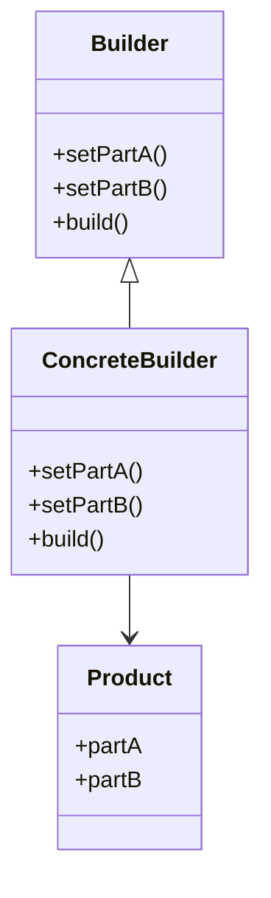

## 5.4 Builder Pattern for Complex Object Creation

In the realm of software design, the Builder Pattern stands out as a powerful tool for constructing complex objects. This pattern is particularly useful when an object requires numerous optional parameters or when the construction process involves multiple steps. In this section, we will delve into the Builder Pattern, exploring its definition, implementation in Julia, and practical use cases.

### Definition

The Builder Pattern is a creational design pattern that separates the construction of a complex object from its representation. By doing so, it allows the same construction process to create different representations. This pattern is especially beneficial when dealing with objects that require a multitude of parameters or when the construction process is intricate.

### Implementing Builder in Julia

Implementing the Builder Pattern in Julia involves creating builder types with methods to set properties and using method chaining (also known as a fluent interface) for readability. Let's break down the implementation process:

#### Creating Builder Types

In Julia, a builder type is typically a mutable struct that holds the properties of the object being constructed. Each property can be set using a method that returns the builder itself, allowing for method chaining.

```julia
mutable struct CarBuilder
    make::String
    model::String
    year::Int
    color::String
end

function CarBuilder()
    return CarBuilder("", "", 0, "")
end

function set_make(builder::CarBuilder, make::String)
    builder.make = make
    return builder
end

function set_model(builder::CarBuilder, model::String)
    builder.model = model
    return builder
end

function set_year(builder::CarBuilder, year::Int)
    builder.year = year
    return builder
end

function set_color(builder::CarBuilder, color::String)
    builder.color = color
    return builder
end

function build(builder::CarBuilder)
    return Car(builder.make, builder.model, builder.year, builder.color)
end
```

#### Using Method Chaining

Method chaining enhances the readability of the code by allowing multiple method calls to be linked together in a single line. This is achieved by returning the builder object itself from each method.

```julia
car = CarBuilder()
    |> set_make("Toyota")
    |> set_model("Corolla")
    |> set_year(2022)
    |> set_color("Red")
    |> build
```

### Director Role

In some implementations of the Builder Pattern, a Director is used to coordinate the building process. The Director is responsible for executing the steps in a specific order to construct the object. However, in many cases, especially in Julia, the Director role can be optional, as the builder itself can manage the construction process.

### Use Cases and Examples

The Builder Pattern is particularly useful in scenarios where objects have numerous optional parameters or when constructing structured data. Here are some practical use cases:

#### Constructing Structured Data

When dealing with structured data formats like JSON or XML, the Builder Pattern can simplify the construction process by allowing for a clear and concise specification of the data structure.

```julia
mutable struct JSONBuilder
    data::Dict{String, Any}
end

function JSONBuilder()
    return JSONBuilder(Dict())
end

function add_key_value(builder::JSONBuilder, key::String, value::Any)
    builder.data[key] = value
    return builder
end

function build_json(builder::JSONBuilder)
    return JSON(builder.data)
end

json_data = JSONBuilder()
    |> add_key_value("name", "John Doe")
    |> add_key_value("age", 30)
    |> add_key_value("city", "New York")
    |> build_json
```

#### Configuring Objects with Optional Parameters

For objects that have numerous optional parameters, the Builder Pattern provides a flexible way to set only the desired parameters without the need for multiple constructors.

```julia
mutable struct HouseBuilder
    bedrooms::Int
    bathrooms::Int
    has_garage::Bool
    has_garden::Bool
end

function HouseBuilder()
    return HouseBuilder(0, 0, false, false)
end

function set_bedrooms(builder::HouseBuilder, bedrooms::Int)
    builder.bedrooms = bedrooms
    return builder
end

function set_bathrooms(builder::HouseBuilder, bathrooms::Int)
    builder.bathrooms = bathrooms
    return builder
end

function set_garage(builder::HouseBuilder, has_garage::Bool)
    builder.has_garage = has_garage
    return builder
end

function set_garden(builder::HouseBuilder, has_garden::Bool)
    builder.has_garden = has_garden
    return builder
end

function build_house(builder::HouseBuilder)
    return House(builder.bedrooms, builder.bathrooms, builder.has_garage, builder.has_garden)
end

house = HouseBuilder()
    |> set_bedrooms(3)
    |> set_bathrooms(2)
    |> set_garage(true)
    |> build_house
```

### Design Considerations

When implementing the Builder Pattern in Julia, consider the following:

- **Flexibility**: The Builder Pattern provides flexibility in object construction, allowing for different configurations without the need for multiple constructors.
- **Readability**: Method chaining enhances readability, making the code more intuitive and easier to understand.
- **Director Role**: The Director role is optional in Julia, as the builder itself can manage the construction process.
- **Performance**: While the Builder Pattern adds an extra layer of abstraction, it should not significantly impact performance in most cases.

### Differences and Similarities

The Builder Pattern is often confused with other creational patterns like the Factory Method and Abstract Factory. Here are some distinctions:

- **Builder vs. Factory Method**: The Factory Method pattern focuses on creating objects without specifying the exact class, while the Builder Pattern focuses on constructing complex objects step by step.
- **Builder vs. Abstract Factory**: The Abstract Factory pattern provides an interface for creating families of related objects, while the Builder Pattern constructs a single complex object.

### Visualizing the Builder Pattern

To better understand the Builder Pattern, let's visualize the process using a class diagram:



**Diagram Description**: The diagram illustrates the relationship between the Builder, ConcreteBuilder, and Product classes. The ConcreteBuilder implements the methods defined in the Builder interface to construct the Product.

### Try It Yourself

Now that we've covered the basics of the Builder Pattern, it's time to experiment. Try modifying the code examples to add new properties or change the construction process. For instance, you could add a new method to the `CarBuilder` to set additional features like a sunroof or navigation system.

### References and Links

For further reading on the Builder Pattern and its applications, consider the following resources:

- [Design Patterns: Elements of Reusable Object-Oriented Software](https://en.wikipedia.org/wiki/Design_Patterns) - A classic book on design patterns.
- [JuliaLang Documentation](https://docs.julialang.org/) - Official documentation for the Julia programming language.

### Knowledge Check

Before we conclude, let's test your understanding of the Builder Pattern with a few questions.

## Quiz Time!



### What is the primary purpose of the Builder Pattern?

- [x] To separate the construction of a complex object from its representation.
- [ ] To create a single instance of a class.
- [ ] To provide an interface for creating families of related objects.
- [ ] To define an interface for creating an object, but let subclasses alter the type of objects that will be created.

> **Explanation:** The Builder Pattern separates the construction of a complex object from its representation, allowing the same construction process to create different representations.

### In Julia, what is a common practice when implementing the Builder Pattern?

- [x] Using method chaining for readability.
- [ ] Using inheritance to extend classes.
- [ ] Using singletons to manage object creation.
- [ ] Using abstract classes to define interfaces.

> **Explanation:** Method chaining is commonly used in the Builder Pattern to enhance readability by allowing multiple method calls to be linked together.

### What role does the Director play in the Builder Pattern?

- [x] It coordinates the building process.
- [ ] It defines the interface for creating an object.
- [ ] It provides a single instance of a class.
- [ ] It manages the lifecycle of objects.

> **Explanation:** The Director coordinates the building process, executing the steps in a specific order to construct the object.

### Which of the following is a key benefit of the Builder Pattern?

- [x] Flexibility in object construction.
- [ ] Ensuring a single instance of a class.
- [ ] Creating families of related objects.
- [ ] Defining an interface for creating an object.

> **Explanation:** The Builder Pattern provides flexibility in object construction, allowing for different configurations without the need for multiple constructors.

### How does the Builder Pattern differ from the Factory Method Pattern?

- [x] The Builder Pattern focuses on constructing complex objects step by step.
- [ ] The Builder Pattern provides an interface for creating families of related objects.
- [ ] The Builder Pattern ensures a single instance of a class.
- [ ] The Builder Pattern defines an interface for creating an object.

> **Explanation:** The Builder Pattern focuses on constructing complex objects step by step, while the Factory Method Pattern focuses on creating objects without specifying the exact class.

### What is a common use case for the Builder Pattern?

- [x] Constructing structured data like JSON or XML.
- [ ] Creating a single instance of a class.
- [ ] Defining an interface for creating an object.
- [ ] Managing the lifecycle of objects.

> **Explanation:** The Builder Pattern is commonly used for constructing structured data like JSON or XML, where the construction process involves multiple steps.

### What is the advantage of using method chaining in the Builder Pattern?

- [x] It enhances readability.
- [ ] It ensures a single instance of a class.
- [ ] It provides an interface for creating families of related objects.
- [ ] It defines an interface for creating an object.

> **Explanation:** Method chaining enhances readability by allowing multiple method calls to be linked together in a single line.

### In the Builder Pattern, what is typically returned from each method in the builder?

- [x] The builder object itself.
- [ ] A new instance of the object being built.
- [ ] A singleton instance.
- [ ] An abstract class.

> **Explanation:** Each method in the builder typically returns the builder object itself, allowing for method chaining.

### True or False: The Director role is always necessary in the Builder Pattern.

- [ ] True
- [x] False

> **Explanation:** The Director role is optional in the Builder Pattern, especially in Julia, where the builder itself can manage the construction process.

### What is a potential drawback of the Builder Pattern?

- [x] It adds an extra layer of abstraction.
- [ ] It ensures a single instance of a class.
- [ ] It provides an interface for creating families of related objects.
- [ ] It defines an interface for creating an object.

> **Explanation:** The Builder Pattern adds an extra layer of abstraction, which can be a drawback in some cases, but it should not significantly impact performance in most scenarios.



Remember, this is just the beginning. As you progress, you'll build more complex and interactive applications using the Builder Pattern. Keep experimenting, stay curious, and enjoy the journey!
