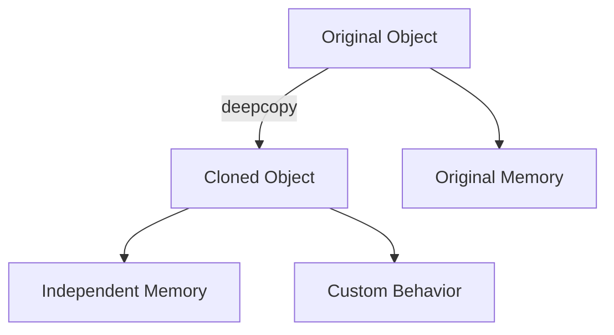

## 5.5 Prototype Pattern Using `deepcopy`

In the world of software design, the Prototype Pattern is a creational pattern that allows for the creation of new objects by copying an existing object, known as the prototype. This pattern is particularly useful when the cost of creating a new instance of an object is more expensive than copying an existing one. In Julia, the `deepcopy` function plays a crucial role in implementing this pattern, providing a mechanism to clone objects efficiently.

### Definition

The Prototype Pattern is defined as a design pattern that creates new objects by copying an existing object (the prototype). This approach is beneficial when object creation is resource-intensive, and you want to avoid the overhead of initializing new objects from scratch.

### Implementing Prototype in Julia

Julia provides a built-in function `deepcopy` that facilitates the cloning of objects. This function is essential for implementing the Prototype Pattern in Julia. Let's explore how to use `deepcopy` and customize clone behavior by defining `Base.copy` or `Base.deepcopy_internal`.

#### Using `deepcopy` to Clone Objects

The `deepcopy` function in Julia creates a deep copy of an object, meaning it recursively copies all elements of the object, ensuring that the new object is entirely independent of the original.

```julia
struct Car
    make::String
    model::String
    year::Int
end

original_car = Car("Toyota", "Corolla", 2020)

cloned_car = deepcopy(original_car)

println("Original Car: ", original_car)
println("Cloned Car: ", cloned_car)
```

In this example, `deepcopy` is used to clone the `original_car` object. The `cloned_car` is a new instance with the same properties as `original_car`, but it is a separate object in memory.

#### Customizing Clone Behavior

In some cases, you may want to customize the cloning behavior. Julia allows you to define `Base.copy` or `Base.deepcopy_internal` to control how objects are copied.

```julia
struct CustomCar
    make::String
    model::String
    year::Int
end

Base.deepcopy_internal(x::CustomCar, dict::IdDict) = CustomCar(x.make, x.model, x.year)

custom_car = CustomCar("Ford", "Mustang", 2021)

cloned_custom_car = deepcopy(custom_car)

println("Custom Car: ", custom_car)
println("Cloned Custom Car: ", cloned_custom_car)
```

Here, we define a custom `deepcopy_internal` method for the `CustomCar` struct, allowing us to control how the object is cloned.

### Shallow vs. Deep Copy

Understanding the difference between shallow and deep copy is crucial when working with the Prototype Pattern.

- **Shallow Copy**: Copies the object's top-level structure but not the nested objects. Changes to nested objects in the copy will affect the original.
- **Deep Copy**: Recursively copies all objects, ensuring complete independence from the original.

```julia
struct Engine
    horsepower::Int
end

struct Vehicle
    make::String
    engine::Engine
end

original_vehicle = Vehicle("Honda", Engine(150))

shallow_copied_vehicle = copy(original_vehicle)

deep_copied_vehicle = deepcopy(original_vehicle)

shallow_copied_vehicle.engine.horsepower = 200

println("Original Vehicle Engine Horsepower: ", original_vehicle.engine.horsepower)
println("Shallow Copied Vehicle Engine Horsepower: ", shallow_copied_vehicle.engine.horsepower)
println("Deep Copied Vehicle Engine Horsepower: ", deep_copied_vehicle.engine.horsepower)
```

In this example, modifying the `engine.horsepower` in the shallow copy affects the original vehicle, while the deep copy remains unchanged.

### Use Cases and Examples

The Prototype Pattern is particularly useful in scenarios where object creation is costly or complex. Here are some practical use cases:

#### Copying Complex Objects with Pre-set Configurations

Imagine you have a complex object with numerous configurations. Instead of re-initializing the object each time, you can create a prototype and clone it.

```julia
struct Configuration
    settings::Dict{String, Any}
end

prototype_config = Configuration(Dict("theme" => "dark", "language" => "en"))

user_config = deepcopy(prototype_config)

println("Prototype Config: ", prototype_config.settings)
println("User Config: ", user_config.settings)
```

#### Avoiding the Overhead of Initializing New Objects from Scratch

When initializing new objects involves significant computation or resource allocation, cloning a prototype can save time and resources.

```julia
struct ResourceIntensiveObject
    data::Vector{Int}
    function ResourceIntensiveObject()
        # Simulate heavy computation
        sleep(2)
        new(rand(1:100, 1000))
    end
end

prototype_object = ResourceIntensiveObject()

cloned_object = deepcopy(prototype_object)

println("Prototype Object Data: ", prototype_object.data)
println("Cloned Object Data: ", cloned_object.data)
```

### Design Considerations

When implementing the Prototype Pattern in Julia, consider the following:

- **Performance**: While `deepcopy` is powerful, it can be slower than shallow copy due to its recursive nature. Use it judiciously.
- **Memory Usage**: Deep copying large objects can consume significant memory. Ensure your system has adequate resources.
- **Custom Behavior**: Define custom `deepcopy_internal` methods for complex objects to optimize cloning behavior.

### Differences and Similarities

The Prototype Pattern is often confused with the Factory Method Pattern. While both are creational patterns, they differ in their approach:

- **Prototype Pattern**: Creates objects by copying an existing object.
- **Factory Method Pattern**: Creates objects by defining an interface for creating an object, but allows subclasses to alter the type of objects that will be created.

### Try It Yourself

Experiment with the code examples provided. Try modifying the properties of the cloned objects and observe how changes affect the original objects. Consider implementing custom `deepcopy_internal` methods for your own structs to see how you can control cloning behavior.

### Visualizing the Prototype Pattern

To better understand the Prototype Pattern, let's visualize the process of cloning objects using `deepcopy`.



**Diagram Description**: This flowchart illustrates the cloning process using `deepcopy`. The original object is cloned into a new object with independent memory. Custom behavior can be defined for the cloning process.

### References and Links

- [Julia Documentation on `deepcopy`](https://docs.julialang.org/en/v1/base/base/#Base.deepcopy)
- [Design Patterns: Elements of Reusable Object-Oriented Software](https://en.wikipedia.org/wiki/Design_Patterns) by Erich Gamma et al.
- [MDN Web Docs on Design Patterns](https://developer.mozilla.org/en-US/docs/Web/JavaScript/Guide/Design_Patterns)

### Knowledge Check

- What is the main advantage of using the Prototype Pattern?
- How does `deepcopy` differ from a shallow copy?
- When would you define a custom `deepcopy_internal` method?

### Embrace the Journey

Remember, mastering design patterns like the Prototype Pattern is a journey. As you progress, you'll build more efficient and scalable applications. Keep experimenting, stay curious, and enjoy the journey!

## Quiz Time!



### What is the primary purpose of the Prototype Pattern?

- [x] To create new objects by copying an existing object
- [ ] To define an interface for creating objects
- [ ] To separate the construction of a complex object from its representation
- [ ] To provide a way to access the elements of an aggregate object sequentially

> **Explanation:** The Prototype Pattern is used to create new objects by copying an existing object, known as the prototype.

### Which Julia function is used to implement the Prototype Pattern?

- [x] `deepcopy`
- [ ] `copy`
- [ ] `clone`
- [ ] `replicate`

> **Explanation:** The `deepcopy` function in Julia is used to create a deep copy of an object, which is essential for implementing the Prototype Pattern.

### What is the difference between a shallow copy and a deep copy?

- [x] A shallow copy copies the top-level structure, while a deep copy copies all nested objects
- [ ] A shallow copy copies all nested objects, while a deep copy copies the top-level structure
- [ ] A shallow copy creates a new object, while a deep copy modifies the original object
- [ ] A shallow copy is faster than a deep copy because it copies more data

> **Explanation:** A shallow copy copies the top-level structure but not the nested objects, while a deep copy recursively copies all objects.

### When should you consider using the Prototype Pattern?

- [x] When object creation is resource-intensive
- [ ] When you need to define an interface for creating objects
- [ ] When you want to separate the construction of a complex object from its representation
- [ ] When you need to provide a way to access the elements of an aggregate object sequentially

> **Explanation:** The Prototype Pattern is useful when object creation is resource-intensive, allowing you to clone existing objects instead.

### How can you customize the cloning behavior in Julia?

- [x] By defining `Base.deepcopy_internal` for your struct
- [ ] By using the `copy` function
- [ ] By overriding the `clone` method
- [ ] By implementing the `replicate` function

> **Explanation:** You can customize the cloning behavior in Julia by defining `Base.deepcopy_internal` for your struct.

### What is a potential downside of using `deepcopy`?

- [x] It can be slower than a shallow copy due to its recursive nature
- [ ] It does not create a new object
- [ ] It modifies the original object
- [ ] It is not supported in Julia

> **Explanation:** `deepcopy` can be slower than a shallow copy because it recursively copies all elements of the object.

### What is the main difference between the Prototype Pattern and the Factory Method Pattern?

- [x] Prototype Pattern creates objects by copying an existing object, while Factory Method Pattern defines an interface for creating objects
- [ ] Prototype Pattern defines an interface for creating objects, while Factory Method Pattern creates objects by copying an existing object
- [ ] Prototype Pattern is used for accessing elements of an aggregate object, while Factory Method Pattern is used for creating objects
- [ ] Prototype Pattern separates the construction of a complex object from its representation, while Factory Method Pattern does not

> **Explanation:** The Prototype Pattern creates objects by copying an existing object, while the Factory Method Pattern defines an interface for creating objects.

### Which of the following is a use case for the Prototype Pattern?

- [x] Copying complex objects with pre-set configurations
- [ ] Defining an interface for creating objects
- [ ] Separating the construction of a complex object from its representation
- [ ] Providing a way to access the elements of an aggregate object sequentially

> **Explanation:** The Prototype Pattern is useful for copying complex objects with pre-set configurations.

### What does the `deepcopy` function return?

- [x] A new object that is a deep copy of the original
- [ ] The original object with modifications
- [ ] A shallow copy of the original object
- [ ] A reference to the original object

> **Explanation:** The `deepcopy` function returns a new object that is a deep copy of the original, ensuring complete independence.

### True or False: `deepcopy` can be used to clone objects with custom behavior by defining `Base.deepcopy_internal`.

- [x] True
- [ ] False

> **Explanation:** True. You can define `Base.deepcopy_internal` to customize the cloning behavior of objects in Julia.


