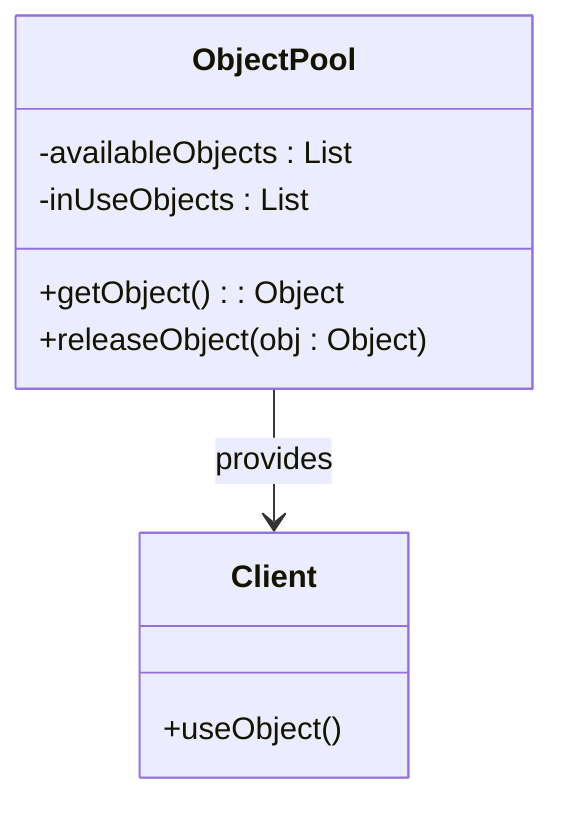
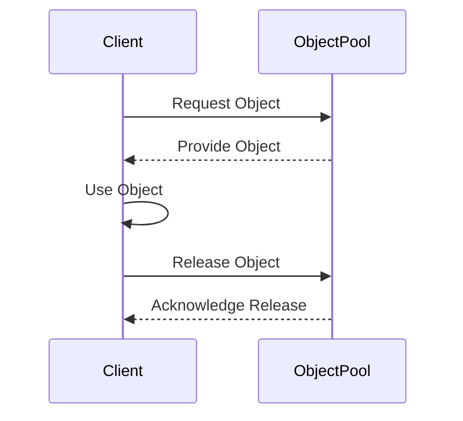

## 5.6 Resource Management Patterns in Julia

In the realm of software development, efficient resource management is crucial for building performant and scalable applications. One of the key patterns that aid in resource management is the **Object Pool Pattern**. This pattern is particularly useful in scenarios where the cost of initializing class instances is high, and you need to manage a large number of objects that are frequently used and discarded.

### Object Pool Pattern

**Intent:** The Object Pool Pattern is designed to manage the reuse of objects that are expensive to create. By maintaining a pool of reusable objects, this pattern helps in reducing the overhead of object creation and destruction, thereby improving application performance.

**Diagrams:**



**Key Participants:**

- **Object Pool**: Manages a collection of reusable objects. It provides methods to acquire and release objects.
- **Client**: Uses objects from the pool and returns them when done.

### Implementing Object Pool

To implement an Object Pool in Julia, we need to manage a collection of reusable objects. This involves creating a pool that can provide objects to clients and reclaim them when they are no longer needed.

#### Basic Implementation

Let's start with a simple implementation of an Object Pool in Julia:

```julia
module ObjectPoolPattern

struct ObjectPool{T}
    available_objects::Vector{T}
    in_use_objects::Set{T}
end

function ObjectPool{T}(initial_objects::Vector{T}) where T
    return ObjectPool(initial_objects, Set{T}())
end

function get_object(pool::ObjectPool{T}) where T
    if isempty(pool.available_objects)
        error("No available objects in the pool")
    end
    obj = pop!(pool.available_objects)
    push!(pool.in_use_objects, obj)
    return obj
end

function release_object(pool::ObjectPool{T}, obj::T) where T
    if obj in pool.in_use_objects
        delete!(pool.in_use_objects, obj)
        push!(pool.available_objects, obj)
    else
        error("Object not in use")
    end
end

end # module
```

**Explanation:**

- **ObjectPool Struct**: Manages two collections: `available_objects` and `in_use_objects`.
- **get_object Function**: Retrieves an object from the pool, moving it from `available_objects` to `in_use_objects`.
- **release_object Function**: Returns an object to the pool, moving it back to `available_objects`.

#### Synchronization Considerations

In multi-threaded environments, synchronization is crucial to prevent race conditions when accessing the pool. Julia provides several mechanisms for synchronization, such as locks and atomic operations.

Let's enhance our Object Pool with thread safety:

```julia
using Base.Threads: lock, unlock, ReentrantLock

module ThreadSafeObjectPool

struct ObjectPool{T}
    available_objects::Vector{T}
    in_use_objects::Set{T}
    pool_lock::ReentrantLock
end

function ObjectPool{T}(initial_objects::Vector{T}) where T
    return ObjectPool(initial_objects, Set{T}(), ReentrantLock())
end

function get_object(pool::ObjectPool{T}) where T
    lock(pool.pool_lock)
    try
        if isempty(pool.available_objects)
            error("No available objects in the pool")
        end
        obj = pop!(pool.available_objects)
        push!(pool.in_use_objects, obj)
        return obj
    finally
        unlock(pool.pool_lock)
    end
end

function release_object(pool::ObjectPool{T}, obj::T) where T
    lock(pool.pool_lock)
    try
        if obj in pool.in_use_objects
            delete!(pool.in_use_objects, obj)
            push!(pool.available_objects, obj)
        else
            error("Object not in use")
        end
    finally
        unlock(pool.pool_lock)
    end
end

end # module
```

**Explanation:**

- **ReentrantLock**: Used to ensure that only one thread can access the pool at a time.
- **lock and unlock**: Ensure that operations on the pool are atomic.

### Use Cases and Examples

The Object Pool Pattern is widely used in scenarios where resource initialization is costly. Here are some common use cases:

#### Database Connection Pools

Database connections are expensive to establish and tear down. By using an Object Pool, we can maintain a pool of open connections that can be reused by different parts of the application.

```julia
module DatabaseConnectionPool

using ThreadSafeObjectPool

struct DatabaseConnection
    id::Int
end

function create_connection(id::Int)
    return DatabaseConnection(id)
end

function main()
    connections = [create_connection(i) for i in 1:5]
    pool = ObjectPool(connections)

    conn = get_object(pool)
    println("Using connection: ", conn.id)

    release_object(pool, conn)
end

end # module

DatabaseConnectionPool.main()
```

**Explanation:**

- **DatabaseConnection Struct**: Represents a mock database connection.
- **create_connection Function**: Simulates the creation of a database connection.
- **main Function**: Demonstrates acquiring and releasing a connection from the pool.

#### Thread-Safe Collections of Reusable Data Buffers

In applications that process large amounts of data, managing data buffers efficiently is crucial. An Object Pool can be used to manage a collection of reusable data buffers.

```julia
module DataBufferPool

using ThreadSafeObjectPool

struct DataBuffer
    data::Vector{UInt8}
end

function create_buffer(size::Int)
    return DataBuffer(zeros(UInt8, size))
end

function main()
    buffers = [create_buffer(1024) for _ in 1:10]
    pool = ObjectPool(buffers)

    buffer = get_object(pool)
    println("Using buffer of size: ", length(buffer.data))

    release_object(pool, buffer)
end

end # module

DataBufferPool.main()
```

**Explanation:**

- **DataBuffer Struct**: Represents a buffer of data.
- **create_buffer Function**: Simulates the creation of a data buffer.
- **main Function**: Demonstrates acquiring and releasing a buffer from the pool.

### Design Considerations

When implementing the Object Pool Pattern, consider the following:

- **Pool Size**: Determine the optimal size of the pool based on application needs and resource constraints.
- **Object Lifecycle**: Ensure that objects are properly initialized and cleaned up before being returned to the pool.
- **Error Handling**: Implement robust error handling to manage scenarios where the pool is exhausted or objects are misused.
- **Performance**: Monitor the performance impact of using the pool, especially in high-concurrency environments.

### Differences and Similarities

The Object Pool Pattern is often confused with other creational patterns like the Singleton Pattern. However, they serve different purposes:

- **Object Pool vs. Singleton**: The Object Pool manages multiple instances of a class, while the Singleton Pattern restricts a class to a single instance.
- **Object Pool vs. Factory Method**: The Factory Method Pattern focuses on creating objects, whereas the Object Pool Pattern emphasizes reusing existing objects.

### Try It Yourself

Experiment with the Object Pool Pattern by modifying the code examples:

- **Change Pool Size**: Adjust the number of objects in the pool and observe the impact on performance.
- **Add Logging**: Implement logging to track object acquisition and release.
- **Simulate High Load**: Create a multi-threaded application that simulates high load on the pool.

### Visualizing Object Pool Workflow



**Description:** This sequence diagram illustrates the workflow of acquiring and releasing an object from the pool.

### References and Links

- [Julia Documentation](https://docs.julialang.org/)
- [Concurrency in Julia](https://docs.julialang.org/en/v1/manual/multi-threading/)
- [Design Patterns: Elements of Reusable Object-Oriented Software](https://www.amazon.com/Design-Patterns-Elements-Reusable-Object-Oriented/dp/0201633612)

### Knowledge Check

- **What is the primary purpose of the Object Pool Pattern?**
- **How does the Object Pool Pattern improve performance?**
- **What are some common use cases for the Object Pool Pattern?**

### Embrace the Journey

Remember, mastering design patterns like the Object Pool Pattern is a journey. As you progress, you'll discover more ways to optimize your applications and manage resources efficiently. Keep experimenting, stay curious, and enjoy the journey!

## Quiz Time!



### What is the main purpose of the Object Pool Pattern?

- [x] To manage the reuse of objects that are expensive to create
- [ ] To ensure a class has only one instance
- [ ] To provide a way to create objects without specifying the exact class
- [ ] To separate the construction of a complex object from its representation

> **Explanation:** The Object Pool Pattern is designed to manage the reuse of objects that are expensive to create, improving performance by reducing the overhead of object creation and destruction.

### Which of the following is a key participant in the Object Pool Pattern?

- [x] Object Pool
- [ ] Singleton
- [ ] Factory
- [ ] Adapter

> **Explanation:** The Object Pool is a key participant in the pattern, managing a collection of reusable objects.

### What is a common use case for the Object Pool Pattern?

- [x] Database connection pools
- [ ] Logging frameworks
- [ ] User interface components
- [ ] File I/O operations

> **Explanation:** Database connection pools are a common use case for the Object Pool Pattern, as connections are expensive to establish and tear down.

### How does the Object Pool Pattern improve performance?

- [x] By reducing the overhead of object creation and destruction
- [ ] By ensuring type safety
- [ ] By providing a single point of access to a resource
- [ ] By encapsulating object creation logic

> **Explanation:** The Object Pool Pattern improves performance by reusing objects, thus reducing the overhead associated with creating and destroying objects repeatedly.

### What synchronization mechanism is used in the thread-safe implementation of the Object Pool?

- [x] ReentrantLock
- [ ] Mutex
- [ ] Semaphore
- [ ] Barrier

> **Explanation:** A ReentrantLock is used in the thread-safe implementation to ensure that only one thread can access the pool at a time.

### Which function in the Object Pool Pattern is responsible for retrieving an object from the pool?

- [x] get_object
- [ ] release_object
- [ ] create_object
- [ ] destroy_object

> **Explanation:** The `get_object` function retrieves an object from the pool, moving it from available to in-use.

### What should be considered when determining the pool size?

- [x] Application needs and resource constraints
- [ ] The number of classes in the application
- [ ] The complexity of the object creation logic
- [ ] The number of developers on the team

> **Explanation:** The pool size should be determined based on application needs and resource constraints to ensure optimal performance.

### What is the difference between the Object Pool Pattern and the Singleton Pattern?

- [x] The Object Pool manages multiple instances, while Singleton restricts to one instance
- [ ] Both manage a single instance of a class
- [ ] The Singleton Pattern is used for object creation, while Object Pool is not
- [ ] The Object Pool Pattern is a type of Singleton Pattern

> **Explanation:** The Object Pool Pattern manages multiple instances of a class, whereas the Singleton Pattern restricts a class to a single instance.

### What is a potential drawback of using the Object Pool Pattern?

- [x] Increased complexity in managing object lifecycle
- [ ] Reduced performance due to object reuse
- [ ] Difficulty in implementing in single-threaded environments
- [ ] Lack of flexibility in object creation

> **Explanation:** The Object Pool Pattern can increase complexity in managing the lifecycle of objects, ensuring they are properly initialized and cleaned up.

### True or False: The Object Pool Pattern is only useful in multi-threaded environments.

- [ ] True
- [x] False

> **Explanation:** The Object Pool Pattern is useful in both single-threaded and multi-threaded environments, particularly when objects are expensive to create.




