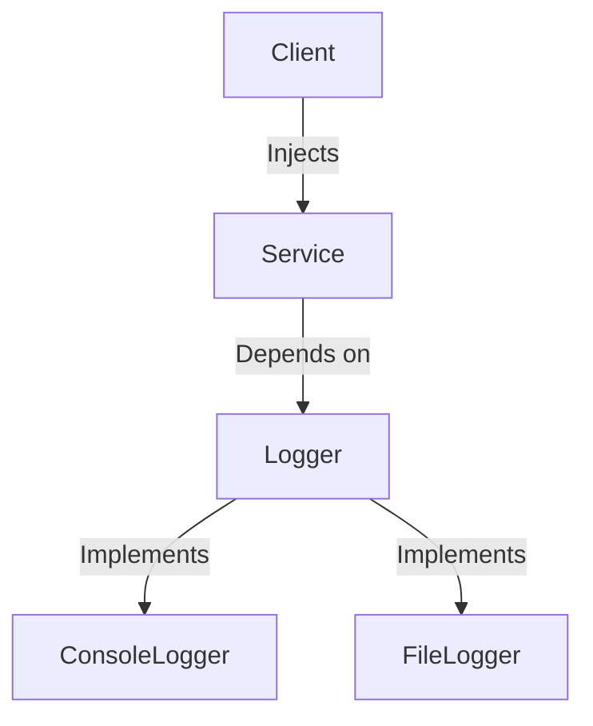

## 5.7 Dependency Injection Pattern in Julia Applications

In the world of software development, the Dependency Injection (DI) pattern is a powerful technique used to achieve loose coupling between components. This pattern is particularly useful in Julia applications, where it can enhance modularity, flexibility, and testability. In this section, we will explore the Dependency Injection pattern, its implementation in Julia, and its benefits.

### Purpose of Dependency Injection

The primary purpose of Dependency Injection is to pass dependencies to a class or module rather than hard-coding them. This approach allows for greater flexibility and modularity in software design. By decoupling the creation of an object from its dependencies, we can easily swap out implementations, making our code more adaptable to change.

### Implementing Dependency Injection

There are several ways to implement Dependency Injection in Julia, including Constructor Injection and Setter Injection. Let's explore each method in detail.

#### Constructor Injection

Constructor Injection involves passing dependencies to an object through its constructor. This method is straightforward and ensures that an object is always in a valid state with all its dependencies provided at the time of creation.

**Example:**

```julia
abstract type Logger end

struct ConsoleLogger <: Logger
end

function log(logger::ConsoleLogger, message::String)
    println("ConsoleLogger: $message")
end

struct Service
    logger::Logger
end

function perform_task(service::Service)
    log(service.logger, "Performing a task")
end

logger = ConsoleLogger()
service = Service(logger)
perform_task(service)
```

In this example, the `Service` struct depends on a `Logger`. By injecting a `ConsoleLogger` into the `Service` via its constructor, we achieve loose coupling and can easily swap out the logger implementation if needed.

#### Setter Injection

Setter Injection uses methods to set dependencies after an object has been created. This approach provides more flexibility, allowing dependencies to be changed at runtime.

**Example:**

```julia
struct FileLogger <: Logger
    filepath::String
end

function log(logger::FileLogger, message::String)
    open(logger.filepath, "a") do file
        write(file, "FileLogger: $message\n")
    end
end

mutable struct ConfigurableService
    logger::Logger
end

function set_logger(service::ConfigurableService, logger::Logger)
    service.logger = logger
end

configurable_service = ConfigurableService(ConsoleLogger())
perform_task(configurable_service)

set_logger(configurable_service, FileLogger("log.txt"))
perform_task(configurable_service)
```

Here, the `ConfigurableService` allows its logger to be set or changed after creation, demonstrating the flexibility of Setter Injection.

### Using Interfaces and Abstract Types

In Julia, we can leverage interfaces and abstract types to decouple implementations further. By depending on abstract types, we can define a contract that various implementations must adhere to, promoting flexibility and interchangeability.

**Example:**

```julia
abstract type Database end

struct MySQLDatabase <: Database
end

function connect(db::MySQLDatabase)
    println("Connecting to MySQL Database")
end

struct PostgreSQLDatabase <: Database
end

function connect(db::PostgreSQLDatabase)
    println("Connecting to PostgreSQL Database")
end

struct Repository
    database::Database
end

function fetch_data(repo::Repository)
    connect(repo.database)
    println("Fetching data")
end

mysql_db = MySQLDatabase()
postgresql_db = PostgreSQLDatabase()

repo1 = Repository(mysql_db)
fetch_data(repo1)

repo2 = Repository(postgresql_db)
fetch_data(repo2)
```

In this example, the `Repository` depends on an abstract `Database` type, allowing us to inject different database implementations without changing the repository's code.

### Use Cases and Examples

Dependency Injection is particularly useful in scenarios where we need to enhance modularity, flexibility, and testability. Let's explore some common use cases.

#### Making Code Testable

By injecting mock objects, we can easily test components in isolation. This approach allows us to simulate different scenarios and verify the behavior of our code without relying on external dependencies.

**Example:**

```julia
struct MockLogger <: Logger
    messages::Vector{String}
end

function log(logger::MockLogger, message::String)
    push!(logger.messages, message)
end

mock_logger = MockLogger(String[])
service = Service(mock_logger)
perform_task(service)

println(mock_logger.messages)
```

In this test, we use a `MockLogger` to capture log messages, allowing us to verify that the `Service` behaves as expected.

#### Enhancing Modularity and Flexibility

Dependency Injection promotes modularity by decoupling components, making it easier to swap out implementations and adapt to changing requirements.

**Example:**

```julia
abstract type PaymentProcessor end

struct PayPalProcessor <: PaymentProcessor
end

function process_payment(processor::PayPalProcessor, amount::Float64)
    println("Processing payment of $amount with PayPal")
end

struct StripeProcessor <: PaymentProcessor
end

function process_payment(processor::StripeProcessor, amount::Float64)
    println("Processing payment of $amount with Stripe")
end

struct CheckoutService
    processor::PaymentProcessor
end

function checkout(service::CheckoutService, amount::Float64)
    process_payment(service.processor, amount)
end

paypal_processor = PayPalProcessor()
stripe_processor = StripeProcessor()

checkout_service1 = CheckoutService(paypal_processor)
checkout(checkout_service1, 100.0)

checkout_service2 = CheckoutService(stripe_processor)
checkout(checkout_service2, 200.0)
```

In this example, the `CheckoutService` can process payments using different payment processors, demonstrating the flexibility of Dependency Injection.

### Visualizing Dependency Injection

To better understand the flow of Dependency Injection, let's visualize the process using a Mermaid.js diagram.



**Diagram Description:** This diagram illustrates the Dependency Injection process, where a `Client` injects a `Service` with a `Logger` dependency. The `Logger` can be implemented by either a `ConsoleLogger` or a `FileLogger`, showcasing the flexibility of this pattern.

### Design Considerations

When implementing Dependency Injection in Julia, consider the following:

- **When to Use:** Use Dependency Injection when you need to decouple components, enhance testability, or allow for flexible configurations.
- **Performance:** Be mindful of the performance implications of injecting dependencies, especially in performance-critical applications.
- **Complexity:** Avoid overcomplicating your design with unnecessary abstractions. Use Dependency Injection judiciously to maintain simplicity.

### Differences and Similarities

Dependency Injection is often confused with other patterns like Service Locator. While both patterns aim to decouple components, Dependency Injection explicitly provides dependencies, whereas Service Locator retrieves them from a centralized registry.

### Try It Yourself

To deepen your understanding of Dependency Injection in Julia, try modifying the code examples provided. Experiment with different implementations, inject mock objects for testing, and explore how Dependency Injection can enhance the flexibility and modularity of your applications.

### References and Links

- [JuliaLang Documentation](https://docs.julialang.org/)
- [Design Patterns: Elements of Reusable Object-Oriented Software](https://en.wikipedia.org/wiki/Design_Patterns)
- [Dependency Injection on Wikipedia](https://en.wikipedia.org/wiki/Dependency_injection)

### Knowledge Check

- What is the primary purpose of Dependency Injection?
- How does Constructor Injection differ from Setter Injection?
- Why is Dependency Injection beneficial for testing?
- What role do abstract types play in Dependency Injection?

### Embrace the Journey

Remember, mastering Dependency Injection is just one step in your journey to becoming an expert Julia developer. As you continue to explore and experiment, you'll discover new ways to apply this pattern and enhance your applications. Keep learning, stay curious, and enjoy the journey!

## Quiz Time!



### What is the primary purpose of Dependency Injection?

- [x] To pass dependencies to a class rather than hard-coding them
- [ ] To increase the complexity of the code
- [ ] To reduce the number of classes in a program
- [ ] To make the code less modular

> **Explanation:** Dependency Injection aims to pass dependencies to a class, allowing for greater flexibility and modularity.

### Which method involves passing dependencies through a constructor?

- [x] Constructor Injection
- [ ] Setter Injection
- [ ] Interface Injection
- [ ] Abstract Injection

> **Explanation:** Constructor Injection involves passing dependencies to an object through its constructor.

### What is a benefit of using Dependency Injection in testing?

- [x] It allows for the injection of mock objects
- [ ] It makes the code more complex
- [ ] It reduces the need for testing
- [ ] It eliminates the need for interfaces

> **Explanation:** Dependency Injection allows for the injection of mock objects, making it easier to test components in isolation.

### How can abstract types be used in Dependency Injection?

- [x] To define a contract that various implementations must adhere to
- [ ] To increase the number of dependencies
- [ ] To make the code less flexible
- [ ] To hard-code dependencies

> **Explanation:** Abstract types define a contract that various implementations must adhere to, promoting flexibility and interchangeability.

### What is the difference between Dependency Injection and Service Locator?

- [x] Dependency Injection explicitly provides dependencies, while Service Locator retrieves them from a registry
- [ ] Service Locator explicitly provides dependencies, while Dependency Injection retrieves them from a registry
- [ ] Both patterns are identical
- [ ] Dependency Injection is used for testing, while Service Locator is not

> **Explanation:** Dependency Injection explicitly provides dependencies, whereas Service Locator retrieves them from a centralized registry.

### Which of the following is a type of Dependency Injection?

- [x] Setter Injection
- [ ] Getter Injection
- [ ] Interface Injection
- [ ] Abstract Injection

> **Explanation:** Setter Injection is a type of Dependency Injection that uses methods to set dependencies after an object has been created.

### What is a potential downside of Dependency Injection?

- [x] It can increase complexity if overused
- [ ] It makes the code less modular
- [ ] It reduces flexibility
- [ ] It eliminates the need for testing

> **Explanation:** While Dependency Injection enhances modularity and flexibility, overusing it can increase complexity.

### What is the role of a Logger in the provided examples?

- [x] It serves as a dependency that can be injected into a Service
- [ ] It is the main class that performs tasks
- [ ] It is used to store data in a database
- [ ] It is a type of database

> **Explanation:** In the examples, a Logger serves as a dependency that can be injected into a Service to handle logging.

### How does Dependency Injection promote modularity?

- [x] By decoupling components and allowing for interchangeable implementations
- [ ] By increasing the number of classes
- [ ] By hard-coding dependencies
- [ ] By reducing the need for interfaces

> **Explanation:** Dependency Injection promotes modularity by decoupling components and allowing for interchangeable implementations.

### True or False: Dependency Injection can only be used with abstract types.

- [ ] True
- [x] False

> **Explanation:** Dependency Injection can be used with both concrete and abstract types, though abstract types enhance flexibility.


