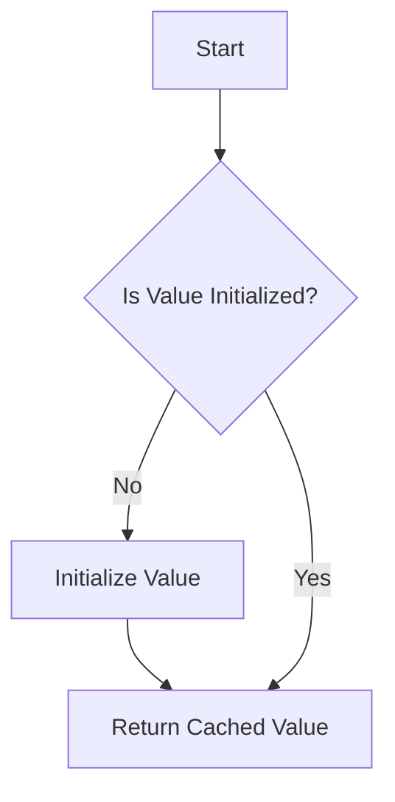

## 5.8 Lazy Initialization and On-Demand Computation

In the world of software development, efficiency and performance are paramount. One of the techniques that can significantly enhance these aspects is lazy initialization and on-demand computation. This approach involves delaying the creation of an object or the computation of a value until it is actually needed, thereby saving resources and improving performance. In this section, we will delve into the concepts of lazy initialization and on-demand computation, explore how they can be implemented in Julia, and examine their use cases and benefits.

### Definition

Lazy initialization is a design pattern that defers the creation of an object or the computation of a value until it is required. This can be particularly useful in scenarios where the initialization or computation is resource-intensive or time-consuming. By postponing these operations, we can optimize the performance of our applications and reduce unnecessary overhead.

### Implementing Lazy Initialization in Julia

Julia, with its powerful features and flexibility, provides several ways to implement lazy initialization. Let's explore some of these techniques:

#### Using the `Lazy.jl` Package

The `Lazy.jl` package is a popular choice for implementing lazy evaluation in Julia. It provides a set of macros and functions that allow developers to define and work with lazy values effortlessly.

To get started with `Lazy.jl`, you first need to install it:

```julia
using Pkg
Pkg.add("Lazy")
```

Once installed, you can use the `@lazy` macro to define lazy variables. Here's a simple example:

```julia
using Lazy

@lazy lazy_value = begin
    println("Computing lazy value...")
    42
end

println("Accessing lazy value:")
println(lazy_value)
```

In this example, the computation of `lazy_value` is deferred until it is accessed for the first time. The message "Computing lazy value..." is printed only when the value is accessed, demonstrating the lazy evaluation in action.

#### Creating Lazily Evaluated Properties with Closures

Another way to implement lazy initialization in Julia is by using closures. Closures allow you to encapsulate a computation within a function, which can be executed on demand.

Here's an example of using closures for lazy initialization:

```julia
struct LazyContainer
    value::Function
end

function get_value(container::LazyContainer)
    if isa(container.value, Function)
        container.value = container.value()
    end
    return container.value
end

lazy_container = LazyContainer(() -> begin
    println("Computing value...")
    100
end)

println("Accessing value:")
println(get_value(lazy_container))
```

In this example, the `LazyContainer` struct holds a function that computes the value. The `get_value` function checks if the value is a function and executes it if necessary, effectively implementing lazy initialization.

### Memoization

Memoization is a related concept that involves caching the results of expensive function calls to avoid redundant computations. This can be particularly useful in scenarios where the same computation is performed multiple times with the same inputs.

Here's how you can implement memoization in Julia:

```julia
function memoize(f)
    cache = Dict{Any, Any}()
    return (args...) -> get!(cache, args) do
        f(args...)
    end
end

function expensive_computation(x)
    println("Performing expensive computation...")
    return x * x
end

memoized_computation = memoize(expensive_computation)

println(memoized_computation(10))
println(memoized_computation(10))  # Cached result
```

In this example, the `memoize` function creates a cache for storing the results of the `expensive_computation` function. The cached result is used for subsequent calls with the same input, demonstrating the efficiency of memoization.

### Use Cases and Examples

Lazy initialization and on-demand computation have numerous applications in software development. Let's explore some common use cases:

#### Loading Large Datasets on Demand

In data-intensive applications, loading large datasets into memory can be resource-intensive. By using lazy initialization, we can load data only when it is needed, reducing memory usage and improving performance.

```julia
struct LazyDataset
    loader::Function
    data::Union{Nothing, Vector{Int}}
end

function get_data(dataset::LazyDataset)
    if dataset.data === nothing
        dataset.data = dataset.loader()
    end
    return dataset.data
end

lazy_dataset = LazyDataset(() -> begin
    println("Loading dataset...")
    return [1, 2, 3, 4, 5]
end, nothing)

println("Accessing data:")
println(get_data(lazy_dataset))
```

In this example, the dataset is loaded only when it is accessed for the first time, demonstrating the benefits of lazy initialization in data processing.

#### Deferring Expensive Computations Until Necessary

In scenarios where computations are expensive and not always needed, lazy initialization can be used to defer these computations until they are actually required.

```julia
struct LazyComputation
    computation::Function
    result::Union{Nothing, Int}
end

function compute_result(lazy_comp::LazyComputation)
    if lazy_comp.result === nothing
        lazy_comp.result = lazy_comp.computation()
    end
    return lazy_comp.result
end

lazy_comp = LazyComputation(() -> begin
    println("Performing computation...")
    return 42
end, nothing)

println("Accessing result:")
println(compute_result(lazy_comp))
```

In this example, the computation is performed only when the result is accessed, showcasing the efficiency of lazy initialization.

### Visualizing Lazy Initialization and On-Demand Computation

To better understand the flow of lazy initialization and on-demand computation, let's visualize the process using a flowchart.



**Figure 1: Flowchart of Lazy Initialization and On-Demand Computation**

This flowchart illustrates the decision-making process involved in lazy initialization. If the value is not initialized, it is computed and returned. If it is already initialized, the cached value is returned.

### Design Considerations

When implementing lazy initialization and on-demand computation, there are several design considerations to keep in mind:

- **Thread Safety**: Ensure that lazy initialization is thread-safe, especially in multi-threaded environments. This may involve using locks or other synchronization mechanisms.
- **Memory Usage**: While lazy initialization can reduce initial memory usage, be mindful of the memory consumed by cached values.
- **Performance Trade-offs**: Consider the trade-offs between computation time and memory usage when deciding whether to use lazy initialization.

### Differences and Similarities

Lazy initialization and memoization are often confused due to their similar goals of improving performance. However, they differ in their approaches:

- **Lazy Initialization**: Focuses on deferring the creation or computation of a value until it is needed.
- **Memoization**: Involves caching the results of function calls to avoid redundant computations.

Both techniques can be used together to optimize performance in different scenarios.

### Try It Yourself

Now that we've explored lazy initialization and on-demand computation, it's time to experiment with these concepts. Try modifying the code examples provided to suit your own use cases. For instance, you could:

- Implement lazy initialization for a different data structure or computation.
- Experiment with memoization for a function with multiple parameters.
- Explore the `Lazy.jl` package further and try out its other features.

### References and Links

For further reading on lazy initialization and on-demand computation, consider exploring the following resources:

- [Lazy.jl Documentation](https://github.com/MikeInnes/Lazy.jl)
- [Memoization Techniques in Julia](https://julialang.org/blog/2018/08/18/memoization/)
- [JuliaLang Documentation](https://docs.julialang.org/)

### Knowledge Check

To reinforce your understanding of lazy initialization and on-demand computation, consider the following questions:

- What are the benefits of using lazy initialization in software development?
- How does memoization differ from lazy initialization?
- What are some common use cases for lazy initialization?

### Embrace the Journey

Remember, mastering lazy initialization and on-demand computation is just one step in your journey as a Julia developer. As you continue to explore and experiment with these concepts, you'll discover new ways to optimize your applications and improve performance. Keep learning, stay curious, and enjoy the process!

## Quiz Time!



### What is lazy initialization?

- [x] Delaying the creation of an object or computation of a value until it is needed.
- [ ] Creating an object or computing a value immediately.
- [ ] Caching results of function calls.
- [ ] A method of parallel computation.

> **Explanation:** Lazy initialization involves deferring the creation or computation until it is actually required, optimizing resource usage.

### Which package in Julia is commonly used for lazy evaluation?

- [x] Lazy.jl
- [ ] Memoize.jl
- [ ] DataFrames.jl
- [ ] Plots.jl

> **Explanation:** The `Lazy.jl` package provides macros and functions for implementing lazy evaluation in Julia.

### What is memoization?

- [x] Caching results of expensive function calls.
- [ ] Delaying computations until necessary.
- [ ] A method of data visualization.
- [ ] A technique for parallel processing.

> **Explanation:** Memoization involves storing the results of function calls to avoid redundant computations.

### How can lazy initialization be implemented in Julia using closures?

- [x] By encapsulating a computation within a function that is executed on demand.
- [ ] By using global variables.
- [ ] By creating a new module.
- [ ] By using the `@parallel` macro.

> **Explanation:** Closures allow encapsulating computations within functions, which can be executed when needed, enabling lazy initialization.

### What is a common use case for lazy initialization?

- [x] Loading large datasets on demand.
- [ ] Immediate computation of all values.
- [ ] Parallel processing of data.
- [ ] Real-time data visualization.

> **Explanation:** Lazy initialization is often used to load large datasets only when they are needed, reducing memory usage.

### What is the main difference between lazy initialization and memoization?

- [x] Lazy initialization defers creation/computation; memoization caches results.
- [ ] Lazy initialization caches results; memoization defers creation/computation.
- [ ] Both are used for parallel processing.
- [ ] Both are used for data visualization.

> **Explanation:** Lazy initialization focuses on deferring operations, while memoization focuses on caching results to avoid redundant computations.

### Which of the following is a benefit of lazy initialization?

- [x] Reduced initial memory usage.
- [ ] Increased computation time.
- [ ] Immediate availability of all data.
- [ ] Increased memory usage.

> **Explanation:** Lazy initialization can reduce initial memory usage by deferring the creation of objects or computation of values.

### What should be considered when implementing lazy initialization in a multi-threaded environment?

- [x] Thread safety and synchronization mechanisms.
- [ ] Immediate computation of all values.
- [ ] Use of global variables.
- [ ] Avoiding closures.

> **Explanation:** In multi-threaded environments, it is important to ensure that lazy initialization is thread-safe, which may involve using locks or other synchronization mechanisms.

### Can lazy initialization and memoization be used together?

- [x] Yes
- [ ] No

> **Explanation:** Lazy initialization and memoization can be used together to optimize performance by deferring operations and caching results.

### True or False: Lazy initialization always improves performance.

- [ ] True
- [x] False

> **Explanation:** While lazy initialization can improve performance by reducing unnecessary computations, it may not always be beneficial, especially if the deferred operations are frequently accessed.




