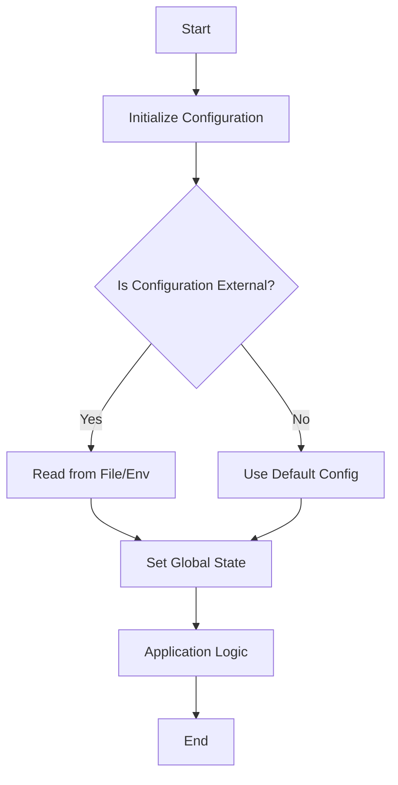

## 5.9 Managing Global State and Configuration

In the realm of software development, managing global state and configuration is a critical aspect that can significantly impact the maintainability, scalability, and reliability of applications. In Julia, a language known for its performance and flexibility, understanding how to effectively manage global state and configuration is essential for building robust applications. This section will delve into the concepts of global variables and constants, configuration management, and best practices for minimizing mutable state.

### Global Variables and Constants

Global variables are variables that are accessible from any part of the program. While they can be convenient, they come with several drawbacks, such as making code harder to understand and maintain, introducing hidden dependencies, and complicating testing and debugging. Let's explore these concepts further.

#### Understanding the Implications of Using Global State

Global state refers to variables or data that are accessible throughout the entire program. While global state can simplify certain tasks, it often leads to issues such as:

- **Tight Coupling**: Global variables can create dependencies between different parts of the code, making it difficult to modify or refactor without affecting other parts.
- **Concurrency Issues**: In a multi-threaded environment, global state can lead to race conditions and unpredictable behavior if not managed properly.
- **Testing Challenges**: Global state can make unit testing difficult, as tests may inadvertently depend on or alter the global state, leading to flaky tests.

To illustrate, consider the following example of a global variable in Julia:

```julia
global_counter = 0

function increment_counter()
    global global_counter
    global_counter += 1
end

increment_counter()
println(global_counter)  # Output: 1
```

In this example, `global_counter` is a global variable that can be accessed and modified by any function. While this may seem straightforward, it can lead to issues if multiple functions or threads modify the counter simultaneously.

#### Constants as a Safer Alternative

Constants are a safer alternative to global variables when you need to define values that should not change. In Julia, constants are defined using the `const` keyword:

```julia
const PI_APPROX = 3.14

function calculate_circumference(radius)
    return 2 * PI_APPROX * radius
end

println(calculate_circumference(5))  # Output: 31.4
```

By using constants, we ensure that the value remains unchanged throughout the program, reducing the risk of unintended side effects.

### Implementing Configuration Management

Configuration management involves setting up and managing configuration settings for an application. This can include reading from configuration files, environment variables, or using patterns like the singleton pattern to manage configurations.

#### Using Modules and Singleton Patterns

Modules in Julia provide a way to encapsulate code and manage namespaces, making them ideal for organizing configuration settings. By using a module, you can define configuration parameters that are accessible throughout your application:

```julia
module Config
    export get_config

    const CONFIG = Dict(
        "db_host" => "localhost",
        "db_port" => 5432
    )

    function get_config(key)
        return get(CONFIG, key, nothing)
    end
end

using .Config

println(Config.get_config("db_host"))  # Output: localhost
```

In this example, the `Config` module encapsulates configuration settings, providing a clean and organized way to access them.

The singleton pattern is another approach to managing configuration. It ensures that a class has only one instance and provides a global point of access to it. In Julia, this can be implemented using a mutable struct:

```julia
mutable struct AppConfig
    db_host::String
    db_port::Int
end

const app_config = AppConfig("localhost", 5432)

function get_app_config()
    return app_config
end

println(get_app_config().db_host)  # Output: localhost
```

By using a singleton pattern, we ensure that the configuration is centralized and consistent across the application.

#### Reading from Configuration Files or Environment Variables

Reading configuration from files or environment variables is a common practice that allows for flexible and dynamic configuration management. Julia provides several packages, such as `TOML.jl` and `JSON.jl`, to facilitate reading configuration files.

Here's an example of reading a configuration from a TOML file:

```julia
using TOML

config = TOML.parsefile("config.toml")

println(config["database"]["host"])  # Output: localhost
```

Similarly, environment variables can be accessed using the `ENV` dictionary in Julia:

```julia
db_host = get(ENV, "DB_HOST", "localhost")
println(db_host)  # Output: localhost (or the value of DB_HOST if set)
```

By using configuration files and environment variables, you can separate configuration from code, making it easier to manage and modify without changing the application logic.

### Best Practices

To effectively manage global state and configuration in Julia, consider the following best practices:

#### Minimizing Global Mutable State

- **Encapsulation**: Use modules or structs to encapsulate state and expose only necessary functions or methods.
- **Immutability**: Prefer immutable data structures and constants to reduce the risk of unintended modifications.

#### Using Dependency Injection to Pass Configurations

Dependency injection is a design pattern that involves passing dependencies (such as configuration settings) to a function or object rather than hardcoding them. This promotes flexibility and testability:

```julia
function connect_to_database(config)
    println("Connecting to database at $(config["host"]):$(config["port"])")
end

config = Dict("host" => "localhost", "port" => 5432)
connect_to_database(config)
```

By injecting the configuration, you can easily swap out dependencies for testing or different environments.

### Visualizing Global State and Configuration Management

To better understand the flow of global state and configuration management, let's visualize the process using a Mermaid.js diagram:



This diagram illustrates the decision-making process for managing configuration, highlighting the steps of initializing, reading, and applying configuration settings.

### References and Links

For further reading on managing global state and configuration, consider the following resources:

- [Julia Documentation](https://docs.julialang.org/)
- [TOML.jl GitHub Repository](https://github.com/JuliaLang/TOML.jl)
- [JSON.jl GitHub Repository](https://github.com/JuliaIO/JSON.jl)

### Knowledge Check

Before we conclude, let's pose a few questions to reinforce your understanding:

- What are the potential issues with using global variables in a multi-threaded environment?
- How can the singleton pattern help in managing configuration settings?
- Why is it beneficial to separate configuration from code?

### Embrace the Journey

Remember, managing global state and configuration is a crucial aspect of software development that can greatly impact the quality of your applications. As you continue to explore and experiment with these concepts, you'll gain a deeper understanding of how to build scalable and maintainable software. Keep experimenting, stay curious, and enjoy the journey!

## Quiz Time!



### What is a potential issue with using global variables?

- [x] They can lead to tight coupling and hidden dependencies.
- [ ] They make code easier to understand.
- [ ] They improve performance in multi-threaded environments.
- [ ] They simplify testing and debugging.

> **Explanation:** Global variables can create dependencies between different parts of the code, making it difficult to modify or refactor without affecting other parts.

### How can constants be beneficial in managing global state?

- [x] They ensure values remain unchanged throughout the program.
- [ ] They allow for dynamic modification of values.
- [ ] They increase the complexity of the code.
- [ ] They are only useful in small programs.

> **Explanation:** Constants are a safer alternative to global variables as they ensure that the value remains unchanged, reducing the risk of unintended side effects.

### What is the purpose of using modules for configuration management?

- [x] To encapsulate configuration settings and manage namespaces.
- [ ] To increase the number of global variables.
- [ ] To make configuration settings mutable.
- [ ] To decrease code readability.

> **Explanation:** Modules provide a way to encapsulate code and manage namespaces, making them ideal for organizing configuration settings.

### What is the singleton pattern used for in configuration management?

- [x] Ensuring a class has only one instance and provides a global point of access.
- [ ] Allowing multiple instances of a class.
- [ ] Making configuration settings mutable.
- [ ] Increasing the complexity of configuration management.

> **Explanation:** The singleton pattern ensures that a class has only one instance and provides a global point of access, centralizing configuration management.

### How can configuration files benefit an application?

- [x] They separate configuration from code, making it easier to manage.
- [ ] They make the application logic more complex.
- [ ] They are only useful for small applications.
- [ ] They require hardcoding configuration settings.

> **Explanation:** Configuration files allow for flexible and dynamic configuration management, separating configuration from code.

### What is a benefit of using environment variables for configuration?

- [x] They allow for dynamic configuration without changing the code.
- [ ] They require recompiling the application for changes.
- [ ] They are only accessible in local environments.
- [ ] They make the code less portable.

> **Explanation:** Environment variables can be accessed using the `ENV` dictionary in Julia, allowing for dynamic configuration without changing the code.

### What is dependency injection?

- [x] A design pattern that involves passing dependencies to a function or object.
- [ ] A method of hardcoding configuration settings.
- [ ] A way to increase global mutable state.
- [ ] A technique to make code less testable.

> **Explanation:** Dependency injection promotes flexibility and testability by passing dependencies (such as configuration settings) to a function or object.

### Why is minimizing global mutable state important?

- [x] It reduces the risk of unintended modifications and side effects.
- [ ] It increases the complexity of the code.
- [ ] It makes the code less readable.
- [ ] It is only important in small applications.

> **Explanation:** Minimizing global mutable state reduces the risk of unintended modifications and side effects, leading to more maintainable code.

### What is the role of encapsulation in managing global state?

- [x] To encapsulate state and expose only necessary functions or methods.
- [ ] To increase the number of global variables.
- [ ] To make state mutable.
- [ ] To decrease code readability.

> **Explanation:** Encapsulation involves using modules or structs to encapsulate state and expose only necessary functions or methods, reducing global mutable state.

### True or False: The singleton pattern allows for multiple instances of a class.

- [ ] True
- [x] False

> **Explanation:** The singleton pattern ensures that a class has only one instance and provides a global point of access, centralizing configuration management.


