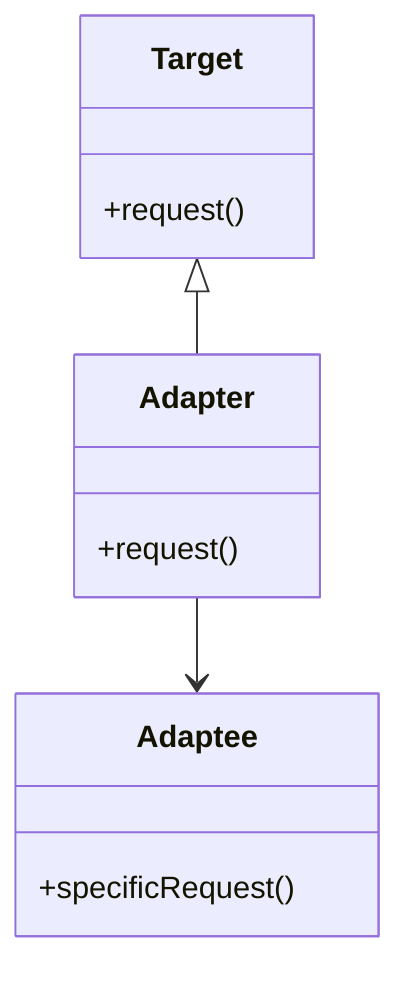

## 6.1 Adapter Pattern for Interfacing Different APIs

### Definition

The Adapter Pattern is a structural design pattern that allows objects with incompatible interfaces to collaborate. It acts as a bridge between two incompatible interfaces by converting the interface of a class or module into another interface that clients expect. This pattern is particularly useful when integrating third-party libraries or legacy code into a new system architecture without altering the existing codebase.

### Implementing Adapter Pattern in Julia

Julia, with its powerful multiple dispatch system and flexible type system, provides unique capabilities for implementing the Adapter Pattern. Let's explore how we can achieve this using wrapper functions, types, and multiple dispatch.

#### Wrapper Functions or Types

1. **Wrapper Functions**: These functions translate calls from one interface to another. They act as intermediaries that adapt the input and output to match the expected interface.

2. **Wrapper Types**: Define a new type that encapsulates the existing object and implements the desired interface methods. This approach allows you to create a new interface while preserving the original object's functionality.

#### Using Multiple Dispatch

Julia's multiple dispatch allows you to define methods that accept existing types and provide the required functionality. This feature can be leveraged to create adapters that seamlessly integrate different interfaces.

### Use Cases and Examples

#### Interfacing with External Libraries

When working with third-party libraries, you may encounter functions that do not match your application's expected interface. The Adapter Pattern can help you create a consistent interface by wrapping these functions.

#### Legacy Code Integration

Legacy systems often have outdated interfaces that do not align with modern architectures. By wrapping these modules, you can integrate them into new systems without modifying the original code.

### Sample Code Snippet

Let's consider a scenario where we have a third-party library that provides a function to calculate the area of a rectangle, but our application expects a function that calculates the area of a square.

```julia
function rectangle_area(length::Float64, width::Float64)::Float64
    return length * width
end

function square_area(side::Float64)::Float64
    return rectangle_area(side, side)
end

println("Area of square with side 5: ", square_area(5.0))
```

In this example, we use a wrapper function `square_area` to adapt the `rectangle_area` function from the third-party library to match our application's expected interface.

### Design Considerations

- **When to Use**: Use the Adapter Pattern when you need to integrate incompatible interfaces without modifying existing code.
- **Considerations**: Be mindful of performance implications when wrapping functions, as additional layers of abstraction can introduce overhead.
- **Pitfalls**: Avoid overusing adapters, as they can lead to a complex and hard-to-maintain codebase if not managed properly.

### Differences and Similarities

The Adapter Pattern is often confused with the Facade Pattern. While both patterns provide a simplified interface, the Adapter Pattern focuses on converting an existing interface to a new one, whereas the Facade Pattern provides a unified interface to a set of interfaces in a subsystem.

### Visualizing the Adapter Pattern

To better understand the Adapter Pattern, let's visualize it using a class diagram.



**Diagram Description**: In this diagram, `Target` represents the interface expected by the client. `Adaptee` is the existing interface that needs to be adapted. `Adapter` is the intermediary that implements the `Target` interface and delegates calls to the `Adaptee`.

### Try It Yourself

Experiment with the Adapter Pattern by modifying the code example to adapt a different function. For instance, try adapting a function that calculates the perimeter of a rectangle to calculate the perimeter of a square.

### References and Links

- [Design Patterns: Elements of Reusable Object-Oriented Software](https://en.wikipedia.org/wiki/Design_Patterns) - A foundational book on design patterns.
- [Julia Documentation](https://docs.julialang.org/) - Official Julia documentation for further reading on multiple dispatch and type systems.

### Knowledge Check

- What is the primary purpose of the Adapter Pattern?
- How does Julia's multiple dispatch facilitate the implementation of the Adapter Pattern?
- What are some common use cases for the Adapter Pattern?

### Embrace the Journey

Remember, mastering design patterns is a journey. As you progress, you'll find more opportunities to apply the Adapter Pattern in your projects. Keep experimenting, stay curious, and enjoy the process of learning and integrating new patterns into your development toolkit.

## Quiz Time!



### What is the primary purpose of the Adapter Pattern?

- [x] To allow incompatible interfaces to work together
- [ ] To provide a simplified interface to a complex subsystem
- [ ] To ensure a single instance of a class
- [ ] To separate the construction of a complex object from its representation

> **Explanation:** The Adapter Pattern allows incompatible interfaces to work together by converting one interface into another that clients expect.

### How does Julia's multiple dispatch facilitate the implementation of the Adapter Pattern?

- [x] By allowing methods to be defined for existing types
- [ ] By enforcing a single method signature
- [ ] By restricting method overloading
- [ ] By providing a single entry point for all functions

> **Explanation:** Julia's multiple dispatch allows methods to be defined for existing types, enabling the creation of adapters that integrate different interfaces.

### What is a common use case for the Adapter Pattern?

- [x] Interfacing with external libraries
- [ ] Creating a single instance of a class
- [ ] Simplifying a complex subsystem
- [ ] Separating object construction from representation

> **Explanation:** A common use case for the Adapter Pattern is interfacing with external libraries to match an application's expected interface.

### What is the difference between the Adapter Pattern and the Facade Pattern?

- [x] Adapter converts interfaces, while Facade provides a unified interface
- [ ] Adapter provides a unified interface, while Facade converts interfaces
- [ ] Both patterns serve the same purpose
- [ ] Adapter is used for singletons, while Facade is for complex subsystems

> **Explanation:** The Adapter Pattern converts an existing interface to a new one, while the Facade Pattern provides a unified interface to a set of interfaces in a subsystem.

### When should you avoid using the Adapter Pattern?

- [x] When it leads to a complex and hard-to-maintain codebase
- [ ] When integrating incompatible interfaces
- [ ] When simplifying a complex subsystem
- [ ] When ensuring a single instance of a class

> **Explanation:** Avoid overusing adapters, as they can lead to a complex and hard-to-maintain codebase if not managed properly.

### What is a wrapper function in the context of the Adapter Pattern?

- [x] A function that translates calls from one interface to another
- [ ] A function that provides a unified interface
- [ ] A function that ensures a single instance
- [ ] A function that separates construction from representation

> **Explanation:** A wrapper function in the Adapter Pattern translates calls from one interface to another, acting as an intermediary.

### What is a wrapper type in the context of the Adapter Pattern?

- [x] A type that encapsulates an object and implements desired interface methods
- [ ] A type that provides a unified interface
- [ ] A type that ensures a single instance
- [ ] A type that separates construction from representation

> **Explanation:** A wrapper type encapsulates an object and implements the desired interface methods, creating a new interface while preserving the original object's functionality.

### What is the role of the Adapter in the Adapter Pattern?

- [x] To implement the target interface and delegate calls to the adaptee
- [ ] To provide a unified interface to a subsystem
- [ ] To ensure a single instance of a class
- [ ] To separate construction from representation

> **Explanation:** The Adapter implements the target interface and delegates calls to the adaptee, allowing incompatible interfaces to work together.

### Can the Adapter Pattern be used to integrate legacy code?

- [x] True
- [ ] False

> **Explanation:** The Adapter Pattern can be used to wrap legacy modules, aligning them with new system architectures without modifying the original code.

### What is a potential pitfall of using the Adapter Pattern?

- [x] Introducing performance overhead due to additional abstraction layers
- [ ] Simplifying a complex subsystem
- [ ] Ensuring a single instance of a class
- [ ] Separating construction from representation

> **Explanation:** A potential pitfall of using the Adapter Pattern is introducing performance overhead due to additional abstraction layers.


