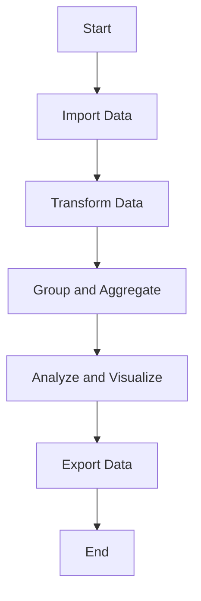

## 6.10.1 Using DataFrames.jl for Data Manipulation

Data manipulation is a cornerstone of data analysis and scientific computing. In Julia, the `DataFrames.jl` package provides a robust framework for handling tabular data, similar to the popular Pandas library in Python. This section will guide you through the essential features of `DataFrames.jl`, including data import/export, transformation, grouping, and aggregation. We will also explore practical use cases such as statistical analysis and data cleaning.

### Overview of DataFrames.jl

`DataFrames.jl` is a powerful package for working with structured data in Julia. It provides a flexible and efficient way to manipulate data, offering a wide range of functionalities that cater to both simple and complex data manipulation tasks. Whether you are dealing with small datasets or large-scale data processing, `DataFrames.jl` equips you with the tools needed to perform operations seamlessly.

#### Key Features of DataFrames.jl

- **Tabular Data Representation**: Similar to tables in a database or spreadsheets, allowing for intuitive data manipulation.
- **Flexible Data Import/Export**: Supports reading from and writing to various file formats, including CSV, Excel, and more.
- **Data Transformation**: Offers functions for filtering, selecting, and transforming data columns.
- **Grouping and Aggregation**: Facilitates group-wise operations for summarizing data.
- **Integration with Other Julia Packages**: Works well with other Julia packages for plotting, statistical analysis, and machine learning.

### Common Operations with DataFrames.jl

Let's delve into some of the common operations you can perform using `DataFrames.jl`.

#### Data Import/Export

One of the first steps in data manipulation is importing data from external sources. `DataFrames.jl` makes it easy to read data from various formats.

**Reading CSV Files**

```julia
using DataFrames
using CSV

df = CSV.File("data.csv") |> DataFrame

first(df, 5)
```

**Writing to CSV Files**

```julia
CSV.write("output.csv", df)
```

**Reading Excel Files**

For Excel files, you can use the `ExcelFiles.jl` package in conjunction with `DataFrames.jl`.

```julia
using DataFrames
using ExcelFiles

df = DataFrame(load("data.xlsx", "Sheet1"))

first(df, 5)
```

#### Data Transformation

Data transformation involves modifying the data to suit analysis needs. This can include filtering rows, selecting specific columns, and applying functions to columns.

**Filtering Rows**

```julia
filtered_df = filter(row -> row.age > 30, df)
```

**Selecting Columns**

```julia
selected_df = select(df, [:name, :age])
```

**Transforming Columns**

```julia
transform!(df, :age => x -> x * 12 => :age_in_months)
```

#### Grouping and Aggregation

Grouping and aggregation are essential for summarizing data, especially when dealing with large datasets.

**Grouping Data**

```julia
grouped_df = groupby(df, :department)
```

**Aggregating Data**

```julia
agg_df = combine(grouped_df, :age => mean => :average_age)
```

### Use Cases and Examples

#### Statistical Analysis

DataFrames.jl is particularly useful for preparing and analyzing datasets for statistical analysis and machine learning.

**Example: Preparing Data for Machine Learning**

```julia
using DataFrames
using CSV

df = CSV.File("iris.csv") |> DataFrame

df = dropmissing(df)

df.species = categorical(df.species)

X = select(df, Not(:species))
y = df.species
```

#### Data Cleaning

Data cleaning is a critical step in data analysis, involving handling missing values, outliers, and inconsistencies.

**Handling Missing Values**

```julia
df.age = coalesce.(df.age, mean(skipmissing(df.age)))
```

**Removing Outliers**

```julia
q1 = quantile(df.salary, 0.25)
q3 = quantile(df.salary, 0.75)
iqr = q3 - q1

cleaned_df = filter(row -> (row.salary >= q1 - 1.5 * iqr) && (row.salary <= q3 + 1.5 * iqr), df)
```

### Visualizing Data Manipulation with DataFrames.jl

To better understand the flow of data manipulation using `DataFrames.jl`, let's visualize the process using a flowchart.



**Description**: This flowchart represents the typical workflow when using `DataFrames.jl` for data manipulation. It starts with importing data, followed by transformation, grouping, and aggregation, leading to analysis and visualization, and finally exporting the processed data.

### Try It Yourself

Now that we've covered the basics, it's time to experiment with `DataFrames.jl` on your own. Here are a few suggestions:

- **Modify the Code**: Try changing the file paths and column names in the examples to match your own datasets.
- **Experiment with Functions**: Use different functions for data transformation, such as `sort`, `join`, and `unique`.
- **Create Visualizations**: Integrate `Plots.jl` or `Gadfly.jl` to visualize your data after manipulation.

### References and Further Reading

- [DataFrames.jl Documentation](https://dataframes.juliadata.org/stable/)
- [CSV.jl Documentation](https://csv.juliadata.org/stable/)
- [ExcelFiles.jl Documentation](https://github.com/queryverse/ExcelFiles.jl)
- [JuliaLang Official Website](https://julialang.org/)

### Knowledge Check

Before we wrap up, let's reinforce what we've learned with a few questions:

1. What is the primary purpose of `DataFrames.jl` in Julia?
2. How do you read a CSV file into a DataFrame?
3. What function would you use to filter rows in a DataFrame?
4. How can you handle missing values in a DataFrame?
5. Describe a use case where grouping and aggregation would be beneficial.

### Embrace the Journey

Remember, mastering data manipulation with `DataFrames.jl` is a journey. As you continue to explore and experiment, you'll uncover more advanced techniques and patterns that will enhance your data analysis capabilities. Keep learning, stay curious, and enjoy the process!

## Quiz Time!



### What is the primary purpose of DataFrames.jl in Julia?

- [x] To provide tools for working with tabular data
- [ ] To perform numerical simulations
- [ ] To create graphical user interfaces
- [ ] To manage web servers

> **Explanation:** DataFrames.jl is designed for handling and manipulating tabular data, similar to tables in a database or spreadsheets.

### How do you read a CSV file into a DataFrame in Julia?

- [x] Using CSV.File and DataFrame
- [ ] Using read.csv
- [ ] Using pandas.read_csv
- [ ] Using ExcelFiles.load

> **Explanation:** The correct method in Julia is to use CSV.File to read the file and then convert it to a DataFrame.

### Which function is used to filter rows in a DataFrame?

- [x] filter
- [ ] select
- [ ] transform
- [ ] groupby

> **Explanation:** The filter function is used to filter rows based on a condition.

### How can you handle missing values in a DataFrame?

- [x] Using the coalesce function
- [ ] Using the drop function
- [ ] Using the fillna function
- [ ] Using the replace function

> **Explanation:** The coalesce function is used to replace missing values with a specified value.

### What is a common use case for grouping and aggregation?

- [x] Summarizing data by categories
- [ ] Sorting data alphabetically
- [ ] Merging two DataFrames
- [ ] Visualizing data trends

> **Explanation:** Grouping and aggregation are typically used to summarize data by categories, such as calculating averages or totals.

### Which package is used in conjunction with DataFrames.jl to read Excel files?

- [x] ExcelFiles.jl
- [ ] CSV.jl
- [ ] XLSX.jl
- [ ] Pandas.jl

> **Explanation:** ExcelFiles.jl is used to read Excel files into DataFrames in Julia.

### What is the purpose of the transform function in DataFrames.jl?

- [x] To apply transformations to columns
- [ ] To filter rows based on conditions
- [ ] To join two DataFrames
- [ ] To export data to CSV

> **Explanation:** The transform function is used to apply transformations to columns, such as creating new columns or modifying existing ones.

### How do you write a DataFrame to a CSV file?

- [x] Using CSV.write
- [ ] Using write.csv
- [ ] Using pandas.to_csv
- [ ] Using ExcelFiles.save

> **Explanation:** CSV.write is the correct function to write a DataFrame to a CSV file in Julia.

### What is the benefit of using groupby in DataFrames.jl?

- [x] It allows for efficient group-wise operations
- [ ] It sorts the DataFrame
- [ ] It merges two DataFrames
- [ ] It visualizes data trends

> **Explanation:** groupby is used to perform efficient group-wise operations, such as aggregation.

### True or False: DataFrames.jl can only handle small datasets.

- [ ] True
- [x] False

> **Explanation:** DataFrames.jl is capable of handling both small and large datasets efficiently.


