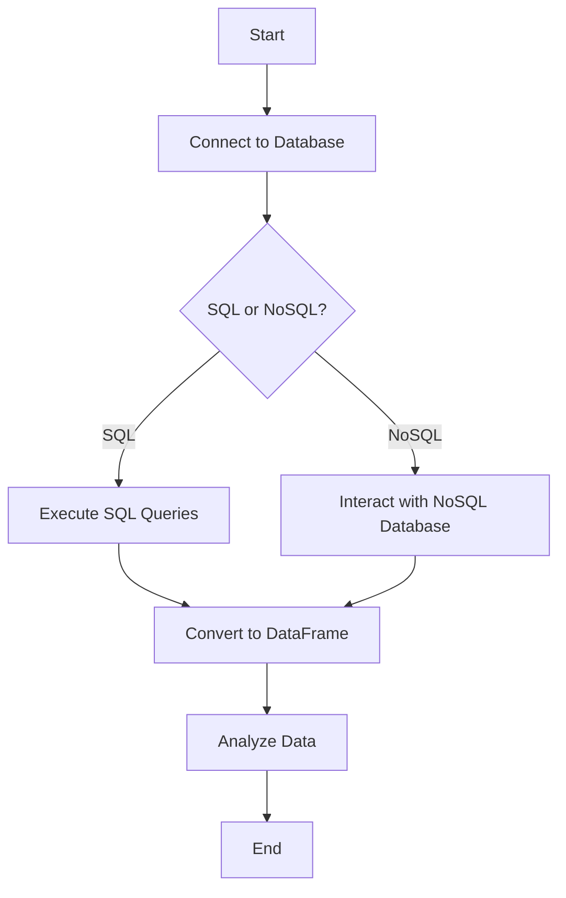

## 6.10.2 Database Integration with Julia: SQL and NoSQL

In today's data-driven world, integrating databases with programming languages is crucial for building scalable and efficient applications. Julia, known for its high performance and ease of use, offers robust solutions for database integration, both for SQL and NoSQL databases. This section will guide you through the process of connecting Julia to various databases, executing queries, and leveraging Julia's powerful data manipulation capabilities.

### Connecting to Databases

To connect Julia to databases, we can use several packages that provide interfaces to SQL and NoSQL databases. Let's explore some of the most popular options.

#### SQL Databases

For SQL databases, Julia offers several packages that facilitate database connectivity:

- **JDBC.jl**: This package provides a Julia interface to databases using the Java Database Connectivity (JDBC) API. It's a versatile choice for connecting to any database that supports JDBC.
- **ODBC.jl**: This package allows you to connect to databases using the Open Database Connectivity (ODBC) standard. It's suitable for a wide range of databases, including SQL Server, MySQL, and PostgreSQL.
- **LibPQ.jl**: Specifically designed for PostgreSQL, this package offers a native interface to PostgreSQL databases, providing high performance and ease of use.

#### NoSQL Databases

For NoSQL databases, Julia also provides several packages:

- **Mongo.jl**: This package allows you to interact with MongoDB, a popular NoSQL database known for its flexibility and scalability.
- **Couchbase.jl**: This package provides an interface to Couchbase, a distributed NoSQL database optimized for interactive applications.

### Data Operations

Once connected to a database, you can perform various data operations, such as executing queries and integrating with Julia's DataFrames for analysis.

#### Executing Queries

Executing SQL queries in Julia is straightforward. Let's demonstrate how to run queries using the LibPQ.jl package for PostgreSQL.

```julia
using LibPQ

conn = LibPQ.Connection("host=localhost dbname=mydb user=myuser password=mypassword")

result = execute(conn, "SELECT * FROM employees")

rows = fetchall(result)

close(conn)

println(rows)
```

In this example, we connect to a PostgreSQL database, execute a query to retrieve all records from the `employees` table, and print the results.

#### DataFrames Integration

Julia's DataFrames.jl package provides a powerful way to manipulate and analyze data. You can easily convert query results into DataFrames for further analysis.

```julia
using DataFrames, LibPQ

conn = LibPQ.Connection("host=localhost dbname=mydb user=myuser password=mypassword")

df = DataFrame(execute(conn, "SELECT * FROM employees"))

close(conn)

println(df)
```

By converting query results into a DataFrame, you can leverage Julia's data manipulation capabilities to perform complex analyses.

### NoSQL Databases

Interfacing with NoSQL databases in Julia is also straightforward. Let's explore how to interact with MongoDB using the Mongo.jl package.

```julia
using Mongo

client = MongoClient("mongodb://localhost:27017")
db = getdatabase(client, "mydb")
collection = getcollection(db, "employees")

insert_one(collection, Dict("name" => "John Doe", "position" => "Developer"))

cursor = find(collection, Dict("position" => "Developer"))

for doc in cursor
    println(doc)
end

close(client)
```

In this example, we connect to a MongoDB database, insert a document into a collection, and query documents based on a specific condition.

### Use Cases and Examples

Database integration in Julia is applicable in various scenarios, from enterprise applications to big data processing.

#### Enterprise Applications

In enterprise applications, integrating Julia with existing databases allows you to leverage Julia's performance and analytical capabilities while maintaining compatibility with existing data infrastructure.

#### Big Data Processing

Julia's ability to handle large datasets makes it an excellent choice for big data processing. By integrating with databases, you can efficiently analyze and process large volumes of data stored in SQL or NoSQL databases.

### Visualizing Database Integration

To better understand the process of database integration in Julia, let's visualize the workflow using a Mermaid.js diagram.



**Diagram Description**: This flowchart illustrates the process of integrating Julia with databases. It starts with connecting to a database, executing queries or interacting with NoSQL databases, converting results to DataFrames, and analyzing the data.

### References and Links

For further reading on database integration with Julia, consider exploring the following resources:

- [JDBC.jl Documentation](https://github.com/JuliaDatabases/JDBC.jl)
- [ODBC.jl Documentation](https://github.com/JuliaDatabases/ODBC.jl)
- [LibPQ.jl Documentation](https://github.com/invenia/LibPQ.jl)
- [Mongo.jl Documentation](https://github.com/JuliaIO/Mongo.jl)

### Knowledge Check

To reinforce your understanding of database integration in Julia, consider the following questions:

- What are the key differences between SQL and NoSQL databases?
- How can you convert query results into DataFrames in Julia?
- What are some use cases for integrating Julia with databases?

### Embrace the Journey

Remember, mastering database integration in Julia is a journey. As you progress, you'll discover more advanced techniques and optimizations. Keep experimenting, stay curious, and enjoy the process!

## Quiz Time!



### Which package is used to connect Julia to PostgreSQL databases?

- [ ] JDBC.jl
- [ ] ODBC.jl
- [x] LibPQ.jl
- [ ] Mongo.jl

> **Explanation:** LibPQ.jl is specifically designed for connecting to PostgreSQL databases in Julia.

### What is the primary use of DataFrames.jl in database integration?

- [x] To convert query results into DataFrames for analysis
- [ ] To execute SQL queries
- [ ] To connect to NoSQL databases
- [ ] To manage database connections

> **Explanation:** DataFrames.jl is used to convert query results into DataFrames, allowing for powerful data manipulation and analysis.

### Which package would you use to interact with MongoDB in Julia?

- [ ] LibPQ.jl
- [ ] ODBC.jl
- [x] Mongo.jl
- [ ] JDBC.jl

> **Explanation:** Mongo.jl is the package used to interact with MongoDB databases in Julia.

### What is the advantage of using ODBC.jl?

- [x] It allows connecting to a wide range of databases using the ODBC standard.
- [ ] It is specifically for PostgreSQL databases.
- [ ] It is used for NoSQL databases.
- [ ] It is a package for data visualization.

> **Explanation:** ODBC.jl provides a standard interface for connecting to various databases that support ODBC.

### What is the first step in integrating Julia with a database?

- [x] Establish a connection to the database
- [ ] Execute a query
- [ ] Convert results to DataFrames
- [ ] Analyze the data

> **Explanation:** The first step in integrating Julia with a database is to establish a connection to the database.

### Which of the following is a NoSQL database?

- [ ] PostgreSQL
- [ ] MySQL
- [x] MongoDB
- [ ] SQL Server

> **Explanation:** MongoDB is a NoSQL database known for its flexibility and scalability.

### How can you close a database connection in Julia?

- [x] Using the `close` function
- [ ] Using the `disconnect` function
- [ ] Using the `terminate` function
- [ ] Using the `end` function

> **Explanation:** The `close` function is used to close a database connection in Julia.

### What is the purpose of the `fetchall` function in LibPQ.jl?

- [x] To retrieve all rows from a query result
- [ ] To execute a SQL query
- [ ] To connect to a database
- [ ] To insert data into a database

> **Explanation:** The `fetchall` function is used to retrieve all rows from a query result in LibPQ.jl.

### Which of the following is a benefit of using Julia for database integration?

- [x] High performance and ease of use
- [ ] Limited database support
- [ ] Complex syntax
- [ ] Lack of data manipulation capabilities

> **Explanation:** Julia offers high performance and ease of use, making it an excellent choice for database integration.

### True or False: DataFrames.jl can only be used with SQL databases.

- [ ] True
- [x] False

> **Explanation:** DataFrames.jl can be used with both SQL and NoSQL databases to manipulate and analyze data.


