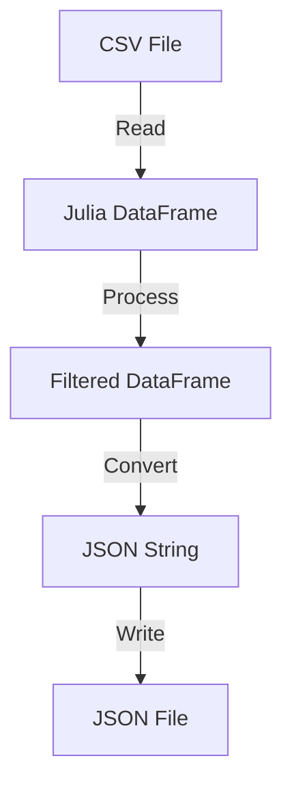

## 6.10.3 Working with CSV, JSON, and Other Data Formats

In the world of data-driven applications, the ability to efficiently handle various data formats is crucial. Julia, with its rich ecosystem of packages, provides robust tools for working with popular data formats such as CSV, JSON, HDF5, Feather, and Parquet. In this section, we will explore how to leverage these tools to read, write, and manipulate data effectively in Julia.

### CSV.jl: High-Performance Parsing

CSV (Comma-Separated Values) is one of the most common data formats used for data exchange. Julia's `CSV.jl` package is designed to handle CSV files efficiently, even when dealing with large datasets. Let's dive into how we can utilize `CSV.jl` for high-performance parsing.

#### Reading CSV Files

To read a CSV file in Julia, you first need to install the `CSV.jl` package. You can do this by running:

```julia
using Pkg
Pkg.add("CSV")
```

Once installed, you can read a CSV file using the `CSV.File` function:

```julia
using CSV
using DataFrames

df = CSV.File("data.csv") |> DataFrame

println(first(df, 5))
```

**Key Features:**
- **Multithreading:** `CSV.jl` supports multithreaded parsing, which can significantly speed up the reading process for large files.
- **Type Inference:** Automatically infers data types, but you can also specify types explicitly if needed.

#### Writing CSV Files

Writing data to a CSV file is straightforward with `CSV.jl`. Here's how you can do it:

```julia
CSV.write("output.csv", df)
```

**Customization Options:**
- **Delimiters:** You can specify different delimiters if your data is not comma-separated.
- **Header:** Choose whether to include headers in the output file.

#### Performance Considerations

When working with large datasets, consider the following tips to optimize performance:
- **Use Multithreading:** Enable multithreading by setting the `CSV.read` function's `threaded=true` option.
- **Chunking:** Process data in chunks if memory is a constraint.

### JSON.jl: Serialization/Deserialization

JSON (JavaScript Object Notation) is a lightweight data interchange format that is easy to read and write for humans and machines. Julia's `JSON.jl` package provides tools for parsing JSON strings into Julia objects and vice versa.

#### Parsing JSON Strings

To parse JSON data, you need to install the `JSON.jl` package:

```julia
using Pkg
Pkg.add("JSON")
```

Here's how you can parse a JSON string:

```julia
using JSON

json_str = """
{
  "name": "John Doe",
  "age": 30,
  "is_student": false
}
"""

data = JSON.parse(json_str)

println(data["name"])  # Output: John Doe
```

#### Serializing Julia Objects

You can also serialize Julia objects into JSON strings:

```julia
person = Dict("name" => "Jane Doe", "age" => 25, "is_student" => true)

json_output = JSON.json(person)

println(json_output)
```

**Use Cases:**
- **Configuration Files:** JSON is often used for storing configuration settings.
- **Data Interchange:** Easily exchange data between Julia and other systems.

### Other Formats: HDF5, Feather, and Parquet

Beyond CSV and JSON, Julia supports several other data formats that are particularly useful for handling large and complex datasets.

#### HDF5.jl: Handling Large Datasets

HDF5 (Hierarchical Data Format version 5) is a file format and set of tools for managing complex data. It is particularly well-suited for large datasets.

To work with HDF5 files, install the `HDF5.jl` package:

```julia
using Pkg
Pkg.add("HDF5")
```

Here's an example of reading and writing HDF5 files:

```julia
using HDF5

h5write("data.h5", "dataset1", rand(100, 100))

data = h5read("data.h5", "dataset1")

println(size(data))  # Output: (100, 100)
```

**Advantages:**
- **Hierarchical Structure:** Organize data in a tree-like structure.
- **Scalability:** Efficiently handle large datasets.

#### Feather.jl and Parquet.jl: Efficient Columnar Storage

Feather and Parquet are columnar storage formats that are optimized for big data processing.

**Feather.jl:**

```julia
using Pkg
Pkg.add("Feather")

using Feather

Feather.write("data.feather", df)

df_feather = Feather.read("data.feather")
```

**Parquet.jl:**

```julia
using Pkg
Pkg.add("Parquet")

using Parquet

Parquet.write("data.parquet", df)

df_parquet = Parquet.read("data.parquet")
```

**Benefits:**
- **Compression:** Both formats support compression, reducing storage space.
- **Interoperability:** Easily exchange data with systems like Apache Spark.

### Use Cases and Examples

#### Data Interchange

Julia's ability to handle multiple data formats makes it an excellent choice for data interchange between different systems. For example, you can read data from a CSV file, process it in Julia, and then export it to a JSON format for use in a web application.

```julia
df = CSV.File("data.csv") |> DataFrame

df_processed = filter(row -> row.age > 18, df)

json_data = JSON.json(df_processed)

open("output.json", "w") do file
    write(file, json_data)
end
```

#### Configuration Files

JSON and other formats are often used for configuration files in applications. Here's an example of reading and writing configuration settings in JSON:

```julia
config_str = read("config.json", String)
config = JSON.parse(config_str)

config["setting1"] = "new_value"

open("config.json", "w") do file
    write(file, JSON.json(config))
end
```

### Visualizing Data Flow

To better understand how data flows between different formats and systems, let's visualize the process using a Mermaid.js diagram.



**Diagram Explanation:**
- **CSV File:** The starting point where data is read into Julia.
- **Julia DataFrame:** Data is processed and filtered.
- **JSON String:** The processed data is converted into JSON format.
- **JSON File:** The final output is written to a JSON file.

### Try It Yourself

Experiment with the code examples provided. Try modifying the CSV and JSON data, and observe how the changes affect the output. Explore different options for reading and writing data, such as using different delimiters or compression settings.

### References and Links

- [CSV.jl Documentation](https://csv.juliadata.org/stable/)
- [JSON.jl Documentation](https://github.com/JuliaIO/JSON.jl)
- [HDF5.jl Documentation](https://github.com/JuliaIO/HDF5.jl)
- [Feather.jl Documentation](https://github.com/JuliaData/Feather.jl)
- [Parquet.jl Documentation](https://github.com/JuliaIO/Parquet.jl)

### Knowledge Check

- What are the advantages of using columnar storage formats like Feather and Parquet?
- How can you enable multithreading when reading CSV files in Julia?
- Why is JSON a popular choice for configuration files?

### Embrace the Journey

Remember, mastering data formats in Julia is a journey. As you progress, you'll find new ways to optimize and streamline your data processing workflows. Keep experimenting, stay curious, and enjoy the journey!

## Quiz Time!



### What package in Julia is used for high-performance CSV parsing?

- [x] CSV.jl
- [ ] JSON.jl
- [ ] HDF5.jl
- [ ] Feather.jl

> **Explanation:** CSV.jl is specifically designed for parsing CSV files efficiently in Julia.

### Which function is used to read a CSV file into a DataFrame in Julia?

- [x] CSV.File
- [ ] CSV.read
- [ ] CSV.parse
- [ ] CSV.load

> **Explanation:** CSV.File is used to read a CSV file into a DataFrame in Julia.

### What is the primary use of JSON.jl in Julia?

- [x] Serialization/Deserialization
- [ ] Data Visualization
- [ ] Machine Learning
- [ ] Numerical Computation

> **Explanation:** JSON.jl is used for parsing JSON strings into Julia objects and vice versa.

### Which data format is best suited for handling large, complex datasets in Julia?

- [x] HDF5
- [ ] CSV
- [ ] JSON
- [ ] XML

> **Explanation:** HDF5 is designed for managing large, complex datasets efficiently.

### What is a key benefit of using columnar storage formats like Feather and Parquet?

- [x] Efficient data compression
- [ ] Easy human readability
- [ ] Simple syntax
- [ ] Fast parsing of JSON

> **Explanation:** Columnar storage formats like Feather and Parquet offer efficient data compression, making them suitable for big data processing.

### How can you enable multithreading when reading CSV files in Julia?

- [x] Set the `threaded=true` option in CSV.read
- [ ] Use the `multithread` function
- [ ] Set the `parallel=true` option in CSV.File
- [ ] Use the `@parallel` macro

> **Explanation:** Enabling multithreading in CSV.read by setting `threaded=true` can significantly speed up the reading process for large files.

### What is a common use case for JSON in Julia applications?

- [x] Configuration files
- [ ] Image processing
- [ ] Numerical simulations
- [ ] Graph plotting

> **Explanation:** JSON is often used for storing configuration settings in applications.

### Which package is used for handling HDF5 files in Julia?

- [x] HDF5.jl
- [ ] JSON.jl
- [ ] CSV.jl
- [ ] Feather.jl

> **Explanation:** HDF5.jl is the package used for handling HDF5 files in Julia.

### What is the advantage of using JSON for data interchange?

- [x] Easy to read and write for humans and machines
- [ ] High data compression
- [ ] Fast numerical computation
- [ ] Built-in data visualization

> **Explanation:** JSON is a lightweight data interchange format that is easy to read and write for both humans and machines.

### True or False: Feather and Parquet are row-based storage formats.

- [ ] True
- [x] False

> **Explanation:** Feather and Parquet are columnar storage formats, not row-based.


