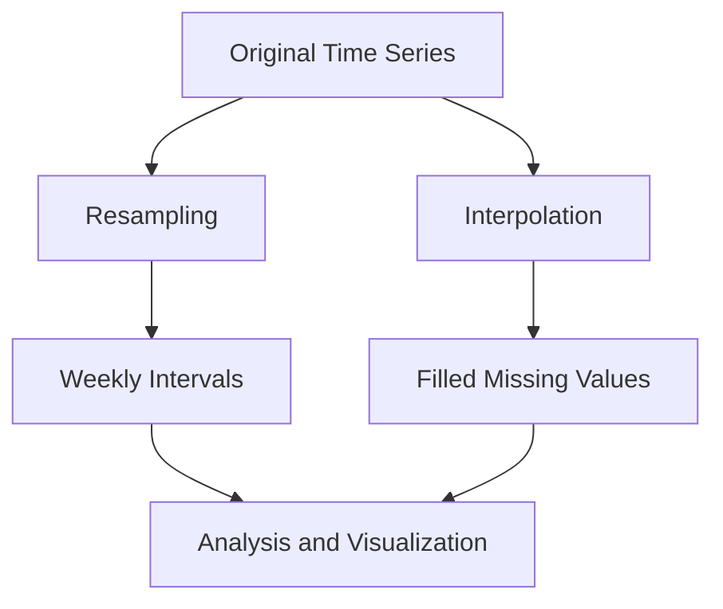

## 6.10.4 Handling Time Series and Temporal Data

Time series data is ubiquitous in various domains, from finance and economics to environmental monitoring and IoT applications. Julia, with its powerful packages and efficient handling of numerical data, provides robust tools for working with time series and temporal data. In this section, we will explore how to effectively manage, analyze, and visualize time series data using Julia's ecosystem.

### Introduction to Time Series Data

Time series data consists of observations collected sequentially over time. Each observation is associated with a timestamp, making it crucial to handle both the data values and their temporal context. Common operations on time series data include resampling, interpolation, and forecasting.

### TimeSeries.jl: Dedicated Time Series Data Structures

**TimeSeries.jl** is a Julia package specifically designed for handling time series data. It provides efficient data structures and functions for manipulating time-stamped data.

#### Key Features of TimeSeries.jl

- **Efficient Storage**: TimeSeries.jl offers a `TimeArray` type that efficiently stores time series data with associated timestamps.
- **Data Manipulation**: It supports various operations such as slicing, joining, and aligning time series.
- **Time-Based Indexing**: You can easily access data points using time-based indices.

#### Creating a Time Series with TimeSeries.jl

Let's start by creating a simple time series using TimeSeries.jl:

```julia
using TimeSeries, Dates

dates = DateTime(2024, 1, 1):Day(1):DateTime(2024, 1, 10)

data = rand(10)

time_series = TimeArray(dates, data, ["Value"])

println(time_series)
```

In this example, we create a `TimeArray` with daily timestamps and random data values. The `TimeArray` structure allows for efficient storage and manipulation of time series data.

### Date and Time Functions in Julia

Julia's `Dates` standard library provides essential functions for working with dates and times. It includes types such as `Date`, `DateTime`, and various time periods like `Day`, `Hour`, and `Minute`.

#### Working with Dates and DateTimes

```julia
using Dates

date = Date(2024, 11, 17)

datetime = DateTime(2024, 11, 17, 14, 30)

next_week = date + Day(7)

earlier_time = datetime - Hour(3)

println("Date: $date, DateTime: $datetime")
println("Next Week: $next_week, Earlier Time: $earlier_time")
```

The `Dates` library allows you to perform arithmetic operations on dates and times, making it easy to manipulate temporal data.

### Operations and Analysis on Time Series

Time series analysis often involves resampling, interpolation, and forecasting. Let's explore these operations in detail.

#### Resampling Time Series Data

Resampling involves aggregating data into different time intervals. This is useful for reducing data granularity or aligning data from different sources.

```julia
using TimeSeries

weekly_series = resample(time_series, "1W", mean)

println(weekly_series)
```

In this example, we resample the time series to weekly intervals using the mean as the aggregation function.

#### Interpolation and Forecasting

Interpolation fills missing values in a time series, while forecasting predicts future data points based on historical trends.

```julia
using TimeSeries, Interpolations

dates = DateTime(2024, 1, 1):Day(1):DateTime(2024, 1, 10)
data = [1.0, 2.0, missing, 4.0, 5.0, missing, 7.0, 8.0, 9.0, 10.0]
time_series = TimeArray(dates, data, ["Value"])

interpolated_series = interpolate(time_series, CubicSpline())

println(interpolated_series)
```

In this example, we use cubic spline interpolation to fill missing values in a time series.

### Use Cases and Examples

Time series data is prevalent in various fields. Let's explore some common use cases.

#### Financial Data Analysis

Financial data, such as stock prices and economic indicators, is often represented as time series. Julia's time series tools can efficiently process and analyze such data.

```julia
using TimeSeries

dates = DateTime(2024, 1, 1):Day(1):DateTime(2024, 1, 10)
prices = [100.0, 101.5, 102.0, 103.0, 104.5, 105.0, 106.0, 107.5, 108.0, 109.0]
stock_series = TimeArray(dates, prices, ["Price"])

returns = diff(stock_series) ./ lag(stock_series, 1)

println(returns)
```

This example demonstrates how to calculate daily returns from stock price data.

#### Sensor Data Processing

IoT devices often generate time-stamped sensor data. Julia's time series capabilities can handle and analyze this data efficiently.

```julia
using TimeSeries

dates = DateTime(2024, 1, 1):Hour(1):DateTime(2024, 1, 24)
sensor_data = rand(24)
sensor_series = TimeArray(dates, sensor_data, ["Temperature"])

daily_avg = resample(sensor_series, "1D", mean)

println(daily_avg)
```

In this example, we simulate hourly temperature data from a sensor and resample it to daily averages.

### Visualizing Time Series Data

Visualizing time series data is crucial for understanding trends and patterns. Julia offers several packages for creating informative plots.

#### Plotting with Plots.jl

```julia
using Plots, TimeSeries

plot(time_series, title="Time Series Plot", xlabel="Date", ylabel="Value")
```

This simple example demonstrates how to plot a time series using Plots.jl.

### Try It Yourself

Experiment with the code examples provided in this section. Try modifying the time intervals, aggregation functions, or interpolation methods to see how they affect the results. Explore different visualization options to gain insights into your time series data.

### Visualizing Time Series Operations

To better understand the operations on time series data, let's visualize the process of resampling and interpolation using a flowchart.



**Figure 1**: This flowchart illustrates the process of resampling and interpolating a time series, leading to analysis and visualization.

### References and Further Reading

- [TimeSeries.jl Documentation](https://github.com/JuliaStats/TimeSeries.jl)
- [Dates Standard Library](https://docs.julialang.org/en/v1/stdlib/Dates/)
- [Interpolations.jl](https://github.com/JuliaMath/Interpolations.jl)

### Knowledge Check

- What is the purpose of resampling in time series analysis?
- How can you fill missing values in a time series?
- What are some common use cases for time series data?

### Embrace the Journey

Remember, mastering time series analysis in Julia is a journey. As you explore more complex datasets and techniques, you'll gain deeper insights into temporal data. Keep experimenting, stay curious, and enjoy the process!

## Quiz Time!



### What is a key feature of TimeSeries.jl?

- [x] Efficient storage of time-stamped data
- [ ] Built-in machine learning models
- [ ] Automatic data visualization
- [ ] Real-time data streaming

> **Explanation:** TimeSeries.jl provides efficient storage and manipulation of time-stamped data using the `TimeArray` type.

### Which Julia library provides functions for working with dates and times?

- [x] Dates
- [ ] TimeSeries.jl
- [ ] Plots.jl
- [ ] Interpolations.jl

> **Explanation:** The `Dates` standard library in Julia provides essential functions for working with dates and times.

### What is the purpose of resampling in time series analysis?

- [x] Aggregating data into different time intervals
- [ ] Filling missing values
- [ ] Predicting future data points
- [ ] Visualizing data trends

> **Explanation:** Resampling involves aggregating data into different time intervals, which can help in reducing data granularity or aligning data from different sources.

### How can you fill missing values in a time series?

- [x] Interpolation
- [ ] Resampling
- [ ] Forecasting
- [ ] Aggregation

> **Explanation:** Interpolation is used to fill missing values in a time series by estimating the missing data points based on existing data.

### Which package is used for plotting time series data in Julia?

- [x] Plots.jl
- [ ] TimeSeries.jl
- [ ] Dates
- [ ] Interpolations.jl

> **Explanation:** Plots.jl is a popular package in Julia for creating various types of plots, including time series plots.

### What is a common use case for time series data?

- [x] Financial data analysis
- [ ] Image processing
- [ ] Text mining
- [ ] Natural language processing

> **Explanation:** Financial data analysis, such as processing stock prices and economic indicators, is a common use case for time series data.

### What type of data structure does TimeSeries.jl provide?

- [x] TimeArray
- [ ] DataFrame
- [ ] Matrix
- [ ] Vector

> **Explanation:** TimeSeries.jl provides the `TimeArray` data structure for efficient storage and manipulation of time series data.

### What is the result of resampling a time series to weekly intervals?

- [x] Aggregated data at weekly intervals
- [ ] Interpolated missing values
- [ ] Predicted future data points
- [ ] Visualized data trends

> **Explanation:** Resampling a time series to weekly intervals results in aggregated data at weekly intervals, often using a specified aggregation function like mean or sum.

### Which function is used to create a DateTime object in Julia?

- [x] DateTime()
- [ ] Date()
- [ ] Time()
- [ ] Timestamp()

> **Explanation:** The `DateTime()` function is used to create a DateTime object in Julia, representing a specific date and time.

### True or False: Interpolation can be used for forecasting future data points in a time series.

- [ ] True
- [x] False

> **Explanation:** Interpolation is used to fill missing values within the existing data range, not for forecasting future data points.


