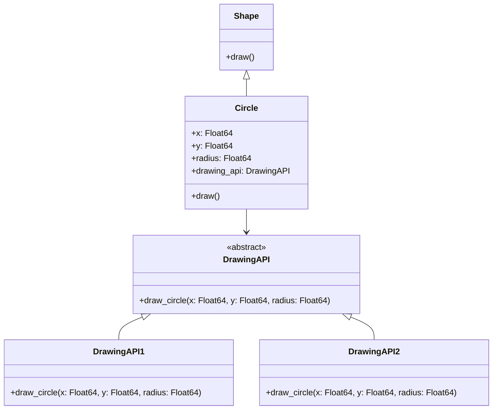

## 6.2 Bridge Pattern for Decoupling Abstraction and Implementation

In the realm of software design, achieving flexibility and scalability often requires a thoughtful approach to how components are structured and interact. The Bridge Pattern is a structural design pattern that plays a crucial role in decoupling abstraction from implementation, allowing both to vary independently. This pattern is particularly useful in Julia, where the language's features such as multiple dispatch and abstract types can be leveraged to implement the Bridge Pattern effectively.

### Definition

The Bridge Pattern is defined as a design pattern that separates an abstraction from its implementation so that the two can evolve independently. This separation promotes loose coupling, making it easier to extend and maintain the codebase. By decoupling the abstraction from its implementation, developers can introduce new abstractions and implementations without affecting each other.

### Key Concepts

- **Abstraction**: Represents the high-level control layer of the application. It defines the interface for the client.
- **Implementation**: Contains the low-level operations that the abstraction relies on. It is often represented by an interface or abstract class.
- **Bridge**: Acts as an intermediary that connects the abstraction to the implementation, allowing them to vary independently.

### Implementing Bridge Pattern in Julia

Julia's type system and multiple dispatch capabilities make it an excellent choice for implementing the Bridge Pattern. Let's explore how we can achieve this using abstract types, subtypes, and composition.

#### Abstract Types and Subtypes

In Julia, abstract types are used to define a hierarchy of types. They serve as a blueprint for concrete types that inherit from them. Here's how you can define abstract types and subtypes to represent the abstraction and implementation:

```julia
abstract type Shape end

abstract type DrawingAPI end

struct DrawingAPI1 <: DrawingAPI
    function draw_circle(x::Float64, y::Float64, radius::Float64)
        println("API1.circle at ($x, $y) with radius $radius")
    end
end

struct DrawingAPI2 <: DrawingAPI
    function draw_circle(x::Float64, y::Float64, radius::Float64)
        println("API2.circle at ($x, $y) with radius $radius")
    end
end

struct Circle <: Shape
    x::Float64
    y::Float64
    radius::Float64
    drawing_api::DrawingAPI

    function Circle(x, y, radius, drawing_api)
        new(x, y, radius, drawing_api)
    end

    function draw(circle::Circle)
        draw_circle(circle.drawing_api, circle.x, circle.y, circle.radius)
    end
end
```

In this example, `Shape` is the abstract type representing the abstraction, and `DrawingAPI` is the abstract type for the implementation. `DrawingAPI1` and `DrawingAPI2` are concrete implementations of the `DrawingAPI`. The `Circle` struct acts as the bridge, connecting the abstraction (`Shape`) with the implementation (`DrawingAPI`).

#### Composition Over Inheritance

The Bridge Pattern favors composition over inheritance. In the example above, the `Circle` struct composes a `DrawingAPI` object, allowing the abstraction to use different implementations without being tightly coupled to any specific one.

### Use Cases and Examples

The Bridge Pattern is applicable in various scenarios where abstraction and implementation need to evolve independently. Let's explore some common use cases:

#### Cross-Platform GUI Frameworks

In cross-platform GUI frameworks, the Bridge Pattern can be used to separate the GUI representation from the underlying platform-specific implementation. This allows developers to create a unified interface for the GUI while supporting multiple platforms.

```julia
abstract type GUIComponent end

abstract type PlatformAPI end

struct WindowsAPI <: PlatformAPI
    function render_button()
        println("Rendering button on Windows")
    end
end

struct MacOSAPI <: PlatformAPI
    function render_button()
        println("Rendering button on macOS")
    end
end

struct Button <: GUIComponent
    platform_api::PlatformAPI

    function Button(platform_api)
        new(platform_api)
    end

    function render(button::Button)
        render_button(button.platform_api)
    end
end

windows_button = Button(WindowsAPI())
macos_button = Button(MacOSAPI())

render(windows_button)  # Output: Rendering button on Windows
render(macos_button)    # Output: Rendering button on macOS
```

In this example, the `Button` component acts as the abstraction, while `WindowsAPI` and `MacOSAPI` are the platform-specific implementations. The Bridge Pattern allows the `Button` to render itself on different platforms without being tightly coupled to any specific implementation.

#### Database Connectivity

Another common use case for the Bridge Pattern is in database connectivity. By abstracting database operations, developers can work with different database engines seamlessly.

```julia
abstract type Database end

abstract type DatabaseEngine end

struct PostgreSQLEngine <: DatabaseEngine
    function connect()
        println("Connecting to PostgreSQL database")
    end
end

struct MySQLEngine <: DatabaseEngine
    function connect()
        println("Connecting to MySQL database")
    end
end

struct DatabaseConnection <: Database
    engine::DatabaseEngine

    function DatabaseConnection(engine)
        new(engine)
    end

    function connect(db::DatabaseConnection)
        connect(db.engine)
    end
end

postgres_connection = DatabaseConnection(PostgreSQLEngine())
mysql_connection = DatabaseConnection(MySQLEngine())

connect(postgres_connection)  # Output: Connecting to PostgreSQL database
connect(mysql_connection)     # Output: Connecting to MySQL database
```

In this example, `DatabaseConnection` acts as the abstraction, while `PostgreSQLEngine` and `MySQLEngine` are the concrete implementations. The Bridge Pattern allows the `DatabaseConnection` to connect to different database engines without being tightly coupled to any specific one.

### Design Considerations

When implementing the Bridge Pattern in Julia, consider the following:

- **Flexibility**: The Bridge Pattern provides flexibility by allowing abstraction and implementation to vary independently. This makes it easier to introduce new abstractions and implementations without affecting existing code.
- **Complexity**: While the Bridge Pattern promotes flexibility, it can also introduce complexity. Ensure that the added complexity is justified by the need for flexibility.
- **Performance**: Consider the performance implications of using the Bridge Pattern, especially if the abstraction and implementation involve expensive operations.

### Differences and Similarities

The Bridge Pattern is often confused with the Adapter Pattern. While both patterns involve decoupling, they serve different purposes:

- **Bridge Pattern**: Focuses on decoupling abstraction from implementation, allowing both to vary independently.
- **Adapter Pattern**: Focuses on converting the interface of a class into another interface that clients expect, enabling classes to work together that otherwise couldn't due to incompatible interfaces.

### Try It Yourself

To deepen your understanding of the Bridge Pattern, try modifying the code examples provided:

- **Experiment with Different Implementations**: Add new implementations for the `DrawingAPI`, `PlatformAPI`, or `DatabaseEngine` and observe how the abstraction remains unaffected.
- **Extend the Abstraction**: Introduce new abstractions, such as `Rectangle` or `Checkbox`, and implement them using the existing implementations.
- **Optimize Performance**: Consider the performance implications of your implementation and explore ways to optimize it.

### Visualizing the Bridge Pattern

To better understand the Bridge Pattern, let's visualize the relationship between the abstraction and implementation using a class diagram:



**Diagram Description**: This class diagram illustrates the Bridge Pattern, where `Shape` is the abstract type, `Circle` is the concrete abstraction, and `DrawingAPI` is the abstract implementation. `DrawingAPI1` and `DrawingAPI2` are concrete implementations of `DrawingAPI`. The `Circle` class acts as the bridge, connecting the abstraction to the implementation.

### Knowledge Check

Before we conclude, let's reinforce our understanding of the Bridge Pattern with a few questions:

- What is the primary purpose of the Bridge Pattern?
- How does the Bridge Pattern promote loose coupling?
- What are some common use cases for the Bridge Pattern?
- How does the Bridge Pattern differ from the Adapter Pattern?

### Embrace the Journey

Remember, mastering design patterns is a journey. As you continue to explore and apply the Bridge Pattern in your Julia projects, you'll gain a deeper understanding of how to design flexible and scalable software. Keep experimenting, stay curious, and enjoy the journey!

## Quiz Time!



### What is the primary purpose of the Bridge Pattern?

- [x] To separate abstraction from implementation
- [ ] To convert one interface into another
- [ ] To provide a way to create objects
- [ ] To define a family of algorithms

> **Explanation:** The Bridge Pattern is designed to separate abstraction from implementation, allowing both to vary independently.

### How does the Bridge Pattern promote loose coupling?

- [x] By decoupling abstraction from implementation
- [ ] By using inheritance to share behavior
- [ ] By converting interfaces
- [ ] By encapsulating object creation

> **Explanation:** The Bridge Pattern promotes loose coupling by decoupling abstraction from implementation, allowing changes in one to not affect the other.

### Which of the following is a common use case for the Bridge Pattern?

- [x] Cross-platform GUI frameworks
- [ ] Sorting algorithms
- [ ] Singleton objects
- [ ] Data serialization

> **Explanation:** Cross-platform GUI frameworks are a common use case for the Bridge Pattern, as it allows the GUI to be separated from platform-specific implementations.

### How does the Bridge Pattern differ from the Adapter Pattern?

- [x] Bridge separates abstraction from implementation; Adapter converts interfaces
- [ ] Bridge converts interfaces; Adapter separates abstraction from implementation
- [ ] Both patterns serve the same purpose
- [ ] Bridge is used for object creation

> **Explanation:** The Bridge Pattern separates abstraction from implementation, while the Adapter Pattern converts interfaces to make them compatible.

### In Julia, which feature is particularly useful for implementing the Bridge Pattern?

- [x] Abstract types and multiple dispatch
- [ ] Macros and metaprogramming
- [ ] Type inference
- [ ] Garbage collection

> **Explanation:** Abstract types and multiple dispatch in Julia are particularly useful for implementing the Bridge Pattern, as they allow for flexible and decoupled design.

### What is the role of the 'bridge' in the Bridge Pattern?

- [x] To connect abstraction to implementation
- [ ] To convert interfaces
- [ ] To create objects
- [ ] To define algorithms

> **Explanation:** The 'bridge' in the Bridge Pattern connects the abstraction to the implementation, allowing them to vary independently.

### Which of the following is NOT a benefit of using the Bridge Pattern?

- [ ] Flexibility
- [ ] Scalability
- [x] Increased complexity
- [ ] Loose coupling

> **Explanation:** While the Bridge Pattern offers flexibility, scalability, and loose coupling, it can also introduce increased complexity, which is not a benefit.

### What is a potential drawback of the Bridge Pattern?

- [x] Increased complexity
- [ ] Tight coupling
- [ ] Lack of flexibility
- [ ] Limited scalability

> **Explanation:** A potential drawback of the Bridge Pattern is increased complexity due to the separation of abstraction and implementation.

### Which of the following best describes the Bridge Pattern?

- [x] A structural pattern that separates abstraction from implementation
- [ ] A creational pattern that defines object creation
- [ ] A behavioral pattern that defines object interaction
- [ ] A pattern for converting interfaces

> **Explanation:** The Bridge Pattern is a structural pattern that separates abstraction from implementation, allowing both to vary independently.

### True or False: The Bridge Pattern is often used to create objects.

- [ ] True
- [x] False

> **Explanation:** False. The Bridge Pattern is not primarily used for object creation; it is used to separate abstraction from implementation.


