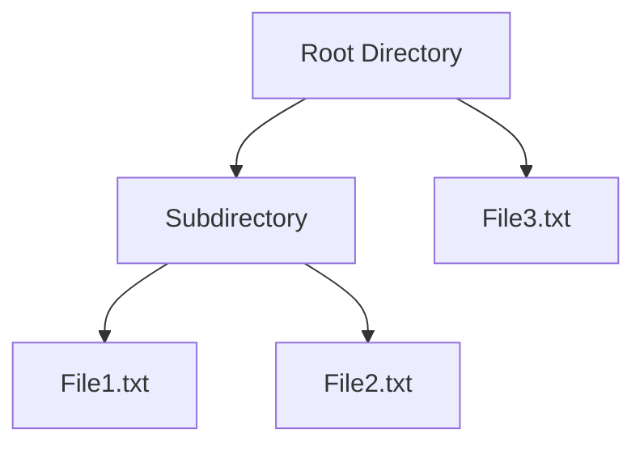

## 6.3 Composite Pattern with Recursive Data Structures

The Composite Pattern is a structural design pattern that enables you to compose objects into tree-like structures to represent part-whole hierarchies. This pattern allows clients to treat individual objects and compositions of objects uniformly, simplifying the client code and enhancing flexibility. In Julia, the Composite Pattern can be effectively implemented using recursive data structures, unified interfaces, and parametric types.

### Definition

- **Composes objects into tree structures** to represent part-whole hierarchies.
- **Allows clients to treat individual objects and compositions uniformly**, providing a consistent interface for both.

### Implementing Composite Pattern in Julia

#### Recursive Types

In Julia, recursive types are a powerful way to implement the Composite Pattern. By defining structs that can contain instances of themselves, you can create flexible and scalable data structures.

```julia
abstract type FileSystem end

struct File <: FileSystem
    name::String
    size::Int
end

struct Directory <: FileSystem
    name::String
    contents::Vector{FileSystem}
end
```

In this example, we define an abstract type `FileSystem` and two concrete types, `File` and `Directory`. The `Directory` type contains a vector of `FileSystem` instances, allowing it to hold both files and other directories.

#### Unified Interfaces

To treat individual objects and compositions uniformly, implement methods that operate on both single elements and composites. This can be achieved by defining functions that work with the abstract type and dispatching them based on the concrete type.

```julia
function total_size(fs::FileSystem)
    if fs isa File
        return fs.size
    elseif fs isa Directory
        return sum(total_size(item) for item in fs.contents)
    end
end
```

The `total_size` function calculates the total size of a `FileSystem` object. It checks if the object is a `File` or a `Directory` and performs the appropriate calculation, demonstrating how to handle both individual and composite objects uniformly.

#### Parametric Types

Parametric types in Julia allow you to handle different kinds of components within your composite structure. This is particularly useful when dealing with heterogeneous collections.

```julia
abstract type Expression{T} end

struct Constant{T} <: Expression{T}
    value::T
end

struct Sum{T} <: Expression{T}
    terms::Vector{Expression{T}}
end
```

Here, we define a parametric type `Expression{T}` with two concrete types: `Constant{T}` and `Sum{T}`. This setup allows for building expression trees where each node can be a constant or a sum of expressions.

### Use Cases and Examples

#### File System Hierarchies

The Composite Pattern is ideal for representing file system hierarchies, where directories can contain both files and other directories. This structure allows for operations like calculating total size, listing contents, or searching for files to be implemented uniformly across the hierarchy.

```julia
file1 = File("file1.txt", 100)
file2 = File("file2.txt", 200)
subdir = Directory("subdir", [file1, file2])
root = Directory("root", [subdir, File("file3.txt", 300)])

println("Total size: ", total_size(root))  # Output: Total size: 600
```

In this example, we create a simple file system hierarchy and calculate the total size using the `total_size` function.

#### Mathematical Expressions

Another common use case for the Composite Pattern is in building mathematical expression trees, which are useful for symbolic computations and evaluations.

```julia
function evaluate(expr::Expression{T}) where T
    if expr isa Constant
        return expr.value
    elseif expr isa Sum
        return sum(evaluate(term) for term in expr.terms)
    end
end

expr = Sum{Int}([Constant{Int}(5), Constant{Int}(10), Sum{Int}([Constant{Int}(3), Constant{Int}(2)])])
println("Expression value: ", evaluate(expr))  # Output: Expression value: 20
```

This example demonstrates how to build and evaluate a mathematical expression tree using the Composite Pattern.

### Visualizing the Composite Pattern

To better understand the Composite Pattern, let's visualize a simple file system hierarchy using a tree diagram.



**Diagram Description**: This diagram represents a file system hierarchy with a root directory containing a subdirectory and a file. The subdirectory further contains two files.

### Design Considerations

- **When to Use**: The Composite Pattern is ideal when you need to represent part-whole hierarchies and want to treat individual objects and compositions uniformly.
- **Performance**: Be mindful of performance implications when dealing with large hierarchies, as recursive operations can be costly.
- **Flexibility**: The pattern provides flexibility in adding new component types without altering existing code.

### Differences and Similarities

- **Similar Patterns**: The Composite Pattern is often confused with the Decorator Pattern, but while both involve tree-like structures, the Decorator Pattern focuses on adding responsibilities to objects dynamically.
- **Unique Features in Julia**: Julia's multiple dispatch and parametric types make it particularly well-suited for implementing the Composite Pattern, allowing for flexible and efficient designs.

### Try It Yourself

Experiment with the code examples provided by modifying the structures and methods. For instance, try adding a new type of expression, such as a `Product`, to the mathematical expression tree and implement the corresponding evaluation logic.

### References and Links

- [Design Patterns: Elements of Reusable Object-Oriented Software](https://en.wikipedia.org/wiki/Design_Patterns) - A foundational book on design patterns.
- [Julia Documentation](https://docs.julialang.org/en/v1/) - Official Julia documentation for further reading on types and multiple dispatch.

### Knowledge Check

- How does the Composite Pattern help in treating individual objects and compositions uniformly?
- What are the advantages of using recursive types in Julia for implementing the Composite Pattern?
- How can parametric types enhance the flexibility of composite structures?

### Embrace the Journey

Remember, mastering design patterns like the Composite Pattern is a journey. As you progress, you'll build more complex and efficient applications. Keep experimenting, stay curious, and enjoy the journey!

## Quiz Time!



### What is the primary purpose of the Composite Pattern?

- [x] To compose objects into tree structures to represent part-whole hierarchies.
- [ ] To add responsibilities to objects dynamically.
- [ ] To provide a way to create objects without specifying their concrete classes.
- [ ] To define a family of algorithms and make them interchangeable.

> **Explanation:** The Composite Pattern is used to compose objects into tree structures to represent part-whole hierarchies, allowing clients to treat individual objects and compositions uniformly.

### Which of the following is a key feature of recursive types in Julia?

- [x] They allow structs to contain instances of themselves.
- [ ] They enable dynamic method dispatch.
- [ ] They provide a way to encapsulate data and behavior.
- [ ] They are used to define immutable data structures.

> **Explanation:** Recursive types in Julia allow structs to contain instances of themselves, which is essential for implementing tree-like structures in the Composite Pattern.

### How do unified interfaces benefit the Composite Pattern?

- [x] They allow operations to be performed uniformly on both individual and composite objects.
- [ ] They enable the dynamic addition of responsibilities to objects.
- [ ] They provide a mechanism for creating objects without specifying their concrete classes.
- [ ] They facilitate the encapsulation of data and behavior.

> **Explanation:** Unified interfaces allow operations to be performed uniformly on both individual and composite objects, simplifying client code and enhancing flexibility.

### What role do parametric types play in the Composite Pattern?

- [x] They allow handling different kinds of components within a composite structure.
- [ ] They enable dynamic method dispatch.
- [ ] They provide a way to encapsulate data and behavior.
- [ ] They are used to define immutable data structures.

> **Explanation:** Parametric types allow handling different kinds of components within a composite structure, enhancing flexibility and reusability.

### In the provided file system example, what does the `total_size` function do?

- [x] It calculates the total size of a FileSystem object.
- [ ] It lists all files in a directory.
- [ ] It renames files and directories.
- [ ] It deletes files and directories.

> **Explanation:** The `total_size` function calculates the total size of a FileSystem object by summing the sizes of individual files and directories.

### Which of the following is a common use case for the Composite Pattern?

- [x] File system hierarchies
- [ ] Dynamic method dispatch
- [ ] Immutable data structures
- [ ] Encapsulation of data and behavior

> **Explanation:** File system hierarchies are a common use case for the Composite Pattern, as they naturally form tree-like structures with directories and files.

### How can you extend the mathematical expression example to include a `Product` type?

- [x] Define a new struct `Product` and implement the evaluation logic.
- [ ] Modify the `Constant` struct to include multiplication.
- [ ] Use dynamic method dispatch to handle products.
- [ ] Encapsulate multiplication behavior in the `Sum` struct.

> **Explanation:** To extend the example, define a new struct `Product` and implement the evaluation logic to handle multiplication in the expression tree.

### What is a potential performance consideration when using the Composite Pattern?

- [x] Recursive operations can be costly in large hierarchies.
- [ ] Dynamic method dispatch can slow down execution.
- [ ] Immutable data structures can lead to excessive memory usage.
- [ ] Encapsulation of data and behavior can increase complexity.

> **Explanation:** Recursive operations can be costly in large hierarchies, so it's important to consider performance implications when using the Composite Pattern.

### Which pattern is often confused with the Composite Pattern?

- [x] Decorator Pattern
- [ ] Factory Pattern
- [ ] Observer Pattern
- [ ] Strategy Pattern

> **Explanation:** The Composite Pattern is often confused with the Decorator Pattern, but they serve different purposes. The Decorator Pattern focuses on adding responsibilities to objects dynamically.

### True or False: Julia's multiple dispatch and parametric types make it particularly well-suited for implementing the Composite Pattern.

- [x] True
- [ ] False

> **Explanation:** True. Julia's multiple dispatch and parametric types provide flexibility and efficiency, making it well-suited for implementing the Composite Pattern.


