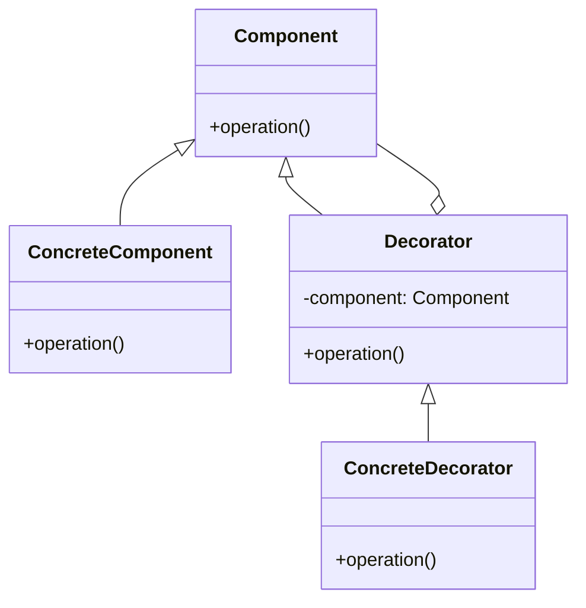

## 6.4 Decorator Pattern for Enhanced Functionality

The Decorator Pattern is a structural design pattern that allows behavior to be added to individual objects, either statically or dynamically, without affecting the behavior of other objects from the same class. This pattern is particularly useful in Julia due to its dynamic nature and powerful type system. In this section, we will explore how to implement the Decorator Pattern in Julia, leveraging its unique features such as multiple dispatch and function composition.

### Definition

- **Attaches additional responsibilities to an object dynamically**: The Decorator Pattern allows you to add new functionality to an object without altering its structure.
- **Provides a flexible alternative to subclassing for extending functionality**: Instead of creating a subclass for every possible combination of features, decorators can be used to mix and match features as needed.

### Implementing Decorator Pattern in Julia

Julia's flexibility and powerful features make it an excellent language for implementing the Decorator Pattern. Here, we will discuss three main approaches: wrapper types, function composition, and multiple dispatch.

#### Wrapper Types

Wrapper types are a common way to implement the Decorator Pattern. By creating a new type that wraps the original object, you can add or modify behavior without changing the original object's code.

```julia
struct Coffee
    description::String
    cost::Float64
end

function describe(coffee::Coffee)
    return coffee.description
end

function calculate_cost(coffee::Coffee)
    return coffee.cost
end

struct MilkDecorator
    coffee::Coffee
end

function describe(decorator::MilkDecorator)
    return describe(decorator.coffee) * " with milk"
end

function calculate_cost(decorator::MilkDecorator)
    return calculate_cost(decorator.coffee) + 0.5
end

basic_coffee = Coffee("Basic Coffee", 2.0)
milk_coffee = MilkDecorator(basic_coffee)

println(describe(milk_coffee))  # Output: Basic Coffee with milk
println(calculate_cost(milk_coffee))  # Output: 2.5
```

In this example, `MilkDecorator` is a wrapper type that adds milk to a `Coffee` object. The `describe` and `calculate_cost` functions are extended to handle the new type, demonstrating how additional functionality can be layered onto existing objects.

#### Function Composition

Function composition is another powerful technique in Julia that can be used to implement the Decorator Pattern. By composing functions, you can dynamically add behavior to existing functions.

```julia
function make_coffee()
    println("Making coffee")
end

function add_milk(f)
    return function()
        f()
        println("Adding milk")
    end
end

make_coffee_with_milk = add_milk(make_coffee)

make_coffee_with_milk()  # Output: Making coffee
                         #         Adding milk
```

In this example, `add_milk` is a decorator function that enhances the `make_coffee` function by adding milk. The composed function `make_coffee_with_milk` demonstrates how additional behavior can be added dynamically.

#### Multiple Dispatch

Julia's multiple dispatch system allows you to define new methods for existing functions that handle decorated types, providing a flexible way to implement the Decorator Pattern.

```julia
struct Tea
    description::String
    cost::Float64
end

function describe(tea::Tea)
    return tea.description
end

function calculate_cost(tea::Tea)
    return tea.cost
end

struct SugarDecorator
    tea::Tea
end

function describe(decorator::SugarDecorator)
    return describe(decorator.tea) * " with sugar"
end

function calculate_cost(decorator::SugarDecorator)
    return calculate_cost(decorator.tea) + 0.2
end

basic_tea = Tea("Basic Tea", 1.5)
sugar_tea = SugarDecorator(basic_tea)

println(describe(sugar_tea))  # Output: Basic Tea with sugar
println(calculate_cost(sugar_tea))  # Output: 1.7
```

In this example, `SugarDecorator` is a decorator type that adds sugar to a `Tea` object. The `describe` and `calculate_cost` functions are extended using multiple dispatch to handle the decorated type.

### Use Cases and Examples

The Decorator Pattern is versatile and can be applied in various scenarios. Here are a couple of common use cases:

#### Logging and Monitoring

Adding logging to function calls without modifying the original functions is a classic use case for the Decorator Pattern.

```julia
function process_data(data)
    println("Processing data: $data")
end

function log_decorator(f)
    return function(data)
        println("Logging: Starting process")
        f(data)
        println("Logging: Process completed")
    end
end

logged_process_data = log_decorator(process_data)

logged_process_data("Sample Data")  # Output: Logging: Starting process
                                    #         Processing data: Sample Data
                                    #         Logging: Process completed
```

In this example, `log_decorator` adds logging functionality to the `process_data` function, demonstrating how decorators can be used for monitoring purposes.

#### Input Validation

Wrapping input handlers to include validation steps dynamically is another practical application of the Decorator Pattern.

```julia
function handle_input(input)
    println("Handling input: $input")
end

function validate_decorator(f)
    return function(input)
        if isempty(input)
            println("Validation failed: Input is empty")
            return
        end
        f(input)
    end
end

validated_handle_input = validate_decorator(handle_input)

validated_handle_input("")  # Output: Validation failed: Input is empty
validated_handle_input("Valid Input")  # Output: Handling input: Valid Input
```

In this example, `validate_decorator` adds input validation to the `handle_input` function, showcasing how decorators can enhance input handling.

### Visualizing the Decorator Pattern

To better understand the Decorator Pattern, let's visualize it using a class diagram:



**Diagram Description**: This diagram illustrates the structure of the Decorator Pattern. The `Component` interface defines the operation, which is implemented by `ConcreteComponent`. The `Decorator` class holds a reference to a `Component` and extends its behavior. `ConcreteDecorator` provides the additional functionality.

### Design Considerations

When implementing the Decorator Pattern in Julia, consider the following:

- **Performance**: Decorators can introduce additional overhead, so use them judiciously in performance-critical applications.
- **Complexity**: While decorators provide flexibility, they can also increase complexity if overused. Aim for a balance between flexibility and simplicity.
- **Compatibility**: Ensure that decorators are compatible with the objects they wrap, especially when dealing with multiple decorators.

### Differences and Similarities

The Decorator Pattern is often confused with the Proxy Pattern, as both involve wrapping objects. However, the key difference is that decorators add behavior, while proxies control access. Understanding this distinction is crucial for applying the correct pattern in your designs.

### Try It Yourself

To deepen your understanding of the Decorator Pattern, try modifying the code examples provided:

- **Experiment with different decorators**: Create new decorators for the `Coffee` and `Tea` examples, such as `CaramelDecorator` or `VanillaDecorator`.
- **Combine multiple decorators**: Apply multiple decorators to a single object and observe the behavior.
- **Implement a real-world scenario**: Think of a real-world application where the Decorator Pattern could be beneficial and implement it in Julia.

### Embrace the Journey

Remember, mastering design patterns is a journey. As you explore the Decorator Pattern in Julia, you'll gain insights into how to enhance functionality dynamically and flexibly. Keep experimenting, stay curious, and enjoy the process of learning and applying these powerful concepts!

## Quiz Time!



### What is the primary purpose of the Decorator Pattern?

- [x] To attach additional responsibilities to an object dynamically
- [ ] To create a new subclass for each feature
- [ ] To control access to an object
- [ ] To simplify the interface of a complex system

> **Explanation:** The Decorator Pattern is used to add new functionality to an object dynamically without altering its structure.

### Which Julia feature is particularly useful for implementing the Decorator Pattern?

- [x] Multiple dispatch
- [ ] Single inheritance
- [ ] Static typing
- [ ] Garbage collection

> **Explanation:** Julia's multiple dispatch system allows for flexible method definitions, making it ideal for implementing decorators.

### What is a common use case for the Decorator Pattern?

- [x] Logging and monitoring
- [ ] Memory management
- [ ] Thread synchronization
- [ ] Data serialization

> **Explanation:** The Decorator Pattern is often used to add logging and monitoring functionality to existing functions.

### How does the Decorator Pattern differ from the Proxy Pattern?

- [x] Decorators add behavior, while proxies control access
- [ ] Decorators control access, while proxies add behavior
- [ ] Both patterns serve the same purpose
- [ ] Decorators are used for security, while proxies are not

> **Explanation:** Decorators enhance functionality, whereas proxies manage access to an object.

### What is a potential drawback of using decorators?

- [x] Increased complexity
- [ ] Reduced flexibility
- [ ] Limited scalability
- [ ] Incompatibility with existing systems

> **Explanation:** While decorators provide flexibility, they can also increase the complexity of the codebase if overused.

### In the provided example, what does the `MilkDecorator` do?

- [x] Adds milk to a Coffee object
- [ ] Removes milk from a Coffee object
- [ ] Adds sugar to a Coffee object
- [ ] Changes the type of Coffee object

> **Explanation:** The `MilkDecorator` adds milk to a `Coffee` object, enhancing its description and cost.

### Which technique is used in Julia to compose functions for the Decorator Pattern?

- [x] Function composition
- [ ] Class inheritance
- [ ] Interface implementation
- [ ] Static binding

> **Explanation:** Function composition in Julia allows for dynamic addition of behavior to existing functions.

### What is the role of a wrapper type in the Decorator Pattern?

- [x] To encapsulate the original object and add new behavior
- [ ] To replace the original object with a new one
- [ ] To simplify the interface of the original object
- [ ] To remove functionality from the original object

> **Explanation:** Wrapper types encapsulate the original object and allow for the addition or modification of behavior.

### What should be considered when implementing decorators in performance-critical applications?

- [x] Potential overhead introduced by decorators
- [ ] The number of decorators used
- [ ] The size of the original object
- [ ] The language version

> **Explanation:** Decorators can introduce additional overhead, which should be considered in performance-critical applications.

### True or False: The Decorator Pattern can only be used with object-oriented languages.

- [ ] True
- [x] False

> **Explanation:** The Decorator Pattern can be implemented in various programming paradigms, including functional and procedural, as demonstrated in Julia.


