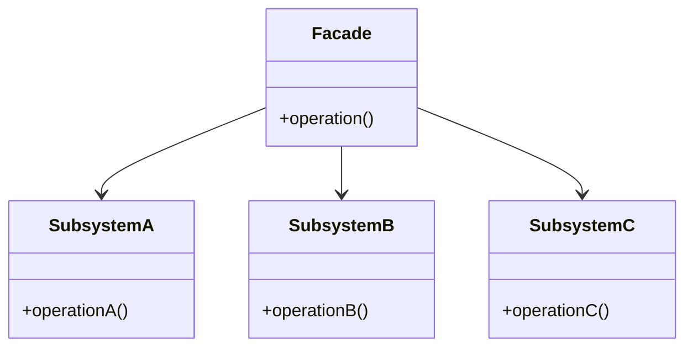

## 6.5 Facade Pattern for Simplified Interfaces

The Facade Pattern is a structural design pattern that provides a simplified interface to a complex subsystem. By encapsulating the complexity of the subsystem, the Facade Pattern makes it easier for clients to interact with the system without needing to understand its intricacies. This pattern is particularly useful in scenarios where a system is composed of multiple interdependent components, and a unified interface can streamline interactions.

### Definition

- **Unified Interface**: The Facade Pattern offers a single, unified interface to a set of interfaces in a subsystem.
- **Complexity Reduction**: It reduces the complexity of the subsystem, making it more accessible and easier to use.

### Implementing Facade Pattern in Julia

In Julia, the Facade Pattern can be effectively implemented using module encapsulation and high-level API functions. Let's explore these techniques in detail.

#### Module Encapsulation

Module encapsulation involves creating a module that re-exports selected functions from multiple modules. This approach allows you to present a cohesive API to the user while hiding the complexity of the underlying modules.

**Example:**

Suppose we have a complex mathematical library with multiple modules for different operations:

```julia
module Algebra
    export add, subtract

    function add(a, b)
        return a + b
    end

    function subtract(a, b)
        return a - b
    end
end

module Geometry
    export area_circle, area_square

    function area_circle(radius)
        return π * radius^2
    end

    function area_square(side)
        return side^2
    end
end
```

We can create a facade module that provides a simplified interface to these operations:

```julia
module MathFacade
    using ..Algebra, ..Geometry

    export add, subtract, area_circle, area_square

    # Re-export functions from Algebra and Geometry
    const add = Algebra.add
    const subtract = Algebra.subtract
    const area_circle = Geometry.area_circle
    const area_square = Geometry.area_square
end
```

With `MathFacade`, users can access mathematical operations without needing to know the details of the `Algebra` and `Geometry` modules.

#### High-Level API Functions

High-level API functions are concise functions that internally use complex subsystem functions. These functions abstract the complexity and provide a straightforward interface for common tasks.

**Example:**

Consider a data processing pipeline with multiple steps:

```julia
module DataProcessing
    export load_data, clean_data, analyze_data

    function load_data(file_path)
        # Load data from a file
        return read(file_path, String)
    end

    function clean_data(data)
        # Perform data cleaning
        return replace(data, r"\s+" => " ")
    end

    function analyze_data(data)
        # Analyze the cleaned data
        return length(data)
    end
end
```

We can create a facade function that simplifies the entire process:

```julia
module DataFacade
    using ..DataProcessing

    export process_data

    function process_data(file_path)
        data = DataProcessing.load_data(file_path)
        cleaned_data = DataProcessing.clean_data(data)
        result = DataProcessing.analyze_data(cleaned_data)
        return result
    end
end
```

The `process_data` function provides a high-level interface that abstracts the details of loading, cleaning, and analyzing data.

### Use Cases and Examples

The Facade Pattern is widely applicable in various scenarios. Let's explore some common use cases and examples.

#### Library Simplification

When dealing with complex libraries, such as machine learning frameworks, the Facade Pattern can provide a simple API that abstracts the complexity of the underlying components.

**Example:**

Consider a machine learning library with modules for data preprocessing, model training, and evaluation:

```julia
module MLPreprocessing
    export preprocess_data

    function preprocess_data(data)
        # Preprocess data for training
        return data
    end
end

module MLTraining
    export train_model

    function train_model(data)
        # Train a machine learning model
        return "model"
    end
end

module MLEvaluation
    export evaluate_model

    function evaluate_model(model, test_data)
        # Evaluate the trained model
        return "accuracy"
    end
end
```

We can create a facade module that simplifies the entire machine learning workflow:

```julia
module MLFacade
    using ..MLPreprocessing, ..MLTraining, ..MLEvaluation

    export run_pipeline

    function run_pipeline(data, test_data)
        preprocessed_data = MLPreprocessing.preprocess_data(data)
        model = MLTraining.train_model(preprocessed_data)
        accuracy = MLEvaluation.evaluate_model(model, test_data)
        return accuracy
    end
end
```

The `run_pipeline` function provides a straightforward interface for running the entire machine learning pipeline.

#### Subsystem Management

In systems with multiple components, such as data processing pipelines, the Facade Pattern can simplify interactions by providing a unified interface.

**Example:**

Consider a data processing system with modules for data ingestion, transformation, and storage:

```julia
module DataIngestion
    export ingest_data

    function ingest_data(source)
        # Ingest data from a source
        return "raw_data"
    end
end

module DataTransformation
    export transform_data

    function transform_data(raw_data)
        # Transform raw data
        return "transformed_data"
    end
end

module DataStorage
    export store_data

    function store_data(transformed_data)
        # Store transformed data
        return "stored_data"
    end
end
```

We can create a facade module that manages the entire data processing workflow:

```julia
module DataPipelineFacade
    using ..DataIngestion, ..DataTransformation, ..DataStorage

    export process_data_pipeline

    function process_data_pipeline(source)
        raw_data = DataIngestion.ingest_data(source)
        transformed_data = DataTransformation.transform_data(raw_data)
        stored_data = DataStorage.store_data(transformed_data)
        return stored_data
    end
end
```

The `process_data_pipeline` function provides a high-level interface for processing data from ingestion to storage.

### Visualizing the Facade Pattern

To better understand the Facade Pattern, let's visualize its structure using a class diagram.



**Diagram Description**: The Facade class provides a unified interface to the operations of SubsystemA, SubsystemB, and SubsystemC. Clients interact with the Facade class, which delegates requests to the appropriate subsystem components.

### Design Considerations

When implementing the Facade Pattern in Julia, consider the following:

- **When to Use**: Use the Facade Pattern when you need to simplify interactions with a complex subsystem or when you want to provide a unified interface to multiple components.
- **Encapsulation**: Ensure that the facade encapsulates the complexity of the subsystem and provides a clear and concise API.
- **Flexibility**: While the facade simplifies interactions, it should not limit the flexibility of accessing the underlying components when necessary.

### Differences and Similarities

The Facade Pattern is often confused with other structural patterns, such as the Adapter Pattern. Here are some key differences and similarities:

- **Facade vs. Adapter**: The Facade Pattern provides a simplified interface to a complex subsystem, while the Adapter Pattern converts the interface of a class into another interface that clients expect.
- **Facade vs. Proxy**: The Facade Pattern simplifies interactions with a subsystem, whereas the Proxy Pattern provides a surrogate or placeholder for another object to control access to it.

### Try It Yourself

To deepen your understanding of the Facade Pattern, try modifying the code examples provided. Here are some suggestions:

- **Extend the Facade**: Add additional functionality to the facade modules, such as logging or error handling.
- **Create a New Facade**: Implement a facade for a different subsystem, such as a web service client or a file processing system.
- **Experiment with Subsystems**: Modify the underlying subsystem modules to see how changes affect the facade.

### Knowledge Check

- **Question**: What is the primary purpose of the Facade Pattern?
- **Question**: How does module encapsulation help implement the Facade Pattern in Julia?
- **Question**: What are some common use cases for the Facade Pattern?

### Embrace the Journey

Remember, mastering design patterns is a journey. As you continue to explore and apply the Facade Pattern in your projects, you'll gain a deeper understanding of how to simplify complex systems and create more maintainable code. Keep experimenting, stay curious, and enjoy the journey!

## Quiz Time!



### What is the primary purpose of the Facade Pattern?

- [x] To provide a simplified interface to a complex subsystem
- [ ] To convert the interface of a class into another interface
- [ ] To provide a surrogate or placeholder for another object
- [ ] To encapsulate the details of a single class

> **Explanation:** The Facade Pattern is designed to provide a simplified interface to a complex subsystem, making it easier for clients to interact with the system.

### How does module encapsulation help implement the Facade Pattern in Julia?

- [x] By re-exporting selected functions from multiple modules
- [ ] By converting one interface into another
- [ ] By providing a surrogate for another object
- [ ] By encapsulating the details of a single class

> **Explanation:** Module encapsulation in Julia involves creating a module that re-exports selected functions from multiple modules, providing a unified interface.

### What is a common use case for the Facade Pattern?

- [x] Simplifying interactions with multi-component systems
- [ ] Converting the interface of a class into another interface
- [ ] Providing a surrogate for another object
- [ ] Encapsulating the details of a single class

> **Explanation:** A common use case for the Facade Pattern is simplifying interactions with multi-component systems, such as data processing pipelines.

### Which pattern is often confused with the Facade Pattern?

- [x] Adapter Pattern
- [ ] Singleton Pattern
- [ ] Observer Pattern
- [ ] Strategy Pattern

> **Explanation:** The Adapter Pattern is often confused with the Facade Pattern, but they serve different purposes.

### What is the difference between the Facade and Adapter Patterns?

- [x] Facade simplifies interactions; Adapter converts interfaces
- [ ] Facade provides a surrogate; Adapter simplifies interactions
- [ ] Facade encapsulates details; Adapter provides a surrogate
- [ ] Facade converts interfaces; Adapter encapsulates details

> **Explanation:** The Facade Pattern simplifies interactions with a subsystem, while the Adapter Pattern converts the interface of a class into another interface.

### What is a key benefit of using the Facade Pattern?

- [x] Reducing complexity for the client
- [ ] Increasing the number of interfaces
- [ ] Providing a surrogate for another object
- [ ] Encapsulating the details of a single class

> **Explanation:** A key benefit of the Facade Pattern is reducing complexity for the client by providing a simplified interface.

### When should you consider using the Facade Pattern?

- [x] When you need to simplify interactions with a complex subsystem
- [ ] When you need to convert one interface into another
- [ ] When you need to provide a surrogate for another object
- [ ] When you need to encapsulate the details of a single class

> **Explanation:** Consider using the Facade Pattern when you need to simplify interactions with a complex subsystem.

### What is a potential drawback of the Facade Pattern?

- [x] It may limit flexibility in accessing underlying components
- [ ] It increases the complexity of the subsystem
- [ ] It requires converting interfaces
- [ ] It provides a surrogate for another object

> **Explanation:** A potential drawback of the Facade Pattern is that it may limit flexibility in accessing underlying components.

### How can you extend the functionality of a facade module?

- [x] By adding logging or error handling
- [ ] By converting interfaces
- [ ] By providing a surrogate for another object
- [ ] By encapsulating the details of a single class

> **Explanation:** You can extend the functionality of a facade module by adding features such as logging or error handling.

### True or False: The Facade Pattern is only applicable to object-oriented programming.

- [ ] True
- [x] False

> **Explanation:** False. The Facade Pattern is applicable in various programming paradigms, including functional and procedural programming, not just object-oriented programming.


