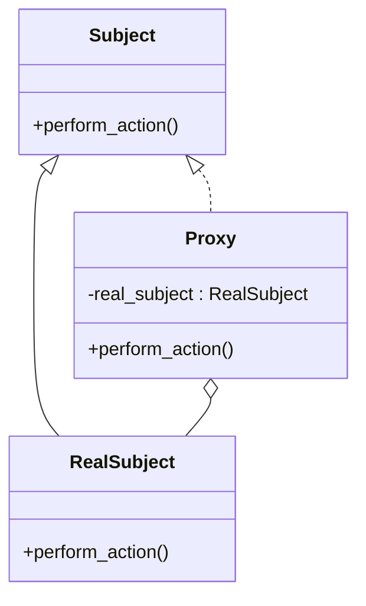

## 6.7 Proxy Pattern for Controlled Access

In the realm of software design, the Proxy Pattern stands out as a powerful structural pattern that provides a surrogate or placeholder for another object to control access to it. This pattern is particularly useful in scenarios where direct access to an object is either costly or needs to be controlled. In this section, we'll delve into the intricacies of the Proxy Pattern, its implementation in Julia, and its various use cases.

### Definition

The Proxy Pattern is a structural design pattern that involves creating a proxy object to act as an intermediary for another object. This proxy object can control access to the original object, adding a layer of indirection that can be used for various purposes such as lazy initialization, access control, logging, and more.

**Key Characteristics:**
- **Surrogate or Placeholder**: The proxy acts as a stand-in for the real object.
- **Controlled Access**: The proxy can control access to the real object, providing additional functionality such as authentication or logging.
- **Indirection Layer**: Adds a layer of indirection to manage complex interactions with the real object.

### Implementing Proxy Pattern in Julia

Julia, with its powerful type system and multiple dispatch capabilities, provides an excellent platform for implementing the Proxy Pattern. Let's explore how we can create proxy types and override methods to achieve controlled access.

#### Proxy Types

To implement a proxy in Julia, we start by defining a type that holds a reference to the real subject. This proxy type will implement the same interface as the real subject, allowing it to delegate calls to the actual object.

```julia
struct RealSubject
    data::String
end

function perform_action(subject::RealSubject)
    println("Performing action on: ", subject.data)
end

struct Proxy
    real_subject::RealSubject
end

function perform_action(proxy::Proxy)
    println("Proxy: Checking access before delegating.")
    # Delegate the call to the real subject
    perform_action(proxy.real_subject)
end
```

In this example, the `Proxy` type holds a reference to a `RealSubject` and implements the `perform_action` method. Before delegating the call to the real subject, it performs an access check, demonstrating how proxies can add control logic.

#### Method Overriding

Method overriding in the Proxy Pattern allows us to add control logic before delegating to the actual object. This is particularly useful for scenarios like logging, access control, or lazy initialization.

```julia
function perform_action(proxy::Proxy)
    println("Proxy: Logging access.")
    # Check if the real subject is initialized
    if proxy.real_subject === nothing
        println("Proxy: Initializing the real subject.")
        proxy.real_subject = RealSubject("Initialized Data")
    end
    # Delegate the call to the real subject
    perform_action(proxy.real_subject)
end
```

In this extended example, the proxy checks if the real subject is initialized before delegating the call, demonstrating lazy initialization.

### Use Cases and Examples

The Proxy Pattern is versatile and can be applied in various scenarios. Let's explore some common use cases and examples.

#### Lazy Initialization

Lazy initialization is a technique where the creation of a heavy resource is delayed until it is actually needed. This can be efficiently implemented using the Proxy Pattern.

```julia
struct LazyProxy
    real_subject::Union{RealSubject, Nothing}
end

function perform_action(proxy::LazyProxy)
    if proxy.real_subject === nothing
        println("LazyProxy: Initializing the real subject.")
        proxy.real_subject = RealSubject("Lazy Initialized Data")
    end
    perform_action(proxy.real_subject)
end

lazy_proxy = LazyProxy(nothing)
perform_action(lazy_proxy)
```

In this example, the `LazyProxy` initializes the `RealSubject` only when `perform_action` is called, demonstrating lazy initialization.

#### Access Control and Security

The Proxy Pattern can also be used to restrict access to sensitive objects based on user permissions. This is particularly useful in scenarios where security is a concern.

```julia
struct SecureProxy
    real_subject::RealSubject
    user_role::String
end

function perform_action(proxy::SecureProxy)
    if proxy.user_role != "admin"
        println("Access Denied: Insufficient permissions.")
        return
    end
    perform_action(proxy.real_subject)
end

secure_proxy = SecureProxy(RealSubject("Sensitive Data"), "guest")
perform_action(secure_proxy)
```

In this example, the `SecureProxy` checks the user's role before allowing access to the `RealSubject`, demonstrating access control.

### Visualizing the Proxy Pattern

To better understand the Proxy Pattern, let's visualize its structure using a class diagram.



**Diagram Description**: This class diagram illustrates the relationship between the `Subject`, `RealSubject`, and `Proxy`. The `Proxy` class implements the same interface as the `RealSubject` and holds a reference to it, allowing it to control access.

### Design Considerations

When implementing the Proxy Pattern in Julia, consider the following:

- **Performance Overhead**: Introducing a proxy adds an additional layer, which may impact performance. Ensure that the benefits of using a proxy outweigh the overhead.
- **Complexity**: While proxies can simplify certain interactions, they can also introduce complexity. Use proxies judiciously to avoid unnecessary complexity.
- **Security**: Proxies can enhance security by controlling access, but they should be implemented carefully to avoid introducing vulnerabilities.

### Differences and Similarities

The Proxy Pattern is often confused with other patterns such as the Decorator and Adapter patterns. Here's how they differ:

- **Proxy vs. Decorator**: While both patterns involve wrapping an object, the Proxy Pattern focuses on controlling access, whereas the Decorator Pattern adds additional behavior.
- **Proxy vs. Adapter**: The Adapter Pattern is used to make two incompatible interfaces compatible, while the Proxy Pattern controls access to an object.

### Try It Yourself

To deepen your understanding of the Proxy Pattern, try modifying the code examples to:

- Implement a proxy that logs every access to the real subject.
- Create a proxy that caches results from the real subject to improve performance.
- Experiment with different access control mechanisms in the `SecureProxy`.

### References and Links

For further reading on the Proxy Pattern and its applications, consider the following resources:

- [Design Patterns: Elements of Reusable Object-Oriented Software](https://en.wikipedia.org/wiki/Design_Patterns) - A foundational book on design patterns.
- [JuliaLang Documentation](https://docs.julialang.org/) - Official documentation for the Julia programming language.

### Knowledge Check

Before moving on, let's summarize the key takeaways:

- The Proxy Pattern provides a surrogate or placeholder for another object to control access.
- It can be used for lazy initialization, access control, logging, and more.
- Julia's type system and multiple dispatch make it well-suited for implementing proxies.

Remember, mastering design patterns like the Proxy Pattern is a journey. Keep experimenting, stay curious, and enjoy the process of learning and applying these patterns in your projects.

## Quiz Time!



### What is the primary purpose of the Proxy Pattern?

- [x] To control access to another object
- [ ] To add additional behavior to an object
- [ ] To make incompatible interfaces compatible
- [ ] To simplify complex interfaces

> **Explanation:** The Proxy Pattern is primarily used to control access to another object, providing a surrogate or placeholder for it.

### How does the Proxy Pattern differ from the Decorator Pattern?

- [x] Proxy controls access, Decorator adds behavior
- [ ] Proxy adds behavior, Decorator controls access
- [ ] Both patterns serve the same purpose
- [ ] Proxy simplifies interfaces, Decorator adapts interfaces

> **Explanation:** The Proxy Pattern controls access to an object, while the Decorator Pattern adds additional behavior to an object.

### In Julia, how can you implement a proxy type?

- [x] By defining a type that holds a reference to the real subject
- [ ] By creating a new interface for the proxy
- [ ] By using inheritance to extend the real subject
- [ ] By directly modifying the real subject's methods

> **Explanation:** A proxy type in Julia is implemented by defining a type that holds a reference to the real subject and implements the same interface.

### What is a common use case for the Proxy Pattern?

- [x] Lazy initialization
- [ ] Data serialization
- [ ] Interface adaptation
- [ ] Algorithm optimization

> **Explanation:** Lazy initialization is a common use case for the Proxy Pattern, where the creation of a resource is delayed until it is needed.

### Which of the following is a benefit of using the Proxy Pattern?

- [x] Controlled access to objects
- [ ] Increased performance
- [ ] Simplified code structure
- [ ] Reduced memory usage

> **Explanation:** The Proxy Pattern provides controlled access to objects, which can enhance security and manage resource usage.

### What is a potential drawback of using the Proxy Pattern?

- [x] Performance overhead
- [ ] Lack of flexibility
- [ ] Incompatibility with other patterns
- [ ] Difficulty in implementation

> **Explanation:** Introducing a proxy adds an additional layer, which may impact performance due to the overhead of the indirection.

### How can the Proxy Pattern enhance security?

- [x] By restricting access based on user permissions
- [ ] By encrypting data
- [ ] By reducing code complexity
- [ ] By optimizing algorithms

> **Explanation:** The Proxy Pattern can enhance security by restricting access to sensitive objects based on user permissions.

### What is the role of method overriding in the Proxy Pattern?

- [x] To add control logic before delegating to the real object
- [ ] To change the interface of the real object
- [ ] To simplify the real object's methods
- [ ] To improve the performance of the real object

> **Explanation:** Method overriding in the Proxy Pattern allows adding control logic before delegating calls to the real object.

### Which of the following is NOT a characteristic of the Proxy Pattern?

- [ ] Surrogate or placeholder
- [ ] Controlled access
- [ ] Indirection layer
- [x] Interface adaptation

> **Explanation:** Interface adaptation is not a characteristic of the Proxy Pattern; it is a feature of the Adapter Pattern.

### True or False: The Proxy Pattern and Adapter Pattern serve the same purpose.

- [ ] True
- [x] False

> **Explanation:** The Proxy Pattern and Adapter Pattern serve different purposes; the Proxy Pattern controls access, while the Adapter Pattern adapts interfaces.


