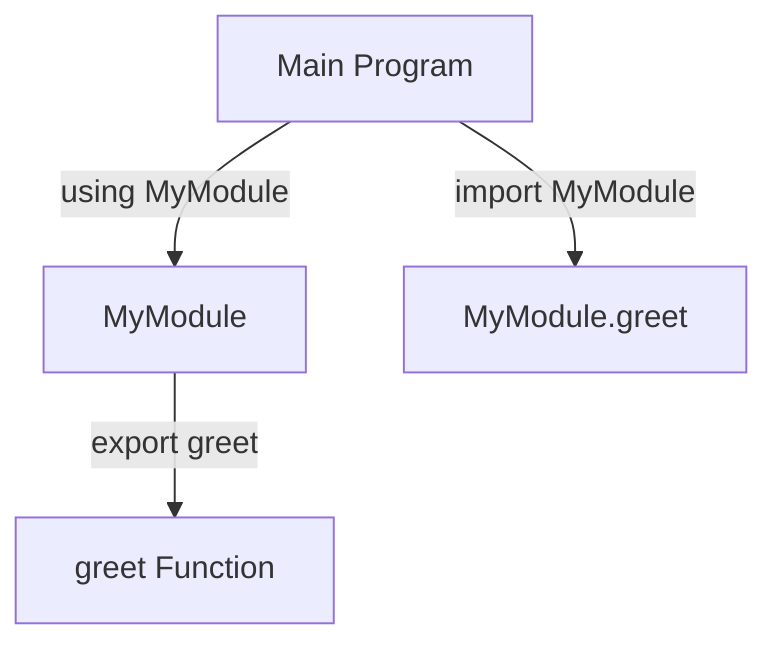

## 6.8 Module Pattern and Namespace Management

In the world of software development, organizing code efficiently is crucial for building scalable and maintainable applications. The Module Pattern and Namespace Management in Julia provide a robust mechanism to achieve this. By encapsulating functionality within modules, we can manage namespaces effectively, prevent naming conflicts, and control the visibility of functions and variables. This section will guide you through the concepts, implementation, and best practices of using modules in Julia.

### Definition

The Module Pattern in Julia is a design pattern that organizes code into modules to manage namespaces and prevent naming conflicts. It encapsulates functionality and controls the visibility of functions and variables, allowing developers to create well-structured and maintainable codebases.

### Implementing Module Pattern in Julia

#### Creating Modules

In Julia, a module is a separate namespace that can contain variables, functions, types, and other modules. To define a module, we use the `module` keyword followed by the module name. Here's a basic example:

```julia
module MyModule

function greet(name)
    println("Hello, $name!")
end

end # End of module
```

In this example, `MyModule` is a module that contains a single function `greet`. The module acts as a container, encapsulating the `greet` function within its namespace.

#### Exporting Symbols

By default, the functions and variables defined within a module are not accessible from outside the module. To make certain symbols accessible, we use the `export` keyword. This allows us to control what is visible to the outside world.

```julia
module MyModule

export greet

function greet(name)
    println("Hello, $name!")
end

end # End of module
```

With the `export` keyword, the `greet` function is now accessible to other parts of the program that use this module.

#### Importing Modules

To use a module in your code, you can include it using the `using` or `import` keywords. The `using` keyword imports the module and makes the exported symbols directly accessible, while `import` requires you to prefix the symbols with the module name.

```julia
using .MyModule

greet("Julia") # Directly accessible

import .MyModule

MyModule.greet("Julia") # Access with module prefix
```

The dot (`.`) before the module name indicates that the module is in the current scope or directory.

### Best Practices

#### Encapsulation

One of the key advantages of using modules is encapsulation. By keeping the internals of a module hidden unless explicitly exported, you can prevent unintended interactions between different parts of your code. This leads to more robust and maintainable applications.

#### Modular Design

Breaking down applications into logical modules is a best practice that enhances code organization. Each module should have a clear responsibility and encapsulate related functionality. This modular design approach makes it easier to manage large codebases and facilitates code reuse.

### Visualizing Module and Namespace Management

To better understand how modules and namespaces work in Julia, let's visualize the concept using a diagram.



**Diagram Description**: This diagram illustrates the relationship between the main program and the `MyModule`. The `using` keyword allows direct access to the `greet` function, while `import` requires using the module prefix.

### Code Examples

Let's explore a more comprehensive example that demonstrates the use of modules in a real-world scenario.

```julia
module MathOperations

export add, subtract

function add(x, y)
    return x + y
end

function subtract(x, y)
    return x - y
end

function multiply(x, y)
    return x * y
end

end # End of module

using .MathOperations

println(add(5, 3))      # Output: 8
println(subtract(5, 3)) # Output: 2

# println(multiply(5, 3)) # This will result in an error
```

In this example, the `MathOperations` module exports the `add` and `subtract` functions, making them accessible to the main program. The `multiply` function, however, is kept internal and is not accessible outside the module.

### Try It Yourself

To deepen your understanding, try modifying the code examples above. Here are some suggestions:

- Add a new function to the `MathOperations` module and export it.
- Create a new module that depends on `MathOperations` and uses its functions.
- Experiment with the `import` keyword and observe how it affects symbol accessibility.

### References and Links

For further reading on modules and namespace management in Julia, consider exploring the following resources:

- [Julia Documentation on Modules](https://docs.julialang.org/en/v1/manual/modules/)
- [JuliaLang GitHub Repository](https://github.com/JuliaLang/julia)
- [JuliaLang Discourse Community](https://discourse.julialang.org/)

### Knowledge Check

Let's reinforce what we've learned with some questions and exercises:

- What is the purpose of using modules in Julia?
- How does the `export` keyword affect symbol visibility?
- What is the difference between `using` and `import` when including a module?

### Embrace the Journey

Remember, mastering the Module Pattern and Namespace Management in Julia is just the beginning. As you progress, you'll build more complex and organized applications. Keep experimenting, stay curious, and enjoy the journey!

## Quiz Time!



### What is the primary purpose of using modules in Julia?

- [x] To organize code and manage namespaces
- [ ] To increase code execution speed
- [ ] To simplify syntax
- [ ] To reduce memory usage

> **Explanation:** Modules are used to organize code and manage namespaces, preventing naming conflicts and encapsulating functionality.

### How do you define a module in Julia?

- [x] Using the `module` keyword
- [ ] Using the `namespace` keyword
- [ ] Using the `package` keyword
- [ ] Using the `class` keyword

> **Explanation:** The `module` keyword is used to define a module in Julia, creating a separate namespace.

### What does the `export` keyword do in a module?

- [x] Makes certain symbols accessible outside the module
- [ ] Hides certain symbols from outside the module
- [ ] Deletes certain symbols from the module
- [ ] Renames certain symbols within the module

> **Explanation:** The `export` keyword makes specified symbols accessible outside the module, controlling visibility.

### Which keyword allows direct access to exported symbols from a module?

- [x] `using`
- [ ] `import`
- [ ] `include`
- [ ] `require`

> **Explanation:** The `using` keyword allows direct access to exported symbols from a module.

### What is the effect of using the `import` keyword with a module?

- [x] Requires prefixing symbols with the module name
- [ ] Allows direct access to all symbols
- [ ] Automatically exports all symbols
- [ ] Deletes the module after use

> **Explanation:** The `import` keyword requires prefixing symbols with the module name for access.

### Which of the following is a best practice when using modules?

- [x] Encapsulating functionality within modules
- [ ] Exporting all functions and variables
- [ ] Using global variables extensively
- [ ] Avoiding the use of modules

> **Explanation:** Encapsulating functionality within modules is a best practice for organization and maintainability.

### What is the benefit of breaking down applications into logical modules?

- [x] Enhances code organization and facilitates code reuse
- [ ] Increases code execution speed
- [ ] Simplifies syntax
- [ ] Reduces memory usage

> **Explanation:** Breaking down applications into logical modules enhances code organization and facilitates code reuse.

### How can you make a function within a module inaccessible from outside?

- [x] Do not use the `export` keyword for that function
- [ ] Use the `hide` keyword for that function
- [ ] Use the `private` keyword for that function
- [ ] Use the `lock` keyword for that function

> **Explanation:** By not using the `export` keyword, a function remains inaccessible from outside the module.

### What is the purpose of the dot (`.`) before a module name when using `using` or `import`?

- [x] Indicates the module is in the current scope or directory
- [ ] Denotes a private module
- [ ] Marks the module as deprecated
- [ ] Specifies a hidden module

> **Explanation:** The dot (`.`) before a module name indicates that the module is in the current scope or directory.

### True or False: The `multiply` function in the `MathOperations` module is accessible outside the module.

- [ ] True
- [x] False

> **Explanation:** The `multiply` function is not exported, so it is not accessible outside the `MathOperations` module.



By mastering the Module Pattern and Namespace Management in Julia, you are well on your way to building efficient, scalable, and maintainable applications. Keep exploring and applying these concepts to your projects!
