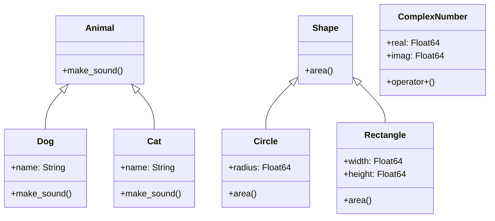

## 6.9 Extending Functions and Types with Julia's Type System

In the world of programming, flexibility and extensibility are key to building robust and maintainable software. Julia, with its powerful type system, offers developers the ability to extend functions and types seamlessly. This capability allows for the creation of custom behaviors and the integration of new types into existing libraries without altering the original code. In this section, we will explore how to leverage Julia's type system to extend functions and types, providing you with the tools to build more adaptable and efficient applications.

### Definition

Extending functions and types in Julia involves utilizing the language's ability to add new behaviors to existing functions and types. This is achieved through:

- **Method Overloading**: Defining new methods for existing functions that operate on different types.
- **Subtype Declaration**: Creating new types that are subtypes of existing abstract types.
- **Type Hierarchies**: Leveraging abstract types to establish relationships between types.

### Implementing Extensions in Julia

#### Method Overloading

Method overloading in Julia allows you to define multiple methods for the same function, each tailored to handle different types of arguments. This is a cornerstone of Julia's multiple dispatch system, enabling functions to behave differently based on the types of their inputs.

**Example: Overloading a Function**

Let's consider a simple example where we overload a function to handle different types of inputs:

```julia
function describe(x)
    println("This is a generic description.")
end

function describe(x::Int)
    println("This is an integer: $x")
end

function describe(x::String)
    println("This is a string: $x")
end

describe(42)       # Output: This is an integer: 42
describe("Julia")  # Output: This is a string: Julia
describe(3.14)     # Output: This is a generic description.
```

In this example, the `describe` function is overloaded to provide specific behavior for `Int` and `String` types, while falling back to a generic description for other types.

#### Subtype Declaration

Subtype declaration allows you to create new types that are subtypes of existing abstract types. This is useful for defining a hierarchy of types that share common behaviors.

**Example: Creating a Subtype**

```julia
abstract type Shape end

struct Circle <: Shape
    radius::Float64
end

struct Rectangle <: Shape
    width::Float64
    height::Float64
end

function area(s::Circle)
    return π * s.radius^2
end

function area(s::Rectangle)
    return s.width * s.height
end

c = Circle(5.0)
r = Rectangle(4.0, 6.0)

println("Area of circle: ", area(c))       # Output: Area of circle: 78.53981633974483
println("Area of rectangle: ", area(r))   # Output: Area of rectangle: 24.0
```

Here, we define an abstract type `Shape` and two concrete subtypes `Circle` and `Rectangle`. The `area` function is overloaded to compute the area for each specific shape.

#### Type Hierarchies

Type hierarchies in Julia allow you to organize types in a way that reflects their relationships. Abstract types serve as the foundation for these hierarchies, enabling polymorphic behavior across related types.

**Example: Leveraging Type Hierarchies**

```julia
abstract type Animal end

struct Dog <: Animal
    name::String
end

struct Cat <: Animal
    name::String
end

function make_sound(a::Dog)
    println("$a.name says: Woof!")
end

function make_sound(a::Cat)
    println("$a.name says: Meow!")
end

d = Dog("Buddy")
c = Cat("Whiskers")

make_sound(d)  # Output: Buddy says: Woof!
make_sound(c)  # Output: Whiskers says: Meow!
```

In this example, we define an abstract type `Animal` and concrete subtypes `Dog` and `Cat`. The `make_sound` function is overloaded to provide specific sounds for each animal type.

### Use Cases and Examples

#### Custom Numeric Types

One of the powerful applications of extending functions and types in Julia is the creation of custom numeric types. These types can integrate seamlessly with Julia's built-in mathematical functions, allowing for specialized numeric computations.

**Example: Defining a Custom Numeric Type**

```julia
struct ComplexNumber
    real::Float64
    imag::Float64
end

Base.:+(a::ComplexNumber, b::ComplexNumber) = ComplexNumber(a.real + b.real, a.imag + b.imag)

Base.show(io::IO, c::ComplexNumber) = print(io, "$(c.real) + $(c.imag)i")

c1 = ComplexNumber(3.0, 4.0)
c2 = ComplexNumber(1.0, 2.0)

println("Sum: ", c1 + c2)  # Output: Sum: 4.0 + 6.0i
```

In this example, we define a `ComplexNumber` type and overload the addition operator to handle complex number addition. We also customize the string representation to display complex numbers in a readable format.

#### Extending Libraries

Julia's type system allows you to extend existing libraries by adding methods to handle new types. This is particularly useful when you want to integrate custom types into third-party libraries without modifying their source code.

**Example: Extending a Library**

Suppose you are using a library that provides a function `process` for handling data, but it doesn't support your custom data type. You can extend the library by adding a method for your type:

```julia
function process(data)
    println("Processing generic data")
end

struct CustomData
    value::Int
end

function process(data::CustomData)
    println("Processing custom data with value: ", data.value)
end

generic_data = 42
custom_data = CustomData(100)

process(generic_data)  # Output: Processing generic data
process(custom_data)   # Output: Processing custom data with value: 100
```

Here, we extend the `process` function to handle `CustomData` without altering the original library code.

### Visualizing Type Hierarchies and Extensions

To better understand the relationships between types and how extensions work, let's visualize a simple type hierarchy using a class diagram.



**Diagram Description**: This class diagram illustrates the type hierarchy for `Animal` and `Shape`, showing how `Dog` and `Cat` are subtypes of `Animal`, and `Circle` and `Rectangle` are subtypes of `Shape`. It also depicts the `ComplexNumber` type with its overloaded addition operator.

### Try It Yourself

Now that we've explored extending functions and types in Julia, it's time to experiment with these concepts. Try modifying the code examples to:

- Add a new subtype of `Shape`, such as `Triangle`, and implement the `area` function for it.
- Create a new custom numeric type, such as `RationalNumber`, and overload arithmetic operators for it.
- Extend a library function to handle a new custom data type of your choice.

### References and Links

For further reading on Julia's type system and extending functions, consider the following resources:

- [Julia Documentation on Types](https://docs.julialang.org/en/v1/manual/types/)
- [JuliaLang: Multiple Dispatch](https://julialang.org/blog/2012/04/why-we-created-julia/)
- [MDN Web Docs: Object-Oriented Programming](https://developer.mozilla.org/en-US/docs/Learn/JavaScript/Objects/Object-oriented_JS)

### Knowledge Check

Before we conclude, let's reinforce what we've learned with a few questions and exercises:

- What is method overloading, and how does it relate to multiple dispatch in Julia?
- How can you create a subtype in Julia, and why would you want to do so?
- Experiment with creating a new type hierarchy and extending functions to handle your custom types.

### Embrace the Journey

Remember, extending functions and types in Julia is just the beginning. As you continue to explore Julia's type system, you'll discover even more ways to create flexible and powerful applications. Keep experimenting, stay curious, and enjoy the journey!

## Quiz Time!



### What is method overloading in Julia?

- [x] Defining multiple methods for the same function with different types.
- [ ] Creating new types that are subtypes of existing abstract types.
- [ ] Leveraging abstract types to establish relationships between types.
- [ ] Adding new behaviors to existing functions.

> **Explanation:** Method overloading involves defining multiple methods for the same function, each tailored to handle different types of arguments.

### How do you declare a subtype in Julia?

- [x] By using the `<:` operator to specify the parent abstract type.
- [ ] By using the `::` operator to specify the type.
- [ ] By using the `=>` operator to map types.
- [ ] By using the `==` operator to compare types.

> **Explanation:** In Julia, you declare a subtype by using the `<:` operator to specify the parent abstract type.

### What is the purpose of type hierarchies in Julia?

- [x] To organize types and enable polymorphic behavior across related types.
- [ ] To create new types that are unrelated to existing types.
- [ ] To define functions that operate on specific types only.
- [ ] To restrict the use of certain types in a program.

> **Explanation:** Type hierarchies in Julia organize types and enable polymorphic behavior across related types, allowing for more flexible code.

### Which of the following is an example of extending a library in Julia?

- [x] Adding a method to handle a new custom data type without modifying the original library code.
- [ ] Creating a new library from scratch.
- [ ] Modifying the source code of an existing library.
- [ ] Removing methods from an existing library.

> **Explanation:** Extending a library involves adding methods to handle new types without modifying the original library code.

### What is a key benefit of using Julia's type system?

- [x] It allows for seamless integration of custom types into existing libraries.
- [ ] It restricts the use of certain types in a program.
- [ ] It simplifies the process of creating new libraries.
- [ ] It eliminates the need for method overloading.

> **Explanation:** Julia's type system allows for seamless integration of custom types into existing libraries, enhancing flexibility and extensibility.

### What is the role of abstract types in Julia?

- [x] To serve as the foundation for type hierarchies and enable polymorphic behavior.
- [ ] To define concrete implementations of functions.
- [ ] To restrict the use of certain types in a program.
- [ ] To simplify the process of creating new libraries.

> **Explanation:** Abstract types in Julia serve as the foundation for type hierarchies and enable polymorphic behavior across related types.

### How can you overload a function in Julia?

- [x] By defining multiple methods for the same function with different argument types.
- [ ] By creating a new function with a different name.
- [ ] By modifying the source code of the function.
- [ ] By removing existing methods from the function.

> **Explanation:** In Julia, you overload a function by defining multiple methods for the same function, each with different argument types.

### What is a custom numeric type in Julia?

- [x] A user-defined type that integrates with Julia's math functions.
- [ ] A built-in type provided by Julia.
- [ ] A type that cannot be extended or modified.
- [ ] A type that is restricted to specific operations.

> **Explanation:** A custom numeric type in Julia is a user-defined type that integrates with Julia's math functions, allowing for specialized computations.

### What is the benefit of method overloading in Julia?

- [x] It allows functions to behave differently based on the types of their inputs.
- [ ] It restricts the use of certain types in a program.
- [ ] It simplifies the process of creating new libraries.
- [ ] It eliminates the need for multiple dispatch.

> **Explanation:** Method overloading in Julia allows functions to behave differently based on the types of their inputs, enhancing flexibility and adaptability.

### True or False: Julia's type system allows for the creation of custom behaviors without altering existing library code.

- [x] True
- [ ] False

> **Explanation:** True. Julia's type system allows for the creation of custom behaviors by extending functions and types without altering existing library code.


