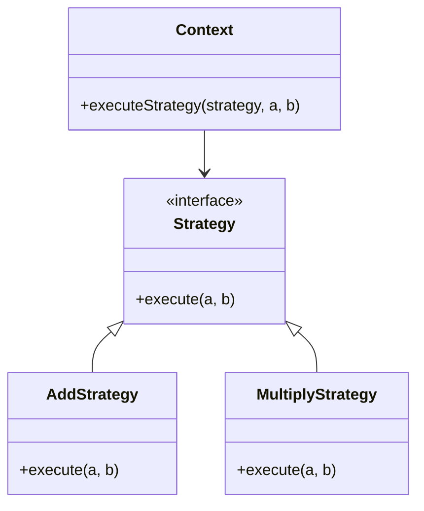

## 7.1 Strategy Pattern with Function Overloading

The Strategy Pattern is a behavioral design pattern that enables selecting an algorithm's behavior at runtime. By encapsulating algorithms within a family of interchangeable strategies, it allows the client to choose which algorithm to use. In Julia, this pattern can be elegantly implemented using function overloading, leveraging Julia's powerful multiple dispatch system.

### Definition

- **Encapsulates interchangeable behaviors** and uses delegation to decide which behavior to use.

### Implementing Strategy Pattern in Julia

Julia's dynamic type system and multiple dispatch make it an ideal language for implementing the Strategy Pattern. Let's explore how we can use function overloading and callable structs to achieve this.

#### Functions as First-Class Citizens

In Julia, functions are first-class citizens, meaning they can be passed as arguments, returned from other functions, and assigned to variables. This feature is crucial for implementing the Strategy Pattern, as it allows us to pass different functions as strategies to algorithms.

```julia
function add(a, b)
    return a + b
end

function multiply(a, b)
    return a * b
end

function execute_strategy(strategy, a, b)
    return strategy(a, b)
end

println(execute_strategy(add, 5, 3))       # Output: 8
println(execute_strategy(multiply, 5, 3))  # Output: 15
```

In this example, `execute_strategy` is a higher-order function that takes a strategy function as an argument and applies it to the given inputs. By passing different functions (`add` or `multiply`), we can change the behavior of `execute_strategy`.

#### Callable Structs

Another way to implement the Strategy Pattern in Julia is by using callable structs. A struct can be made callable by defining the `call` method for it. This approach encapsulates the strategy within a struct, providing more flexibility and organization.

```julia
struct AddStrategy end
function (s::AddStrategy)(a, b)
    return a + b
end

struct MultiplyStrategy end
function (s::MultiplyStrategy)(a, b)
    return a * b
end

add_strategy = AddStrategy()
multiply_strategy = MultiplyStrategy()

println(add_strategy(5, 3))       # Output: 8
println(multiply_strategy(5, 3))  # Output: 15
```

Here, `AddStrategy` and `MultiplyStrategy` are structs that implement the `call` method, making them callable like functions. This encapsulation allows for more complex strategies that can maintain state or configuration.

### Use Cases and Examples

The Strategy Pattern is versatile and can be applied in various scenarios. Let's explore some common use cases.

#### Sorting Algorithms

Sorting algorithms often require different comparison functions. By using the Strategy Pattern, we can easily switch between different comparison strategies.

```julia
function ascending(a, b)
    return a < b
end

function descending(a, b)
    return a > b
end

function sort_with_strategy(arr, compare)
    for i in 1:length(arr)
        for j in i+1:length(arr)
            if compare(arr[j], arr[i])
                arr[i], arr[j] = arr[j], arr[i]
            end
        end
    end
    return arr
end

arr = [5, 2, 9, 1, 5, 6]
println(sort_with_strategy(arr, ascending))  # Output: [1, 2, 5, 5, 6, 9]
println(sort_with_strategy(arr, descending)) # Output: [9, 6, 5, 5, 2, 1]
```

In this example, `sort_with_strategy` takes a comparison function as a strategy, allowing us to sort the array in either ascending or descending order.

#### Payment Processing

In a payment processing system, different payment methods such as credit cards, PayPal, or bank transfers can be implemented as strategies.

```julia
struct CreditCardPayment end
function (p::CreditCardPayment)(amount)
    println("Processing credit card payment of $amount")
end

struct PayPalPayment end
function (p::PayPalPayment)(amount)
    println("Processing PayPal payment of $amount")
end

credit_card = CreditCardPayment()
paypal = PayPalPayment()

credit_card(100)  # Output: Processing credit card payment of 100
paypal(200)       # Output: Processing PayPal payment of 200
```

By encapsulating payment methods within callable structs, we can easily switch between different payment strategies.

### Visualizing the Strategy Pattern

To better understand the Strategy Pattern, let's visualize it using a class diagram.



**Diagram Description**: The `Context` class uses a `Strategy` interface to execute a strategy. `AddStrategy` and `MultiplyStrategy` are concrete implementations of the `Strategy` interface.

### Key Participants

- **Context**: The class that uses a `Strategy` to perform an operation.
- **Strategy**: An interface for encapsulating an algorithm.
- **Concrete Strategies**: Implementations of the `Strategy` interface, such as `AddStrategy` and `MultiplyStrategy`.

### Applicability

Use the Strategy Pattern when:

- You have multiple algorithms for a specific task and want to switch between them.
- You want to avoid conditional statements for selecting algorithms.
- You need to encapsulate algorithms within classes or structs for better organization.

### Sample Code Snippet

Here's a complete example of using the Strategy Pattern with function overloading in Julia:

```julia
struct AddStrategy end
function (s::AddStrategy)(a, b)
    return a + b
end

struct MultiplyStrategy end
function (s::MultiplyStrategy)(a, b)
    return a * b
end

function execute_strategy(strategy, a, b)
    return strategy(a, b)
end

add_strategy = AddStrategy()
multiply_strategy = MultiplyStrategy()

println(execute_strategy(add_strategy, 5, 3))       # Output: 8
println(execute_strategy(multiply_strategy, 5, 3))  # Output: 15
```

### Design Considerations

When implementing the Strategy Pattern in Julia, consider the following:

- **Function Overloading**: Use Julia's multiple dispatch to overload functions based on different strategies.
- **Callable Structs**: Encapsulate strategies within structs for better organization and flexibility.
- **Performance**: Ensure that the overhead of using strategies is minimal, especially in performance-critical applications.

### Differences and Similarities

The Strategy Pattern is often confused with the State Pattern. While both patterns involve encapsulating behavior, the Strategy Pattern focuses on interchangeable algorithms, whereas the State Pattern deals with state transitions.

### Try It Yourself

Experiment with the Strategy Pattern by modifying the code examples:

- Implement a new strategy for subtraction or division.
- Create a new use case, such as a logging system with different logging strategies (e.g., console, file, network).
- Explore how the Strategy Pattern can be combined with other design patterns, such as the Factory Pattern, to create more flexible and scalable systems.

### Knowledge Check

- What is the primary purpose of the Strategy Pattern?
- How does Julia's multiple dispatch facilitate the implementation of the Strategy Pattern?
- What are some common use cases for the Strategy Pattern?

### Embrace the Journey

Remember, mastering design patterns is a journey. As you continue to explore and experiment with the Strategy Pattern in Julia, you'll gain deeper insights into creating flexible and maintainable software. Keep experimenting, stay curious, and enjoy the journey!

## Quiz Time!



### What is the primary purpose of the Strategy Pattern?

- [x] To encapsulate interchangeable behaviors and use delegation to decide which behavior to use.
- [ ] To manage object creation and initialization.
- [ ] To define a family of algorithms and make them interchangeable.
- [ ] To provide a way to access the elements of an aggregate object sequentially.

> **Explanation:** The Strategy Pattern encapsulates interchangeable behaviors and uses delegation to decide which behavior to use.

### How does Julia's multiple dispatch facilitate the implementation of the Strategy Pattern?

- [x] By allowing functions to be overloaded based on different strategies.
- [ ] By providing a way to create singleton objects.
- [ ] By enabling the use of inheritance for behavior sharing.
- [ ] By supporting asynchronous programming.

> **Explanation:** Julia's multiple dispatch allows functions to be overloaded based on different strategies, making it easier to implement the Strategy Pattern.

### What is a common use case for the Strategy Pattern?

- [x] Sorting algorithms with different comparison functions.
- [ ] Managing global state and configuration.
- [ ] Implementing a singleton object.
- [ ] Creating a complex object step by step.

> **Explanation:** A common use case for the Strategy Pattern is sorting algorithms with different comparison functions.

### Which of the following is NOT a key participant in the Strategy Pattern?

- [ ] Context
- [ ] Strategy
- [x] Singleton
- [ ] Concrete Strategy

> **Explanation:** The Singleton is not a key participant in the Strategy Pattern. The key participants are Context, Strategy, and Concrete Strategy.

### What is the role of a Concrete Strategy in the Strategy Pattern?

- [x] To implement the algorithm defined by the Strategy interface.
- [ ] To manage object creation and initialization.
- [ ] To provide a way to access the elements of an aggregate object sequentially.
- [ ] To encapsulate the state of an object.

> **Explanation:** A Concrete Strategy implements the algorithm defined by the Strategy interface.

### What is the benefit of using callable structs in Julia for the Strategy Pattern?

- [x] They encapsulate strategies within structs, providing more flexibility and organization.
- [ ] They allow for asynchronous execution of strategies.
- [ ] They enable the use of inheritance for behavior sharing.
- [ ] They support the creation of singleton objects.

> **Explanation:** Callable structs encapsulate strategies within structs, providing more flexibility and organization.

### Which pattern is often confused with the Strategy Pattern?

- [x] State Pattern
- [ ] Singleton Pattern
- [ ] Factory Pattern
- [ ] Observer Pattern

> **Explanation:** The Strategy Pattern is often confused with the State Pattern, as both involve encapsulating behavior.

### What is a key consideration when implementing the Strategy Pattern in Julia?

- [x] Ensuring that the overhead of using strategies is minimal.
- [ ] Using inheritance to share behavior among strategies.
- [ ] Implementing a singleton object for each strategy.
- [ ] Providing a way to access the elements of an aggregate object sequentially.

> **Explanation:** A key consideration is ensuring that the overhead of using strategies is minimal, especially in performance-critical applications.

### What is the advantage of using functions as first-class citizens in Julia for the Strategy Pattern?

- [x] They allow passing different functions as strategies to algorithms.
- [ ] They enable the use of inheritance for behavior sharing.
- [ ] They support asynchronous execution of strategies.
- [ ] They provide a way to create singleton objects.

> **Explanation:** Functions as first-class citizens allow passing different functions as strategies to algorithms, facilitating the Strategy Pattern.

### True or False: The Strategy Pattern is used to manage object creation and initialization.

- [ ] True
- [x] False

> **Explanation:** False. The Strategy Pattern is used to encapsulate interchangeable behaviors and use delegation to decide which behavior to use.


