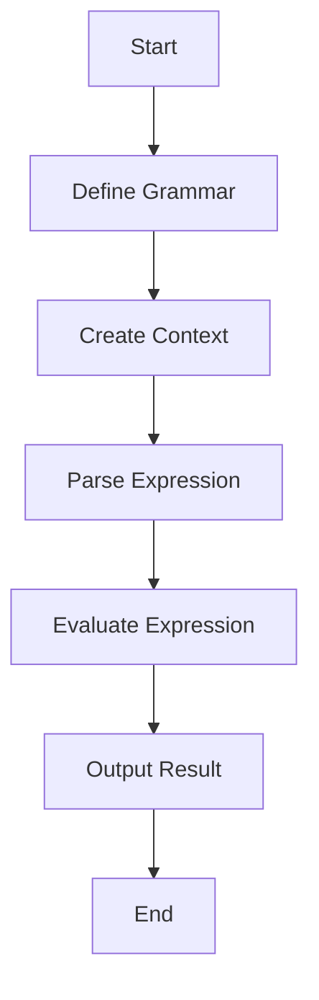

## 7.10 Interpreter Pattern for Custom Languages

The Interpreter Pattern is a powerful design pattern used to define a representation of a grammar and provide an interpreter to process it. This pattern is particularly useful in scenarios where you need to evaluate expressions or implement domain-specific languages (DSLs). In this section, we will explore how to implement the Interpreter Pattern in Julia, leveraging its unique features to create efficient and scalable interpreters.

### Definition

The Interpreter Pattern is a behavioral design pattern that involves the following key components:

- **Grammar Representation**: Defines the syntax and structure of the language or expressions you want to interpret.
- **Interpreter**: Implements the logic to evaluate or process the expressions based on the defined grammar.

### Implementing Interpreter Pattern in Julia

Julia's dynamic type system and multiple dispatch capabilities make it an excellent choice for implementing the Interpreter Pattern. Let's break down the implementation into two main parts: Grammar Representation and Evaluation Function.

#### Grammar Representation

In Julia, we can use types to model the grammar of the language. This involves defining a set of types that represent different elements of the language, such as literals, variables, operators, and expressions.

```julia
abstract type Expr end

struct NumLiteral <: Expr
    value::Float64
end

struct Variable <: Expr
    name::Symbol
end

struct BinaryOp <: Expr
    operator::Symbol
    left::Expr
    right::Expr
end
```

In this example, we have defined three types: `NumLiteral` for numeric literals, `Variable` for variables, and `BinaryOp` for binary operations. These types form the building blocks of our grammar.

#### Evaluation Function

The evaluation function is responsible for interpreting the expressions based on the grammar. We can use multiple dispatch to define different evaluation methods for each type of expression.

```julia
mutable struct Context
    variables::Dict{Symbol, Float64}
end

function evaluate(expr::NumLiteral, context::Context)
    return expr.value
end

function evaluate(expr::Variable, context::Context)
    return get(context.variables, expr.name, 0.0)
end

function evaluate(expr::BinaryOp, context::Context)
    left_value = evaluate(expr.left, context)
    right_value = evaluate(expr.right, context)
    if expr.operator == :+
        return left_value + right_value
    elseif expr.operator == :-
        return left_value - right_value
    elseif expr.operator == :*
        return left_value * right_value
    elseif expr.operator == :/
        return left_value / right_value
    else
        error("Unsupported operator: $(expr.operator)")
    end
end
```

In this code, we define an `evaluate` function for each type of expression. The `Context` struct holds the values of variables, allowing us to evaluate expressions that involve variables.

### Use Cases and Examples

The Interpreter Pattern is versatile and can be applied to various scenarios. Let's explore some common use cases and examples.

#### DSLs (Domain-Specific Languages)

Domain-specific languages are mini-languages tailored for specific tasks, such as configuration or scripting. The Interpreter Pattern can be used to implement DSLs in Julia.

**Example: A Simple Arithmetic DSL**

```julia
expr = BinaryOp(:+, NumLiteral(3.0), BinaryOp(:*, Variable(:x), NumLiteral(2.0)))

context = Context(Dict(:x => 5.0))

result = evaluate(expr, context)
println("Result: $result")  # Output: Result: 13.0
```

In this example, we define a simple arithmetic expression using our grammar types and evaluate it using the `evaluate` function. The context provides the value of the variable `x`.

#### Expression Evaluation

The Interpreter Pattern is also useful for evaluating mathematical expressions input by users. This can be particularly valuable in applications that require dynamic expression evaluation.

**Example: Evaluating User Input**

```julia
function parse_and_evaluate(input::String, context::Context)
    # For simplicity, assume input is in the form "a + b"
    parts = split(input, ' ')
    left = NumLiteral(parse(Float64, parts[1]))
    operator = Symbol(parts[2])
    right = NumLiteral(parse(Float64, parts[3]))
    expr = BinaryOp(operator, left, right)
    return evaluate(expr, context)
end

user_input = "4 + 7"
result = parse_and_evaluate(user_input, context)
println("User Input Result: $result")  # Output: User Input Result: 11.0
```

This example demonstrates how to parse a simple user input expression and evaluate it using the Interpreter Pattern.

### Visualizing the Interpreter Pattern

To better understand the flow of the Interpreter Pattern, let's visualize the process using a flowchart.



**Figure 1: Flowchart of the Interpreter Pattern Process**

This flowchart illustrates the steps involved in implementing the Interpreter Pattern, from defining the grammar to evaluating and outputting the result.

### Design Considerations

When implementing the Interpreter Pattern in Julia, consider the following:

- **Complexity**: The pattern can become complex for large grammars. Consider using existing parsing libraries for more complex languages.
- **Performance**: The pattern may not be suitable for performance-critical applications due to its interpretive nature. Consider compiling expressions for better performance.
- **Extensibility**: Design the grammar and interpreter to be easily extensible, allowing for the addition of new expressions and operators.

### Differences and Similarities

The Interpreter Pattern is often confused with the Visitor Pattern, as both involve processing a structure of elements. However, the Interpreter Pattern focuses on evaluating expressions based on a grammar, while the Visitor Pattern is more about performing operations on elements of an object structure.

### Try It Yourself

Experiment with the Interpreter Pattern by modifying the code examples:

- Add support for additional operators, such as exponentiation or modulus.
- Extend the grammar to include functions, such as `sin` or `cos`.
- Implement a more complex DSL for a specific domain, such as financial calculations or data transformations.

### References and Links

For further reading on the Interpreter Pattern and related topics, consider the following resources:

- [Design Patterns: Elements of Reusable Object-Oriented Software](https://en.wikipedia.org/wiki/Design_Patterns) by Erich Gamma et al.
- [JuliaLang Documentation](https://docs.julialang.org/)
- [Domain-Specific Languages](https://martinfowler.com/books/dsl.html) by Martin Fowler

### Knowledge Check

To reinforce your understanding of the Interpreter Pattern, try answering the following questions and exercises.

## Quiz Time!



### What is the primary purpose of the Interpreter Pattern?

- [x] To define a grammar and provide an interpreter to process it
- [ ] To optimize performance-critical applications
- [ ] To manage complex object structures
- [ ] To facilitate network communication

> **Explanation:** The Interpreter Pattern is used to define a grammar and provide an interpreter to process expressions based on that grammar.

### Which Julia feature is particularly useful for implementing the Interpreter Pattern?

- [x] Multiple dispatch
- [ ] Static typing
- [ ] Garbage collection
- [ ] Concurrency

> **Explanation:** Julia's multiple dispatch allows for defining different evaluation methods for each type of expression, making it ideal for the Interpreter Pattern.

### What is a common use case for the Interpreter Pattern?

- [x] Implementing domain-specific languages (DSLs)
- [ ] Optimizing database queries
- [ ] Managing memory allocation
- [ ] Handling user authentication

> **Explanation:** The Interpreter Pattern is commonly used to implement DSLs, which are mini-languages tailored for specific tasks.

### How can you represent a grammar in Julia?

- [x] By defining types for different elements of the language
- [ ] By using global variables
- [ ] By writing complex loops
- [ ] By leveraging Julia's garbage collector

> **Explanation:** In Julia, you can represent a grammar by defining types that model different elements of the language, such as literals and operators.

### What is the role of the evaluation function in the Interpreter Pattern?

- [x] To interpret expressions based on the grammar
- [ ] To manage memory allocation
- [ ] To handle network requests
- [ ] To optimize code execution

> **Explanation:** The evaluation function interprets expressions based on the defined grammar, executing the logic for each type of expression.

### Which pattern is often confused with the Interpreter Pattern?

- [x] Visitor Pattern
- [ ] Singleton Pattern
- [ ] Factory Pattern
- [ ] Observer Pattern

> **Explanation:** The Interpreter Pattern is often confused with the Visitor Pattern, as both involve processing a structure of elements.

### What is a potential drawback of the Interpreter Pattern?

- [x] It may not be suitable for performance-critical applications
- [ ] It is difficult to implement in Julia
- [ ] It cannot be extended
- [ ] It is only applicable to network applications

> **Explanation:** The interpretive nature of the Interpreter Pattern may not be suitable for performance-critical applications.

### How can you extend the grammar in the Interpreter Pattern?

- [x] By adding new types and evaluation methods
- [ ] By using global variables
- [ ] By writing complex loops
- [ ] By leveraging Julia's garbage collector

> **Explanation:** You can extend the grammar by adding new types and corresponding evaluation methods for additional expressions and operators.

### What is a DSL?

- [x] A domain-specific language tailored for specific tasks
- [ ] A distributed system language
- [ ] A data serialization language
- [ ] A dynamic scripting language

> **Explanation:** A DSL is a domain-specific language designed for specific tasks, often implemented using the Interpreter Pattern.

### True or False: The Interpreter Pattern is ideal for performance-critical applications.

- [ ] True
- [x] False

> **Explanation:** The Interpreter Pattern is not ideal for performance-critical applications due to its interpretive nature, which may introduce overhead.



Remember, this is just the beginning. As you progress, you'll build more complex and interactive interpreters. Keep experimenting, stay curious, and enjoy the journey!
