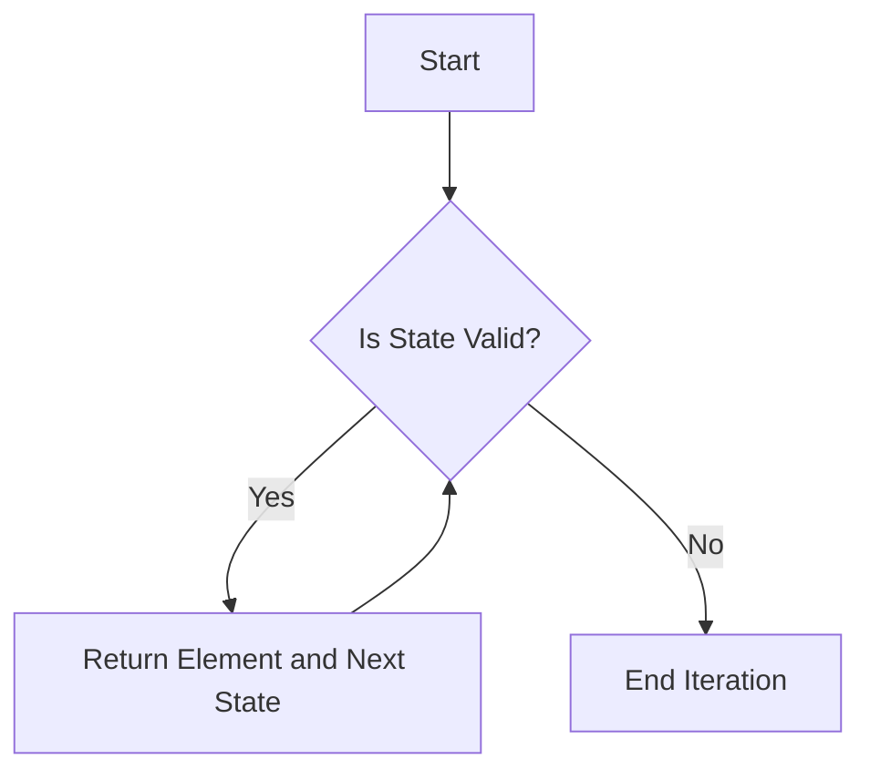

## 7.11 Iterator Pattern with Custom Collections

### Introduction

The Iterator Pattern is a fundamental design pattern that provides a way to access elements of a collection sequentially without exposing its underlying representation. In Julia, this pattern is elegantly supported through the implementation of the `iterate` function, which allows custom collections to be seamlessly integrated into Julia's iteration protocol. This section will guide you through the process of implementing the Iterator Pattern in Julia, focusing on custom collections, and explore its use cases in various contexts such as custom data structures and data streaming.

### Understanding the Iterator Pattern

The Iterator Pattern is a behavioral design pattern that abstracts the process of iterating over a collection. It decouples the iteration logic from the collection itself, allowing different iteration strategies to be implemented without modifying the collection's structure. This pattern is particularly useful for custom data structures like trees and graphs, where the iteration logic can be complex and varied.

#### Key Participants

- **Iterator**: An object that encapsulates the iteration logic and maintains the current state of iteration.
- **Iterable Collection**: The collection that provides an iterator to traverse its elements.
- **Client**: The code that uses the iterator to access the collection's elements.

### Implementing the Iterator Pattern in Julia

Julia's iteration protocol is built around the `iterate` function, which is used to define how a collection is traversed. To implement the Iterator Pattern for a custom collection in Julia, you need to define the `iterate` method for your collection type.

#### Implementing the `iterate` Method

The `iterate` function in Julia is a two-argument function that returns a tuple containing the next element and the next state. The first call to `iterate` takes the collection as its argument and returns the first element and the initial state. Subsequent calls take the state as an argument and return the next element and updated state.

Here's a basic example of implementing the `iterate` method for a custom collection:

```julia
struct MyCollection
    data::Vector{Int}
end

function Base.iterate(collection::MyCollection, state=1)
    if state > length(collection.data)
        return nothing
    else
        return (collection.data[state], state + 1)
    end
end
```

In this example, `MyCollection` is a simple wrapper around a vector of integers. The `iterate` function returns each element of the vector along with the next state, which is simply the next index.

#### Supporting the Iteration Protocol

Once the `iterate` method is defined, your custom collection can be used in loops and other iteration contexts. For example:

```julia
my_collection = MyCollection([1, 2, 3, 4, 5])

for element in my_collection
    println(element)
end
```

This loop will print each element of `MyCollection`, demonstrating how the iteration protocol is seamlessly integrated with Julia's syntax.

### Use Cases and Examples

The Iterator Pattern is versatile and can be applied to various scenarios. Let's explore some common use cases and examples.

#### Custom Data Structures

Custom data structures like trees, graphs, or other non-linear structures can benefit significantly from the Iterator Pattern. By defining a custom iterator, you can control the traversal logic, such as depth-first or breadth-first traversal for trees.

##### Example: Tree Traversal

Consider a simple binary tree structure:

```julia
struct TreeNode
    value::Int
    left::Union{TreeNode, Nothing}
    right::Union{TreeNode, Nothing}
end

struct BinaryTree
    root::Union{TreeNode, Nothing}
end

function Base.iterate(tree::BinaryTree, state=nothing)
    if state === nothing
        return tree.root === nothing ? nothing : (tree.root.value, tree.root)
    else
        node = state
        if node.left !== nothing
            return (node.left.value, node.left)
        elseif node.right !== nothing
            return (node.right.value, node.right)
        else
            return nothing
        end
    end
end
```

This example demonstrates a simple in-order traversal of a binary tree. The `iterate` function is used to traverse the tree nodes, returning each node's value.

#### Data Streaming

Data streaming is another area where the Iterator Pattern shines. By generating data on-the-fly, you can process large datasets in a memory-efficient manner.

##### Example: Infinite Sequence Generator

Let's create an infinite sequence generator using the Iterator Pattern:

```julia
struct InfiniteSequence
    start::Int
end

function Base.iterate(seq::InfiniteSequence, state=seq.start)
    return (state, state + 1)
end

seq = InfiniteSequence(1)

for i in seq
    println(i)
    if i > 10
        break
    end
end
```

This example generates an infinite sequence of integers starting from a given number. The loop demonstrates how to use the iterator to process the sequence, with a break condition to prevent infinite execution.

### Visualizing the Iterator Pattern

To better understand the flow of the Iterator Pattern, let's visualize the process using a flowchart:



**Caption**: This flowchart illustrates the iteration process, where the `iterate` function checks the validity of the state and returns the next element and state if valid.

### Design Considerations

When implementing the Iterator Pattern in Julia, consider the following:

- **State Management**: Ensure that the state is managed correctly to avoid infinite loops or incorrect iteration.
- **Performance**: Optimize the `iterate` function for performance, especially for large or complex data structures.
- **Error Handling**: Implement error handling to manage edge cases, such as empty collections or invalid states.

### Differences and Similarities

The Iterator Pattern is often confused with the Enumerator Pattern, which provides a similar interface for iterating over collections. However, the Iterator Pattern focuses on decoupling the iteration logic from the collection, while the Enumerator Pattern typically involves a more tightly coupled design.

### Try It Yourself

Experiment with the examples provided by modifying the data structures or iteration logic. For instance, try implementing a breadth-first traversal for the binary tree or create a custom iterator for a graph structure.

### Knowledge Check

- **Question**: What is the primary purpose of the Iterator Pattern?
- **Exercise**: Implement a custom iterator for a linked list data structure.

### Embrace the Journey

Remember, mastering the Iterator Pattern is just one step in your journey to becoming proficient in Julia. Keep experimenting, stay curious, and enjoy the process of learning and applying design patterns in your projects.

### Summary

The Iterator Pattern is a powerful tool for accessing elements of a collection sequentially without exposing its underlying representation. By implementing the `iterate` method in Julia, you can create custom iterators for various data structures and use cases, enhancing the flexibility and efficiency of your code.

## Quiz Time!



### What is the primary purpose of the Iterator Pattern?

- [x] To provide a way to access elements of a collection sequentially without exposing its underlying representation.
- [ ] To modify the elements of a collection.
- [ ] To sort the elements of a collection.
- [ ] To delete elements from a collection.

> **Explanation:** The Iterator Pattern is designed to provide a way to access elements of a collection sequentially without exposing its underlying representation.

### Which function is central to implementing the Iterator Pattern in Julia?

- [x] `iterate`
- [ ] `next`
- [ ] `prev`
- [ ] `traverse`

> **Explanation:** The `iterate` function is central to implementing the Iterator Pattern in Julia, as it defines how a collection is traversed.

### What does the `iterate` function return?

- [x] A tuple containing the next element and the next state.
- [ ] A single element.
- [ ] A boolean indicating if there are more elements.
- [ ] A list of all remaining elements.

> **Explanation:** The `iterate` function returns a tuple containing the next element and the next state.

### In the provided tree traversal example, what type of traversal is implemented?

- [x] In-order traversal
- [ ] Pre-order traversal
- [ ] Post-order traversal
- [ ] Level-order traversal

> **Explanation:** The example demonstrates an in-order traversal of a binary tree.

### What is a key consideration when implementing the Iterator Pattern?

- [x] State management
- [ ] Sorting logic
- [ ] Data encryption
- [ ] Memory allocation

> **Explanation:** State management is crucial to ensure correct iteration and avoid infinite loops.

### How can the Iterator Pattern be applied to data streaming?

- [x] By generating data on-the-fly in a memory-efficient manner.
- [ ] By storing all data in memory before processing.
- [ ] By compressing data before iteration.
- [ ] By encrypting data during iteration.

> **Explanation:** The Iterator Pattern can be applied to data streaming by generating data on-the-fly, which is memory-efficient.

### What is a common use case for the Iterator Pattern?

- [x] Custom data structures like trees and graphs
- [ ] Data encryption
- [ ] Sorting algorithms
- [ ] Database transactions

> **Explanation:** Custom data structures like trees and graphs are common use cases for the Iterator Pattern.

### What is the role of the client in the Iterator Pattern?

- [x] To use the iterator to access the collection's elements.
- [ ] To modify the iterator's logic.
- [ ] To store the collection's elements.
- [ ] To delete elements from the collection.

> **Explanation:** The client uses the iterator to access the collection's elements.

### Can the Iterator Pattern be used for infinite sequences?

- [x] True
- [ ] False

> **Explanation:** The Iterator Pattern can be used for infinite sequences, as demonstrated in the infinite sequence generator example.

### What is a potential pitfall when implementing the Iterator Pattern?

- [x] Incorrect state management leading to infinite loops.
- [ ] Excessive memory usage.
- [ ] Data loss during iteration.
- [ ] Slow iteration speed.

> **Explanation:** Incorrect state management can lead to infinite loops, which is a potential pitfall when implementing the Iterator Pattern.


