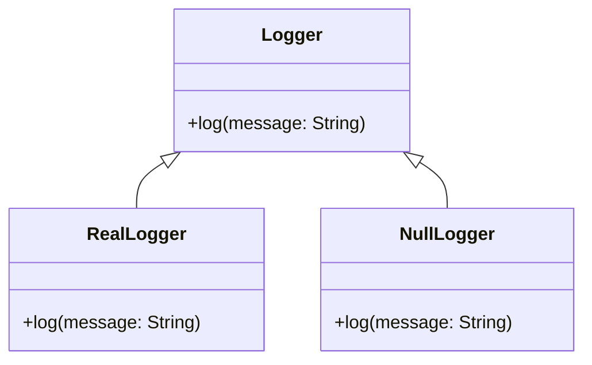

## 7.12 Null Object Pattern for Default Behaviors

In the world of software development, handling null references can often lead to cumbersome and error-prone code. The Null Object Pattern offers a solution by providing an object that does nothing instead of using null references. This pattern is particularly useful in Julia, where we can leverage its powerful type system and multiple dispatch capabilities to create elegant and efficient solutions.

### Definition

The Null Object Pattern is a design pattern that provides an object that implements a default behavior when a null reference might otherwise be used. This pattern helps to eliminate the need for null checks and simplifies code by providing a consistent interface.

### Implementing Null Object Pattern in Julia

#### Null Type

To implement the Null Object Pattern in Julia, we start by defining a type that represents the null object. This type will have methods that do nothing, effectively acting as a placeholder.

```julia
struct NullLogger end

function log(::NullLogger, message::String)
    # Do nothing
end
```

In this example, `NullLogger` is a type that represents a logger that does nothing. The `log` function is defined for `NullLogger`, but it does not perform any actions.

#### Default Implementations

Using the null object in place of `nothing` allows us to avoid conditional checks throughout our code. Instead of checking if a logger is `nothing` before logging a message, we can use a `NullLogger` that safely ignores the log request.

```julia
function process_data(logger, data)
    # Perform some data processing
    log(logger, "Processing data: $data")
    # Further processing...
end

logger = NullLogger()
process_data(logger, "Sample data")
```

In this example, `process_data` can be called with a `NullLogger`, and it will safely ignore the logging operation without any additional checks.

### Use Cases and Examples

#### Logging

One common use case for the Null Object Pattern is in logging. By replacing an actual logger with a null logger, we can discard log messages without adding conditional logic to check if logging is enabled.

```julia
struct RealLogger end

function log(::RealLogger, message::String)
    println("Log: $message")
end

real_logger = RealLogger()
null_logger = NullLogger()

process_data(real_logger, "Important data")
process_data(null_logger, "Unimportant data")
```

In this scenario, `real_logger` will print log messages, while `null_logger` will silently discard them.

#### Fallback Handlers

Another use case is using a null handler when no action is required. This can be useful in event-driven systems where certain events do not require handling.

```julia
struct NullEventHandler end

function handle_event(::NullEventHandler, event::String)
    # Do nothing
end

event_handler = NullEventHandler()
handle_event(event_handler, "Some event")
```

Here, `NullEventHandler` provides a default behavior for handling events, allowing us to avoid null checks.

### Visualizing the Null Object Pattern

To better understand the Null Object Pattern, let's visualize the interaction between different components using a class diagram.



In this diagram, `Logger` is an abstract class with a `log` method. `RealLogger` and `NullLogger` are concrete implementations, with `NullLogger` providing a no-op implementation.

### Design Considerations

When implementing the Null Object Pattern in Julia, consider the following:

- **Consistency**: Ensure that the null object provides a consistent interface with other implementations.
- **Performance**: The null object should have minimal overhead, as it is often used in performance-critical paths.
- **Simplicity**: Avoid adding unnecessary complexity to the null object. It should remain simple and focused on providing default behavior.

### Differences and Similarities

The Null Object Pattern is often compared to other patterns, such as the Strategy Pattern. While both patterns involve interchangeable objects, the Null Object Pattern specifically focuses on providing a default, do-nothing behavior.

### Try It Yourself

To get hands-on experience with the Null Object Pattern, try modifying the code examples to add additional methods to the `NullLogger` and `RealLogger` types. Experiment with different scenarios where a null object might be useful, such as in error handling or configuration management.

### Knowledge Check

- **Question**: What is the primary benefit of using the Null Object Pattern?
- **Challenge**: Implement a null object for a configuration manager that provides default settings.

### Embrace the Journey

Remember, the Null Object Pattern is just one tool in your design pattern toolkit. As you continue to explore and apply different patterns, you'll develop a deeper understanding of how to build robust and maintainable software. Keep experimenting, stay curious, and enjoy the journey!

## Quiz Time!



### What is the primary purpose of the Null Object Pattern?

- [x] To provide a default behavior instead of using null references
- [ ] To enhance performance by reducing memory usage
- [ ] To simplify complex algorithms
- [ ] To improve user interface design

> **Explanation:** The Null Object Pattern provides a default behavior to avoid null references and simplify code.


### How does the Null Object Pattern help in logging?

- [x] By using a null logger to discard messages without conditional checks
- [ ] By enhancing the performance of log operations
- [ ] By encrypting log messages for security
- [ ] By automatically formatting log messages

> **Explanation:** The Null Object Pattern allows using a null logger to discard messages without needing conditional checks.


### What is a key consideration when implementing the Null Object Pattern?

- [x] Ensuring the null object provides a consistent interface
- [ ] Maximizing the complexity of the null object
- [ ] Reducing the number of methods in the null object
- [ ] Increasing the memory usage of the null object

> **Explanation:** Consistency in the interface is crucial to ensure the null object can be used interchangeably with other implementations.


### Which pattern is often compared to the Null Object Pattern?

- [x] Strategy Pattern
- [ ] Singleton Pattern
- [ ] Observer Pattern
- [ ] Factory Pattern

> **Explanation:** The Strategy Pattern is often compared to the Null Object Pattern because both involve interchangeable objects.


### What is a common use case for the Null Object Pattern?

- [x] Logging
- [ ] Data encryption
- [ ] User authentication
- [ ] Network communication

> **Explanation:** Logging is a common use case where the Null Object Pattern can be used to discard messages without conditional logic.


### What does the Null Object Pattern eliminate the need for?

- [x] Null checks
- [ ] Performance optimization
- [ ] User input validation
- [ ] Data serialization

> **Explanation:** The Null Object Pattern eliminates the need for null checks by providing a default behavior.


### What type of method does a null object typically implement?

- [x] A method that does nothing
- [ ] A method that performs complex calculations
- [ ] A method that logs errors
- [ ] A method that encrypts data

> **Explanation:** A null object typically implements methods that do nothing, providing a default behavior.


### How can the Null Object Pattern be visualized?

- [x] Using a class diagram
- [ ] Using a flowchart
- [ ] Using a sequence diagram
- [ ] Using a pie chart

> **Explanation:** A class diagram can be used to visualize the Null Object Pattern, showing the relationship between different components.


### What is a benefit of using a null object in event handling?

- [x] It provides a default behavior when no action is required
- [ ] It increases the complexity of event handling
- [ ] It reduces the performance of event handling
- [ ] It encrypts event data for security

> **Explanation:** A null object provides a default behavior when no action is required, simplifying event handling.


### True or False: The Null Object Pattern is only useful in logging scenarios.

- [ ] True
- [x] False

> **Explanation:** False. The Null Object Pattern is useful in various scenarios, including logging, event handling, and configuration management.


