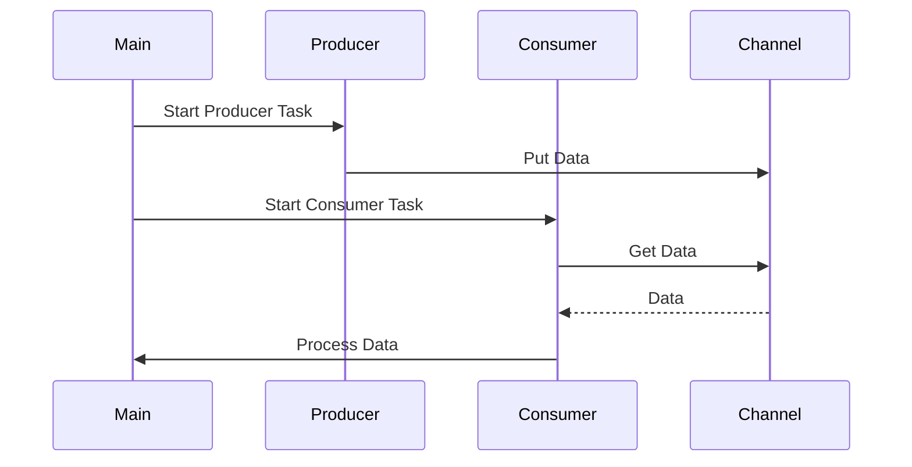

## 7.13 Event Handling and Asynchronous Callbacks

In the realm of software development, creating responsive and efficient applications often requires the ability to handle events and execute asynchronous operations. Julia, with its powerful concurrency model, provides robust tools for event handling and asynchronous callbacks. This section will guide you through the concepts and practical implementations of event-driven programming in Julia, focusing on channels, tasks, and function pointers.

### Event-Driven Programming

Event-driven programming is a paradigm where the flow of the program is determined by events such as user actions, sensor outputs, or messages from other programs. In this model, the application remains idle until an event occurs, at which point it reacts by executing a specific piece of code.

#### Responding to Events

To design systems that effectively respond to events, you must:

- **Identify the Events**: Determine the types of events your application needs to handle, such as user inputs, network requests, or file changes.
- **Define Event Handlers**: Create functions or methods that will be executed in response to specific events.
- **Establish Event Loops**: Implement loops that continuously listen for events and dispatch them to the appropriate handlers.

### Implementing Events in Julia

Julia provides several constructs to facilitate event handling and asynchronous operations, including channels, tasks, and coroutines.

#### Channels

Channels in Julia are used for communication between tasks. They allow you to pass messages asynchronously, making them ideal for event-driven architectures.

```julia
channel = Channel{Int}(10)

@async begin
    for i in 1:10
        put!(channel, i)
        println("Produced: $i")
    end
    close(channel)
end

@async begin
    for i in channel
        println("Consumed: $i")
    end
end
```

In this example, we create a channel with a buffer size of 10. The producer task sends integers to the channel, while the consumer task receives and processes them. The `@async` macro is used to run these tasks concurrently.

#### Tasks and Coroutines

Tasks in Julia are lightweight units of execution that can be paused and resumed. They are ideal for managing concurrent operations without the overhead of threads or processes.

```julia
function download_data(url)
    println("Starting download from $url")
    # Simulate a download delay
    sleep(2)
    println("Completed download from $url")
end

urls = ["http://example.com/file1", "http://example.com/file2"]

@sync for url in urls
    @async download_data(url)
end
```

Here, we define a `download_data` function that simulates downloading data from a URL. The `@async` macro is used to start a task for each URL, and `@sync` ensures that the main program waits for all downloads to complete.

### Callbacks

Callbacks are functions that are passed as arguments to other functions and are invoked after a certain event or operation has completed. They are a fundamental part of asynchronous programming, allowing you to specify what should happen once an event is handled.

#### Function Pointers

In Julia, you can pass functions as arguments to other functions, making it easy to implement callbacks.

```julia
function perform_operation(x, callback)
    result = x * 2
    callback(result)
end

function print_result(result)
    println("The result is: $result")
end

perform_operation(5, print_result)
```

In this example, `perform_operation` takes a number and a callback function. After performing an operation on the number, it calls the callback with the result.

### Use Cases and Examples

Event handling and asynchronous callbacks are crucial in various applications, from server-side programming to interactive user interfaces.

#### Server Applications

In server applications, handling incoming network connections or requests asynchronously can significantly improve performance and responsiveness.

```julia
using Sockets

function handle_client(client)
    println("Client connected: $(client)")
    write(client, "Hello, client!\n")
    close(client)
end

server = listen(8080)

@async while true
    client = accept(server)
    @async handle_client(client)
end
```

This server listens for incoming connections on port 8080. Each connection is handled in a separate task, allowing the server to manage multiple clients concurrently.

#### Interactive Applications

In interactive applications, updating UI components in response to user interaction is essential for a smooth user experience.

```julia
using Gtk

function on_button_click(widget)
    println("Button clicked!")
end

win = GtkWindow("Event Handling Example", 400, 200)
button = GtkButton("Click Me")
signal_connect(on_button_click, button, "clicked")

push!(win, button)
showall(win)
```

This example uses the Gtk.jl package to create a simple GUI application. When the button is clicked, the `on_button_click` function is called, demonstrating how callbacks can be used to handle user interactions.

### Visualizing Event Handling and Asynchronous Callbacks

To better understand the flow of event handling and asynchronous callbacks, consider the following sequence diagram:



This diagram illustrates the interaction between the main program, producer, and consumer tasks using a channel for communication.

### References and Links

- [Julia Documentation on Concurrency](https://docs.julialang.org/en/v1/manual/concurrency/)
- [Async Programming in Julia](https://julialang.org/blog/2019/07/multithreading/)
- [Gtk.jl Documentation](https://juliagraphics.github.io/Gtk.jl/stable/)

### Knowledge Check

- What are the benefits of using channels for event handling in Julia?
- How do tasks and coroutines differ from traditional threading models?
- What role do callbacks play in asynchronous programming?

### Try It Yourself

Experiment with the provided code examples by modifying them to handle different types of events or data. For instance, try creating a simple chat server using channels and tasks, or build a GUI application with multiple interactive components.

### Embrace the Journey

Remember, mastering event handling and asynchronous callbacks is a journey. As you continue to explore these concepts, you'll discover new ways to build responsive and efficient applications. Keep experimenting, stay curious, and enjoy the process!

## Quiz Time!



### What is the primary purpose of event-driven programming?

- [x] To respond to events such as user actions or messages
- [ ] To execute code sequentially
- [ ] To handle errors in a program
- [ ] To optimize memory usage

> **Explanation:** Event-driven programming focuses on responding to events like user actions or messages, allowing applications to be more interactive and responsive.

### Which Julia construct is used for asynchronous communication between tasks?

- [x] Channel
- [ ] Array
- [ ] Dictionary
- [ ] Tuple

> **Explanation:** Channels in Julia are used for asynchronous communication between tasks, allowing data to be passed between them.

### What does the `@async` macro do in Julia?

- [x] It starts a task that runs concurrently with other tasks
- [ ] It blocks the main thread until the task completes
- [ ] It synchronizes multiple tasks
- [ ] It creates a new thread

> **Explanation:** The `@async` macro in Julia starts a task that runs concurrently, allowing other tasks to execute simultaneously.

### How can you ensure that the main program waits for all asynchronous tasks to complete?

- [x] Use the `@sync` macro
- [ ] Use the `@await` macro
- [ ] Use the `@join` macro
- [ ] Use the `@wait` macro

> **Explanation:** The `@sync` macro in Julia ensures that the main program waits for all asynchronous tasks within its block to complete.

### What is a callback function?

- [x] A function passed as an argument to another function and invoked after an event
- [ ] A function that returns a value
- [ ] A function that is called recursively
- [ ] A function that handles errors

> **Explanation:** A callback function is passed as an argument to another function and is invoked after a specific event or operation.

### In the context of event handling, what is a common use case for callbacks?

- [x] Handling user interactions in a GUI application
- [ ] Sorting a list of numbers
- [ ] Calculating the sum of an array
- [ ] Reading a file from disk

> **Explanation:** Callbacks are commonly used to handle user interactions in GUI applications, allowing the program to respond to events like button clicks.

### What is the role of the `signal_connect` function in Gtk.jl?

- [x] It connects a callback function to a widget event
- [ ] It creates a new window
- [ ] It initializes the GTK library
- [ ] It closes a window

> **Explanation:** The `signal_connect` function in Gtk.jl connects a callback function to a widget event, enabling event-driven programming in GUI applications.

### Which of the following is NOT a benefit of using tasks in Julia?

- [ ] Lightweight execution units
- [ ] Ability to pause and resume
- [x] Guaranteed execution order
- [ ] Concurrent execution

> **Explanation:** Tasks in Julia are lightweight and can be paused and resumed, but they do not guarantee execution order, as they run concurrently.

### True or False: Channels in Julia can only be used for communication between tasks on the same thread.

- [ ] True
- [x] False

> **Explanation:** Channels in Julia can be used for communication between tasks across different threads, not just within the same thread.

### What is the purpose of the `close` function when working with channels?

- [x] To indicate that no more data will be sent through the channel
- [ ] To delete the channel
- [ ] To reset the channel's buffer
- [ ] To pause data transmission

> **Explanation:** The `close` function is used to indicate that no more data will be sent through the channel, allowing consumers to finish processing.


