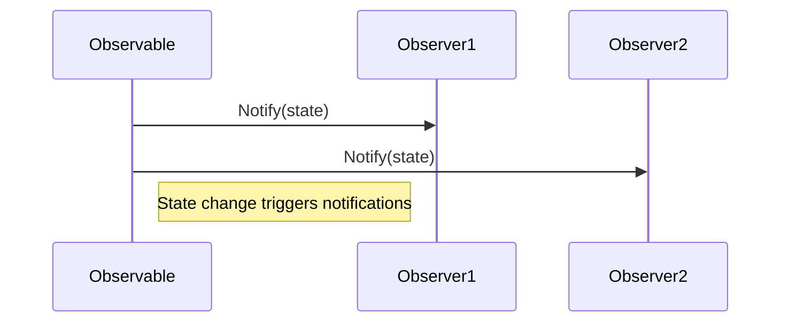

## 7.2 Observer Pattern (Publish/Subscribe) in Event Handling

The Observer Pattern, also known as the Publish/Subscribe pattern, is a fundamental design pattern in software engineering. It is particularly useful in scenarios where a change in one object needs to be communicated to multiple other objects. This pattern is widely used in event-driven systems, GUI applications, and real-time data processing.

### Definition

The Observer Pattern defines a one-to-many dependency between objects. When one object (the subject) changes state, all its dependents (observers) are notified and updated automatically. This decouples the subject from its observers, allowing for more flexible and maintainable code.

### Implementing Observer Pattern in Julia

Julia, with its powerful multiple dispatch and metaprogramming capabilities, provides a unique environment for implementing the Observer Pattern. Let's explore how to create observable objects and a notification system in Julia.

#### Observable Objects

To implement the Observer Pattern, we first need to define observable objects. These objects maintain a list of observers that need to be notified of any state changes.

```julia
mutable struct Observable
    observers::Vector{Function}
    state::Any
end

function Observable(initial_state)
    return Observable(Vector{Function}(), initial_state)
end

function add_observer(obs::Observable, observer::Function)
    push!(obs.observers, observer)
end

function remove_observer(obs::Observable, observer::Function)
    deleteat!(obs.observers, findfirst(==(observer), obs.observers))
end

function notify_observers(obs::Observable)
    for observer in obs.observers
        observer(obs.state)
    end
end

function set_state!(obs::Observable, new_state)
    obs.state = new_state
    notify_observers(obs)
end
```

In this implementation, the `Observable` struct maintains a list of observers and a state. We provide methods to add and remove observers, as well as to notify them when the state changes.

#### Notification System

The notification system is responsible for informing all registered observers about changes in the observable object. This is achieved through the `notify_observers` function, which iterates over the list of observers and calls each one with the current state.

### Use Cases and Examples

The Observer Pattern is versatile and can be applied in various domains. Here are some common use cases:

#### GUI Applications

In graphical user interfaces, the Observer Pattern is used to update UI components in response to data changes. For example, when a user modifies a data entry, all relevant UI elements should reflect the updated data.

```julia
function ui_component(state)
    println("UI component updated with new state: $state")
end

observable = Observable("Initial State")

add_observer(observable, ui_component)

set_state!(observable, "Updated State")
```

In this example, the `ui_component` function acts as an observer that updates the UI whenever the observable's state changes.

#### Event-Driven Systems

Event-driven systems rely heavily on the Observer Pattern to react to various events, such as messages, sensor inputs, or user actions. This pattern allows for a clean separation between event producers and consumers.

```julia
function log_event(state)
    println("Event logged: $state")
end

add_observer(observable, log_event)

set_state!(observable, "New Event Occurred")
```

Here, the `log_event` function logs events whenever the observable's state changes, demonstrating how the Observer Pattern can be used in event-driven architectures.

### Visualizing the Observer Pattern

To better understand the flow of the Observer Pattern, let's visualize it using a sequence diagram.



This diagram illustrates how the `Observable` object notifies multiple observers when its state changes.

### Design Considerations

When implementing the Observer Pattern in Julia, consider the following:

- **Performance**: Ensure that the notification process is efficient, especially if there are many observers.
- **Decoupling**: The pattern promotes decoupling between the subject and observers, enhancing maintainability.
- **Error Handling**: Implement robust error handling to manage potential issues during observer notifications.

### Differences and Similarities

The Observer Pattern is often compared to the Mediator Pattern. While both involve communication between objects, the Mediator Pattern centralizes communication through a mediator object, whereas the Observer Pattern allows direct communication between subjects and observers.

### Try It Yourself

Experiment with the Observer Pattern by modifying the code examples. Try adding more observers, changing the state multiple times, or implementing a more complex notification logic.

### Knowledge Check

- What is the primary purpose of the Observer Pattern?
- How does the Observer Pattern promote decoupling in software design?
- Can you think of a scenario where the Observer Pattern might not be suitable?

### Embrace the Journey

Remember, mastering design patterns like the Observer Pattern is a journey. As you continue to explore Julia and its capabilities, you'll find new ways to apply these patterns to create efficient and scalable applications. Keep experimenting, stay curious, and enjoy the process!

## Quiz Time!



### What is the primary purpose of the Observer Pattern?

- [x] To define a one-to-many dependency between objects
- [ ] To centralize communication through a mediator object
- [ ] To encapsulate a request as an object
- [ ] To provide a way to access elements of an aggregate object sequentially

> **Explanation:** The Observer Pattern defines a one-to-many dependency between objects, allowing observers to be notified of changes in the subject.

### How does the Observer Pattern promote decoupling?

- [x] By allowing subjects and observers to communicate without being tightly coupled
- [ ] By centralizing communication through a mediator
- [ ] By encapsulating requests as objects
- [ ] By providing a way to access elements of an aggregate object sequentially

> **Explanation:** The Observer Pattern promotes decoupling by allowing subjects and observers to communicate without being tightly coupled, enhancing maintainability.

### Which of the following is a common use case for the Observer Pattern?

- [x] GUI applications
- [ ] Sorting algorithms
- [ ] Database normalization
- [ ] Memory management

> **Explanation:** The Observer Pattern is commonly used in GUI applications to update UI components in response to data changes.

### What is a key difference between the Observer Pattern and the Mediator Pattern?

- [x] The Observer Pattern allows direct communication between subjects and observers
- [ ] The Observer Pattern centralizes communication through a mediator
- [ ] The Observer Pattern encapsulates requests as objects
- [ ] The Observer Pattern provides a way to access elements of an aggregate object sequentially

> **Explanation:** The Observer Pattern allows direct communication between subjects and observers, whereas the Mediator Pattern centralizes communication through a mediator.

### In Julia, what is a common way to implement observers?

- [x] Using functions as observers
- [ ] Using classes as observers
- [ ] Using global variables as observers
- [ ] Using macros as observers

> **Explanation:** In Julia, functions are commonly used as observers to react to state changes in observable objects.

### What is a potential drawback of the Observer Pattern?

- [x] Performance issues with many observers
- [ ] Centralized communication
- [ ] Lack of encapsulation
- [ ] Difficulty in accessing elements sequentially

> **Explanation:** A potential drawback of the Observer Pattern is performance issues when there are many observers, as each needs to be notified of state changes.

### How can error handling be managed in the Observer Pattern?

- [x] By implementing robust error handling during observer notifications
- [ ] By centralizing error handling through a mediator
- [ ] By encapsulating errors as objects
- [ ] By providing a way to access errors sequentially

> **Explanation:** Error handling can be managed by implementing robust error handling during observer notifications to manage potential issues.

### What is a benefit of using the Observer Pattern in event-driven systems?

- [x] It allows clean separation between event producers and consumers
- [ ] It centralizes communication through a mediator
- [ ] It encapsulates events as objects
- [ ] It provides a way to access events sequentially

> **Explanation:** The Observer Pattern allows clean separation between event producers and consumers, making it beneficial for event-driven systems.

### Can the Observer Pattern be used for real-time data processing?

- [x] True
- [ ] False

> **Explanation:** The Observer Pattern can be used for real-time data processing by notifying observers of changes as they occur.

### What is a common method to notify observers in Julia?

- [x] Iterating over a list of observer functions and calling each one
- [ ] Centralizing notifications through a mediator
- [ ] Encapsulating notifications as objects
- [ ] Providing a way to access notifications sequentially

> **Explanation:** A common method to notify observers in Julia is by iterating over a list of observer functions and calling each one with the current state.


