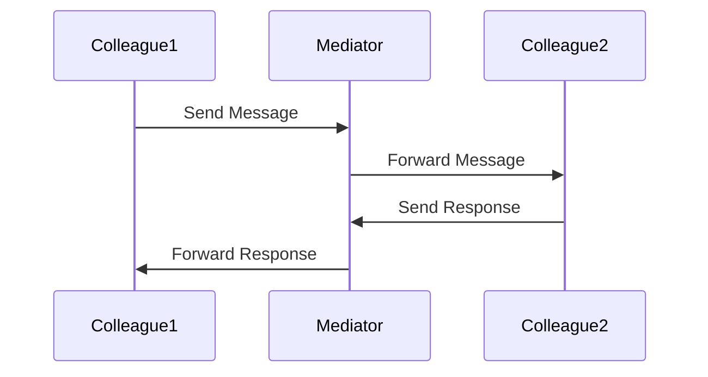
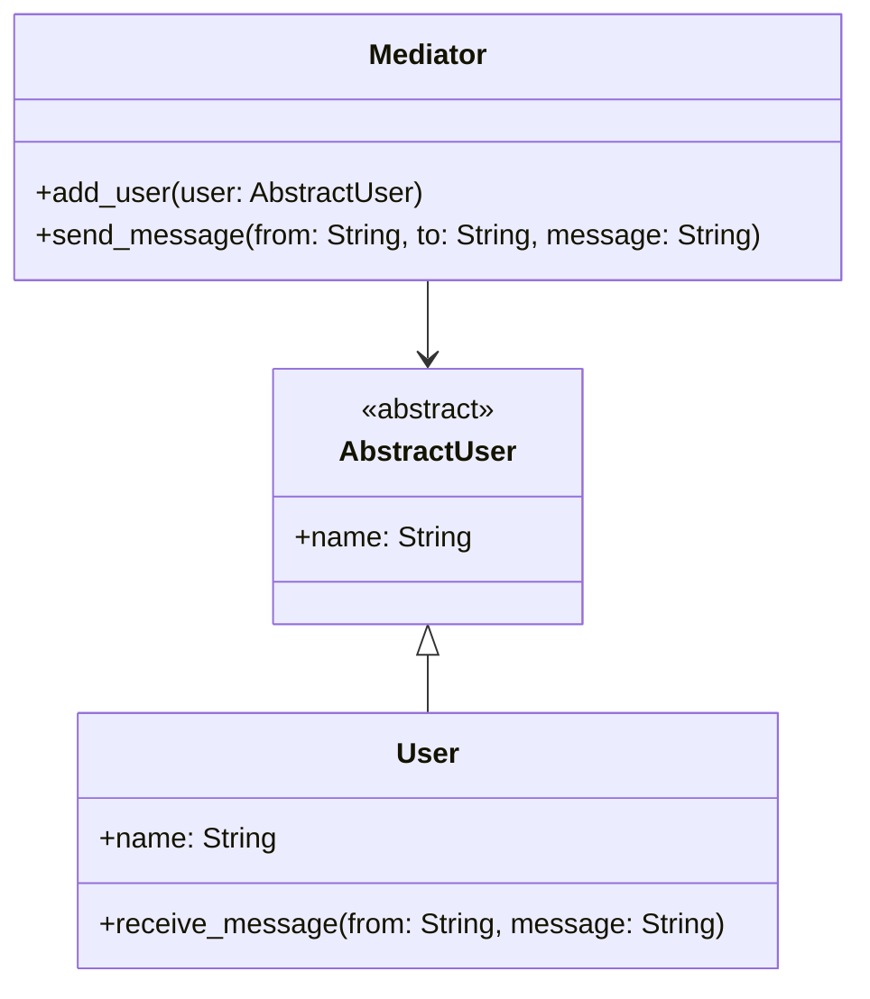

## 7.5 Mediator Pattern for Simplifying Complex Communications

In the realm of software design, managing complex communications between objects can become cumbersome and error-prone. The Mediator Pattern offers a solution by centralizing communication control, thereby reducing dependencies and enhancing modularity. In this section, we will delve into the Mediator Pattern, its implementation in Julia, and its practical applications.

### Definition

The Mediator Pattern is a behavioral design pattern that centralizes complex communications and control between related objects. Instead of objects communicating directly with each other, they communicate through a mediator, which handles the interactions. This pattern helps in reducing the dependencies between communicating objects, making the system more maintainable and scalable.

### Key Participants

- **Mediator**: The central object that manages communication between colleague objects.
- **Colleague Objects**: The components that communicate through the mediator rather than directly with each other.

### Intent

The primary intent of the Mediator Pattern is to simplify communication between objects by introducing a mediator object that encapsulates how these objects interact. This pattern promotes loose coupling by keeping objects from referring to each other explicitly.

### Diagrams

To better understand the Mediator Pattern, let's visualize the interaction between the mediator and its colleague objects using a sequence diagram.



**Diagram Description**: This sequence diagram illustrates how Colleague1 sends a message to Colleague2 through the Mediator. The Mediator handles the message forwarding and response management, ensuring that Colleague1 and Colleague2 remain decoupled.

### Implementing Mediator Pattern in Julia

Let's explore how to implement the Mediator Pattern in Julia. We'll create a simple chat application where users communicate through a central chat room (mediator).

#### Mediator Object

First, define the mediator object that will manage the communication between users.

```julia
struct ChatRoom
    users::Dict{String, AbstractUser}
end

function add_user(chatroom::ChatRoom, user::AbstractUser)
    chatroom.users[user.name] = user
    println("User $(user.name) has joined the chat room.")
end

function send_message(chatroom::ChatRoom, from::String, to::String, message::String)
    if haskey(chatroom.users, to)
        receive_message(chatroom.users[to], from, message)
    else
        println("User $to not found in the chat room.")
    end
end
```

#### Colleague Objects

Next, define the colleague objects, which in this case are users who will communicate through the chat room.

```julia
abstract type AbstractUser end

struct User <: AbstractUser
    name::String
end

function receive_message(user::User, from::String, message::String)
    println("$(user.name) received a message from $from: $message")
end
```

#### Usage Example

Now, let's see how these components work together in a chat application.

```julia
chatroom = ChatRoom(Dict())

alice = User("Alice")
bob = User("Bob")

add_user(chatroom, alice)
add_user(chatroom, bob)

send_message(chatroom, "Alice", "Bob", "Hello, Bob!")
send_message(chatroom, "Bob", "Alice", "Hi, Alice!")
```

**Output**:
```
User Alice has joined the chat room.
User Bob has joined the chat room.
Bob received a message from Alice: Hello, Bob!
Alice received a message from Bob: Hi, Alice!
```

### Use Cases and Examples

The Mediator Pattern is particularly useful in scenarios where multiple objects need to interact in a complex manner. Here are some practical use cases:

#### Chat Applications

In chat applications, the Mediator Pattern can manage message routing between users, ensuring that each user only needs to communicate with the chat room rather than directly with other users.

#### Control Systems

In control systems, such as flight control software, the Mediator Pattern can orchestrate components, ensuring that each component communicates through a central controller, reducing the complexity of direct interactions.

### Design Considerations

When implementing the Mediator Pattern in Julia, consider the following:

- **Scalability**: The mediator can become a bottleneck if it handles too many interactions. Consider distributing responsibilities if necessary.
- **Complexity**: While the pattern simplifies object interactions, it can increase the complexity of the mediator itself. Ensure that the mediator remains manageable.
- **Flexibility**: The pattern enhances flexibility by decoupling objects, making it easier to modify or extend the system.

### Differences and Similarities

The Mediator Pattern is often confused with the Observer Pattern. While both patterns involve communication between objects, the Mediator Pattern centralizes communication through a mediator, whereas the Observer Pattern involves a one-to-many relationship where observers are notified of changes.

### Try It Yourself

To deepen your understanding, try modifying the chat application example:

- Add more users and simulate a group chat.
- Implement private messaging where only specific users can receive certain messages.
- Extend the mediator to log all messages for auditing purposes.

### Visualizing the Mediator Pattern

Let's visualize the structure of the Mediator Pattern using a class diagram.



**Diagram Description**: This class diagram illustrates the relationship between the Mediator, AbstractUser, and User classes. The Mediator manages communication between User instances, which are concrete implementations of the AbstractUser.

### References and Links

For further reading on the Mediator Pattern and its applications, consider the following resources:

- [Design Patterns: Elements of Reusable Object-Oriented Software](https://en.wikipedia.org/wiki/Design_Patterns) - The seminal book by Erich Gamma et al. that introduced the concept of design patterns.
- [JuliaLang Documentation](https://docs.julialang.org/) - Official documentation for the Julia programming language.
- [Refactoring Guru: Mediator Pattern](https://refactoring.guru/design-patterns/mediator) - A comprehensive guide to the Mediator Pattern with examples.

### Knowledge Check

To reinforce your understanding, consider the following questions:

- How does the Mediator Pattern reduce dependencies between objects?
- What are the potential drawbacks of using the Mediator Pattern?
- How can the Mediator Pattern be applied in a real-world application?

### Embrace the Journey

Remember, mastering design patterns is a journey. As you continue to explore and apply these patterns, you'll gain a deeper understanding of software architecture and design. Keep experimenting, stay curious, and enjoy the process!

## Quiz Time!



### What is the primary intent of the Mediator Pattern?

- [x] To centralize complex communications and control between related objects.
- [ ] To create a one-to-many dependency between objects.
- [ ] To encapsulate a request as an object.
- [ ] To define a family of algorithms.

> **Explanation:** The Mediator Pattern centralizes communication and control between objects, reducing dependencies and enhancing modularity.

### In the Mediator Pattern, who manages the communication between colleague objects?

- [x] The Mediator
- [ ] The Colleague Objects
- [ ] The Observer
- [ ] The Command

> **Explanation:** The Mediator is responsible for managing communication between colleague objects, ensuring they remain decoupled.

### Which of the following is a key benefit of using the Mediator Pattern?

- [x] It reduces dependencies between objects.
- [ ] It increases the complexity of object interactions.
- [ ] It creates a direct communication channel between objects.
- [ ] It eliminates the need for a central controller.

> **Explanation:** The Mediator Pattern reduces dependencies by centralizing communication, making the system more maintainable.

### What is a potential drawback of the Mediator Pattern?

- [x] The mediator can become a bottleneck if it handles too many interactions.
- [ ] It increases the number of direct dependencies between objects.
- [ ] It makes it difficult to modify or extend the system.
- [ ] It requires objects to communicate directly with each other.

> **Explanation:** The mediator can become a bottleneck if it handles too many interactions, which can affect performance.

### How does the Mediator Pattern differ from the Observer Pattern?

- [x] The Mediator Pattern centralizes communication through a mediator, while the Observer Pattern involves a one-to-many relationship.
- [ ] The Mediator Pattern involves a one-to-many relationship, while the Observer Pattern centralizes communication.
- [ ] Both patterns centralize communication through a mediator.
- [ ] Both patterns involve a one-to-many relationship.

> **Explanation:** The Mediator Pattern centralizes communication through a mediator, whereas the Observer Pattern involves a one-to-many relationship.

### In a chat application, what role does the chat room play in the Mediator Pattern?

- [x] The Mediator
- [ ] A Colleague Object
- [ ] An Observer
- [ ] A Command

> **Explanation:** In a chat application, the chat room acts as the mediator, managing communication between users.

### What is the role of colleague objects in the Mediator Pattern?

- [x] They communicate through the mediator rather than directly with each other.
- [ ] They manage communication between other objects.
- [ ] They act as a central controller for communication.
- [ ] They encapsulate requests as objects.

> **Explanation:** Colleague objects communicate through the mediator, reducing direct dependencies between them.

### Which of the following is a practical use case for the Mediator Pattern?

- [x] Managing message routing in chat applications.
- [ ] Implementing a one-to-many dependency between objects.
- [ ] Creating a direct communication channel between objects.
- [ ] Encapsulating requests as objects.

> **Explanation:** The Mediator Pattern is useful for managing message routing in chat applications, ensuring users communicate through a central mediator.

### What is a key consideration when implementing the Mediator Pattern?

- [x] Ensuring the mediator remains manageable and does not become a bottleneck.
- [ ] Increasing the number of direct dependencies between objects.
- [ ] Eliminating the need for a central controller.
- [ ] Creating a direct communication channel between objects.

> **Explanation:** It's important to ensure the mediator remains manageable and does not become a bottleneck, which can affect performance.

### True or False: The Mediator Pattern enhances flexibility by decoupling objects.

- [x] True
- [ ] False

> **Explanation:** True. The Mediator Pattern enhances flexibility by decoupling objects, making it easier to modify or extend the system.


