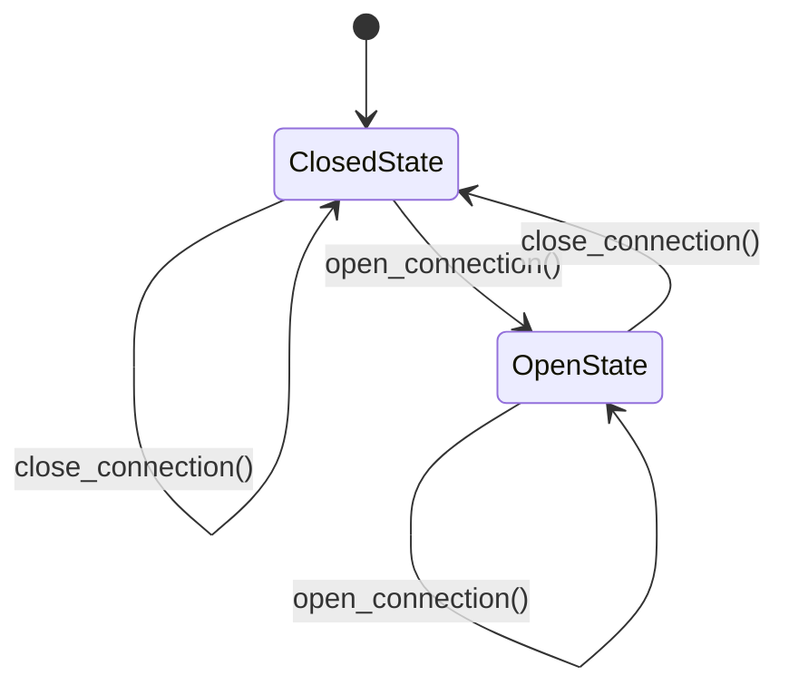

## 7.7 State Pattern Using Mutable Structures

In this section, we delve into the State Pattern, a behavioral design pattern that enables an object to change its behavior when its internal state changes. This pattern is particularly useful in scenarios where an object must exhibit different behaviors in different states, such as in connection objects or UI components. We will explore how to implement the State Pattern in Julia using mutable structures, providing a comprehensive understanding of its application and benefits.

### Definition

The State Pattern allows an object to alter its behavior when its internal state changes. It encapsulates state-specific behavior within separate state objects and delegates state-dependent behavior to these objects.

### Implementing State Pattern in Julia

#### State Objects

In Julia, we can define separate types for each state. These types encapsulate the behavior associated with a particular state. By using mutable structures, we can easily switch between different state objects, allowing the context object to change its behavior dynamically.

#### Context Object

The context object holds a reference to a state object and delegates behavior to it. This object is responsible for managing state transitions and invoking the appropriate behavior based on the current state.

### Use Cases and Examples

#### Connection Objects

Consider a connection object that changes its behavior based on whether a connection is open or closed. By implementing the State Pattern, we can encapsulate the behavior for each state in separate state objects and switch between them as needed.

#### UI Components

UI components often need to vary their behavior depending on the mode they are in, such as edit mode or view mode. The State Pattern allows us to encapsulate the behavior for each mode in separate state objects, making it easy to switch between modes and update the component's behavior accordingly.

### Code Example: Implementing the State Pattern in Julia

Let's explore a practical example of implementing the State Pattern in Julia using mutable structures. We'll create a simple state machine for a connection object that can be in either an "Open" or "Closed" state.

```julia
abstract type ConnectionState end

mutable struct OpenState <: ConnectionState
    function open_connection(state::OpenState)
        println("Connection is already open.")
    end

    function close_connection(state::OpenState)
        println("Closing the connection.")
        return ClosedState()
    end
end

mutable struct ClosedState <: ConnectionState
    function open_connection(state::ClosedState)
        println("Opening the connection.")
        return OpenState()
    end

    function close_connection(state::ClosedState)
        println("Connection is already closed.")
    end
end

mutable struct Connection
    state::ConnectionState

    function Connection(initial_state::ConnectionState)
        new(initial_state)
    end

    function open_connection(conn::Connection)
        conn.state = open_connection(conn.state)
    end

    function close_connection(conn::Connection)
        conn.state = close_connection(conn.state)
    end
end

conn = Connection(ClosedState())
conn.open_connection()  # Output: Opening the connection.
conn.open_connection()  # Output: Connection is already open.
conn.close_connection() # Output: Closing the connection.
conn.close_connection() # Output: Connection is already closed.
```

### Diagram: State Pattern in Action

Below is a diagram illustrating the state transitions for our connection object:



**Caption:** This diagram shows the state transitions for a connection object using the State Pattern. The object can transition between "Open" and "Closed" states based on the invoked operations.

### Design Considerations

- **When to Use the State Pattern**: Use this pattern when an object's behavior depends on its state, and it must change its behavior at runtime depending on that state.
- **Benefits**: The State Pattern promotes cleaner code by encapsulating state-specific behavior in separate objects. It also makes it easier to add new states without modifying existing code.
- **Pitfalls**: Be cautious of excessive state objects, which can lead to increased complexity. Ensure that state transitions are well-defined and managed.

### Differences and Similarities

- **State vs. Strategy Pattern**: While both patterns encapsulate behavior, the State Pattern is used for objects that change behavior based on state, whereas the Strategy Pattern is used for objects that can switch between different algorithms or strategies.
- **State vs. Observer Pattern**: The State Pattern focuses on changing behavior based on state, while the Observer Pattern is about notifying observers of state changes.

### Try It Yourself

Experiment with the code example provided above. Try adding a new state, such as a "Connecting" state, and implement the necessary transitions. Observe how the State Pattern allows you to easily extend the behavior of the connection object without modifying existing code.

### Knowledge Check

- **Question**: What is the primary purpose of the State Pattern?
- **Question**: How does the State Pattern differ from the Strategy Pattern?
- **Question**: What are the benefits of using the State Pattern in software design?

### Embrace the Journey

Remember, mastering design patterns is a journey. As you continue to explore and implement these patterns, you'll gain a deeper understanding of how to create flexible, maintainable, and scalable software applications. Keep experimenting, stay curious, and enjoy the process!

## Quiz Time!



### What is the primary purpose of the State Pattern?

- [x] To allow an object to change its behavior when its internal state changes.
- [ ] To encapsulate algorithms in separate classes.
- [ ] To notify observers of state changes.
- [ ] To provide a simplified interface to a complex system.

> **Explanation:** The State Pattern allows an object to alter its behavior when its internal state changes, encapsulating state-specific behavior in separate objects.

### How does the State Pattern differ from the Strategy Pattern?

- [x] The State Pattern is used for objects that change behavior based on state, while the Strategy Pattern is used for switching between algorithms.
- [ ] The State Pattern is used for notifying observers, while the Strategy Pattern is used for encapsulating algorithms.
- [ ] The State Pattern is used for simplifying interfaces, while the Strategy Pattern is used for managing state transitions.
- [ ] The State Pattern is used for managing state transitions, while the Strategy Pattern is used for notifying observers.

> **Explanation:** The State Pattern focuses on changing behavior based on state, whereas the Strategy Pattern is about switching between different algorithms or strategies.

### What are the benefits of using the State Pattern in software design?

- [x] It promotes cleaner code by encapsulating state-specific behavior in separate objects.
- [x] It makes it easier to add new states without modifying existing code.
- [ ] It simplifies complex interfaces.
- [ ] It notifies observers of state changes.

> **Explanation:** The State Pattern encapsulates state-specific behavior in separate objects, promoting cleaner code and making it easier to add new states without modifying existing code.

### In the provided code example, what does the `Connection` struct represent?

- [x] The context object that holds a reference to a state object.
- [ ] The state object that encapsulates behavior for a particular state.
- [ ] The abstract type for defining state-specific behavior.
- [ ] The function that manages state transitions.

> **Explanation:** The `Connection` struct is the context object that holds a reference to a state object and delegates behavior to it.

### Which of the following is a potential pitfall of using the State Pattern?

- [x] Excessive state objects can lead to increased complexity.
- [ ] It makes it difficult to add new states.
- [ ] It requires modifying existing code to add new states.
- [ ] It simplifies complex interfaces.

> **Explanation:** While the State Pattern promotes cleaner code, excessive state objects can lead to increased complexity if not managed properly.

### What is the role of the `open_connection` function in the `OpenState` struct?

- [x] To print a message indicating the connection is already open.
- [ ] To transition the connection to the closed state.
- [ ] To notify observers of the state change.
- [ ] To encapsulate the algorithm for opening a connection.

> **Explanation:** The `open_connection` function in the `OpenState` struct prints a message indicating the connection is already open.

### In the state diagram, what does the arrow from `ClosedState` to `OpenState` represent?

- [x] The transition from a closed connection to an open connection.
- [ ] The transition from an open connection to a closed connection.
- [ ] The notification of observers about a state change.
- [ ] The encapsulation of an algorithm for opening a connection.

> **Explanation:** The arrow from `ClosedState` to `OpenState` represents the transition from a closed connection to an open connection.

### What is a key difference between the State Pattern and the Observer Pattern?

- [x] The State Pattern focuses on changing behavior based on state, while the Observer Pattern is about notifying observers of state changes.
- [ ] The State Pattern is used for encapsulating algorithms, while the Observer Pattern is used for managing state transitions.
- [ ] The State Pattern simplifies complex interfaces, while the Observer Pattern encapsulates state-specific behavior.
- [ ] The State Pattern notifies observers of state changes, while the Observer Pattern changes behavior based on state.

> **Explanation:** The State Pattern focuses on changing behavior based on state, whereas the Observer Pattern is about notifying observers of state changes.

### What is the purpose of the `close_connection` function in the `ClosedState` struct?

- [x] To print a message indicating the connection is already closed.
- [ ] To transition the connection to the open state.
- [ ] To notify observers of the state change.
- [ ] To encapsulate the algorithm for closing a connection.

> **Explanation:** The `close_connection` function in the `ClosedState` struct prints a message indicating the connection is already closed.

### True or False: The State Pattern can be used to simplify complex interfaces.

- [ ] True
- [x] False

> **Explanation:** The primary purpose of the State Pattern is to allow an object to change its behavior when its internal state changes, not to simplify complex interfaces.


