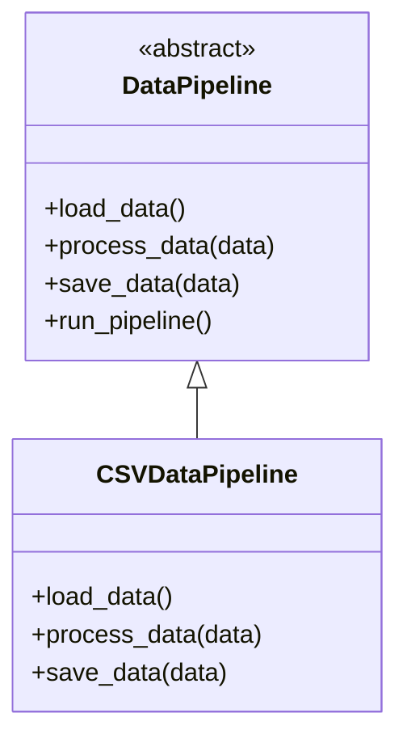

## 7.8 Template Method Pattern with Abstract Types

The Template Method Pattern is a behavioral design pattern that defines the skeleton of an algorithm in a base class, allowing subclasses to override specific steps of the algorithm without altering its structure. This pattern is particularly useful when you have a common process with varying details that need to be implemented differently across subclasses. In Julia, we can leverage abstract types and multiple dispatch to implement this pattern effectively.

### Definition

- **Template Method Pattern**: Defines the skeleton of an algorithm, deferring certain steps to subclasses. This ensures that the overall structure of the algorithm remains unchanged while allowing subclasses to provide specific implementations for certain steps.

### Implementing Template Method in Julia

In Julia, the Template Method Pattern can be implemented using abstract types and methods. Here's how you can achieve this:

#### Abstract Methods

1. **Define an Abstract Type**: Create an abstract type that represents the base class for your algorithm. This type will contain abstract methods that subclasses must implement.

2. **Declare Abstract Functions**: Use abstract functions within the abstract type to define the steps of the algorithm that need to be customized by subclasses.

#### Algorithm Implementation

1. **Implement Invariant Steps**: In the base type, implement the steps of the algorithm that remain constant across all subclasses.

2. **Use Concrete Types**: Create concrete types that inherit from the abstract type and provide specific implementations for the abstract methods.

### Use Cases and Examples

The Template Method Pattern is versatile and can be applied to various scenarios. Let's explore some common use cases and provide examples in Julia.

#### Data Processing Pipelines

Data processing often involves a series of steps that need to be executed in a specific order. The Template Method Pattern allows you to define a common pipeline structure while enabling customization of individual processing steps.

```julia
abstract type DataPipeline end

function load_data(pipeline::DataPipeline)
    error("load_data must be implemented by the subclass")
end

function process_data(pipeline::DataPipeline, data)
    error("process_data must be implemented by the subclass")
end

function save_data(pipeline::DataPipeline, data)
    error("save_data must be implemented by the subclass")
end

function run_pipeline(pipeline::DataPipeline)
    data = load_data(pipeline)
    processed_data = process_data(pipeline, data)
    save_data(pipeline, processed_data)
end

struct CSVDataPipeline <: DataPipeline end

function load_data(pipeline::CSVDataPipeline)
    println("Loading data from CSV file")
    return "raw CSV data"
end

function process_data(pipeline::CSVDataPipeline, data)
    println("Processing CSV data")
    return "processed CSV data"
end

function save_data(pipeline::CSVDataPipeline, data)
    println("Saving processed data to CSV file")
end

csv_pipeline = CSVDataPipeline()
run_pipeline(csv_pipeline)
```

In this example, the `DataPipeline` abstract type defines the structure of the data processing pipeline. The `CSVDataPipeline` concrete type provides specific implementations for loading, processing, and saving CSV data.

#### Game AI Behavior

In game development, AI behavior often follows a common pattern with specific actions defined by different enemy types. The Template Method Pattern allows you to define general AI behavior while enabling customization for individual enemy types.

```julia
abstract type GameAI end

function select_target(ai::GameAI)
    error("select_target must be implemented by the subclass")
end

function move_to_target(ai::GameAI, target)
    error("move_to_target must be implemented by the subclass")
end

function attack_target(ai::GameAI, target)
    error("attack_target must be implemented by the subclass")
end

function perform_action(ai::GameAI)
    target = select_target(ai)
    move_to_target(ai, target)
    attack_target(ai, target)
end

struct ZombieAI <: GameAI end

function select_target(ai::ZombieAI)
    println("Zombie selects the nearest target")
    return "nearest target"
end

function move_to_target(ai::ZombieAI, target)
    println("Zombie shambles towards $target")
end

function attack_target(ai::ZombieAI, target)
    println("Zombie attacks $target with a bite")
end

zombie_ai = ZombieAI()
perform_action(zombie_ai)
```

In this example, the `GameAI` abstract type defines the structure of AI behavior. The `ZombieAI` concrete type provides specific implementations for selecting, moving to, and attacking a target.

### Visualizing the Template Method Pattern

To better understand the Template Method Pattern, let's visualize the relationship between the abstract type, concrete types, and the template method.



In this diagram, `DataPipeline` is the abstract type that defines the template method `run_pipeline`. The `CSVDataPipeline` is a concrete type that implements the abstract methods `load_data`, `process_data`, and `save_data`.

### Key Participants

- **Abstract Type**: Defines the skeleton of the algorithm and declares abstract methods for customizable steps.
- **Concrete Types**: Implement the abstract methods to provide specific behavior for each step.
- **Template Method**: Implements the invariant steps of the algorithm and calls the abstract methods.

### Applicability

The Template Method Pattern is applicable when:

- You have a common algorithm structure with varying details.
- You want to enforce a specific sequence of steps while allowing customization.
- You need to provide a default implementation for some steps while allowing others to be overridden.

### Design Considerations

- **Flexibility**: The pattern provides flexibility by allowing subclasses to customize specific steps of the algorithm.
- **Code Reuse**: Common steps are implemented once in the base type, promoting code reuse.
- **Complexity**: The pattern can introduce complexity if there are too many abstract methods or if the algorithm structure is too rigid.

### Differences and Similarities

- **Strategy Pattern**: The Template Method Pattern is often confused with the Strategy Pattern. While both patterns allow for customization, the Template Method Pattern defines a fixed algorithm structure, whereas the Strategy Pattern allows for interchangeable strategies.
- **Abstract Factory Pattern**: Both patterns use abstract types, but the Abstract Factory Pattern focuses on creating families of related objects, while the Template Method Pattern focuses on defining an algorithm skeleton.

### Try It Yourself

To deepen your understanding of the Template Method Pattern, try modifying the examples provided:

- **Create a new data pipeline**: Implement a new concrete type for a JSON data pipeline that loads, processes, and saves JSON data.
- **Add new enemy types**: Implement new concrete types for different enemy AI behaviors, such as a `VampireAI` or `RobotAI`.

### References and Links

- [Design Patterns: Elements of Reusable Object-Oriented Software](https://en.wikipedia.org/wiki/Design_Patterns) - A foundational book on design patterns.
- [JuliaLang Documentation](https://docs.julialang.org/) - Official Julia documentation for further reading on abstract types and multiple dispatch.

### Knowledge Check

- **What is the main purpose of the Template Method Pattern?**
- **How does the Template Method Pattern promote code reuse?**
- **What are the key differences between the Template Method Pattern and the Strategy Pattern?**

### Embrace the Journey

Remember, mastering design patterns is a journey. As you continue to explore and experiment with the Template Method Pattern in Julia, you'll gain a deeper understanding of how to build flexible and maintainable software. Keep experimenting, stay curious, and enjoy the journey!

## Quiz Time!



### What is the primary purpose of the Template Method Pattern?

- [x] To define the skeleton of an algorithm and allow subclasses to customize specific steps.
- [ ] To create interchangeable strategies for different algorithms.
- [ ] To encapsulate a group of individual factories.
- [ ] To provide a way to access the elements of an aggregate object sequentially.

> **Explanation:** The Template Method Pattern defines the skeleton of an algorithm, allowing subclasses to customize specific steps without changing the algorithm's structure.

### In the Template Method Pattern, what role does the abstract type play?

- [x] It defines the skeleton of the algorithm and declares abstract methods for customizable steps.
- [ ] It provides concrete implementations for all methods in the algorithm.
- [ ] It acts as a factory for creating objects.
- [ ] It serves as a data container for algorithm results.

> **Explanation:** The abstract type defines the skeleton of the algorithm and declares abstract methods that subclasses must implement.

### How does the Template Method Pattern promote code reuse?

- [x] By implementing common steps once in the base type and allowing subclasses to customize only the necessary parts.
- [ ] By allowing multiple algorithms to be used interchangeably.
- [ ] By creating a single interface for a group of related objects.
- [ ] By providing a way to access elements of an aggregate object.

> **Explanation:** The Template Method Pattern promotes code reuse by implementing common steps in the base type, allowing subclasses to focus on customizing specific steps.

### Which of the following is a key difference between the Template Method Pattern and the Strategy Pattern?

- [x] The Template Method Pattern defines a fixed algorithm structure, while the Strategy Pattern allows for interchangeable strategies.
- [ ] The Template Method Pattern focuses on creating families of related objects, while the Strategy Pattern defines a skeleton of an algorithm.
- [ ] The Template Method Pattern is used for data access, while the Strategy Pattern is used for object creation.
- [ ] The Template Method Pattern is used for sequential access, while the Strategy Pattern is used for concurrent access.

> **Explanation:** The Template Method Pattern defines a fixed algorithm structure, whereas the Strategy Pattern allows for interchangeable strategies.

### What is a common use case for the Template Method Pattern?

- [x] Data processing pipelines with customizable processing steps.
- [ ] Creating a single interface for a group of related objects.
- [ ] Providing a way to access elements of an aggregate object sequentially.
- [ ] Encapsulating a group of individual factories.

> **Explanation:** A common use case for the Template Method Pattern is data processing pipelines, where the overall structure is fixed, but individual steps can be customized.

### In the provided example, what does the `run_pipeline` function do?

- [x] It implements the template method by executing the invariant steps of the data processing pipeline.
- [ ] It provides a concrete implementation for loading data.
- [ ] It acts as a factory for creating data processing objects.
- [ ] It serves as a data container for processed data.

> **Explanation:** The `run_pipeline` function implements the template method by executing the invariant steps of the data processing pipeline.

### How can the Template Method Pattern introduce complexity?

- [x] By having too many abstract methods or a rigid algorithm structure.
- [ ] By allowing multiple algorithms to be used interchangeably.
- [ ] By creating a single interface for a group of related objects.
- [ ] By providing a way to access elements of an aggregate object.

> **Explanation:** The Template Method Pattern can introduce complexity if there are too many abstract methods or if the algorithm structure is too rigid.

### What is the role of concrete types in the Template Method Pattern?

- [x] They implement the abstract methods to provide specific behavior for each step.
- [ ] They define the skeleton of the algorithm and declare abstract methods.
- [ ] They act as factories for creating objects.
- [ ] They serve as data containers for algorithm results.

> **Explanation:** Concrete types implement the abstract methods to provide specific behavior for each step of the algorithm.

### Which of the following is NOT a benefit of the Template Method Pattern?

- [ ] Flexibility in customizing specific steps of an algorithm.
- [ ] Code reuse by implementing common steps once.
- [x] Interchangeable strategies for different algorithms.
- [ ] Enforcing a specific sequence of steps.

> **Explanation:** Interchangeable strategies for different algorithms are a feature of the Strategy Pattern, not the Template Method Pattern.

### True or False: The Template Method Pattern is only applicable to object-oriented programming languages.

- [ ] True
- [x] False

> **Explanation:** The Template Method Pattern can be applied in various programming paradigms, including those supported by Julia, which is not strictly object-oriented.


