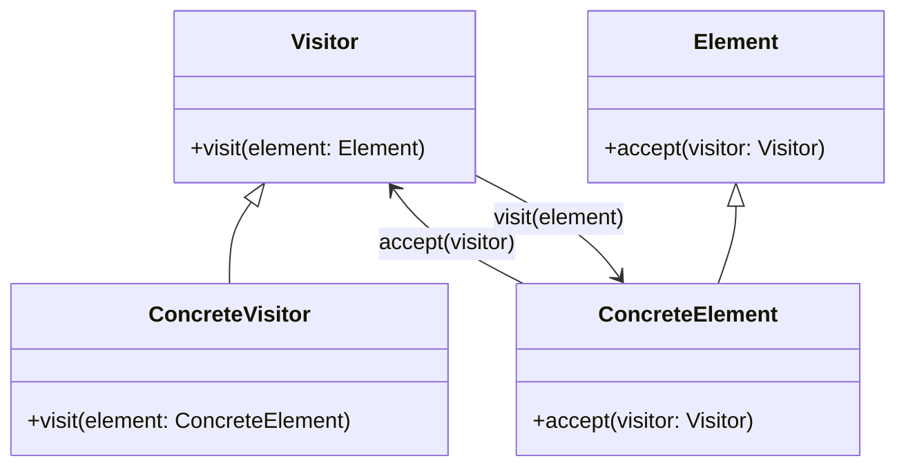

## 7.9 Visitor Pattern for Operations on Data Structures

In the realm of software design, the Visitor Pattern stands out as a powerful tool for separating algorithms from the objects on which they operate. This pattern is particularly useful when you need to perform operations across a set of objects with different interfaces or when you want to add new operations without altering the objects themselves. In this section, we will delve into the Visitor Pattern, its implementation in Julia, and its application in various scenarios.

### Definition

The Visitor Pattern is a behavioral design pattern that allows you to add further operations to objects without modifying them. It achieves this by separating the algorithm from the object structure, enabling new operations to be added without changing the classes of the elements on which it operates.

### Implementing Visitor Pattern in Julia

Implementing the Visitor Pattern in Julia involves defining visitor types and accept methods. Let's break down these components:

#### Visitor Types

In Julia, a visitor is typically a type that implements methods for different element types. Each method corresponds to an operation that can be performed on an element. Here's a basic example:

```julia
abstract type Visitor end

struct PrintVisitor <: Visitor end

function visit(visitor::PrintVisitor, element::Int)
    println("Visiting integer: $element")
end

function visit(visitor::PrintVisitor, element::String)
    println("Visiting string: $element")
end
```

In this example, `PrintVisitor` is a visitor type that has methods for visiting integers and strings. Each method defines what happens when the visitor encounters an element of that type.

#### Accept Methods

Elements that can be visited implement an `accept` method, which takes a visitor as an argument. This method is responsible for calling the appropriate visit method on the visitor:

```julia
abstract type Element end

struct IntegerElement <: Element
    value::Int
end

struct StringElement <: Element
    value::String
end

function accept(element::IntegerElement, visitor::Visitor)
    visit(visitor, element.value)
end

function accept(element::StringElement, visitor::Visitor)
    visit(visitor, element.value)
end
```

Here, `IntegerElement` and `StringElement` are element types that implement the `accept` method. This method delegates the operation to the visitor, allowing it to perform the appropriate action based on the element's type.

### Use Cases and Examples

The Visitor Pattern is particularly useful in scenarios where you need to perform operations on complex object structures, such as syntax trees or data structures. Let's explore some common use cases:

#### Syntax Tree Traversal

In compilers and interpreters, syntax trees are often traversed to perform operations like optimization or code generation. The Visitor Pattern provides a clean way to separate these operations from the tree structure itself.

```julia
abstract type ASTNode end

struct AddNode <: ASTNode
    left::ASTNode
    right::ASTNode
end

struct NumberNode <: ASTNode
    value::Int
end

struct ASTVisitor <: Visitor end

function visit(visitor::ASTVisitor, node::AddNode)
    println("Visiting AddNode")
    accept(node.left, visitor)
    accept(node.right, visitor)
end

function visit(visitor::ASTVisitor, node::NumberNode)
    println("Visiting NumberNode with value: $(node.value)")
end

function accept(node::ASTNode, visitor::Visitor)
    visit(visitor, node)
end

ast = AddNode(NumberNode(1), NumberNode(2))
visitor = ASTVisitor()
accept(ast, visitor)
```

In this example, we define an abstract syntax tree (AST) with `AddNode` and `NumberNode` types. The `ASTVisitor` traverses the tree, visiting each node and performing the appropriate operation.

#### Data Structure Operations

The Visitor Pattern is also useful for adding new operations to data structures without modifying their implementation. For instance, you might want to add a new operation to a collection of elements:

```julia
abstract type DataStructure end

struct ListElement <: DataStructure
    elements::Vector{Element}
end

struct SumVisitor <: Visitor
    sum::Int
end

function visit(visitor::SumVisitor, element::IntegerElement)
    visitor.sum += element.value
end

function accept(data_structure::ListElement, visitor::Visitor)
    for element in data_structure.elements
        accept(element, visitor)
    end
end

elements = ListElement([IntegerElement(1), IntegerElement(2), IntegerElement(3)])
sum_visitor = SumVisitor(0)
accept(elements, sum_visitor)
println("Sum of elements: $(sum_visitor.sum)")
```

In this example, we define a `ListElement` data structure and a `SumVisitor` that calculates the sum of integer elements. The `accept` method iterates over the elements, applying the visitor to each one.

### Visualizing the Visitor Pattern

To better understand the Visitor Pattern, let's visualize the interaction between visitors and elements using a class diagram:



**Diagram Description**: This diagram illustrates the relationship between the `Visitor`, `Element`, `ConcreteVisitor`, and `ConcreteElement` classes. The `ConcreteElement` class implements the `accept` method, which takes a `Visitor` and calls its `visit` method.

### Design Considerations

When implementing the Visitor Pattern in Julia, consider the following:

- **Flexibility**: The Visitor Pattern allows you to add new operations without modifying existing classes. This is particularly useful in systems where the object structure is stable but new operations are frequently added.
- **Complexity**: The pattern can introduce complexity, especially if there are many element types and visitor methods. Ensure that the benefits of using the pattern outweigh the added complexity.
- **Performance**: The Visitor Pattern can impact performance due to the additional method calls. Consider the performance implications in performance-critical applications.

### Differences and Similarities

The Visitor Pattern is often compared to other behavioral patterns, such as the Strategy Pattern. While both patterns involve encapsulating behavior, the Visitor Pattern is unique in its ability to operate on a set of objects with different interfaces. Unlike the Strategy Pattern, which focuses on interchangeable algorithms, the Visitor Pattern focuses on operations across a set of elements.

### Try It Yourself

To deepen your understanding of the Visitor Pattern, try modifying the examples above:

- **Add a new visitor**: Implement a new visitor that performs a different operation, such as counting elements or finding the maximum value.
- **Extend the element types**: Add new element types to the data structure and update the visitors to handle them.
- **Optimize the traversal**: Experiment with different traversal strategies to improve performance.

### References and Links

For further reading on the Visitor Pattern and its applications, consider the following resources:

- [Design Patterns: Elements of Reusable Object-Oriented Software](https://en.wikipedia.org/wiki/Design_Patterns) by Erich Gamma et al.
- [Visitor Pattern on Wikipedia](https://en.wikipedia.org/wiki/Visitor_pattern)
- [JuliaLang Documentation](https://docs.julialang.org/)

### Knowledge Check

Before we wrap up, let's reinforce what we've learned with a few questions:

- What is the primary purpose of the Visitor Pattern?
- How does the Visitor Pattern differ from the Strategy Pattern?
- What are some common use cases for the Visitor Pattern?

### Embrace the Journey

Remember, mastering design patterns is a journey. As you explore the Visitor Pattern and other patterns, you'll gain insights into how to design flexible and maintainable software. Keep experimenting, stay curious, and enjoy the journey!

## Quiz Time!



### What is the main purpose of the Visitor Pattern?

- [x] To separate algorithms from the objects on which they operate
- [ ] To encapsulate interchangeable algorithms
- [ ] To provide a simplified interface to a complex system
- [ ] To manage object creation

> **Explanation:** The Visitor Pattern is designed to separate algorithms from the objects on which they operate, allowing new operations to be added without modifying the objects.

### Which method must elements implement in the Visitor Pattern?

- [x] accept
- [ ] visit
- [ ] execute
- [ ] handle

> **Explanation:** Elements in the Visitor Pattern must implement the `accept` method, which takes a visitor and calls its `visit` method.

### In the Visitor Pattern, what is the role of the visitor?

- [x] To perform operations on elements
- [ ] To create new elements
- [ ] To manage element lifecycle
- [ ] To provide a simplified interface

> **Explanation:** The visitor's role is to perform operations on elements, allowing new operations to be added without modifying the elements.

### How does the Visitor Pattern differ from the Strategy Pattern?

- [x] Visitor operates on a set of objects with different interfaces, while Strategy encapsulates interchangeable algorithms
- [ ] Visitor encapsulates interchangeable algorithms, while Strategy operates on a set of objects
- [ ] Visitor provides a simplified interface, while Strategy manages object creation
- [ ] Visitor manages object creation, while Strategy provides a simplified interface

> **Explanation:** The Visitor Pattern operates on a set of objects with different interfaces, while the Strategy Pattern encapsulates interchangeable algorithms.

### What is a common use case for the Visitor Pattern?

- [x] Syntax tree traversal
- [ ] Object creation
- [ ] Simplifying complex systems
- [ ] Managing object lifecycle

> **Explanation:** A common use case for the Visitor Pattern is syntax tree traversal, where operations like optimization or code generation are performed on AST nodes.

### What is a potential drawback of the Visitor Pattern?

- [x] Increased complexity
- [ ] Limited flexibility
- [ ] Poor performance
- [ ] Difficult to implement

> **Explanation:** The Visitor Pattern can introduce complexity, especially if there are many element types and visitor methods.

### How can the Visitor Pattern impact performance?

- [x] Additional method calls can affect performance
- [ ] It simplifies code, improving performance
- [ ] It reduces memory usage
- [ ] It optimizes algorithms

> **Explanation:** The Visitor Pattern can impact performance due to the additional method calls required for visiting elements.

### What is a benefit of using the Visitor Pattern?

- [x] Adding new operations without modifying existing classes
- [ ] Simplifying object creation
- [ ] Managing object lifecycle
- [ ] Providing a simplified interface

> **Explanation:** The Visitor Pattern allows new operations to be added without modifying existing classes, enhancing flexibility.

### What should you consider when implementing the Visitor Pattern?

- [x] Flexibility, complexity, and performance
- [ ] Object creation, lifecycle management, and interfaces
- [ ] Simplification, encapsulation, and abstraction
- [ ] Memory usage, algorithm optimization, and interfaces

> **Explanation:** When implementing the Visitor Pattern, consider flexibility, complexity, and performance to ensure it meets your needs.

### True or False: The Visitor Pattern is useful for adding new operations to data structures without modifying their implementation.

- [x] True
- [ ] False

> **Explanation:** True. The Visitor Pattern allows new operations to be added to data structures without modifying their implementation.




