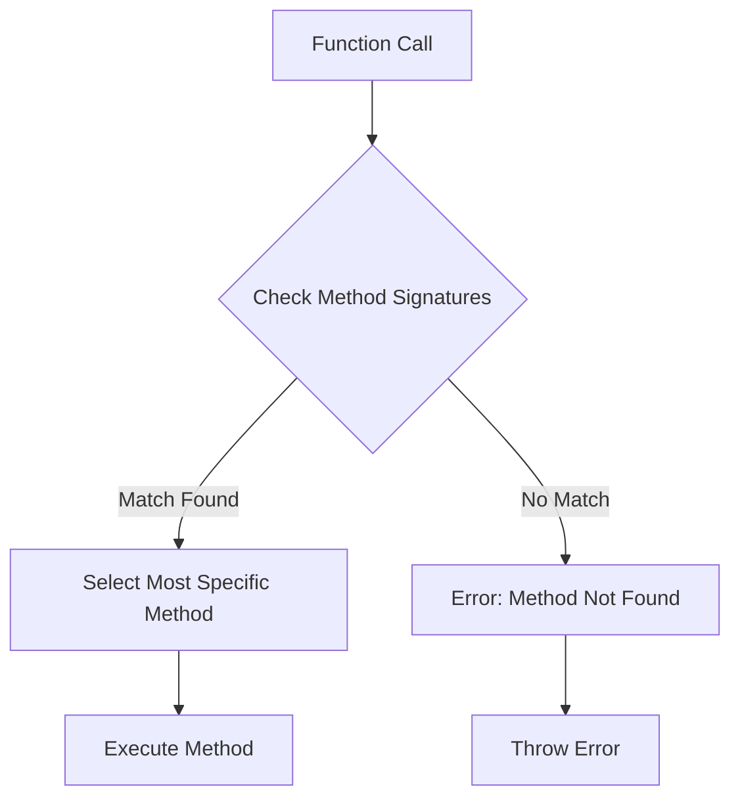

## 8.1 Effective Use of Multiple Dispatch

Multiple dispatch is a core feature of Julia that sets it apart from many other programming languages. It allows functions to have multiple methods, with the most specific method being chosen based on the types of all arguments. This capability enables developers to write flexible, efficient, and expressive code. In this section, we will delve into the intricacies of multiple dispatch, explore how to design APIs using dispatch, and discuss best practices to avoid common pitfalls.

### Core Concept of Multiple Dispatch

At its heart, multiple dispatch allows a function to behave differently based on the combination of argument types it receives. This is in contrast to single dispatch, where the method is chosen based on the type of a single object, typically the first argument or the object the method is called on.

#### Understanding Multiple Dispatch

In Julia, a function can have multiple methods, each defined for different combinations of argument types. When a function is called, Julia selects the most specific method applicable to the given arguments. This selection process is known as dispatch.

```julia
function area(shape)
    error("area not implemented for this shape")
end

function area(radius::Float64)
    return π * radius^2
end

function area(length::Float64, width::Float64)
    return length * width
end

println(area(3.0))          # Calls the method for circles
println(area(4.0, 5.0))     # Calls the method for rectangles
```

In the example above, the `area` function has two methods: one for circles and one for rectangles. The appropriate method is chosen based on the number and type of arguments provided.

### Designing APIs with Dispatch

Multiple dispatch is a powerful tool for designing clean and extensible APIs. By leveraging dispatch, you can create functions that are both generic and specialized, providing flexibility and performance.

#### Generic Functions

Generic functions are designed to work across a broad range of types. They provide a common interface that can be extended with specialized methods.

```julia
function process(data)
    println("Processing generic data")
end

function process(data::Array)
    println("Processing array data")
end

function process(data::String)
    println("Processing string data")
end

process(42)          # Calls the generic method
process([1, 2, 3])   # Calls the method for arrays
process("Hello")     # Calls the method for strings
```

#### Specialized Methods

Specialized methods provide optimized implementations for specific types. By defining methods for particular types, you can tailor the behavior of a function to suit different data structures or use cases.

```julia
function calculate(x, y)
    return x + y
end

function calculate(x::Int, y::Int)
    return x * y
end

println(calculate(2.0, 3.0))  # Calls the generic method
println(calculate(2, 3))      # Calls the method for integers
```

### Best Practices for Multiple Dispatch

To harness the full potential of multiple dispatch, it's important to follow best practices that ensure your code is efficient, maintainable, and free from ambiguity.

#### Type Hierarchies

Organizing types into hierarchies can facilitate method specialization and improve code clarity. By defining abstract types and subtypes, you can create a structured type system that reflects the relationships between different data types.

```julia
abstract type Shape end

struct Circle <: Shape
    radius::Float64
end

struct Rectangle <: Shape
    length::Float64
    width::Float64
end

function area(shape::Shape)
    error("area not implemented for this shape")
end

function area(c::Circle)
    return π * c.radius^2
end

function area(r::Rectangle)
    return r.length * r.width
end

println(area(Circle(3.0)))        # Calls the method for circles
println(area(Rectangle(4.0, 5.0))) # Calls the method for rectangles
```

#### Avoiding Ambiguity

Ambiguity arises when multiple methods are equally applicable to a given set of arguments. To avoid ambiguity, ensure that method definitions are specific and do not overlap.

```julia
function ambiguous(x::Number, y::Number)
    println("Method 1")
end

function ambiguous(x::Int, y::Real)
    println("Method 2")
end

ambiguous(1, 2.0)  # Error: ambiguous method call
```

To resolve ambiguity, refine method definitions to be more specific or use type hierarchies to clarify the intended behavior.

### Use Cases and Examples

Multiple dispatch is a versatile tool that can be applied to a wide range of use cases. Here are some examples of how multiple dispatch can be used effectively in Julia.

#### Customized Printing

By defining `show` methods for custom types, you can control how objects are displayed in the REPL or when printed.

```julia
struct Person
    name::String
    age::Int
end

function Base.show(io::IO, p::Person)
    println(io, "Person(name: $(p.name), age: $(p.age))")
end

p = Person("Alice", 30)
println(p)  # Calls the custom `show` method
```

#### Algorithm Selection

Multiple dispatch can be used to automatically choose the best algorithm based on input types, improving performance and flexibility.

```julia
function sort_data(data)
    println("Sorting generic data")
end

function sort_data(data::Array{Int})
    println("Sorting integer array")
    sort!(data)
end

function sort_data(data::Array{String})
    println("Sorting string array")
    sort!(data)
end

int_data = [3, 1, 2]
str_data = ["banana", "apple", "cherry"]

sort_data(int_data)  # Calls the method for integer arrays
sort_data(str_data)  # Calls the method for string arrays
```

### Visualizing Multiple Dispatch

To better understand how multiple dispatch works, let's visualize the process of method selection using a flowchart.



**Figure 1**: Visualizing the method selection process in multiple dispatch.

### References and Links

For further reading on multiple dispatch and its applications in Julia, consider exploring the following resources:

- [Julia Documentation on Functions](https://docs.julialang.org/en/v1/manual/functions/)
- [JuliaLang Blog: Multiple Dispatch](https://julialang.org/blog/2012/04/why-we-created-julia/)
- [MDN Web Docs: Function Overloading](https://developer.mozilla.org/en-US/docs/Web/JavaScript/Guide/Functions#function_overloading)

### Knowledge Check

To reinforce your understanding of multiple dispatch, consider the following questions and exercises:

1. What is the primary advantage of using multiple dispatch over single dispatch?
2. How can you resolve method ambiguity in Julia?
3. Write a function that uses multiple dispatch to handle different types of input data.
4. Experiment with defining custom `show` methods for your own types.
5. Explore how multiple dispatch can be used to select algorithms based on input types.

### Embrace the Journey

Remember, mastering multiple dispatch is a journey. As you continue to explore Julia, you'll discover new ways to leverage this powerful feature to write more efficient and expressive code. Keep experimenting, stay curious, and enjoy the process!

### Formatting and Structure

Organize your code with clear headings and subheadings, and use bullet points to break down complex information. Highlight important terms or concepts using bold or italic text sparingly.

### Writing Style

Use first-person plural (we, let's) to create a collaborative feel, and avoid gender-specific pronouns. Define acronyms and abbreviations upon first use.

## Quiz Time!



### What is multiple dispatch in Julia?

- [x] A feature that allows functions to have multiple methods, with the most specific method chosen based on argument types.
- [ ] A feature that allows functions to be called with multiple arguments.
- [ ] A feature that allows functions to be overloaded based on the number of arguments.
- [ ] A feature that allows functions to be defined in multiple modules.

> **Explanation:** Multiple dispatch in Julia allows functions to have multiple methods, with the most specific method being chosen based on the types of all arguments.

### How can you define a method for a specific type in Julia?

- [x] By specifying the type in the function signature.
- [ ] By using a special keyword.
- [ ] By defining the method inside a type block.
- [ ] By using a macro.

> **Explanation:** In Julia, you define a method for a specific type by specifying the type in the function signature.

### What is the purpose of using abstract types in Julia?

- [x] To organize types into hierarchies and facilitate method specialization.
- [ ] To define methods that cannot be instantiated.
- [ ] To create immutable types.
- [ ] To define global variables.

> **Explanation:** Abstract types in Julia are used to organize types into hierarchies, which facilitates method specialization and improves code clarity.

### How can you avoid method ambiguity in Julia?

- [x] By ensuring method definitions are specific and do not overlap.
- [ ] By using global variables.
- [ ] By defining methods in separate modules.
- [ ] By using macros.

> **Explanation:** To avoid method ambiguity in Julia, ensure that method definitions are specific and do not overlap.

### What is a common use case for multiple dispatch in Julia?

- [x] Algorithm selection based on input types.
- [ ] Defining global variables.
- [ ] Creating immutable types.
- [ ] Using macros for code generation.

> **Explanation:** A common use case for multiple dispatch in Julia is algorithm selection based on input types, which improves performance and flexibility.

### What is the role of the `show` method in Julia?

- [x] To control how objects are displayed in the REPL or when printed.
- [ ] To define global variables.
- [ ] To create immutable types.
- [ ] To use macros for code generation.

> **Explanation:** The `show` method in Julia is used to control how objects are displayed in the REPL or when printed.

### How does Julia select the most specific method for a function call?

- [x] By checking method signatures and selecting the most specific match.
- [ ] By using a random selection process.
- [ ] By selecting the first method defined.
- [ ] By using a macro.

> **Explanation:** Julia selects the most specific method for a function call by checking method signatures and selecting the most specific match.

### What is the benefit of using specialized methods in Julia?

- [x] They provide optimized implementations for specific types.
- [ ] They allow functions to be called with multiple arguments.
- [ ] They enable the use of global variables.
- [ ] They create immutable types.

> **Explanation:** Specialized methods in Julia provide optimized implementations for specific types, enhancing performance and flexibility.

### What is the primary advantage of using multiple dispatch over single dispatch?

- [x] It allows functions to behave differently based on the combination of argument types.
- [ ] It allows functions to be called with multiple arguments.
- [ ] It enables the use of global variables.
- [ ] It creates immutable types.

> **Explanation:** The primary advantage of using multiple dispatch over single dispatch is that it allows functions to behave differently based on the combination of argument types.

### True or False: Multiple dispatch is unique to Julia.

- [x] False
- [ ] True

> **Explanation:** While multiple dispatch is a core feature of Julia, it is not unique to the language. Other languages, such as CLOS (Common Lisp Object System), also support multiple dispatch.


